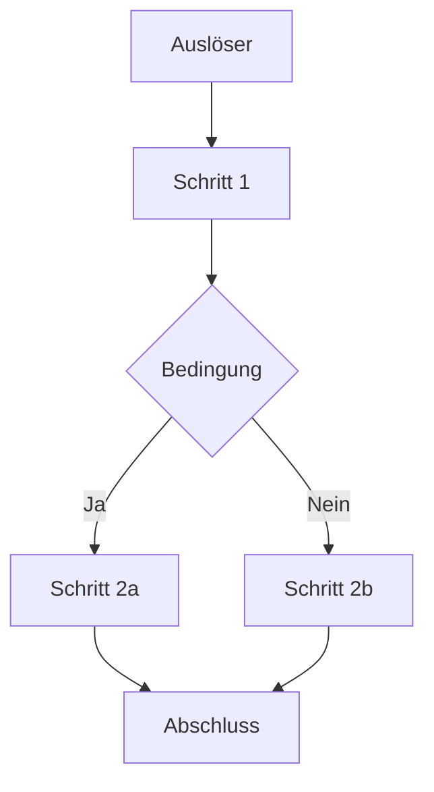
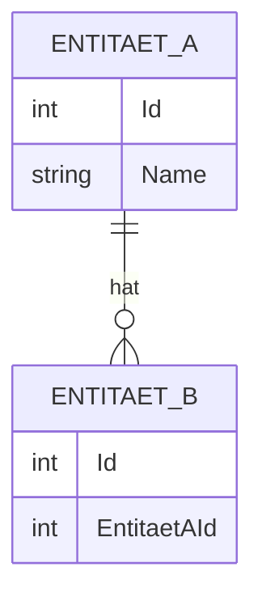

# Bestehende Features nachträglich dokumentieren

Erstellt die Dokumentation für bereits vorhandene Features eines Projekts retroaktiv — so, als wären sie im Rahmen des KI-Agenten-Workflows entwickelt worden. Grundlage ist ausschließlich der bestehende Code und die Git-Historie; Planungsartefakte werden nicht vorausgesetzt.

**Eingabe:** Optional — der Name eines Funktionsbereichs als Argument. Fehlt das Argument, analysiert das Kommando das gesamte Projekt und dokumentiert alle noch nicht dokumentierten Bereiche.

---

## Schritt 1: Dokumentationsstand prüfen

Ermittle, welche Funktionsbereiche bereits unter `docs/help/` dokumentiert sind:

Suche nach `docs/help/*/index.md` und notiere die vorhandenen Verzeichnisnamen als „bereits dokumentiert".

## Schritt 2: Zu dokumentierende Funktionsbereiche bestimmen

**Wurde ein Funktionsbereich als Argument übergeben:** Überspringe die automatische Erkennung. Prüfe nur, ob dieser Bereich unter `docs/help/` bereits existiert. Ist er vollständig dokumentiert, informiere den Anwender und brich ab.

**Kein Argument übergeben:** Analysiere die Projektstruktur, um fachliche Funktionsbereiche zu ermitteln. Suche nach:

- Klassen und Namespaces in `src/` (Controller, Services, Repositories, ViewModels, Handlers)
- Feature-Ordner oder Routengruppen
- Migrations- oder Schema-Dateien, die eigenständige Entitätsgruppen zeigen
- Tests, die abgegrenzte Bereiche testen

Leite daraus eine Liste fachlicher Funktionsbereiche aus Anwendersicht ab (übergeordnete Begriffe wie `Anwendungen`, `Benutzer`, `Berichtswesen`, `E-Mail-Versand`). Vergleiche sie mit den bereits dokumentierten Bereichen und bilde die Differenz.

Zeige dem Anwender die Liste der noch nicht dokumentierten Bereiche und frage, welche davon dokumentiert werden sollen — alle auf einmal oder einzelne auswählen.

Warte auf die Antwort des Anwenders, bevor du fortfährst.

## Schritt 3: Für jeden ausgewählten Funktionsbereich — Entstehungsdatum ermitteln

Ermittle mithilfe der Git-Historie das Datum des ältesten Commits, der Dateien dieses Funktionsbereichs eingeführt hat:

```
git log --diff-filter=A --name-only --pretty=format:"%ad" --date=short -- {relevante Pfade}
```

Verwende das früheste gefundene Datum als Grundlage für `changes.log`. Gibt es keine auswertbaren Git-Daten, verwende `unbekannt` als Datumsangabe.

## Schritt 4: Code-Analyse

Lies alle relevanten Quelldateien des Funktionsbereichs vollständig. Achte dabei auf:

- Klassennamen, Methodennamen, Eigenschaften
- Captions, Labels und Texte, die dem Anwender angezeigt werden
- Konfigurationsparameter und ihre Standardwerte
- Schnittstellen (API-Endpunkte, Events, Interfaces)
- Datenbankentitäten und ihre Beziehungen

Commit-Botschaften aus der Git-Historie (`git log --oneline -- {relevante Pfade}`) dürfen als Hinweis auf fachliche Absichten herangezogen werden, ersetzen aber nicht die Analyse des Codes selbst.

## Schritt 5: `changes.log` aktualisieren

Lies `changes.log` im Projektstammverzeichnis (lege die Datei an, falls sie noch nicht existiert).

Füge einen neuen Eintrag ein. Retroaktive Einträge werden **chronologisch nach Datum** eingeordnet — nicht zwingend ganz oben, sondern an der Stelle, die dem ermittelten Datum entspricht:

```
## {Datum aus Schritt 3} — {Funktionsbereichs-Bezeichnung}

- {Kurze Beschreibung der wesentlichen Funktionalität 1}
- {Kurze Beschreibung der wesentlichen Funktionalität 2}
- ...
```

Jeder Punkt beschreibt eine fachliche Funktionalität in ein bis zwei Sätzen. Technische Dateinamen in Backticks, keine Auflistung jeder Quelldatei.

## Schritt 6: Dokumentationsarten bestimmen

Prüfe für jede der folgenden Dokumentationsarten, ob sie für den Funktionsbereich sinnvoll ist. Erstelle nur die Arten, die tatsächlich relevante Inhalte liefern können.

| Datei | Inhalt | Sinnvoll wenn... |
|-------|--------|-----------------|
| `beschreibung.md` | Allgemeine Beschreibung mit Beispielen | immer |
| `ablauf-technisch.md` | Technischer Programmablaufplan | Abläufe mit mehreren Schritten oder Verzweigungen vorhanden |
| `ablauf-anwender.md` | Anwenderfreundlicher Ablaufplan | interaktive Benutzerführung vorhanden |
| `api.md` | API-Dokumentation | öffentliche Schnittstellen oder Events exponiert |
| `installation.md` | Installationsanweisungen und Konfiguration | Feature benötigt Konfiguration oder Einrichtungsschritte |
| `datenmodell.md` | ERM-Modell | Datenbankentitäten vorhanden |
| `business-rules.md` | Erklärung komplexer Geschäftslogik | besondere, nicht selbsterklärende Regeln oder Sonderfälle vorhanden |

## Schritt 7: Dokumentationsverzeichnis anlegen oder erweitern

Erstelle das Verzeichnis `docs/help/{funktionsbereich}/`, falls es noch nicht existiert.

Wenn das Verzeichnis bereits existiert, lies die vorhandene `index.md` und alle bestehenden Dokumentationsdateien. Ergänze oder aktualisiere sie, anstatt neue parallele Dateien zu erstellen.

Erstelle oder aktualisiere die `index.md` als Einstiegspunkt:

```
# {Funktionsbereichs-Bezeichnung}

Kurze Einleitung (1–3 Sätze): Was leistet dieser Bereich, welches Problem löst er?

## Inhalt

- [Beschreibung](beschreibung.md)
- [Technischer Ablauf](ablauf-technisch.md)       ← nur wenn erstellt
- [Ablauf für Anwender](ablauf-anwender.md)        ← nur wenn erstellt
- [API](api.md)                                    ← nur wenn erstellt
- [Installation & Konfiguration](installation.md)  ← nur wenn erstellt
- [Datenmodell](datenmodell.md)                    ← nur wenn erstellt
- [Business Rules](business-rules.md)              ← nur wenn erstellt
```

## Schritt 8: Dokumentationsdateien erstellen oder ergänzen

Für jede in Schritt 6 ausgewählte Datei im Verzeichnis `docs/help/{funktionsbereich}/`:

- **Datei existiert bereits:** Lies sie vollständig und integriere die neuen Inhalte an der passenden Stelle.
- **Datei existiert noch nicht:** Erstelle sie neu.

---

### `beschreibung.md` — Allgemeine Beschreibung

```
← [Zurück zur Übersicht](index.md)

# {Funktionsbereichs-Bezeichnung} — Beschreibung

## Zweck

Was macht dieser Bereich? Welches Problem löst er für den Anwender?

## Funktionsweise

Beschreibung des Verhaltens in verständlicher Sprache.

## Beispiele

Konkrete Anwendungsbeispiele, die den Nutzen verdeutlichen.

## Einschränkungen

Bekannte Grenzen oder Sonderfälle, die der Anwender kennen sollte.
```

---

### `ablauf-technisch.md` — Technischer Programmablaufplan

Beschreibt den vollständigen Ablauf aus technischer Sicht, einschließlich aller relevanten Klassen, Methoden und Komponenten mit ihren tatsächlichen Namen.

```
← [Zurück zur Übersicht](index.md)

# {Funktionsbereichs-Bezeichnung} — Technischer Ablauf

## Übersicht

Kurze Beschreibung des Gesamtablaufs (2–4 Sätze).

## Ablauf

### 1. {Schritt-Bezeichnung}

Beschreibung was in diesem Schritt geschieht.

Beteiligte Komponenten:
- `{Klassenname}.{Methodenname}` — Zweck
- `{Klassenname}.{Eigenschaft}` — Bedeutung

### 2. {Nächster Schritt}

...

## Diagramm

Falls der Ablauf Verzweigungen oder mehrere parallele Pfade enthält, ein Mermaid-Flussdiagramm:



## Fehlerbehandlung

Welche Ausnahmen oder Fehlerfälle werden behandelt und wie?
```

---

### `ablauf-anwender.md` — Anwenderfreundlicher Ablaufplan

Basiert auf dem technischen Ablauf, lässt technische Details weg und verwendet ausschließlich die dem Anwender sichtbaren Bezeichnungen (Menütitel, Button-Captions, Feldbezeichnungen).

```
← [Zurück zur Übersicht](index.md)

# {Funktionsbereichs-Bezeichnung} — Ablauf für Anwender

## Voraussetzungen

Was muss der Anwender vor dem ersten Schritt bereits erledigt haben?

## Schritt-für-Schritt-Anleitung

### 1. {Anwendersichtiger Schritt}

Beschreibung in einfacher Sprache ohne technische Begriffe.

> **Hinweis:** Besonderheiten oder häufige Fehler, auf die Anwender achten sollten.

### 2. {Nächster Schritt}

...

## Ergebnis

Was sieht oder bekommt der Anwender am Ende des Ablaufs?
```

---

### `api.md` — API-Dokumentation

```
← [Zurück zur Übersicht](index.md)

# {Funktionsbereichs-Bezeichnung} — API

## Übersicht

Kurze Beschreibung der exponierten Schnittstelle.

## Endpunkte / Methoden

### `{Methodenname}` / `{Endpunkt}`

**Beschreibung:** ...

**Parameter:**

| Name | Typ | Pflicht | Beschreibung |
|------|-----|---------|--------------|
| ...  | ... | Ja/Nein | ...          |

**Rückgabe:**

| Typ | Beschreibung |
|-----|--------------|
| ... | ...          |

**Beispiel:**
```
{Beispielaufruf}
```

**Fehler:**

| Code / Exception | Ursache |
|-----------------|---------|
| ...             | ...     |
```

---

### `installation.md` — Installation und Konfiguration

```
← [Zurück zur Übersicht](index.md)

# {Funktionsbereichs-Bezeichnung} — Installation und Konfiguration

## Voraussetzungen

Was muss vorhanden sein, bevor dieser Bereich eingerichtet werden kann?

## Installationsschritte

1. ...
2. ...

## Konfiguration

| Parameter | Typ | Standardwert | Beschreibung |
|-----------|-----|--------------|--------------|
| ...       | ... | ...          | ...          |

## Überprüfung

Wie kann der Anwender oder Administrator prüfen, ob die Einrichtung erfolgreich war?
```

---

### `datenmodell.md` — ERM-Modell

```
← [Zurück zur Übersicht](index.md)

# {Funktionsbereichs-Bezeichnung} — Datenmodell

## Entitäten

### `{Entitätsname}`

| Eigenschaft | Typ | Beschreibung |
|-------------|-----|--------------|
| ...         | ... | ...          |

## Beziehungen

Beschreibung der Beziehungen zwischen den Entitäten.

## Diagramm


```

---

### `business-rules.md` — Business Rules

```
← [Zurück zur Übersicht](index.md)

# {Funktionsbereichs-Bezeichnung} — Business Rules

## {Regelname}

**Beschreibung:** Was regelt diese Logik, warum existiert sie?

**Bedingungen:**
- ...

**Verhalten:**
- Wenn {Bedingung}: {Ergebnis}
- Sonst: {Ergebnis}

**Umsetzung:** `{Klassenname}.{Methodenname}` (kurze Erläuterung, warum die Umsetzung so gewählt wurde, falls nicht offensichtlich)
```

---

## Schritt 9: Weitere Bereiche

Sind mehrere Funktionsbereiche zur Dokumentation ausgewählt worden, wiederhole Schritt 3 bis 8 für jeden weiteren Bereich.

## Schritt 10: Globalen Index aktualisieren

Erstelle oder aktualisiere die Datei `docs/help/index.md` als Gesamtübersicht aller dokumentierten Funktionsbereiche.

Lies alle vorhandenen `docs/help/*/index.md`-Dateien und entnimm jeweils:
- Die H1-Überschrift als Anzeigetext
- Den ersten Satz der Einleitung als Kurzbeschreibung
- Den Verzeichnisnamen als relativen Pfad

Gruppiere die Bereiche nach fachlicher Verwandtschaft (z. B. Stammdaten, Prozesse, Konfiguration, Berichtswesen, Systemverwaltung). Sind alle Bereiche thematisch gleichwertig oder ist keine sinnvolle Gruppierung erkennbar, liste sie alphabetisch ohne Gruppen auf.

Struktur der `docs/help/index.md`:

```
# Dokumentation

Übersicht über alle dokumentierten Funktionsbereiche.

## {Gruppe}

- [{Bereichsname}]({verzeichnis}/index.md) — {Kurzbeschreibung}

## {Weitere Gruppe}

- [{Bereichsname}]({verzeichnis}/index.md) — {Kurzbeschreibung}
```

Existiert `docs/help/index.md` bereits, lies sie zuerst vollständig. Füge die neu dokumentierten Bereiche in die passenden Gruppen ein und sortiere innerhalb jeder Gruppe alphabetisch. Bestehende Einträge bleiben unverändert.

---

## Hinweise

- Nichts erfinden — nur dokumentieren, was im Code tatsächlich vorhanden ist.
- Retroaktive Dokumentation beschreibt den **aktuellen Stand** des Codes, nicht den Entstehungsprozess.
- Captions und Bezeichnungen, die dem Anwender angezeigt werden, immer aus dem Code entnehmen, nicht raten.
- Klassen- und Methodennamen immer in Backticks.
- Mermaid-Diagramme nur erstellen, wenn der Ablauf komplex genug ist, um vom Diagramm zu profitieren.
- Wenn unklar ist, welche Dokumentationsarten sinnvoll sind, eher mehr erstellen als zu wenig — leere oder triviale Abschnitte weglassen.
- `changes.log`-Einträge für retroaktiv dokumentierte Bereiche chronologisch nach Git-Datum einordnen, nicht am Anfang der Datei.
