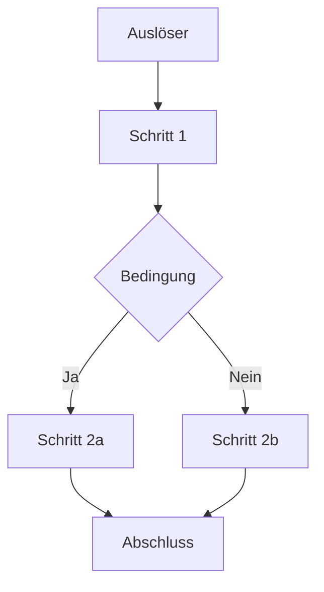
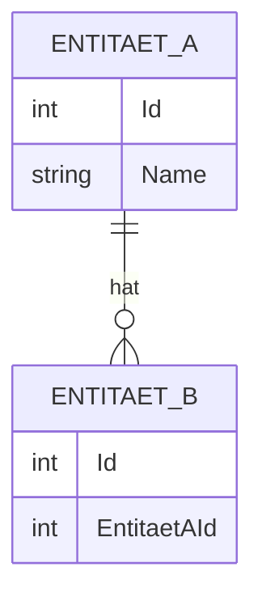
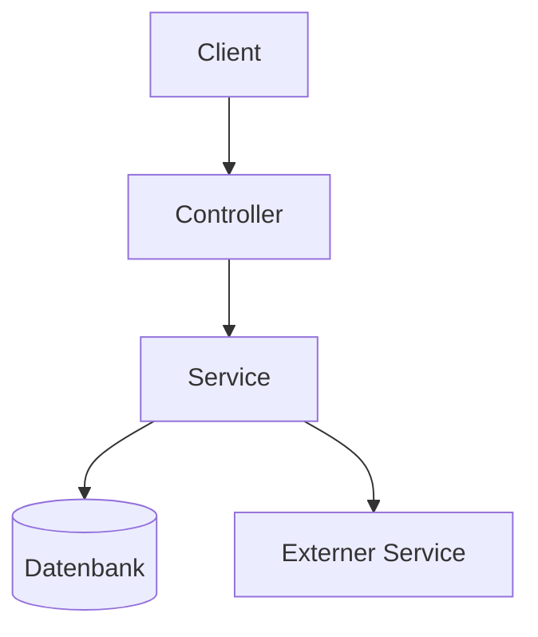

# Dokumentation aktualisieren

Erstelle oder aktualisiere die Projektdokumentation für das zuletzt implementierte Feature. Die Grundlage ist der aktuelle Stand des Codes — es wird nur dokumentiert, was tatsächlich implementiert ist.

**Ziel:** Lesbare, vollständige Dokumentation erzeugen und das Änderungsprotokoll fortschreiben.

---

## Schritt 1: Implementierung verstehen

Verschaffe dir einen Überblick über das implementierte Feature:

- Lies `docs/features/{branchname}/requirement.md` und `docs/features/{branchname}/plan.md`, falls vorhanden.
- Ermittle alle im aktuellen Branch geänderten und neu erstellten Dateien:
  ```
  git diff --name-only --diff-filter=AM $(git merge-base HEAD main)
  ```
- Lies die relevanten Quelldateien vollständig. Achte dabei auf:
  - Klassennamen, Methodennamen, Eigenschaften
  - Captions, Labels und Texte, die dem Anwender angezeigt werden
  - Konfigurationsparameter und ihre Standardwerte
  - Schnittstellen (API-Endpunkte, Events, Interfaces)
  - Datenbankentitäten und ihre Beziehungen

## Schritt 2: Funktionsbereich bestimmen

Bestimme den **thematischen Funktionsbereich**, dem das implementierte Feature angehört — nicht die konkrete Operation, sondern das fachliche Thema, das mehrere verwandte Features umfassen kann. Beispiel: "Anlage von Anwendungen" und "Bearbeiten von Anwendungen" gehören beide zum Funktionsbereich `Anwendungen`.

**Vorgehen:**

1. Liste alle vorhandenen Verzeichnisse unter `docs/help/` auf.
2. Prüfe, ob das implementierte Feature thematisch zu einem bestehenden Verzeichnis passt. Wenn ja, verwende dessen Namen — es wird kein neues Verzeichnis angelegt, sondern die vorhandene Dokumentation erweitert.
3. Wenn kein passendes Verzeichnis existiert, leite einen neuen Funktionsbereichsnamen ab: der **übergeordnete fachliche Begriff** aus Anwendersicht (z. B. `Anwendungen`, `Benutzer`, `Berichtswesen`, `E-Mail-Versand`), nicht die spezifische Operation.

Diese Bezeichnung wird als Verzeichnisname verwendet (Leerzeichen durch Bindestriche ersetzen, Kleinschreibung).

## Schritt 3: `changes.log` aktualisieren

Lies `changes.log` im Projektstammverzeichnis (lege die Datei an, falls sie noch nicht existiert). Füge am **Anfang der Datei** einen neuen Eintrag ein:

```
## YYYY-MM-DD — {Feature-Bezeichnung}

- {Kurze Beschreibung der wesentlichen Änderung 1}
- {Kurze Beschreibung der wesentlichen Änderung 2}
- ...
```

Jeder Punkt beschreibt eine fachliche Änderung in ein bis zwei Sätzen. Technische Dateinamen in Backticks, keine Auflistung jeder geänderten Zeile.

## Schritt 4: Dokumentationsarten bestimmen

Prüfe für jede der folgenden Dokumentationsarten, ob sie für das implementierte Feature sinnvoll ist. Erstelle nur die Arten, die tatsächlich relevante Inhalte liefern können.

| Datei | Inhalt | Sinnvoll wenn... |
|-------|--------|-----------------|
| `beschreibung.md` | Allgemeine Beschreibung mit Beispielen | immer |
| `ablauf-technisch.md` | Technischer Programmablaufplan | Abläufe mit mehreren Schritten oder Verzweigungen vorhanden |
| `ablauf-anwender.md` | Anwenderfreundlicher Ablaufplan | interaktive Benutzerführung vorhanden |
| `api.md` | API-Dokumentation | öffentliche Schnittstellen oder Events exponiert |
| `installation.md` | Installationsanweisungen und Konfiguration | Feature benötigt Konfiguration oder Einrichtungsschritte |
| `datenmodell.md` | ERM-Modell | neue oder geänderte Datenbankentitäten vorhanden |
| `architektur.md` | Komponentendiagramm, Service-Abhängigkeiten, Datenfluss | Feature berührt mehrere Services, Systeme oder führt neue Abhängigkeiten ein |
| `business-rules.md` | Erklärung komplexer Geschäftslogik | besondere, nicht selbsterklärende Regeln oder Sonderfälle vorhanden |
| `troubleshooting.md` | Bekannte Probleme, Fehlermeldungen und Lösungen | Feature hat nicht-offensichtliche Fehlerfälle oder häufige Anwenderfehler |

## Schritt 5: Dokumentationsverzeichnis anlegen oder erweitern

Erstelle das Verzeichnis `docs/help/{funktionsbereich}/`, falls es noch nicht existiert.

Wenn das Verzeichnis bereits existiert, lies die vorhandene `index.md` und die bestehenden Dokumentationsdateien. Ergänze oder aktualisiere sie, anstatt neue parallele Dateien zu erstellen. Neue Abschnitte werden in bestehende Dateien integriert; nur wenn sich ein Thema nicht in bestehende Dateien einfügt, wird eine neue Datei angelegt.

Erstelle oder aktualisiere die `index.md` als Einstiegspunkt:

```
# {Feature-Bezeichnung}

Kurze Einleitung (1–3 Sätze): Was tut dieses Feature, welches Problem löst es?

## Inhalt

- [Beschreibung](beschreibung.md)
- [Technischer Ablauf](ablauf-technisch.md)          ← nur wenn erstellt
- [Ablauf für Anwender](ablauf-anwender.md)           ← nur wenn erstellt
- [API](api.md)                                       ← nur wenn erstellt
- [Installation & Konfiguration](installation.md)     ← nur wenn erstellt
- [Datenmodell](datenmodell.md)                       ← nur wenn erstellt
- [Architektur](architektur.md)                       ← nur wenn erstellt
- [Business Rules](business-rules.md)                 ← nur wenn erstellt
- [Fehlerbehebung](troubleshooting.md)                ← nur wenn erstellt
```

## Schritt 6: Dokumentationsdateien erstellen oder ergänzen

Für jede in Schritt 4 ausgewählte Datei im Verzeichnis `docs/help/{funktionsbereich}/`:

- **Datei existiert bereits:** Lies sie vollständig und integriere die neuen Inhalte an der passenden Stelle. Füge neue Abschnitte ein, erweitere bestehende — aber lösche oder ersetze keine vorhandenen Inhalte, die noch gültig sind.
- **Datei existiert noch nicht:** Erstelle sie neu.

---

### `beschreibung.md` — Allgemeine Beschreibung

```
← [Zurück zur Übersicht](index.md)

# {Feature-Bezeichnung} — Beschreibung

## Zweck

Was macht dieses Feature? Welches Problem löst es für den Anwender?

## Funktionsweise

Beschreibung des Verhaltens in verständlicher Sprache.

## Beispiele

Konkrete Anwendungsbeispiele, die den Nutzen verdeutlichen.

## Einschränkungen

Bekannte Grenzen oder Sonderfälle, die der Anwender kennen sollte.
```

---

### `ablauf-technisch.md` — Technischer Programmablaufplan

Beschreibt den vollständigen Ablauf aus technischer Sicht, einschließlich aller relevanten Klassen, Methoden und Komponenten mit ihren tatsächlichen Namen.

```
← [Zurück zur Übersicht](index.md)

# {Feature-Bezeichnung} — Technischer Ablauf

## Übersicht

Kurze Beschreibung des Gesamtablaufs (2–4 Sätze).

## Ablauf

### 1. {Schritt-Bezeichnung}

Beschreibung was in diesem Schritt geschieht.

Beteiligte Komponenten:
- `{Klassenname}.{Methodenname}` — Zweck
- `{Klassenname}.{Eigenschaft}` — Bedeutung

### 2. {Nächster Schritt}

...

## Diagramm

Falls der Ablauf Verzweigungen oder mehrere parallele Pfade enthält, ein Mermaid-Flussdiagramm:



## Fehlerbehandlung

Welche Ausnahmen oder Fehlerfälle werden behandelt und wie?
```

---

### `ablauf-anwender.md` — Anwenderfreundlicher Ablaufplan

Basiert auf dem technischen Ablauf, lässt technische Details weg und verwendet ausschließlich die dem Anwender sichtbaren Bezeichnungen (Menütitel, Button-Captions, Feldbezeichnungen).

```
← [Zurück zur Übersicht](index.md)

# {Feature-Bezeichnung} — Ablauf für Anwender

## Voraussetzungen

Was muss der Anwender vor dem ersten Schritt bereits erledigt haben?

## Schritt-für-Schritt-Anleitung

### 1. {Anwendersichtiger Schritt}

Beschreibung in einfacher Sprache ohne technische Begriffe.

> **Hinweis:** Besonderheiten oder häufige Fehler, auf die Anwender achten sollten.

### 2. {Nächster Schritt}

...

## Ergebnis

Was sieht oder bekommt der Anwender am Ende des Ablaufs?

## Barrierefreiheit

Nur ausfüllen, wenn das Feature UI-Elemente enthält: Gibt es Tastaturkürzel, Screen-Reader-Unterstützung oder andere Zugänglichkeitsmerkmale, die Anwender kennen sollten?
```

---

### `api.md` — API-Dokumentation

```
← [Zurück zur Übersicht](index.md)

# {Feature-Bezeichnung} — API

## Übersicht

Kurze Beschreibung der exponierten Schnittstelle.

## Authentifizierung

Welche Authentifizierung ist erforderlich (z. B. Bearer Token, API-Key, keine)?
Wo wird das Token übergeben (Header, Query-Parameter)?

## Rate Limiting

Gibt es Mengenbeschränkungen? Falls ja: Limit, Zeitfenster, Response-Header oder Fehlercode bei Überschreitung.

## Endpunkte / Methoden

### `{Methodenname}` / `{Endpunkt}`

**Beschreibung:** ...

**Parameter:**

| Name | Typ | Pflicht | Beschreibung |
|------|-----|---------|--------------|
| ...  | ... | Ja/Nein | ...          |

**Rückgabe:**

| Typ | Beschreibung |
|-----|--------------|
| ... | ...          |

**Beispiel:**
```
{Beispielaufruf}
```

**Fehler:**

| Code / Exception | Ursache |
|-----------------|---------|
| ...             | ...     |
```

---

### `installation.md` — Installation und Konfiguration

```
← [Zurück zur Übersicht](index.md)

# {Feature-Bezeichnung} — Installation und Konfiguration

## Voraussetzungen

Was muss vorhanden sein, bevor das Feature eingerichtet werden kann?

## Installationsschritte

1. ...
2. ...

## Konfiguration

| Parameter | Typ | Standardwert | Beschreibung |
|-----------|-----|--------------|--------------|
| ...       | ... | ...          | ...          |

## Umgebungsvariablen

Nur ausfüllen, wenn das Feature Umgebungsvariablen liest oder erwartet.

| Variable | Pflicht | Beispielwert | Beschreibung |
|----------|---------|--------------|--------------|
| ...      | Ja/Nein | ...          | ...          |

## Überprüfung

Wie kann der Anwender oder Administrator prüfen, ob die Installation erfolgreich war?
```

---

### `datenmodell.md` — ERM-Modell

```
← [Zurück zur Übersicht](index.md)

# {Feature-Bezeichnung} — Datenmodell

## Entitäten

### `{Entitätsname}`

| Eigenschaft | Typ | Beschreibung |
|-------------|-----|--------------|
| ...         | ... | ...          |

## Beziehungen

Beschreibung der Beziehungen zwischen den Entitäten.

## Diagramm


```

---

### `architektur.md` — Architektur und Komponentenübersicht

Nur erstellen, wenn das Feature mehrere Services, externe Systeme oder nicht-triviale Abhängigkeiten berührt.

```
# {Feature-Bezeichnung} — Architektur

## Beteiligte Komponenten

Kurze Auflistung aller beteiligten Systeme, Services und Module mit ihrer Rolle im Feature.

| Komponente | Typ | Rolle |
|------------|-----|-------|
| ...        | ... | ...   |

## Abhängigkeiten

Welche externen Services, Datenbanken oder Drittsysteme werden verwendet? Welche Richtung hat die Kommunikation (synchron/asynchron)?

## Datenfluss

Wie fließen Daten durch die Komponenten? Wo entstehen sie, wo werden sie transformiert, wo landen sie?

## Diagramm



## Skalierung und Zuverlässigkeit

Falls relevant: Gibt es besondere Anforderungen an Verfügbarkeit, Lastverteilung oder Fehlertoleranz in diesem Feature?
```

---

### `troubleshooting.md` — Fehlerbehebung

```
# {Feature-Bezeichnung} — Fehlerbehebung

## {Problem-Bezeichnung}

**Symptom:** Was sieht der Anwender oder Administrator?

**Ursache:** Warum tritt das Problem auf?

**Lösung:**
1. ...
2. ...

> **Hinweis:** Optionaler Kontext, z. B. wann das Problem typischerweise auftritt.

## {Weiteres Problem}

...
```

---

### `business-rules.md` — Business Rules

```
← [Zurück zur Übersicht](index.md)

# {Feature-Bezeichnung} — Business Rules

## {Regelname}

**Beschreibung:** Was regelt diese Logik, warum existiert sie?

**Bedingungen:**
- ...

**Verhalten:**
- Wenn {Bedingung}: {Ergebnis}
- Sonst: {Ergebnis}

**Umsetzung:** `{Klassenname}.{Methodenname}` (kurze Erläuterung, warum die Umsetzung so gewählt wurde, falls nicht offensichtlich)
```

---

## Schritt 7: Globalen Index aktualisieren

Erstelle oder aktualisiere die Datei `docs/help/index.md` als Gesamtübersicht aller dokumentierten Funktionsbereiche.

Lies alle vorhandenen `docs/help/*/index.md`-Dateien und entnimm jeweils:
- Die H1-Überschrift als Anzeigetext
- Den ersten Satz der Einleitung als Kurzbeschreibung
- Den Verzeichnisnamen als relativen Pfad

Gruppiere die Bereiche nach fachlicher Verwandtschaft (z. B. Stammdaten, Prozesse, Konfiguration, Berichtswesen, Systemverwaltung). Sind alle Bereiche thematisch gleichwertig oder ist keine sinnvolle Gruppierung erkennbar, liste sie alphabetisch ohne Gruppen auf.

Struktur der `docs/help/index.md`:

```
# Dokumentation

Übersicht über alle dokumentierten Funktionsbereiche.

## {Gruppe}

- [{Bereichsname}]({verzeichnis}/index.md) — {Kurzbeschreibung}

## {Weitere Gruppe}

- [{Bereichsname}]({verzeichnis}/index.md) — {Kurzbeschreibung}
```

Existiert `docs/help/index.md` bereits, lies sie zuerst vollständig. Füge den neuen Bereich in die passende Gruppe ein und sortiere innerhalb der Gruppe alphabetisch. Bestehende Einträge bleiben unverändert.

---

## Hinweise

- Nichts erfinden — nur dokumentieren, was im Code tatsächlich vorhanden ist.
- Captions und Bezeichnungen, die dem Anwender angezeigt werden, immer aus dem Code entnehmen, nicht raten.
- Klassen- und Methodennamen immer in Backticks.
- Mermaid-Diagramme nur erstellen, wenn der Ablauf komplex genug ist, um vom Diagramm zu profitieren — bei einfachen linearen Abläufen reicht der Text.
- Wenn unklar ist, welche Dokumentationsarten sinnvoll sind, eher mehr erstellen als zu wenig — leere oder triviale Abschnitte weglassen.
