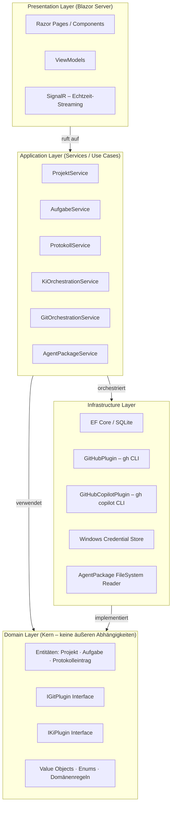

# 🔨 Softwareschmiede

> **KI-gestützter Softwareentwicklungs-Workflow — lokal, strukturiert und erweiterbar**

[](https://dotnet.microsoft.com/)
[](https://blazor.net/)
[](https://www.sqlite.org/)
[](https://www.microsoft.com/windows)
[](LICENSE)

---

## Inhaltsverzeichnis

1. [Projektbeschreibung](#-projektbeschreibung)
2. [Features](#-features)
3. [Screenshots](#-screenshots)
4. [Voraussetzungen](#-voraussetzungen)
5. [Schnellstart](#-schnellstart)
6. [Konfiguration & Plugin-Setup](#️-konfiguration--plugin-setup)
7. [Agentenpakete](#-agentenpakete)
8. [Projektstruktur](#-projektstruktur)
9. [Architektur](#-architektur)
10. [Tests](#-tests)
11. [Roadmap](#-roadmap)
12. [Dokumentation](#-dokumentation)
13. [Beitragen](#-beitragen)
14. [Lizenz](#-lizenz)

---

## 📖 Projektbeschreibung

**Softwareschmiede** ist eine webbasierte **Einzelnutzer-Anwendung** auf Basis von **Blazor Server (.NET 9+)**, die den vollständigen Workflow der **KI-gestützten Softwareentwicklung** in einer einheitlichen Oberfläche verwaltet.

Die Anwendung läuft vollständig **lokal unter Windows**, erfordert **keinen Login** und verbindet Projektmanagement, Git-Integration, Aufgabenverwaltung und KI-Steuerung an einem zentralen Ort.

### Geschäftsziele

| # | Ziel |
|---|------|
| Z-1 | Verwaltung mehrerer Softwareprojekte an einem zentralen Ort |
| Z-2 | Strukturierte Erfassung von Anforderungen je Aufgabe |
| Z-3 | Automatisierte Umsetzung von Anforderungen durch KI-Plugins |
| Z-4 | Nachvollziehbarer Verlauf jeder KI-gesteuerten Entwicklungsaufgabe |
| Z-5 | Erweiterbarkeit für weitere Git-Provider und KI-Systeme ohne Kernänderungen |

---

## 🚀 Features

### 📁 Projektmanagement
- Beliebig viele Softwareprojekte anlegen, bearbeiten, archivieren und löschen
- Repositories aus dem Git-Provider verknüpfen und Issues automatisch laden
- Projektübersicht mit Status und aktiven Aufgaben
- Konfigurierbares Basis-Arbeitsverzeichnis für lokale Repository-Klone (persistiert als `repositories.workdir`, inkl. Runtime-Fallback)

### 🔗 Git-Integration (Plugin-System)
- **Plugin-Architektur** über `IGitPlugin`-Interface – austauschbar für verschiedene Git-Provider
- **GitHub-Plugin** (erstes Plugin): vollständige GitHub-Integration via `gh` CLI
- Klonen, Branch anlegen, Committen, Pushen, Pullen und Pull Requests erstellen
- Aufgabenspezifische Branches (`task/<aufgaben-id>-<kurzname>`)
- Commit-Verwaltung inkl. Rollback (soft / mixed / hard)

### ✅ Aufgabenverwaltung
- Aufgaben aus GitHub Issues anlegen (Titel, Body, Labels, Milestone werden übernommen)
- Freie Aufgaben ohne Issue-Referenz anlegen
- Statusmodell: `Offen` → `In Bearbeitung` → `KI aktiv` / `Tests laufen` → `Abgeschlossen` / `Fehlgeschlagen`
- Automatisches Aufräumen (Branch & Klon löschen) nach Abschluss oder Abbruch

### 🤖 KI-Steuerung (Plugin-System)
- **Plugin-Architektur** über `IKiPlugin`-Interface – austauschbar für verschiedene KI-Systeme
- **GitHub Copilot-Plugin** (erstes Plugin): KI-Integration via `gh copilot` CLI
- Echtzeit-Streaming der KI-Ausgabe (< 500 ms Latenz pro Stream-Chunk)
- Iterative Entwicklung durch Folge-Prompts direkt aus dem Protokoll
- Agentenpaket-Auswahl und Agenten-Auswahl pro Prompt
- Test-Ausführung und strukturierte Auswertung der Ergebnisse

### 📋 Aufgabenprotokoll
- Lückenloses, chronologisches Protokoll aller Prompts, KI-Antworten und Zeitstempel
- Status-Übergänge und Git-Aktionen werden protokolliert
- Volltextsuche über alle Protokolleinträge einer Aufgabe
- Test-Ergebnisse strukturiert: Testname, Status, Fehlermeldung, Dauer

### 📦 Agentenpakete
- Verzeichnisbasierte Pakete mit `.agent.md`-Dateien
- Deployment ins Repository-Verzeichnis beim Start eines KI-Laufs
- Vorschau von Dateiliste, Beschreibung und verfügbaren Agenten in der Oberfläche

### 🏠 Dashboard
- Projektübergreifende Übersicht aller aktiven Aufgaben
- Farbkodierte Statusanzeige (KI aktiv = blau, Fehlgeschlagen = rot, Abgeschlossen = grün)
- Direktnavigation zum Aufgabenprotokoll per Klick

---

## 📸 Screenshots


> *Screenshot-Platzhalter – wird nach erstem Release ergänzt.*

---

## ✅ Voraussetzungen

| Voraussetzung | Version | Hinweis |
|---------------|---------|---------|
| **Windows** | 10 / 11 | Pflicht – Windows Credential Store wird benötigt |
| **.NET SDK** | 9.0+ | [dotnet.microsoft.com](https://dotnet.microsoft.com/download) |
| **GitHub CLI** (`gh`) | aktuell | [cli.github.com](https://cli.github.com/) – für Git & Copilot |
| **Git** | aktuell | [git-scm.com](https://git-scm.com/) |
| **GitHub Copilot** | aktives Abo | Wird über `gh copilot` CLI angesprochen |

**GitHub CLI einrichten:**

```powershell
# GitHub CLI installieren (z. B. via winget)
winget install --id GitHub.cli

# Authentifizieren
gh auth login

# Copilot-Extension sicherstellen
gh extension list   # gh copilot muss vorhanden sein
```

---

## ⚡ Schnellstart

### 1. Repository klonen

```powershell
git clone https://github.com/<your-org>/Softwareschmiede.git
cd Softwareschmiede
```

### 2. Abhängigkeiten wiederherstellen & bauen

```powershell
dotnet restore
dotnet build
```

### 3. Anwendung starten

```powershell
dotnet run --project Softwareschmiede/Softwareschmiede.csproj
```

Die Anwendung ist danach unter **`https://localhost:5001`** (oder dem konfigurierten Port) erreichbar.

### 4. Erste Schritte

1. **GitHub-Token einrichten** – Credential Manager öffnen und Token speichern (siehe [Konfiguration](#️-konfiguration--plugin-setup))
2. **Projekt anlegen** – Auf der Seite *Projekte* ein neues Projekt mit GitHub-Repository erstellen
3. **Aufgabe anlegen** – Issue aus dem Repository wählen oder freie Anforderung erfassen
4. **Agentenpaket auswählen** – Passendes Agentenpaket aus `agent-packages/` zuweisen
5. **KI-Lauf starten** – Prompt eingeben, Agenten auswählen und den KI-gestützten Prozess starten

---

## ⚙️ Konfiguration & Plugin-Setup

### GitHub-Token im Windows Credential Store speichern

Softwareschmiede speichert API-Tokens **ausschließlich im Windows Credential Store** – kein Klartext in Konfigurationsdateien oder der Datenbank.

**Option A – Credential Manager UI:**

1. Startmenü → *Windows-Anmeldeinformationsverwaltung* (Credential Manager) öffnen
2. *Windows-Anmeldeinformationen* → *Generische Anmeldeinformation hinzufügen*
3. Felder ausfüllen:
   - **Internetadresse oder Netzwerkadresse:** `Softwareschmiede.GitHub.Token`
   - **Benutzername:** *(beliebig, z. B. `github`)*
   - **Kennwort:** Dein GitHub Personal Access Token (PAT) mit den Scopes `repo`, `read:org`

**Option B – Kommandozeile (`cmdkey`):**

```powershell
cmdkey /generic:Softwareschmiede.GitHub.Token /user:github /pass:<DEIN_TOKEN>
```

**Token entfernen:**

```powershell
cmdkey /delete:Softwareschmiede.GitHub.Token
```

### Credential-Schlüssel (Referenz)

| Schlüssel | Inhalt |
|-----------|--------|
| `Softwareschmiede.GitHub.Token` | GitHub Personal Access Token |

### Weitere Plugin-Konfiguration

Alle weiteren Plugin-Einstellungen (Repository-URL, Organisations-URL) werden direkt in der Oberfläche unter *Projekte → Repository verknüpfen* konfiguriert und sicher in der lokalen SQLite-Datenbank gespeichert.

### Arbeitsverzeichnis für lokale Klone

Das Basis-Arbeitsverzeichnis für lokale Repository-Klone ist in den Einstellungen konfigurierbar und wird als globale App-Einstellung `repositories.workdir` in SQLite gespeichert.  
Wenn keine Einstellung gesetzt ist oder der konfigurierte Pfad zur Laufzeit nicht nutzbar ist, verwendet die Anwendung automatisch den Fallback auf Basis von `Path.GetTempPath()`.

Der finale Klonpfad wird immer unterhalb von:

`<Basispfad>/softwareschmiede/<aufgabeId>`

gebildet, z. B.:

- Konfiguriert: `D:/Repos` → `D:/Repos/softwareschmiede/<aufgabeId>`
- Fallback: `Path.GetTempPath()` → `<temp>/softwareschmiede/<aufgabeId>`

---

## 📦 Agentenpakete

### Was sind Agentenpakete?

Agentenpakete sind **Verzeichnisse mit `.agent.md`-Dateien**, die KI-Agenten und deren Instruktionen definieren. Sie werden beim Start eines KI-Laufs automatisch in das Arbeitsverzeichnis des Branches kopiert und vom KI-Plugin (z. B. GitHub Copilot) ausgewertet.

### Speicherort

```
<Programmverzeichnis>/agent-packages/
```

Das Verzeichnis wird beim App-Start automatisch angelegt, falls es noch nicht existiert.

### Struktur eines Agentenpakets

```
agent-packages/
├── mein-agentenpaket/               # Unterordner = ein Agentenpaket
│   ├── planner.agent.md             # Agent: Planer
│   ├── implementer.agent.md         # Agent: Implementierer
│   ├── reviewer.agent.md            # Agent: Reviewer
│   └── README.md                    # Optionale Beschreibung des Pakets
└── weiteres-paket/
    └── ...
```

### Aufbau einer `.agent.md`-Datei

Eine `.agent.md`-Datei beschreibt einen einzelnen Agenten mit seinen Instruktionen, Werkzeugen und Rollen. Das Format folgt dem Standard für GitHub Copilot Custom Agents.

### Agentenpakete in der Oberfläche

- Seite *Agentenpakete*: Liste aller verfügbaren Pakete mit Vorschau
- Beim Anlegen einer Aufgabe kann ein Agentenpaket zugewiesen werden
- Vor jedem KI-Lauf kann der Anwender den gewünschten Agenten aus dem Paket auswählen

---

## 🗂️ Projektstruktur

```
Softwareschmiede/                        # Solution Root
├── Softwareschmiede/                    # Blazor Server Hauptprojekt
│   ├── Application/
│   │   └── Services/                   # EntwicklungsprozessService, ProjektService,
│   │                                   # AufgabeService, ProtokollService, ...
│   ├── Domain/
│   │   ├── Entities/                   # Projekt, Aufgabe, Protokolleintrag, ...
│   │   ├── Interfaces/                 # IGitPlugin, IKiPlugin
│   │   ├── ValueObjects/
│   │   └── Enums/                      # AufgabeStatus, ProtokolleintragTyp, ...
│   ├── Infrastructure/
│   │   ├── Persistence/                # EF Core DbContext, Migrations
│   │   ├── Plugins/
│   │   │   ├── GitHub/                 # GitHubPlugin (gh CLI)
│   │   │   └── GitHubCopilot/          # GitHubCopilotPlugin (gh copilot CLI)
│   │   └── Security/                   # WindowsCredentialStore
│   ├── Components/
│   │   └── Pages/                      # Blazor Razor Pages
│   │       ├── Home.razor              # Dashboard
│   │       ├── Projekte/
│   │       ├── Aufgaben/
│   │       └── Agentenpakete/
│   └── wwwroot/                        # Statische Assets (CSS, JS, Bilder)
├── Softwareschmiede.Tests/             # Unit-Tests (xUnit, FluentAssertions, Moq)
├── docs/                               # Planungsdokumente und Architektur
│   ├── requirements/
│   │   └── requirements-analysis.md
│   ├── architecture/
│   │   ├── architecture-blueprint.md
│   │   └── entity-relationship-model.md
│   └── improvements/
└── Softwareschmiede.slnx               # Solution-Datei
```

---

## 🏗️ Architektur

Softwareschmiede folgt einer **Clean Architecture** mit vier klar getrennten Schichten:



| Schicht | Verantwortung |
|---------|---------------|
| **Presentation** | UI-Rendering, Benutzerinteraktion, ViewModel-Binding, Echtzeit-Updates via SignalR |
| **Application** | Anwendungsfalllogik, Koordination von Domain und Infrastructure, Plugin-Aufruf |
| **Domain** | Fachentitäten, Domänenregeln, Plugin-Interfaces – **keine** äußeren Abhängigkeiten |
| **Infrastructure** | DB-Zugriff, CLI-Prozesse, Credential Store, Dateisystem |

### Plugin-Interfaces

```csharp
// Git-Plugin – austauschbar für jeden Git-Provider
public interface IGitPlugin
{
    Task<IEnumerable<Issue>> GetIssuesAsync(string repositoryUrl);
    Task CloneAsync(string repositoryUrl, string localPath);
    Task CreateBranchAsync(string localPath, string branchName);
    Task PushAsync(string localPath, string branchName);
    Task<PullRequest> CreatePullRequestAsync(string repositoryUrl, string branchName, string title, string body);
    // ...
}

// KI-Plugin – austauschbar für jedes KI-System
public interface IKiPlugin
{
    IAsyncEnumerable<string> RunAsync(string prompt, string agentPackagePath, string agentName, string workingDirectory);
    Task<IEnumerable<string>> GetAvailableAgentsAsync(string agentPackagePath);
    // ...
}
```

---

## 🧪 Tests

Das Projekt enthält Unit-Tests im Projekt `Softwareschmiede.Tests`:

```powershell
# Alle Tests ausführen
dotnet test

# Tests mit Coverage-Report
dotnet test --collect:"XPlat Code Coverage"
```

**Test-Stack:**
- [xUnit](https://xunit.net/) – Test-Framework
- [FluentAssertions](https://fluentassertions.com/) – Lesbare Assertions
- [Moq](https://github.com/moq/moq4) – Mocking von Plugin-Interfaces und Services

---

## 🗺️ Roadmap

### v1.0 – MVP (vollständig implementiert ✅)
- [x] Anforderungsanalyse und Architektur-Blueprint
- [x] Domänenmodell und EF Core Datenbankschema
- [x] GitHub-Plugin (gh CLI) – vollständige Git-Integration
- [x] GitHub Copilot-Plugin (gh copilot CLI) – KI-Steuerung mit Echtzeit-Streaming
- [x] Blazor UI: Dashboard, Projekte, Aufgaben, Protokoll, Agentenpakete
- [x] Windows Credential Store Integration

### v1.x – Erweiterungen
- [ ] GitLab-Plugin
- [ ] Azure DevOps-Plugin
- [ ] Weiteres KI-Plugin (z. B. OpenAI / Claude)
- [ ] Export des Aufgabenprotokolls (PDF / Markdown)
- [ ] Erweiterte Agentenpaket-Verwaltung (Upload, Bearbeitung in der UI)

---

## 📚 Dokumentation

| Dokument | Beschreibung |
|----------|-------------|
| [Anforderungsanalyse](docs/requirements/requirements-analysis.md) | Funktionale und nicht-funktionale Anforderungen, Use Cases, Domänenmodell |
| [Architektur-Blueprint](docs/architecture/architecture-blueprint.md) | Schichtenarchitektur, Plugin-System, Sequenzdiagramme, Technologieentscheidungen |
| [Entity-Relationship-Modell](docs/architecture/entity-relationship-model.md) | Datenbankstruktur und Entitäten-Beziehungen |
| [Planungsübersicht](docs/planning-overview.md) | Projektplanung und Meilensteine |
| [Benutzerleitfaden](docs/user-guide.md) | Schritt-für-Schritt-Anleitung für Endanwender |
| [Feature-Dokumentation](docs/business/features.md) | Fachliche Beschreibung aller Features für nicht-technische Stakeholder |
| [Feature F009: Arbeitsverzeichnis konfigurieren](docs/business/features/F009-arbeitsverzeichnis-konfigurieren.md) | Fachliche Beschreibung des konfigurierbaren Arbeitsverzeichnisses inkl. Fallback und Migration |
| [Plugin-Interfaces](docs/api/plugin-interfaces.md) | Technische Dokumentation der Plugin-Schnittstellen für Plugin-Entwickler |
| [Workdir-Konfiguration (technisch)](docs/api/workdir-configuration.md) | Technische Umsetzung von Settings, Resolver, Klonpfadbildung und Reason-Codes |
| [Programmablaufpläne](docs/flows/development-process-flow.md) | Grafische Ablaufpläne und technische Prozessbeschreibungen |
| [Flow: Arbeitsverzeichnis-Auflösung](docs/flows/workdir-resolution-flow.md) | Sequenzablauf für Konfiguration, Laufzeit-Auflösung und Fallback-Verhalten |

---

## 🤝 Beitragen

Beiträge zum Projekt sind willkommen! Bitte beachte die folgenden Konventionen.

### Branch-Konvention

| Typ | Muster | Beispiel |
|-----|--------|---------|
| Neues Feature | `feature/<kurz-beschreibung>` | `feature/gitlab-plugin` |
| Fehlerbehebung | `bugfix/<id>` | `bugfix/42-stream-timeout` |
| Refactoring | `refactor/<bereich>` | `refactor/ki-plugin-interface` |

### Commit-Format (Conventional Commits)

Commits folgen dem **[Conventional Commits](https://www.conventionalcommits.org/)**-Standard:

```
feat:     Neues Feature
fix:      Fehlerbehebung
refactor: Code-Umstrukturierung ohne Verhaltensänderung
test:     Tests hinzufügen oder korrigieren
docs:     Nur Dokumentationsänderungen
chore:    Build, Abhängigkeiten, CI-Konfiguration
```

**Beispiele:**
```
feat: GitHub Copilot Streaming-Unterstützung hinzugefügt
fix: Token-Speicherung im Credential Store repariert
refactor: KiOrchestrationService in kleinere Methoden aufgeteilt
```

### Pull Requests

- Jeder PR benötigt **mindestens 1 Approver** (Code-Review-Pflicht)
- Branch muss aktuell mit `main` sein (rebase oder merge vor dem PR)
- Alle Tests müssen bestehen (`dotnet test`)
- PR-Beschreibung enthält: Kontext, Änderungen, Testnachweis

### Coding-Guidelines

- **Naming:** PascalCase für Klassen/Methoden, camelCase für Parameter/Variablen, Präfix `I` für Interfaces
- **Async:** Alle I/O-Operationen konsequent `async`/`await` – keine `.Result`- oder `.Wait()`-Aufrufe
- **Logging:** `ILogger<T>` in allen Services – strukturiertes Logging mit aussagekräftigen Nachrichten und Parametern
- **Plugin-Erweiterungen:** Neue Plugins implementieren `IGitPlugin` bzw. `IKiPlugin` und werden per DI registriert – keine Kernänderungen nötig

---

## 📄 Lizenz

MIT License *(Platzhalter – wird vor erster Veröffentlichung festgelegt)*

---

*Softwareschmiede – KI-gestützter Entwicklungsworkflow, lokal und unter Ihrer Kontrolle.*
