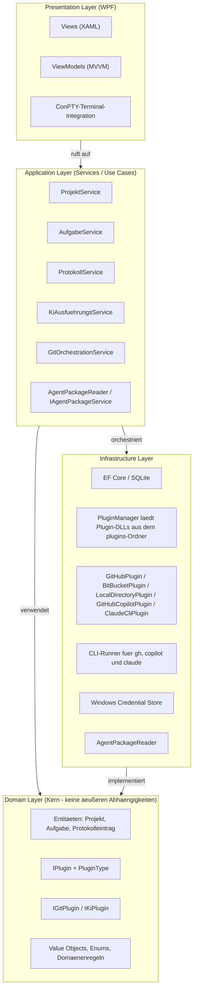

# 🔨 Softwareschmiede

> **KI-gestützter Softwareentwicklungs-Workflow — lokal, strukturiert und erweiterbar**

[](https://dotnet.microsoft.com/)
[](https://learn.microsoft.com/dotnet/desktop/wpf/)
[](https://www.sqlite.org/)
[](https://www.microsoft.com/windows)
[](https://github.com/martin-stromberg/Softwareschmiede/actions/workflows/release.yml)
[](#-lizenz)

---

## Inhaltsverzeichnis

1. [Projektbeschreibung](#-projektbeschreibung)
2. [Features](#-features)
3. [UI-Status](#-ui-status)
4. [Voraussetzungen](#-voraussetzungen)
5. [Installation](#-installation)
6. [Usage](#-usage)
7. [Konfiguration & Plugin-Setup](#-konfiguration--plugin-setup)
8. [Projektstruktur](#-projektstruktur)
9. [Architektur](#-architektur)
10. [Tests](#-tests)
11. [Deployment](#-deployment)
12. [Changelog](#-changelog)
13. [Roadmap](#-roadmap)
14. [Dokumentation](#-dokumentation)
15. [Beitragen](#-beitragen)
16. [Lizenz](#-lizenz)
17. [Kontakt](#-kontakt)

---

## 📖 Projektbeschreibung

**Softwareschmiede** ist eine **Einzelnutzer-Anwendung**, die den vollständigen Workflow der **KI-gestützten Softwareentwicklung** in einer einheitlichen Oberfläche verwaltet.

Die Anwendung läuft vollständig **lokal unter Windows**, erfordert **keinen Login** und verbindet Projektmanagement, Git-Integration, Aufgabenverwaltung und KI-Steuerung an einem zentralen Ort.

Die Oberfläche ist eine native **WPF-Desktopanwendung** (`src/Softwareschmiede.App`, .NET 10+). Eine frühere Blazor-Server-Oberfläche wurde vollständig durch die WPF-Anwendung abgelöst und ist nicht mehr Teil des Projekts.

### Geschäftsziele

| # | Ziel |
|---|------|
| Z-1 | Verwaltung mehrerer Softwareprojekte an einem zentralen Ort |
| Z-2 | Strukturierte Erfassung von Anforderungen je Aufgabe |
| Z-3 | Automatisierte Umsetzung von Anforderungen durch KI-Plugins |
| Z-4 | Nachvollziehbarer Verlauf jeder KI-gesteuerten Entwicklungsaufgabe |
| Z-5 | Erweiterbarkeit für weitere Git-Provider und KI-Systeme ohne Kernänderungen |

---

## 🚀 Features

Softwareschmiede bündelt den kompletten Workflow der KI-gestützten Softwareentwicklung – von der Aufgabenerfassung über den Git-Workflow bis zum fertigen Pull Request – in einer einzigen, lokal laufenden Windows-Anwendung.

Die wichtigsten Features:

- **Projekt- und Aufgabenverwaltung** – Dashboard, Statusmodell und chronologisches Aufgabenprotokoll
- **Plugin-basierte Git-Integration** – GitHub, BitBucket und lokales Verzeichnis als austauschbare SCM-Provider
- **Plugin-basierte KI-Steuerung** – GitHub Copilot, Claude CLI und Codex CLI mit Echtzeit-Streaming der Ausgabe
- **ConPTY-Terminal-Integration** – interaktive KI-CLI-Prozesse direkt eingebettet in der Aufgabendetailansicht
- **Dateiexplorer mit Diff-Ansicht** – Arbeitsbaum- und commitbezogene Vergleichsansicht geänderter Dateien
- **Aufgabenspezifische Branches & Pull Requests** – automatische Branch-Namensbildung, Commit-Verwaltung, PR-Erstellung inkl. Issue-Verknüpfung
- **Folgeanweisungen mit Kontextsteuerung** – Kontext mitgeben, ignorieren oder neu beginnen
- **Repository-Startskripte mit automatischer Portzuweisung** – für lokale Debug-/Run-Konfigurationen je verknüpftem Repository
- **Benachrichtigungssystem** – Toast- und Tonbenachrichtigungen bei abgeschlossenen KI-Läufen
- **Programmupdate** – Update-Prüfung gegen GitHub-Releases direkt aus der Anwendung

Details zu den einzelnen Bereichen finden Sie in der [Anwendungsdokumentation](docs/help/index.md).

---

## 📸 UI-Status

Aktuell ist kein versionierter Screenshot im Repository abgelegt.  
Die wichtigsten UI-Abläufe sind in der [Anwendungsdokumentation](docs/help/index.md) beschrieben.

---

## ✅ Voraussetzungen

| Voraussetzung | Version | Hinweis |
|---------------|---------|---------|
| **Windows** | 10 (Build 17763+) / 11 | Pflicht – Windows Credential Store, WPF und Pseudo Console API (ConPTY) werden benötigt |
| **.NET SDK** | 10.0+ | [dotnet.microsoft.com](https://dotnet.microsoft.com/download) – WPF-Projekt (`net10.0-windows10.0.17763.0`) erfordert Windows-SDK und Zielversion mindestens Build 17763 |
| **GitHub CLI** (`gh`) | aktuell | [cli.github.com](https://cli.github.com/) – für GitHub-Operationen |
| **Git** | aktuell | [git-scm.com](https://git-scm.com/) |
| **Copilot CLI** (`copilot`) | aktuell | Optional – benötigt für das GitHub-Copilot-Plugin (`copilot --version`) |
| **Claude CLI** (`claude`) | aktuell | Optional – benötigt für `Softwareschmiede.Plugin.ClaudeCli` (`claude --version`) |
| **Codex CLI** (`codex`) | aktuell | Optional – benötigt für `Softwareschmiede.Plugin.Codex` (`codex --version`) |
| **GitHub Copilot** | aktives Abo | Optional – nur für Copilot-basierte KI-Läufe |
| **Anthropic API Key** | vorhanden | Optional – nur für Claude-CLI-Läufe (Credential `Softwareschmiede.ClaudeCli.Token`) |

> Für den Aufgabenstart ist ein **KI-Plugin Pflicht**.

**CLI-Tools prüfen/einrichten:**

```powershell
# GitHub CLI installieren (z. B. via winget)
winget install --id GitHub.cli

# Authentifizieren
gh auth login

# Copilot-CLI prüfen
copilot --version

# Claude-CLI prüfen
claude --version
```

---

## 🛠️ Installation

### 1. Repository klonen

```powershell
git clone https://github.com/martin-stromberg/Softwareschmiede.git
cd Softwareschmiede
```

### 2. Abhängigkeiten wiederherstellen & bauen

```powershell
dotnet restore
dotnet build src/Softwareschmiede.App/Softwareschmiede.App.csproj
```

Beim Build werden die Plugin-DLLs automatisch nach `bin/<Config>/plugins/` kopiert (MSBuild-Target `CopyPluginsToOutput`).

### 3. Anwendung starten

```powershell
dotnet run --project src/Softwareschmiede.App/Softwareschmiede.App.csproj
```

Das WPF-Fenster öffnet sich direkt als native Windows-Anwendung.

### 4. Erste Schritte

1. **GitHub-Token einrichten** – Credential Manager öffnen und Token speichern (siehe [Konfiguration](#-konfiguration--plugin-setup))
2. **Optional: Claude-Token einrichten** – Anthropic API Key als Credential speichern (`Softwareschmiede.ClaudeCli.Token`)
3. **Projekt anlegen** – Auf der Seite *Projekte* ein neues Projekt erstellen und ein SCM-Plugin wählen
4. **Aufgabe anlegen** – Issue aus dem Repository wählen oder freie Anforderung erfassen
5. **KI-Plugin wählen (Pflicht)** – Copilot, Claude CLI oder Codex CLI auswählen (explizit oder via Standardplugin/Fallback)
6. **KI-Lauf starten** – Prompt eingeben und den Prozess starten

---

## 🖥️ Usage

### Typischer Ablauf in der Anwendung

1. **Projekt erstellen oder öffnen** und ein Repository verknüpfen.
2. **Aufgabe anlegen** (frei oder aus GitHub-Issue).
3. **Entwicklungsprozess starten** (lokaler Klon + Aufgaben-Branch; bei Issue mit issuebezogenem Branchnamen; optionales Repository-Startskript mit freiem Port wird ausgeführt; KI-Plugin wird über Default/Fallback aufgelöst).
4. **KI-Lauf ausführen** (Prompt + **KI-Plugin Pflicht**; Standardplugin ist vorausgewählt).
5. **Ergebnis prüfen**, optional weitere Folge-Prompts senden.
6. **Commits durchführen**, bei Remote-SCM optional Push/PR (bei Issue inkl. `Closes #<Issue>`), und Aufgabe abschließen oder abbrechen.

### `start.ps1` für Visual-Studio-Debug (freier HTTP-Port)

- Skript: `.\start.ps1` im Repository-Root ausführen, danach F5 in Visual Studio starten.
- Das Skript sucht automatisch alle `Properties/launchSettings.json`-Dateien im Repository (außer unter `.git`, `bin`, `obj`, `TestResults`, `node_modules`) und weist jedem gefundenen Projekt automatisch einen freien, eindeutigen HTTP-Port zu. Es gibt **keinen** `-Port`-Parameter und **keine** Umgebungsvariablen-Steuerung — die Portvergabe erfolgt ausschließlich automatisch.
- Exit-Codes: `0` (Erfolg), `10` (kein launchSettings.json gefunden), `11` (JSON/Profil ungültig), `12` (Port ungültig/nicht verfügbar), `13` (Schreibfehler), `99` (unerwarteter Fehler).

Weiterführende Bedienungshinweise (Arbeitsverzeichnis-Konfiguration für Repository-Startskripte, LocalDirectoryPlugin-Workspace-Modi, KI-Plugin-Auswahl und Standardplugins, Folgeanweisungen mit Kontextsteuerung, Benachrichtigungssystem u. a.) finden Sie in der [Anwendungsdokumentation](docs/help/index.md).

---

## ⚙️ Konfiguration & Plugin-Setup

### Plugin-Architektur (kurz)

- **Contracts:** `src/Softwareschmiede.Plugin.Contracts` definiert `IPlugin`, `IGitPlugin`, `IKiPlugin`, `PluginType`
- **Plugin-Projekte:** liegen als eigenständige Klassenbibliotheken unter `plugins/`
- **Host-Referenzen:** `src/Softwareschmiede/Softwareschmiede.csproj` referenziert Plugin-Projekte mit `ReferenceOutputAssembly="false"`
- **Build/Publish-Kopie:** MSBuild-Targets kopieren Plugin-Artefakte nach `$(OutDir)plugins` bzw. `$(PublishDir)plugins`
- **Discovery zur Laufzeit:** `PluginManager` lädt alle `*.dll` aus `AppContext.BaseDirectory/plugins` und registriert sie nach `PluginType`
- **Aktuelle KI-Plugins:** `Softwareschmiede.Plugin.GitHubCopilot` und `Softwareschmiede.Plugin.ClaudeCli`

### GitHub-Token im Windows Credential Store speichern

Softwareschmiede speichert API-Tokens **ausschließlich im Windows Credential Store** – kein Klartext in Konfigurationsdateien oder der Datenbank.

**Option A – Credential Manager UI:**

1. Startmenü → *Windows-Anmeldeinformationsverwaltung* (Credential Manager) öffnen
2. *Windows-Anmeldeinformationen* → *Generische Anmeldeinformation hinzufügen*
3. Felder ausfüllen:
   - **Internetadresse oder Netzwerkadresse:** `Softwareschmiede.GitHub.Token`
   - **Benutzername:** *(beliebig, z. B. `github`)*
   - **Kennwort:** Dein GitHub Personal Access Token (PAT) mit den Scopes `repo`, `read:org`

**Option B – Kommandozeile (`cmdkey`):**

```powershell
cmdkey /generic:Softwareschmiede.GitHub.Token /user:github /pass:<DEIN_TOKEN>
```

**Token entfernen:**

```powershell
cmdkey /delete:Softwareschmiede.GitHub.Token
```

### Credential-Schlüssel (Referenz)

| Schlüssel | Inhalt |
|-----------|--------|
| `Softwareschmiede.GitHub.Token` | GitHub Personal Access Token |
| `Softwareschmiede.ClaudeCli.Token` | Anthropic API Key für Claude CLI (`ANTHROPIC_API_KEY`) |
| `Softwareschmiede.Codex.ExecutablePath` | Optionaler absoluter Pfad zur Codex-CLI |
| `Softwareschmiede.Codex.CommandLineParameters` | Anwenderdefinierte zusätzliche Codex-CLI-Argumente; keine automatische Default-Übernahme |

### Weitere Plugin-Konfiguration

Projektbezogene Verknüpfungen werden in der Oberfläche unter *Projekte → Repository verknüpfen* plugin-gesteuert konfiguriert und in der lokalen SQLite-Datenbank gespeichert.  
Beispiel: Beim GitHub-Plugin sind `RepositoryUrl` und `RepositoryName` Pflichtfelder; beim LocalDirectoryPlugin wird `SourceDirectory` abgefragt.

Für das Claude-CLI-Plugin kann der API-Key alternativ per `cmdkey` gesetzt werden:

```powershell
cmdkey /generic:Softwareschmiede.ClaudeCli.Token /user:anthropic /pass:<DEIN_ANTHROPIC_API_KEY>
```

### Standardplugin je Pluginart konfigurieren

- In **Einstellungen → Quellcodeverwaltung** und **Einstellungen → KI** können Standard-Plugins pro Pluginart gewählt und konfiguriert werden:
  - **Quellcodeverwaltung** (SourceCodeManagement): z. B. GitHub oder Local Directory
  - **KI** (DevelopmentAutomation): z. B. GitHub Copilot, Claude CLI oder Codex CLI
- Die Auswahl wird persistent in den App-Einstellungen (`DefaultScmPluginKey`, `DefaultKiPluginKey`) gespeichert und beim nächsten Prompt automatisch als Vorauswahl genutzt
- Nach Plugin-Auswahl können plugin-spezifische Einstellungen konfiguriert werden:
  - Die verfügbaren Felder werden vom Plugin via `GetSettingGroups()` definiert
  - Feldtypen (Text, Secret, Integer, Boolean, Enum, FilePath) werden entsprechend gerendert
  - Einstellungswerte werden über `PluginSettingsService` in der Credential-Datenbank persistiert
- Für Git-Aktionen gilt: eine projektspezifische Repository-Auswahl (Aufgabe/Projekt) hat Vorrang; das Standardplugin dient als Fallback
- Ist ein gespeicherter Wert nicht mehr verfügbar, greift automatisch die Fallback-Auflösung auf ein verfügbares Plugin

### Arbeitsverzeichnis für lokale Klone

Das Basis-Arbeitsverzeichnis für lokale Repository-Klone ist in den Einstellungen konfigurierbar und wird als globale App-Einstellung `repositories.workdir` in SQLite gespeichert.  
Wenn keine Einstellung gesetzt ist oder der konfigurierte Pfad zur Laufzeit nicht nutzbar ist, verwendet die Anwendung automatisch den Fallback auf Basis von `Path.GetTempPath()`.

Der finale Klonpfad wird immer unterhalb von:

`<Basispfad>/softwareschmiede/<aufgabeId>`

gebildet, z. B.:

- Konfiguriert: `D:/Repos` → `D:/Repos/softwareschmiede/<aufgabeId>`
- Fallback: `Path.GetTempPath()` → `<temp>/softwareschmiede/<aufgabeId>`

### LocalDirectoryPlugin-Konfiguration (Workspace)

LocalDirectoryPlugin-spezifische Einstellungen werden ebenfalls über das Plugin-Settings-Schema `<PluginPrefix>.<Key>` persistiert:

| Schlüssel | Bedeutung | Default |
|-----------|-----------|---------|
| `LocalDirectoryPlugin.WorkspaceMode` | Arbeitsmodus (`SeparateWorkingDirectory` oder `InSourceDirectory`) | `SeparateWorkingDirectory` |
| `LocalDirectoryPlugin.SourceDirectory` | Optionaler Fallback-Quellpfad, wenn kein Repository-Pfad übergeben wurde | leer |
| `LocalDirectoryPlugin.ConfirmGitInitInSourceDirectory` | Explizite Bestätigung für `git init` im Quellverzeichnis; in `SeparateWorkingDirectory` ausgeblendet | `false` |
| `LocalDirectoryPlugin.CopyTimeoutSeconds` | Guardrail für Kopierdauer | `600` |
| `LocalDirectoryPlugin.CopyMaxFiles` | Guardrail für maximale Dateianzahl pro Kopie | `100000` |
| `LocalDirectoryPlugin.CopyMaxMegabytes` | Guardrail für maximale Datenmenge pro Kopie | `10240` |

Hinweise:
- Ein plugin-spezifisches `WorkingDirectory`-Setting existiert nicht; der Zielpfad wird aus `repositories.workdir` + `softwareschmiede/<aufgabeId>` gebildet.
- Bei ungültigem gespeichertem `WorkspaceMode` fällt das Plugin zur Laufzeit auf `SeparateWorkingDirectory` zurück.

### Verzeichnisstruktur-Abruf für Repository-Arbeitsverzeichnisse

Die Verzeichnisstruktur-Abfrage beim Repository-Dialog wird über folgende `appsettings.json`-Einträge gesteuert:

| Schlüssel | Typ | Default | Bedeutung |
|-----------|-----|---------|-----------|
| `DirectoryStructureEnabled` | bool | `true` | Aktiviert/deaktiviert die automatische Verzeichnisstruktur-Voraus-Ladung im Repository-Dialog |
| `DirectoryStructureMaxDepth` | int | `2` | Maximale Verzeichnis-Tiefe beim Abruf (z. B. `2` = Root + 1 Ebene + 1 Ebene) |
| `DirectoryStructureCacheDurationSeconds` | int | `300` | Cache-Dauer für abgerufene Verzeichnisstrukturen in Sekunden (5 Minuten) |

**Beispiel-Konfiguration in `appsettings.json`:**

```json
{
  "DirectoryStructureEnabled": true,
  "DirectoryStructureMaxDepth": 3,
  "DirectoryStructureCacheDurationSeconds": 600
}
```

**Verhalten:**
- Falls `DirectoryStructureEnabled = false`: Dialog zeigt nur Root-Verzeichnis `"."` an
- Der Cache wird pro Plugin, Repository-URL und Abruftiefe gepuffert und nach Ablauf der TTL verworfen
- Bei fehlgeschlagenem Abruf oder fehlender Strukturunterstützung wird ein manuelles Eingabefeld angezeigt; erfolgreiche leere Repositories bleiben im Auswahlmodus mit Root `"."`

### Git-Workflow-Fallback im separaten Arbeitsverzeichnis

- **Source-Copy-Bootstrap:** Im Modus `SeparateWorkingDirectory` wird die Quelle per Dateikopie übernommen, im Arbeitsverzeichnis `git init` ausgeführt und ein initialer Snapshot-Commit erstellt.
- **Pull ohne Merge + Nutzerhinweis:** Pull im `LocalDirectoryPlugin` ist ein No-Merge-Sync mit verpflichtendem Hinweistext im Service-Protokoll.
- **Push als Datei-Sync:** Push synchronisiert den Dateistand `WorkingDirectory -> SourceDirectory`; ein Remote-`git push` wird nicht ausgeführt.
- **Delete-Sync via Git-Status:** Löschkandidaten werden über `git status --porcelain` im Working Directory ermittelt und beim Push im Source Directory gespiegelt.

### Grenzen, bekannte Einschränkungen und nächste Schritte (LocalDirectoryPlugin)

- **Kein Remote-Provider:** `LocalDirectoryPlugin` unterstützt keine PR-/Issue-/Remote-Branch-Funktionen.
- **Kein `git push`/`git pull` gegen Remote:** Push/Pull sind lokale Dateisynchronisationen zwischen Workspace und Quelle.
- **Konfliktbehandlung bei Pull:** Bei uncommitted Changes im Workspace wird Pull aus Sicherheitsgründen abgebrochen.
- **Nächster Schritt (offen):** UI-seitiger Bestätigungsdialog für Pull in der Aufgabenansicht ist fachlich vorgesehen, aber noch nicht automatisiert getestet.

---

## 🗂️ Projektstruktur

```
Softwareschmiede/                            # Solution Root
├── src/
│   ├── Softwareschmiede/                    # Domain/Application/Infrastructure (Klassenbibliothek)
│   │   ├── Application/
│   │   │   └── Services/                    # EntwicklungsprozessService, ProjektService,
│   │   │                                    # AufgabeService, ProtokollService,
│   │   │                                    # AsyncTaskExtensions (SafeFireAndForget), ...
│   │   ├── Domain/
│   │   │   ├── Entities/                    # Projekt, Aufgabe, Protokolleintrag, ...
│   │   │   ├── Interfaces/                  # IPluginManager, ...
│   │   │   ├── ValueObjects/
│   │   │   └── Enums/                       # AufgabeStatus, ProtokolleintragTyp, ...
│   │   ├── Infrastructure/
│   │   │   ├── Data/                        # EF Core DbContext, Migrations
│   │   │   ├── Plugins/                     # PluginManager (Discovery/Loading)
│   │   │   └── Services/                    # CliRunner, WindowsCredentialStore, ...
│   │   └── Controllers/                     # DiffController (ohne eigenen Web-Host aktuell nicht erreichbar)
│   ├── Softwareschmiede.App/                # WPF-Desktopanwendung (net10.0-windows) — die Benutzeroberfläche
│   │   ├── Views/                           # MainWindow, Dashboard-, Projekt-, Aufgaben-, Einstellungs-Views
│   │   │   ├── ProjectDetailView.xaml       # Projektdetailansicht mit Ribbon-Menü und Kacheln
│   │   │   ├── RepositoryAssignDialog.xaml # Dialog zur Repository-Zuweisung
│   │   │   ├── MainWindow.xaml              # Hauptfenster mit Seitenleiste (aktive Aufgaben)
│   │   │   ├── DashboardView.xaml           # Dashboard mit Aufgabenliste
│   │   │   └── ...
│   │   ├── ViewModels/                      # MVVM-ViewModels (ViewModelBase, MainWindowViewModel, ...)
│   │   │   ├── MainWindowViewModel.cs       # Haupt-ViewModel mit aktiven Aufgaben
│   │   │   ├── DashboardViewModel.cs        # Dashboard-ViewModel mit Aufgabenliste
│   │   │   ├── ProjectDetailViewModel.cs    # ViewModel für Projektdetailansicht
│   │   │   ├── RepositoryAssignViewModel.cs # ViewModel für Repository-Dialog
│   │   │   └── ...
│   │   ├── Controls/                        # ProcessWindowHost, StatusIndicatorControl, RecoveryBannerControl
│   │   ├── Services/                        # DarkModeService, WpfAudioService
│   │   ├── Themes/                          # DarkTheme.xaml, LightTheme.xaml
│   │   ├── Converters/                      # AppConverters, KiAusfuehrungsStatusConverter (WPF-Wertkonverter)
│   ├── Softwareschmiede.IntegrationTests/   # Integrations-Tests
│   ├── Softwareschmiede.Plugin.Contracts/   # IPlugin, IGitPlugin, IKiPlugin, PluginType
│   └── Softwareschmiede.Tests/              # Unit-Tests (xUnit, FluentAssertions, Moq)
├── plugins/                                 # Plugin-Projekte (separate Klassenbibliotheken)
│   ├── Softwareschmiede.Plugin.GitHub/      # Git-Provider Plugin
│   ├── Softwareschmiede.Plugin.BitBucket/   # BitBucket Cloud & Self-Hosted Plugin
│   ├── Softwareschmiede.Plugin.LocalDirectory/ # Lokales SCM-Plugin (WorkspaceMode)
│   ├── Softwareschmiede.Plugin.GitHubCopilot/ # KI-Plugin (Copilot CLI)
│   ├── Softwareschmiede.Plugin.ClaudeCli/   # KI-Plugin (Claude CLI)
│   └── Softwareschmiede.Plugin.Codex/       # KI-Plugin (Codex CLI)
├── docs/                                    # Fachliche/technische Dokumentation
│   ├── help/                                 # Anwendungsdokumentation je Bereich (siehe Kapitel „Dokumentation")
│   ├── features/                             # Planungsartefakte je Anforderung (branchbezogen, nicht dauerhaft)
│   └── CI_CD.md                              # Release-Workflow, Semantic Release, Troubleshooting
└── Softwareschmiede.slnx               # Solution-Datei
```

---

## 🏗️ Architektur

Softwareschmiede folgt einer **Clean Architecture** mit vier klar getrennten Schichten:



| Schicht | Verantwortung |
|---------|---------------|
| **Presentation (WPF)** | Native Windows-UI, MVVM (ViewModelBase), Dark Mode, ConPTY-Terminal-Integration |
| **Application** | Anwendungsfalllogik, Koordination von Domain und Infrastructure, Plugin-Aufruf |
| **Domain** | Fachentitäten, Domänenregeln, Plugin-Interfaces – **keine** äußeren Abhängigkeiten |
| **Infrastructure** | DB-Zugriff, CLI-Prozesse, Credential Store, Dateisystem |

### Plugin-Interfaces

```csharp
// Basisvertrag für alle Plugins
public interface IPlugin
{
    string PluginName { get; }
    string PluginPrefix { get; }
    PluginType PluginType { get; } // SourceCodeManagement | DevelopmentAutomation
}

public interface IGitPlugin : IPlugin { /* Git operations */ }
public interface IKiPlugin : IPlugin { /* AI operations */ }
```

`IPluginManager` lädt Plugin-DLLs aus `plugins/` dynamisch und ordnet sie über `PluginType` den Kategorien zu.

### Discovery- und Build-Flow

1. Plugin-Projekte unter `plugins/*` referenzieren nur `Softwareschmiede.Plugin.Contracts`
2. Das Host-Projekt baut Plugins als Projekt-Referenzen (ohne statisches Linken in den Host)
3. Nach Build/Publish kopieren MSBuild-Targets die Plugin-DLLs in den `plugins`-Unterordner der Ausgabe
4. `PluginManager` scannt beim ersten Zugriff den Ordner `AppContext.BaseDirectory/plugins` (`*.dll`, TopDirectoryOnly)
5. Gefundene Typen werden per `ActivatorUtilities` instanziiert und anhand von `PluginType` als Git- oder KI-Plugin registriert

### Architekturbezug: Branch-Commit-Anzeige + Commit-Diff-Preview

- `GitWorkspaceBrowserService` ermittelt eine Basisreferenz (bevorzugt `origin/HEAD`, sonst Fallback) und berechnet daraus `BranchCommits` relativ zu `HEAD`.
- Commit-Knoten werden in `AufgabeDetail` über den `CommitTreePresenter` zustandsbasiert expandiert (lazy Laden, Fehlerzustand, Retry).
- Commit-Dateiknoten tragen `WorkspaceFileNode.CommitSha`; damit wird die Vorschau commit-spezifisch über `LoadCommitPreviewAsync` geladen.
- Für reguläre Workspace-Dateien bleibt die bestehende Vorschaukette (`LoadPreviewAsync` und dateispezifische Diff-Auflösung) unverändert aktiv.

### Architekturbezug: Aktive Aufgaben im Menü (Issue 81)

- `KiAusfuehrungsStatusConverter` (`IValueConverter`, Presentation-Layer) konvertiert `Aufgabe`-Objekte zu Status-Strings basierend auf Laufzeit-Properties (`AktiveRunId`, `LastHeartbeatUtc`).
- `AufgabeService.GetAktiveAufgabenAsync()` filtert Aufgaben nach Status (`Gestartet`, `Wartend`) und sortiert nach letzter Aktivität (Application-Layer).
- `MainWindowViewModel` und `DashboardViewModel` nutzen die Service-Methode um `AktiveAufgaben`-Collections zu befüllen und Navigation zwischen Views zu koordinieren.
- `NavigateZuAufgabeCommand` nutzt Callbacks zur fensterübergreifenden Navigation zwischen Projekt- und Aufgabendetail (Presentation-Layer Orchestrierung).
- `IsDashboardVisible` (computed Property) steuert die Sichtbarkeit der Seitenleisten-Sektion über XAML-Binding mit `InvertedBoolToVisibilityConverter`.

### Architekturbezug: Absturzstabilisierung (Stabilität & Fehlerbehandlung)

- `App.OnStartup()` registriert vor dem Aufruf von `StartupAsync()` drei globale Exception-Handler (`DispatcherUnhandledException`, `AppDomain.CurrentDomain.UnhandledException`, `TaskScheduler.UnobservedTaskException`), die ausschließlich über `Log.Logger` protokollieren; `DispatcherUnhandledException` setzt zusätzlich `e.Handled = true`, `UnobservedTaskException` ruft `e.SetObserved()` auf.
- `AsyncTaskExtensions.SafeFireAndForget(this Task, ILogger, string)` (`src/Softwareschmiede/Application/Services/AsyncTaskExtensions.cs`) kapselt alle bewusst nicht abgewarteten Aufrufe; ein `ContinueWith`-Callback loggt Fehler (`LogError`) bzw. Abbrüche (`LogInformation`), ohne die Exception zum Aufrufer zu propagieren.
- `CliProcessManager` verwaltet pro Aufgabe ein eigenes `SemaphoreSlim` in einem `ConcurrentDictionary<Guid, SemaphoreSlim>` statt einer einzigen klassenweiten Sperre — Heartbeat-Updates unabhängiger Aufgaben blockieren sich dadurch nicht mehr gegenseitig, überlappende Timer-Ticks derselben Aufgabe werden weiterhin serialisiert.
- `KiAusfuehrungsService` kapselt die Verarbeitung des `Process.Exited`-Events (klassischer und ConPTY-basierter CLI-Start) in einer zentralen, try-catch-geschützten Methode, damit ein Fehler bei einem Abonnenten nicht die Statusbenachrichtigung der übrigen Abonnenten verhindert.
- `App.StartupAsync()` sichert `GetRequiredService<CliProcessManager>()` und `mainWindow.Show()` jeweils mit eigenem try-catch ab, sodass ein Fehler in einem der beiden Schritte nicht zum Abbruch des gesamten Anwendungsstarts führt.

---

## 🧪 Tests

Das Projekt enthält Unit-Tests im Projekt `Softwareschmiede.Tests`:

```powershell
# Alle Tests ausführen
dotnet test

# Tests mit Coverage-Report
dotnet test --collect:"XPlat Code Coverage"
```

**Test-Stack:**
- [xUnit](https://xunit.net/) – Test-Framework
- [FluentAssertions](https://fluentassertions.com/) – Lesbare Assertions
- [Moq](https://github.com/moq/moq4) – Mocking von Plugin-Interfaces und Services

Feature-spezifische Testartefakte:
- Service-Tests (Diff-Pipeline/Cache/Algorithmus): `src/Softwareschmiede.Tests/Application/Services/DiffServiceTests.cs`, `src/Softwareschmiede.Tests/Application/Services/DiffCachingServiceTests.cs`, `src/Softwareschmiede.Tests/Application/Services/DiffAlgorithmServiceTests.cs`
- Service-Tests (Changed Artifact Detection: `CodeFiles` + `PlanningDocuments`, Fallback-Pfade): `src/Softwareschmiede.Tests/Application/Services/GitWorkspaceBrowserServiceTests.cs`
- Service-Tests (Branch-Commit-Baum & Commit-Preview): `src/Softwareschmiede.Tests/Application/Services/GitWorkspaceBrowserServiceTests.cs`
- Service-Tests (dateispezifische Diff-Auflösung): `src/Softwareschmiede.Tests/Application/Services/AufgabeServiceTests.cs`
- Service-Tests (Pluginauswahl/Fallback): `src/Softwareschmiede.Tests/Application/Services/GitOrchestrationServiceTests.cs`
- Service-Tests (Issue 58 Pluginauswahl/Persistenz): `src/Softwareschmiede.Tests/Application/Services/PluginSelectionServiceTests.cs`, `src/Softwareschmiede.Tests/Application/Services/EntwicklungsprozessServiceTests.cs`, `src/Softwareschmiede.Tests/Application/Services/AufgabeServiceTests.cs`
- Service-Tests (Startskript/Portreservierung): `src/Softwareschmiede.Tests/Application/Services/RepositoryStartskriptServiceTests.cs`, `src/Softwareschmiede.Tests/Application/Services/PortReservationServiceTests.cs`
- Unit-Tests: `src/Softwareschmiede.Tests/Infrastructure/Plugins/LocalDirectoryPluginTests.cs`
- Integrationstests: `src/Softwareschmiede.IntegrationTests/Infrastructure/Plugins/LocalDirectoryPluginIntegrationTests.cs`
- Compliance-Tests Agentendefinitionen:
  - Copilot-Plugin Health/CLI/Package-Kompatibilität: `src/Softwareschmiede.Tests/Infrastructure/Plugins/GitHubCopilotPluginTests.cs`
  - Claude-Plugin Package-/Description-Robustheit: `src/Softwareschmiede.Tests/Infrastructure/Plugins/ClaudeCliPluginTests.cs`
  - AgentPackageReader I/O-Fallback: `src/Softwareschmiede.Tests/Infrastructure/Services/AgentPackageReaderTests.cs`
- Benachrichtigungssystem für abgeschlossene KI-Aufgaben:
  - Service-Events (Publikation bei Erfolg/Fehler): `src/Softwareschmiede.Tests/Application/Services/EntwicklungsprozessServiceTests.cs`
  - Einstellungs- und Audio-Validierung/Persistenz: `src/Softwareschmiede.Tests/Application/Services/BenachrichtigungsEinstellungenServiceTests.cs`
- Issue 81 — Aktive Aufgaben im Menü (in Arbeit):
  - Service-Tests: `AufgabeServiceTests` — `GetAktiveAufgabenAsync()` Filterung nach Status, Sortierung nach Aktivität
  - Converter-Tests: `KiAusfuehrungsStatusConverterTests` — Status-String-Berechnung (Läuft, Wartet, Fallback)
  - ViewModel-Tests: `MainWindowViewModelTests` — Properties (`AktiveAufgaben`, `IsDashboardVisible`), `AktiveAufgabenAktualisierenAsync()`, `NavigateZuAufgabeCommand`
  - ViewModel-Tests: `DashboardViewModelTests` — `AktiveAufgabenListe` Befüllung in `LadenAsync()`
  - E2E-Tests: Menü-Anzeige, Navigation zu Aufgabendetail, Sichtbarkeits-Toggle (Dashboard-abhängig), Status-Anzeige
- Absturzstabilisierung (globale Exception-Handler, SafeFireAndForget, Prozess-Handler-Härtung):
  - Neue Testklasse `AppTests` (`src/Softwareschmiede.Tests/App/AppTests.cs`): `DispatcherUnhandledException_Handler_LogsAndHandlesException()`, `UnhandledException_Handler_Logs()`, `UnobservedTaskException_Handler_LogsAndSetsObserved()`
  - Neue Testklasse `AsyncTaskExtensionsTests` (`src/Softwareschmiede.Tests/Application/Services/AsyncTaskExtensionsTests.cs`): `SafeFireAndForget_LogsErrorOnTaskException()`, `SafeFireAndForget_LogsInfoOnTaskCancellation()`, `SafeFireAndForget_DoesNotLogErrorOrInfo_OnSuccessfulTask()`
  - Neue Testklasse `CliProcessManagerTests` (`src/Softwareschmiede.Tests/Application/Services/CliProcessManagerTests.cs`): `AktualisierungAsync_WithConcurrentTimerTicks_Serializes()`, `AktualisierungAsync_WithDifferentAufgaben_DoesNotSerializeAcrossTasks()`
  - Neue Testklasse `TerminalControlTests` (`src/Softwareschmiede.Tests/App/Controls/TerminalControlTests.cs`): `ReadLoopAsync_WithException_LogsAndDoesNotThrow()`, `OnSessionChanged_StoresReadLoopTask()`, `OnSessionChanged_ReadLoopThrows_LogsErrorViaInjectedLogger()`, `OnTextInput_WriteThrows_LogsWarning()`
  - Erweiterung `KiAusfuehrungsServiceTests` um `ProcessExited_SubscriberThrows_LogsAndDoesNotCrash()` und `ConPtyProcessExited_SubscriberThrows_LogsAndDoesNotCrash()`
  - Erweiterung `MainWindowViewModelTests` um `CurrentView_Setter_UsesFireAndForgetSafely()`, `ProjectDetailViewModelTests` um `ProjektId_Setter_UsesFireAndForgetSafely()`, `TaskDetailViewModelTests` um `AufgabeId_Setter_UsesFireAndForgetSafely()`

---

## 🚀 Deployment

Softwareschmiede ist für den **lokalen Betrieb unter Windows** ausgelegt.

- **Development:** `dotnet run --project src/Softwareschmiede.App/Softwareschmiede.App.csproj`
- **Publish:** `dotnet publish src/Softwareschmiede.App/Softwareschmiede.App.csproj -c Release`
- Das Publish-Output enthält automatisch den Ordner `plugins/` mit den Plugin-DLLs.
- Log-Dateien werden unter `{Programmverzeichnis}/logs` abgelegt (Serilog File-Sink).

Für die Inbetriebnahme müssen `gh`, `git` und mindestens eine KI-CLI verfügbar sein (`copilot` oder `claude`; für Claude-Läufe zusätzlich `ANTHROPIC_API_KEY` als Credential).

**Automatisierte Release-Pipeline:**

Bei jedem Push auf `main` erstellt der GitHub-Actions-Workflow `.github/workflows/release.yml` automatisch eine neue Version (Semantic Release nach Conventional Commits), baut die Anwendung, verpackt den Build als `release.zip` und veröffentlicht ein stabiles GitHub-Release. Ein manueller Git-Tag (`vX.Y.Z`) überschreibt die automatische Versionierung. Commit-Konventionen und Team-Regeln siehe [CONTRIBUTING.md](CONTRIBUTING.md), Workflow-Details und Troubleshooting siehe [docs/CI_CD.md](docs/CI_CD.md).

Das In-App-Update erwartet im GitHub-Release exakt das Asset `release.zip`. Im Root des ZIPs müssen `Softwareschmiede.exe` und `version.json` liegen; `version.json` ist die verbindliche lokale Versionsquelle für den Update-Vergleich. Pre-Releases werden nicht angeboten. Die WPF-App zeigt Update- und Refresh-Aktion im Sidebar-Footer, prüft vor dem Update riskante aktive CLI-Läufe und zeigt Download, Entpacken und Vorbereitung im Fortschrittsdialog. Der finale Dateiaustausch läuft über `{Programmverzeichnis}/updates/update.ps1`, kann bei fehlenden Schreibrechten erhöhte Rechte anfordern und protokolliert nach `{Programmverzeichnis}/updates/update.log`. Ein automatisches Rollback wird nicht durchgeführt.

---

## 📝 Changelog

Versionsstände werden automatisiert per Semantic Release aus Conventional Commits erzeugt und in [`CHANGELOG.md`](CHANGELOG.md) festgehalten. Ergänzend wird lokal eine `changes.log` im Projektstamm mit stichwortartigen Änderungsvermerken je Aufgabe geführt (aktuell nicht versioniert, siehe `*.log`-Regel in `.gitignore`).

Zuletzt dokumentiert (README-/Doku-Update):
- **Programmupdate:** WPF-App prüft beim Start stabile GitHub-Releases, vergleicht gegen `version.json`, zeigt Update- und Refresh-Aktion im Sidebar-Footer, prüft riskante aktive CLI-Läufe vor dem Update, lädt `release.zip`, entpackt und validiert das Paket, erzeugt ein externes PowerShell-Update-Skript und startet es mit optionaler Elevation; Fortschrittsdialog, DI-Registrierung, Release-Workflow-Manifest und fokussierte Tests ergänzt (**2026-07-15**)
- **Issue 88: Aufgabendetailansicht optimieren:** WPF-Aufgabendetailansicht zeigt den Namen der geöffneten Aufgabe im Fenstertitel, trennt den aktiven CLI-Namen in der Fußzeile vom Laufstatus, bietet explizite `Info`-, `CLI`- und `Diff`-Ansichten mit dauerhaft erreichbarer Info-Ansicht für neue, gestartete, wartende und beendete Aufgaben und erlaubt den Start von Git-Plugin-Aufgaben ohne Issue-Bezug; Anforderungsanalyse und Umsetzungsplan in requirement.md und plan.md dokumentiert (**2026-07-11**)
- **Bereitstellung der fertigen Anwendung (CI/CD-Release-Pipeline, Review-Verbesserungen):** Release-Workflow (`.github/workflows/release.yml`) im Review überarbeitet: gemeinsame Composite Action `.github/actions/build-and-package` löst die zuvor doppelten Build-/Publish-/ZIP-Schritte in beiden Jobs ab; `cycjimmy/semantic-release-action` und `softprops/action-gh-release` auf einen festen Commit-SHA statt auf einen beweglichen Versions-Tag gepinnt (Supply-Chain-Absicherung); neuer Guard-Step prüft das `publish/`-Verzeichnis vor dem Zippen auf Vollständigkeit; `concurrency`-Guard verhindert parallele Release-Läufe für denselben Ref; CI-Status-Badge für den Release-Workflow in der README ergänzt; Details siehe [docs/CI_CD.md](docs/CI_CD.md) (**2026-07-08**)
- **Bereitstellung der fertigen Anwendung (CI/CD-Release-Pipeline):** Neuer automatisierter GitHub-Actions-Workflow `.github/workflows/release.yml`, der bei jedem Push auf `main` mittels Semantic Release (Conventional Commits) die Version bestimmt, einen .NET-10-Release-Build erstellt, das Ergebnis als `release.zip` verpackt und als GitHub-Release veröffentlicht; manueller Versions-Override per Git-Tag (`vX.Y.Z`) möglich; neue Konfigurationsdateien `package.json` und `.releaserc.json` im Repository-Root; neue Dokumentation `CONTRIBUTING.md` (Commit-Konventionen, Team-Regeln) und `docs/CI_CD.md` (Workflow-Beschreibung, Troubleshooting, Recovery); Anforderungsanalyse und Umsetzungsplan in requirement.md und plan.md dokumentiert (**2026-07-07**)
- **Beseitigung von Fehlerpotentialen (Absturzstabilisierung):** Drei globale Exception-Handler (`DispatcherUnhandledException`, `AppDomain.CurrentDomain.UnhandledException`, `TaskScheduler.UnobservedTaskException`) in `App.xaml.cs` registriert und loggen alle unbehandelten Fehler zentral über Serilog; neue Erweiterungsmethode `AsyncTaskExtensions.SafeFireAndForget` sichert alle Fire-and-Forget-Aufrufe (Heartbeat-Updates, verzögertes Senden von CLI-Befehlen, Laden von Projekten/Aufgaben, Terminal-Lesevorgang) gegen unbeobachtete Exceptions ab; `Process.Exited`-Handler in `KiAusfuehrungsService` (klassischer und ConPTY-Start) konsolidiert und vollständig try-catch-geschützt; `CliProcessManager` serialisiert Heartbeat-Updates nun pro Aufgabe über ein eigenes `SemaphoreSlim` statt einer klassenweiten Sperre; `TerminalControl.ReadLoopAsync` um generisches Exception-Handling und überwachten Hintergrund-Task erweitert; Startfehler von `CliProcessManager` und `MainWindow.Show()` führen nicht mehr zum Abbruch des Anwendungsstarts; neue fachliche Dokumentation unter `docs/help/stabilitaet/`; Anforderungsanalyse und Umsetzungsplan in requirement.md und plan.md dokumentiert (**2026-07-04**)
- **Issue 81: Aktive Aufgaben im Menü (in Arbeit):** Neue Seitenleisten-Sektion in der WPF-Desktopanwendung zeigt aktive Aufgaben (Status `Gestartet` oder `Wartend`) als gerahmte Kacheln mit Titel und dynamischem KI-Ausführungsstatus an; `KiAusfuehrungsStatusConverter` bestimmt Status basierend auf `AktiveRunId` und `LastHeartbeatUtc` (< 5 Min = "Läuft", Wartend = "Wartet"); neue Service-Methode `AufgabeService.GetAktiveAufgabenAsync()` filtert und sortiert Aufgaben nach Aktivität; erweiterte ViewModels mit Properties (`AktiveAufgaben`, `IsDashboardVisible`) und Commands (`NavigateZuAufgabeCommand`); Seitenleisten-Sektion automatisch verborgen wenn Dashboard aktiv; Dashboard zeigt gleiche Liste ohne Höhenlimit; XAML-Erweiterungen in MainWindow und DashboardView; Anforderungsanalyse und Umsetzungsplan in requirement.md und plan.md dokumentiert (**2026-07-01**)
- **Automatische issue.md-Dateierstellung beim Repository-Setup (implementiert ✅):** Beim Repository-Klon wird automatisch eine `issue.md`-Datei mit Aufgabendaten (Titel, ID, Branch, Datum, Anforderungsbeschreibung) im Markdown-Format erstellt; `.gitignore` wird automatisch um den Eintrag `issue.md` erweitert (mit Duplikatsprüfung); Fallback-Text bei leerer Anforderung; Fehlerbehandlung mit Logging (graceful degradation); Neue Methoden `CreateIssueFileAsync` und `UpdateGitignoreAsync` in `EntwicklungsprozessService`, Integration in `ProzessStartenAsync`; Unit-Tests für alle Szenarien (erfolgreiche Erstellung, Fallback-Text, Duplikatsprüfung, Fehlerbehandlung); Anforderungsanalyse und Umsetzungsplan in requirement.md und plan.md dokumentiert (**2026-06-30**)
- **Repository-Suggestion-Panel (in Arbeit):** Neues Panel auf der Projektübersichtsseite mit Vorschlägen unzugeordneter Repositories aus allen Git-Plugins, sortiert nach letzter Aktivität mit relativer Datumsformatierung; Doppelklick erstellt neues Projekt mit automatischer Repository-Zuordnung; Echtzeit-Updates beim Laden und nach Rückkehr von Projektdetail; Fehlerrobustheit bei Plugin-Ausfällen; Anforderungsanalyse und Umsetzungsplan in requirement.md und plan.md dokumentiert (**2026-06-26**)
- **WPF Aufgabenworkflow-Optimierung (Feature #72):** Vereinfachtes Aufgaben-Statusmodell mit direktem Übergang von "Neu" zu "Gestartet"; neuer `StartenCommand` kombiniert Repository-Klone und CLI-Start in einem Schritt; Plugin-Auswahl-Dialog mit optionaler Projekt-Level-Speicherung; `PluginAendernCommand` für Plugin-Wechsel bei laufender CLI mit Prozess-Neustart; automatischer CLI-Neustart beim Aufgabe-Laden; Enum-Vereinfachung (`ArbeitsverzeichnisEingerichtet` und `InArbeit` entfernt); Datenbankmigrationen und Status-Validierung; E2E-Tests für alle Szenarien; Anforderungsanalyse und Umsetzungsplan in requirement.md und plan.md dokumentiert (**2026-06-17**)
- **WPF separate Aufgabendetailansicht (Feature #72):** Aufgabendetailansicht aus der Inline-Position in `ProjectDetailView` ausgelagert in eine fensterumfassende, separate View; Callback-basierte Navigation (`NavigateToTaskViewCallback`, `NavigateBackToProjectCallback`) zwischen `ProjectDetailView` und `TaskDetailView` implementiert; Neuanlage von Aufgaben öffnet `TaskDetailView` mit leerem Formular und persistiert neue Aufgabe mit Status "Neu"; Fehlerbehandlung mit lokaler Fehlermeldung; Dokumentation in requirement.md und plan.md aktualisiert (**2026-06-16**)
- **WPF Plugin-Einstellungen & Styling (Feature #72):** Einstellungsansicht um zwei neue Register (Quellcodeverwaltung, KI) mit Plugin-Auswahl und dynamisch geladenen Einstellungspanels erweitert; feldtyp-spezifische Eingabekomponenten (TextBox, PasswordBox, CheckBox, ComboBox, FilePath); globale Dark-Mode-kompatible Styles in Theme-Dictionaries; StandardPlugin-Persistierung in AppEinstellung (**2026-06-15**)
- **WPF-Projektdetailansicht (Feature #72):** Projektdetailansicht mit Ribbon-Menü (Navigation, Projekt, Aufgaben, Repository), Projekt-Kachel (Symbol, Titel, Beschreibung — bearbeitbar), Aufgaben-Kachel (filterbar nach Status), Repository-Zuweisungs-Dialog und E2E-Tests vollständig implementiert; README und Roadmap aktualisiert (**2026-06-13**)
- **WPF-Migration (Feature #72):** `src/Softwareschmiede.App` als neues WPF-Projekt ergänzt — MVVM-Gerüst, Views, Dark Mode, CLI-Fenstereinbettung, Recovery-Banner, Audio-Service, neues Aufgaben-Statusmodell (`Neu` → `ArbeitsverzeichnisEingerichtet` → `Gestartet` → `InArbeit` → `Wartend` → `Beendet`) in README dokumentiert (**2026-06-11**)
- Feature **„Branch-Commit-Anzeige im Dateibaum + Commit-Diff-Preview”** ergänzt (Implementierungsstatus, Features, Architektur- und Testbezug, Grenzen) auf Basis des Dokumentationsplan-Abschnitts vom **2026-05-27**
- Feature **„KI-Protokoll Auto-Scroll“ (F027)** in README ergänzt (Features/Usage/Changelog) inkl. Verweis auf die neue Fachdokumentation und den Dokumentationsplan-Abschnitt vom 2026-05-25
- Diff-Funktionalität in README konsolidiert (Implementierungsstatus, Feature- und Usage-Abschnitte) inkl. Verweisen auf `/api/diff`
- Testsektion um Diff-spezifische Service-/DI-Tests ergänzt (`DiffService`, `DiffCachingService`, `DiffAlgorithmService`, `ProgramDiWiringTests`)
- LocalDirectoryPlugin als produktiv verfügbares SCM-Plugin ergänzt (inkl. WorkspaceMode und Guardrails)
- Konfiguration, Usage, Architektur und Testsektion auf LocalDirectoryPlugin-Stand synchronisiert
- README auf Feature „Separates Arbeitsverzeichnis mit Git-Workflow-Fallback“ aktualisiert (`git init`-Fallback, Pull ohne Merge + Nutzerhinweis, Push-Sync, Delete-Sync über Git-Status)
- Erweiterte Testabdeckung für den separaten Workspace-Workflow ergänzt (u. a. Guard-/Fehlerpfade für Push/Pull, Delete-Sync und Fallback-Auflösung)
- Claude-CLI-Integration als produktiv verfügbares KI-Plugin ergänzt
- Testartefakte für `lokales-verzeichnis-plugin` und `claude-cli-integration` in der Dokumentationsübersicht verlinkt
- WorkspaceMode-Übersetzungen, dynamische Repository-Felder und Standardplugin-Vorauswahl konsistent dokumentiert
- Projektspezifische `IGitPlugin`-Auflösung in `GitOrchestrationService`/`AufgabeDetail` präzisiert (inkl. LocalDirectory-/LocalRepository-Szenarien und Fallback-Verhalten)
- Testabsicherung für diese Auflösung ergänzt (Service: `GitOrchestrationServiceTests`, UI: `AufgabeDetailGitActionsBunitTests`)
- Repository-Startskript mit freier Portzuweisung dokumentiert (Business/API/Flow) inkl. Persistenzmodell `RepositoryStartKonfiguration`
- Testsektion und Dokumentationsindex um neue Startskript-/Port-Tests und Planungsartefakte erweitert
- `start.ps1`-Skriptvertrag für Visual-Studio-Debug ergänzt (Aufruf, Parameter/Env-Priorität, Exit-Codes, F5-Workflow)
- DiffViewer-Korrektur dokumentiert: dateispezifische Diff-Auflösung für geänderte Dateien in `AufgabeDetail` inkl. Pfadnormalisierung/Fallback und ergänzter Testabdeckung
- SVG-Favicon `favicon-hammer-pick.svg` dokumentiert (Features/Usage) inkl. ergänzter Testabdeckung für Head-Markup und statische Asset-Validierung
- Feature-Dokumentation für „Erkennung geänderter Planungsdokumente“ konsolidiert (API/Flow/Business/Tests): getrennte Workspace-Klassifikation (`CodeFiles`/`PlanningDocuments`) und Fallback-Erkennung
- Feature-Dokumentation für **Issue 58** ergänzt (API/Flow/Business/README): plugin-spezifische Agenten-Discovery/Auswahl, `KiPluginPrefix`-Persistenz und konsistente Auflösung in Start-/Folgeprompt
- Dokumentation für **KI-Arbeitsprotokoll als Markdown** präzisiert (API-/Flow-/Business-/Guide-/Test-Doku): verbindliche Struktur `# Datum` + `## Schritt n`, Markdown-Rendering in der Webausgabe und Sanitizing-/Fallback-Regeln

---

## 🗺️ Roadmap

### v1.0 – MVP (vollständig implementiert ✅)
- [x] Anforderungsanalyse und Architektur-Blueprint
- [x] Domänenmodell und EF Core Datenbankschema
- [x] GitHub-Plugin (gh CLI) – vollständige Git-Integration
- [x] GitHub Copilot-Plugin (copilot CLI) – KI-Steuerung mit Echtzeit-Streaming
- [x] Claude-CLI-Plugin (claude CLI) – KI-Steuerung inkl. Credential-Integration
- [x] Codex-CLI-Plugin (codex CLI) – KI-Steuerung mit optional konfigurierbarem Executable-Pfad
- [x] UI: Dashboard, Projekte, Aufgaben, Protokoll
- [x] Folgeanweisungen mit Kontextsteuerung (Kontext mitgeben / ignorieren / neu beginnen)
- [x] Windows Credential Store Integration

### v2.0 – WPF-Desktopanwendung (abgeschlossen ✅)
- [x] WPF-Projekt `src/Softwareschmiede.App` erstellt (net10.0-windows)
- [x] MVVM-Gerüst: Views, ViewModels, ViewModelBase
- [x] Dark Mode via `DarkModeService` + ResourceDictionary-Themes
- [x] CLI-Fenstereinbettung via `ProcessWindowHost` (Win32 SetParent)
- [x] Recovery-Banner (`RecoveryBannerControl`) und Status-Indikator (`StatusIndicatorControl`)
- [x] Audio-Benachrichtigungen via `WpfAudioService` (WPF MediaPlayer)
- [x] Plugin-DLL-Kopie via MSBuild-Target
- [x] Projektdetailansicht mit Ribbon-Menü, Projekt-/Aufgaben-Kacheln und Repository-Verwaltung
- [x] E2E-Tests für Projektdetailansicht (Bearbeitung, Löschen, Aufgaben, Repository-Verwaltung, Navigation)
- [x] Einstellungsansicht mit Registerkarten für Plugin-Konfiguration (SCM/KI) mit dynamischen Einstellungspanels
- [x] Globale Dark-Mode-kompatible Styles für UI-Komponenten (Label, CheckBox, TextBox, etc.)
- [x] Aufgabendetailansicht mit Ribbon-Menü und Status-abhängigem Content-Switching (Edit/CLI/Diff)
- [x] Separate Aufgabendetailansicht (fensterumfassende View statt inline) – Feature 72
- [x] Aufgabendetailansicht optimiert: Fenstertitel mit Aufgabenname, Fußzeile mit aktivem CLI-Namen, explizite Info-/CLI-/Diff-Ansichten und Startbarkeit von Git-Plugin-Aufgaben ohne Issue-Bezug
- [x] Automatische issue.md-Dateierstellung beim Repository-Setup
- [ ] Aufgabenworkflow-Optimierung – Feature 72 (in Entwicklung)
  - [ ] Enum-Vereinfachung: `ArbeitsverzeichnisEingerichtet` und `InArbeit` entfernen
  - [ ] `StartenCommand` mit kombiniertem Repository-Klone + CLI-Start
  - [ ] Plugin-Auswahl-Dialog mit optionalem Projekt-Level-Standard
  - [ ] `PluginAendernCommand` für Plugin-Wechsel bei laufender CLI
  - [ ] Automatischer CLI-Neustart bei Aufgabe-Laden
  - [ ] E2E-Tests für alle Szenarien
  - [ ] Datenbankmigrationen und Status-Validierung
- [ ] Repository-Suggestion-Panel (in Entwicklung)
  - [ ] Service-Methode `GetUnassignedRepositoriesAsync()` implementieren
  - [ ] Value Converter für relative Datumsformatierung (`UnassignedRepositoriesConverter`)
  - [ ] ProjectListViewModel erweitern um `UnassignedRepositories` und `RepositoryDoubleclickCommand`
  - [ ] ProjectListView XAML mit neuem Suggestions-Panel
  - [ ] Unit-Tests für Service und ViewModel
  - [ ] E2E-Tests für Anzeige, Sortierung und Projekt-Schnellerstellung
- [ ] Neues Aufgaben-Statusmodell vollständig aktiviert (DB-Migration)
- [ ] `IKiPlugin`-Interface-Anpassung (neue CLI-Start-Methoden)
- [x] Blazor-Code vollständig entfernt

### v2.x – Erweiterungen
- [ ] GitLab-Plugin
- [ ] Azure DevOps-Plugin
- [ ] Weitere KI-Plugins (z. B. OpenAI, Gemini als dedizierte Provider)
- [ ] Export des Aufgabenprotokolls (PDF / Markdown)

---

## 📚 Dokumentation

| Dokument | Beschreibung |
|----------|-------------|
| [Anwendungsdokumentation (Index)](docs/help/index.md) | Einstiegspunkt zur fachlichen und technischen Dokumentation je Anwendungsbereich |
| [Projekte](docs/help/projekte/index.md) | Projektverwaltung, Repository-Zuweisung und Arbeitsverzeichnis-Konfiguration |
| [Aufgaben](docs/help/aufgaben/index.md) | Aufgabenworkflow, Statusmodell, Promptvorlagen und zeitgesteuerter Prompt-Versand |
| [Plugins](docs/help/plugins/index.md) | SCM-/KI-Plugin-Architektur inkl. BitBucket-Plugin |
| [Einstellungen](docs/help/einstellungen/index.md) | Plugin-Konfiguration, Standardplugins und Credential-Verwaltung |
| [Terminal (ConPTY)](docs/help/terminal/index.md) | Interaktive CLI-Integration, VT100-Rendering und Clipboard-Paste |
| [Dateiexplorer](docs/help/dateiexplorer/index.md) | Arbeitsbaum- und Diff-Ansicht in der Aufgabendetailansicht |
| [Diff-Funktionalität](docs/help/diff/index.md) | Diff-Erzeugung, Persistenz und Viewer-Integration |
| [Stabilität & Fehlerbehandlung](docs/help/stabilitaet/index.md) | Globale Exception-Handler und Absturzstabilisierung |
| [Programmupdate](docs/help/programmupdate/index.md) | Update-Prüfung, Sidebar-Update/Refresh und Fortschrittsdialog |
| [Anwendung (WPF)](docs/help/anwendung/index.md) | Überblick zur WPF-Desktopanwendung |
| [CI/CD-Pipeline](docs/CI_CD.md) | Release-Workflow, Semantic Release und Troubleshooting |

---

## 🤝 Beitragen

Beiträge zum Projekt sind willkommen! Bitte beachte die folgenden Konventionen.

### Branch-Konvention

| Typ | Muster | Beispiel |
|-----|--------|---------|
| Neues Feature | `feature/<kurz-beschreibung>` | `feature/gitlab-plugin` |
| Fehlerbehebung | `bugfix/<id>` | `bugfix/42-stream-timeout` |
| Refactoring | `refactor/<bereich>` | `refactor/ki-plugin-interface` |

### Commit-Format (Conventional Commits)

Commits folgen dem **[Conventional Commits](https://www.conventionalcommits.org/)**-Standard:

```
feat:     Neues Feature
fix:      Fehlerbehebung
refactor: Code-Umstrukturierung ohne Verhaltensänderung
test:     Tests hinzufügen oder korrigieren
docs:     Nur Dokumentationsänderungen
chore:    Build, Abhängigkeiten, CI-Konfiguration
```

**Beispiele:**
```
feat: GitHub Copilot Streaming-Unterstützung hinzugefügt
fix: Token-Speicherung im Credential Store repariert
refactor: KiAusfuehrungsService in kleinere Methoden aufgeteilt
```

### Pull Requests

- Jeder PR benötigt **mindestens 1 Approver** (Code-Review-Pflicht)
- Branch muss aktuell mit `main` sein (rebase oder merge vor dem PR)
- Alle Tests müssen bestehen (`dotnet test`)
- PR-Beschreibung enthält: Kontext, Änderungen, Testnachweis

### Coding-Guidelines

- **Naming:** PascalCase für Klassen/Methoden, camelCase für Parameter/Variablen, Präfix `I` für Interfaces
- **Async:** Alle I/O-Operationen konsequent `async`/`await` – keine `.Result`- oder `.Wait()`-Aufrufe
- **Logging:** `ILogger<T>` in allen Services – strukturiertes Logging mit aussagekräftigen Nachrichten und Parametern
- **Plugin-Erweiterungen:** Neue Plugins implementieren `IPlugin` + `IGitPlugin`/`IKiPlugin`, setzen `PluginType` und werden als eigenes Projekt unter `plugins/` eingebunden (Discovery via `PluginManager`, keine direkte `AddScoped<...>`-Bindung)

---

## 📄 Lizenz

Softwareschmiede steht unter der **MIT-Lizenz** — siehe [`LICENSE`](LICENSE).

Eine Übersicht aller Drittanbieter-Abhängigkeiten und deren Lizenzen findet sich in
[`THIRD_PARTY_LICENSES.md`](THIRD_PARTY_LICENSES.md). Sicherheitsrelevante Meldungen bitte gemäß
[`SECURITY.md`](SECURITY.md) über GitHub Private Security Advisories einreichen.

---

## 📬 Kontakt

- **Maintainer:** [martin-stromberg](https://github.com/martin-stromberg) (alleiniger Maintainer).
- Für Rückfragen/Feedback bitte Issues im Repository verwenden.
- Sicherheitslücken bitte **nicht** öffentlich melden, sondern gemäß [`SECURITY.md`](SECURITY.md).

---

*Softwareschmiede – KI-gestützter Entwicklungsworkflow, lokal und unter Ihrer Kontrolle.*
