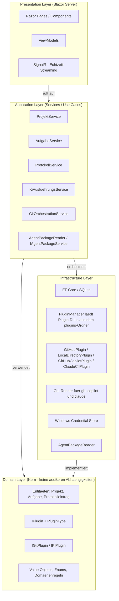

# 🔨 Softwareschmiede

> **KI-gestützter Softwareentwicklungs-Workflow — lokal, strukturiert und erweiterbar**

[](https://dotnet.microsoft.com/)
[](https://blazor.net/)
[](https://www.sqlite.org/)
[](https://www.microsoft.com/windows)
[](#-lizenz)

---

## Inhaltsverzeichnis

1. [Projektbeschreibung](#-projektbeschreibung)
2. [Implementierungsstatus](#-implementierungsstatus)
3. [Features](#-features)
4. [UI-Status](#-ui-status)
5. [Voraussetzungen](#-voraussetzungen)
6. [Installation](#-installation)
7. [Usage](#-usage)
8. [Konfiguration & Plugin-Setup](#-konfiguration--plugin-setup)
9. [Agentenpakete](#-agentenpakete)
10. [Projektstruktur](#-projektstruktur)
11. [Architektur](#-architektur)
12. [Tests](#-tests)
13. [Deployment](#-deployment)
14. [Changelog](#-changelog)
15. [Roadmap](#-roadmap)
16. [Dokumentation](#-dokumentation)
17. [Beitragen](#-beitragen)
18. [Lizenz](#-lizenz)
19. [Kontakt](#-kontakt)

---

## 📖 Projektbeschreibung

**Softwareschmiede** ist eine webbasierte **Einzelnutzer-Anwendung** auf Basis von **Blazor Server (.NET 10+)**, die den vollständigen Workflow der **KI-gestützten Softwareentwicklung** in einer einheitlichen Oberfläche verwaltet.

Die Anwendung läuft vollständig **lokal unter Windows**, erfordert **keinen Login** und verbindet Projektmanagement, Git-Integration, Aufgabenverwaltung und KI-Steuerung an einem zentralen Ort.

### Geschäftsziele

| # | Ziel |
|---|------|
| Z-1 | Verwaltung mehrerer Softwareprojekte an einem zentralen Ort |
| Z-2 | Strukturierte Erfassung von Anforderungen je Aufgabe |
| Z-3 | Automatisierte Umsetzung von Anforderungen durch KI-Plugins |
| Z-4 | Nachvollziehbarer Verlauf jeder KI-gesteuerten Entwicklungsaufgabe |
| Z-5 | Erweiterbarkeit für weitere Git-Provider und KI-Systeme ohne Kernänderungen |

---

## 📌 Implementierungsstatus

Stand: **2026-05-13**

| Bereich | Status | Hinweise |
|---|---|---|
| Projekt-, Aufgaben- und Protokollverwaltung | ✅ Implementiert | Blazor-UI inkl. Dashboard, Detailseiten und Verlauf |
| SCM-Plugins | ✅ Implementiert | `GitHub` und `LocalDirectoryPlugin` produktiv verfügbar |
| Separates Arbeitsverzeichnis mit Git-Workflow-Fallback | ✅ Implementiert | `git init`-Fallback, Pull ohne Merge (inkl. Nutzerhinweis), Push als Datei-Sync inkl. Delete-Sync über `git status` |
| KI-Plugins | ✅ Implementiert | `GitHub Copilot` und `Claude CLI` produktiv verfügbar |
| Standardplugin-Mechanik | ✅ Implementiert | Auflösung: explizite Auswahl → gespeichertes Standardplugin → Fallback |
| Folgeanweisungen mit Kontextsteuerung | ✅ Implementiert | Kontext mitgeben / ignorieren / neu beginnen |
| Lokale Deploymentfähigkeit | ✅ Implementiert | Windows-zentrierter Betrieb, lokale SQLite + Credential Store |
| Öffentliche HTTP-API | ⛔ Nicht vorhanden | Schnittstellen aktuell über Plugin-Verträge dokumentiert |
| CI/CD-Pipeline für Release | ⚠️ Teilweise | Build/Test lokal dokumentiert; automatisierte Release-Pipeline offen |

---

## 🚀 Features

### 📁 Projektmanagement
- Beliebig viele Softwareprojekte anlegen, bearbeiten, archivieren und löschen
- Repositories plugin-gesteuert verknüpfen (dynamische Felder je SCM-Plugin) und Issues automatisch laden
- Projektübersicht mit Status und aktiven Aufgaben
- Konfigurierbares Basis-Arbeitsverzeichnis für lokale Repository-Klone (persistiert als `repositories.workdir`, inkl. Runtime-Fallback)

### 🔗 Git-Integration (Plugin-System)
- **Plugin-Architektur** über `IGitPlugin`-Interface – austauschbar für verschiedene Git-Provider
- **GitHub-Plugin**: vollständige GitHub-Integration via `gh` CLI (inkl. Push/Pull/Pull Request/Issues)
- **LocalDirectoryPlugin**: lokales SCM-Plugin ohne Remote-Provider mit `WorkspaceMode` (`SeparateWorkingDirectory` oder `InSourceDirectory`) und lokalisierten UI-Optionen
- **Projektspezifische `IGitPlugin`-Auflösung:** `GitOrchestrationService` und `AufgabeDetail` nutzen primär das an Aufgabe/Projekt gebundene Repository-Plugin (inkl. lokalem Repository via `LocalDirectoryPlugin`) und nur bei fehlender/mehrdeutiger Zuordnung den Standard-Fallback.
- **Capability-gesteuerte Aktionsmatrix für LocalDirectory-Arbeitskopien:** Bei `LocalDirectory + SeparateWorkingDirectory` blendet die Aufgabenansicht Push/Pull/PR aus und zeigt stattdessen **Merge** (Workspace -> Source) an.
- **SeparateWorkingDirectory-Git-Workflow-Fallback**: `git init`-Fallback (policy-gesteuert), Pull ohne Merge mit Nutzerhinweis, Push als Datei-Synchronisation statt `git push`, Delete-Sync über `git status --porcelain`
- Lokale Git-Basisoperationen: Klonen/Workspace vorbereiten, Branch anlegen, Committen und Reset
- Aufgabenspezifische Branches (`task/<aufgaben-id>-<kurzname>`) bzw. bei Issue-Verknüpfung `task/issue-<issue>-<aufgaben-id>-<kurzname>`
- PR-Erstellung ergänzt bei verknüpfter Issue automatisch eine Closing-Direktive (`Closes #<Issue>`), damit GitHub das Issue beim Merge schließt
- Commit-Verwaltung inkl. Rollback (soft / mixed / hard)

### ✅ Aufgabenverwaltung
- Aufgaben aus GitHub Issues anlegen (Titel, Body, Labels, Milestone werden übernommen)
- Freie Aufgaben ohne Issue-Referenz anlegen
- Durchgängige Issue-Verknüpfung von Aufgabenanlage über Branch bis Pull Request
- Statusmodell: `Offen` → `In Bearbeitung` → `KI aktiv` / `Tests laufen` → `Abgeschlossen` / `Fehlgeschlagen`
- Automatisches Aufräumen (Branch & Klon löschen) nach Abschluss oder Abbruch

### 🤖 KI-Steuerung (Plugin-System)
- **Plugin-Architektur** über `IKiPlugin`-Interface – austauschbar für verschiedene KI-Systeme
- **GitHub Copilot-Plugin**: KI-Integration via `copilot` CLI
- **Claude-CLI-Plugin** (`claude-cli-integration`): KI-Integration via `claude` CLI inkl. `ANTHROPIC_API_KEY`-Weitergabe aus dem Windows Credential Store
- Provider-spezifische Kontext- und Task-Dateien (`*.copilot.context.md`, `*.claude.context.md`, `*.copilot-task.md`, `*.claude-task.md`)
- Echtzeit-Streaming der KI-Ausgabe (< 500 ms Latenz pro Stream-Chunk)
- Sidebar-Footer zeigt live die Anzahl laufender Automatisierungen; optionaler Auto-Shutdown-Toggle erscheint nur bei aktiven Läufen
- Iterative Entwicklung durch Folge-Prompts direkt aus dem Protokoll
- Agentenpaket-Auswahl und Agenten-Auswahl pro Prompt
- Standardplugin je Pluginart in den Einstellungen (SCM und KI) persistierbar
- Explizite KI-Plugin-Auswahl beim Prompt-Senden, inkl. vorausgewähltem Standardplugin
- Folgeanweisungen mit eigener Agenten-Auswahl (Initial-Agent als Standardwert, Rücksetzung nach dem Senden)
- **Kontextsteuerung bei Folgeanweisungen (implementiert):** pro Folgeanweisung wählbar zwischen **Kontext mitgeben**, **Kontext ignorieren** und **Kontext neu beginnen**
- Erweiterte Testabdeckung für Folgeanweisungen inkl. Kontextmodi in UI- und Service-Tests
- Test-Ausführung und strukturierte Auswertung der Ergebnisse

### 📋 Aufgabenprotokoll
- Lückenloses, chronologisches Protokoll aller Prompts, KI-Antworten und Zeitstempel
- KI-Arbeitsprotokoll als strukturiertes Markdown mit Datumszeile (`# {Datum}`) und Schritttrennung
- Status-Übergänge und Git-Aktionen werden protokolliert
- Volltextsuche über alle Protokolleinträge einer Aufgabe
- Webausgabe rendert Markdown inkl. Sanitizing und nutzt bei Bedarf eine lesbare Fallback-Ansicht
- Test-Ergebnisse strukturiert: Testname, Status, Fehlermeldung, Dauer

### 📦 Agentenpakete
- Verzeichnisbasierte Pakete mit `.agent.md`-Dateien
- Deployment ins Repository-Verzeichnis beim Start eines KI-Laufs
- Vorschau von Dateiliste, Beschreibung und verfügbaren Agenten in der Oberfläche

### 🏠 Dashboard
- Projektübergreifende Übersicht aller aktiven Aufgaben
- Farbkodierte Statusanzeige (KI aktiv = blau, Fehlgeschlagen = rot, Abgeschlossen = grün)
- Direktnavigation zum Aufgabenprotokoll per Klick

---

## 📸 UI-Status

Aktuell ist kein versionierter Screenshot im Repository abgelegt.  
Die wichtigsten UI-Abläufe sind im [Benutzerleitfaden](docs/user-guide.md) sowie in der [Flow-Dokumentation](docs/flows/README.md) beschrieben.

---

## ✅ Voraussetzungen

| Voraussetzung | Version | Hinweis |
|---------------|---------|---------|
| **Windows** | 10 / 11 | Pflicht – Windows Credential Store wird benötigt |
| **.NET SDK** | 10.0+ | [dotnet.microsoft.com](https://dotnet.microsoft.com/download) |
| **GitHub CLI** (`gh`) | aktuell | [cli.github.com](https://cli.github.com/) – für GitHub-Operationen |
| **Git** | aktuell | [git-scm.com](https://git-scm.com/) |
| **Copilot CLI** (`copilot`) | aktuell | Für KI-Steuerung im Plugin (`copilot --version`) |
| **Claude CLI** (`claude`) | aktuell | Für `Softwareschmiede.Plugin.ClaudeCli` (`claude --version`) |
| **GitHub Copilot** | aktives Abo | Wird über die Copilot-CLI genutzt |
| **Anthropic API Key** | vorhanden | Für Claude-CLI-Läufe (als Credential `Softwareschmiede.ClaudeCli.Token`) |

**CLI-Tools prüfen/einrichten:**

```powershell
# GitHub CLI installieren (z. B. via winget)
winget install --id GitHub.cli

# Authentifizieren
gh auth login

# Copilot-CLI prüfen
copilot --version

# Claude-CLI prüfen
claude --version
```

---

## 🛠️ Installation

### 1. Repository klonen

```powershell
git clone https://github.com/<your-org>/Softwareschmiede.git
cd Softwareschmiede
```

### 2. Abhängigkeiten wiederherstellen & bauen

```powershell
dotnet restore
dotnet build src/Softwareschmiede/Softwareschmiede.csproj
```

Beim Build des Host-Projekts werden die Plugin-DLLs automatisch nach `bin/<Config>/<TFM>/plugins/` kopiert (inkl. Publish-Ausgabe).

### 3. Anwendung starten

```powershell
dotnet run --project src/Softwareschmiede/Softwareschmiede.csproj
```

Die Anwendung ist danach unter **`https://localhost:5001`** (oder dem konfigurierten Port) erreichbar.

### 4. Erste Schritte

1. **GitHub-Token einrichten** – Credential Manager öffnen und Token speichern (siehe [Konfiguration](#-konfiguration--plugin-setup))
2. **Optional: Claude-Token einrichten** – Anthropic API Key als Credential speichern (`Softwareschmiede.ClaudeCli.Token`)
3. **Projekt anlegen** – Auf der Seite *Projekte* ein neues Projekt erstellen und ein SCM-Plugin wählen
4. **Aufgabe anlegen** – Issue aus dem Repository wählen oder freie Anforderung erfassen
5. **Agentenpaket auswählen** – Passendes Agentenpaket aus `agent-packages/` zuweisen
6. **KI-Lauf starten** – KI-Plugin (Copilot oder Claude CLI), Prompt und Agent auswählen und den Prozess starten

---

## 🖥️ Usage

### Typischer Ablauf in der Anwendung

1. **Projekt erstellen oder öffnen** und ein Repository verknüpfen.
2. **Aufgabe anlegen** (frei oder aus GitHub-Issue).
3. **Entwicklungsprozess starten** (lokaler Klon + Aufgaben-Branch; bei Issue mit issuebezogenem Branchnamen; KI-Plugin wird über Default/Fallback aufgelöst).
4. **KI-Lauf ausführen** (Prompt + Agent + KI-Plugin wählen; Standardplugin ist vorausgewählt).
5. **Ergebnis prüfen**, optional weitere Folge-Prompts senden.
6. **Commits durchführen**, bei Remote-SCM optional Push/PR (bei Issue inkl. `Closes #<Issue>`), und Aufgabe abschließen oder abbrechen.

### LocalDirectoryPlugin & WorkspaceMode

- Für lokale Quellordner kann in den Einstellungen als SCM-Plugin **Local Directory** gewählt werden.
- `WorkspaceMode = SeparateWorkingDirectory` (Standard): Es wird eine getrennte Arbeitskopie erstellt; das Quellverzeichnis bleibt unverändert.
- `WorkspaceMode = InSourceDirectory`: Es wird direkt im Quellverzeichnis gearbeitet; falls dort noch kein Git-Repository existiert, ist `ConfirmGitInitInSourceDirectory=true` erforderlich.
- In der UI erscheinen dafür die Optionen **„Mit separatem Arbeitsverzeichnis arbeiten“** und **„Direkt im Quellverzeichnis arbeiten“**.
- Im Modus `SeparateWorkingDirectory` wird die Quelle per Dateikopie in das Arbeitsverzeichnis übernommen, dort `git init` ausgeführt und ein initialer Snapshot-Commit erstellt.
- Im Modus `SeparateWorkingDirectory` arbeitet **Pull ohne Merge** und protokolliert einen expliziten Nutzerhinweis („kein Merge“).
- Im Modus `SeparateWorkingDirectory` arbeitet **Push als Dateisynchronisation statt `git push`** (Copy/Overwrite inkl. Delete-Sync über `git status --porcelain`).
- In der Aufgaben-Aktionsleiste gilt bei `LocalDirectory + Arbeitskopie`: **Push/Pull/Pull Request ausblenden, Merge einblenden** (gesteuert über `GitActionCapabilities`).
- Nicht unterstützte Remote-Provider-Operationen (z. B. Pull Request/Issues/Remote-Branch-Abfragen) werden im LocalDirectoryPlugin mit `NotSupportedException` abgelehnt.

### KI-Plugin-Auswahl (Copilot oder Claude CLI)

- In den Einstellungen kann je Pluginart (`SourceCodeManagement`, `DevelopmentAutomation`) ein Standardplugin gespeichert werden.
- Beim Prompt-Senden kann das KI-Plugin explizit ausgewählt werden; in der UI ist das Standardplugin für `DevelopmentAutomation` vorausgewählt.
- Auflösungskette zur Laufzeit: **explizite Auswahl → gespeichertes Standardplugin → Fallback auf verfügbares Plugin**.
- Bei installierten Plugins stehen aktuell **GitHub Copilot** und **Claude CLI** zur Verfügung.
- Claude-Läufe nutzen den Credential-Key `Softwareschmiede.ClaudeCli.Token` und setzen `ANTHROPIC_API_KEY` für den CLI-Prozess.
- Agentenpakete müssen für Claude einen `.github`-Ordner enthalten, damit sie als kompatibel gelten.

### Folgeanweisungen mit Agent- und Kontextsteuerung (Aufgabe-Detailseite)

1. Wenn die Aufgabe auf `In Bearbeitung` steht und mindestens eine KI-Antwort vorliegt, erscheint im Bereich **🔄 Folge-Prompt** eine eigene Agenten- und Kontextauswahl.
2. Die Agentenauswahl ist initial auf den beim Start gespeicherten Aufgaben-Agenten gesetzt.
3. Für jede Folgeanweisung wählen Sie zusätzlich den Kontextmodus: **Kontext mitgeben**, **Kontext ignorieren** oder **Kontext neu beginnen**.
4. Beim Senden wird die Folgeanweisung mit den aktuell gewählten Optionen ausgeführt.
5. Danach setzt die UI den Folge-Prompt zurück; die Agentenauswahl wird wieder auf den Initial-Agenten gestellt.

Details zu den einzelnen Schritten:
- [Benutzerleitfaden](docs/user-guide.md)
- [Feature-Dokumentation](docs/business/features.md)
- [Requirements: Kontextsteuerung bei Folgeanweisungen](docs/requirements/kontextsteuerung-folgeanweisungen-requirements-analysis.md)
- [Architektur: Kontextsteuerung bei Folgeanweisungen](docs/architecture/kontextsteuerung-folgeanweisungen-architecture-blueprint.md)

---

## ⚙️ Konfiguration & Plugin-Setup

### Plugin-Architektur (kurz)

- **Contracts:** `src/Softwareschmiede.Plugin.Contracts` definiert `IPlugin`, `IGitPlugin`, `IKiPlugin`, `PluginType`
- **Plugin-Projekte:** liegen als eigenständige Klassenbibliotheken unter `plugins/`
- **Host-Referenzen:** `src/Softwareschmiede/Softwareschmiede.csproj` referenziert Plugin-Projekte mit `ReferenceOutputAssembly="false"`
- **Build/Publish-Kopie:** MSBuild-Targets kopieren Plugin-Artefakte nach `$(OutDir)plugins` bzw. `$(PublishDir)plugins`
- **Discovery zur Laufzeit:** `PluginManager` lädt alle `*.dll` aus `AppContext.BaseDirectory/plugins` und registriert sie nach `PluginType`
- **Aktuelle KI-Plugins:** `Softwareschmiede.Plugin.GitHubCopilot` und `Softwareschmiede.Plugin.ClaudeCli`

### GitHub-Token im Windows Credential Store speichern

Softwareschmiede speichert API-Tokens **ausschließlich im Windows Credential Store** – kein Klartext in Konfigurationsdateien oder der Datenbank.

**Option A – Credential Manager UI:**

1. Startmenü → *Windows-Anmeldeinformationsverwaltung* (Credential Manager) öffnen
2. *Windows-Anmeldeinformationen* → *Generische Anmeldeinformation hinzufügen*
3. Felder ausfüllen:
   - **Internetadresse oder Netzwerkadresse:** `Softwareschmiede.GitHub.Token`
   - **Benutzername:** *(beliebig, z. B. `github`)*
   - **Kennwort:** Dein GitHub Personal Access Token (PAT) mit den Scopes `repo`, `read:org`

**Option B – Kommandozeile (`cmdkey`):**

```powershell
cmdkey /generic:Softwareschmiede.GitHub.Token /user:github /pass:<DEIN_TOKEN>
```

**Token entfernen:**

```powershell
cmdkey /delete:Softwareschmiede.GitHub.Token
```

### Credential-Schlüssel (Referenz)

| Schlüssel | Inhalt |
|-----------|--------|
| `Softwareschmiede.GitHub.Token` | GitHub Personal Access Token |
| `Softwareschmiede.ClaudeCli.Token` | Anthropic API Key für Claude CLI (`ANTHROPIC_API_KEY`) |

### Weitere Plugin-Konfiguration

Projektbezogene Verknüpfungen werden in der Oberfläche unter *Projekte → Repository verknüpfen* plugin-gesteuert konfiguriert und in der lokalen SQLite-Datenbank gespeichert.  
Beispiel: Beim GitHub-Plugin sind `RepositoryUrl` und `RepositoryName` Pflichtfelder; beim LocalDirectoryPlugin wird `SourceDirectory` abgefragt.

Für das Claude-CLI-Plugin kann der API-Key alternativ per `cmdkey` gesetzt werden:

```powershell
cmdkey /generic:Softwareschmiede.ClaudeCli.Token /user:anthropic /pass:<DEIN_ANTHROPIC_API_KEY>
```

### Standardplugin je Pluginart konfigurieren

- In **Einstellungen** kann pro Pluginart genau ein Standardplugin gespeichert werden:
  - `SourceCodeManagement` (z. B. GitHub)
  - `DevelopmentAutomation` (z. B. GitHub Copilot oder Claude CLI)
- Die Auswahl wird persistent in den App-Einstellungen gespeichert und beim nächsten Prompt automatisch als Vorauswahl genutzt.
- Für Git-Aktionen gilt: eine projektspezifische Repository-Auswahl (Aufgabe/Projekt) hat Vorrang; das Standardplugin dient als Fallback.
- Ist ein gespeicherter Wert nicht mehr verfügbar, greift automatisch die Fallback-Auflösung auf ein verfügbares Plugin.

### Arbeitsverzeichnis für lokale Klone

Das Basis-Arbeitsverzeichnis für lokale Repository-Klone ist in den Einstellungen konfigurierbar und wird als globale App-Einstellung `repositories.workdir` in SQLite gespeichert.  
Wenn keine Einstellung gesetzt ist oder der konfigurierte Pfad zur Laufzeit nicht nutzbar ist, verwendet die Anwendung automatisch den Fallback auf Basis von `Path.GetTempPath()`.

Der finale Klonpfad wird immer unterhalb von:

`<Basispfad>/softwareschmiede/<aufgabeId>`

gebildet, z. B.:

- Konfiguriert: `D:/Repos` → `D:/Repos/softwareschmiede/<aufgabeId>`
- Fallback: `Path.GetTempPath()` → `<temp>/softwareschmiede/<aufgabeId>`

### LocalDirectoryPlugin-Konfiguration (Workspace)

LocalDirectoryPlugin-spezifische Einstellungen werden ebenfalls über das Plugin-Settings-Schema `<PluginPrefix>.<Key>` persistiert:

| Schlüssel | Bedeutung | Default |
|-----------|-----------|---------|
| `LocalDirectoryPlugin.WorkspaceMode` | Arbeitsmodus (`SeparateWorkingDirectory` oder `InSourceDirectory`) | `SeparateWorkingDirectory` |
| `LocalDirectoryPlugin.SourceDirectory` | Optionaler Fallback-Quellpfad, wenn kein Repository-Pfad übergeben wurde | leer |
| `LocalDirectoryPlugin.ConfirmGitInitInSourceDirectory` | Explizite Bestätigung für `git init` im Quellverzeichnis; in `SeparateWorkingDirectory` ausgeblendet | `false` |
| `LocalDirectoryPlugin.CopyTimeoutSeconds` | Guardrail für Kopierdauer | `600` |
| `LocalDirectoryPlugin.CopyMaxFiles` | Guardrail für maximale Dateianzahl pro Kopie | `100000` |
| `LocalDirectoryPlugin.CopyMaxMegabytes` | Guardrail für maximale Datenmenge pro Kopie | `10240` |

Hinweise:
- Ein plugin-spezifisches `WorkingDirectory`-Setting existiert nicht; der Zielpfad wird aus `repositories.workdir` + `softwareschmiede/<aufgabeId>` gebildet.
- Bei ungültigem gespeichertem `WorkspaceMode` fällt das Plugin zur Laufzeit auf `SeparateWorkingDirectory` zurück.

### Git-Workflow-Fallback im separaten Arbeitsverzeichnis

- **Source-Copy-Bootstrap:** Im Modus `SeparateWorkingDirectory` wird die Quelle per Dateikopie übernommen, im Arbeitsverzeichnis `git init` ausgeführt und ein initialer Snapshot-Commit erstellt.
- **Pull ohne Merge + Nutzerhinweis:** Pull im `LocalDirectoryPlugin` ist ein No-Merge-Sync mit verpflichtendem Hinweistext im Service-Protokoll.
- **Push als Datei-Sync:** Push synchronisiert den Dateistand `WorkingDirectory -> SourceDirectory`; ein Remote-`git push` wird nicht ausgeführt.
- **Delete-Sync via Git-Status:** Löschkandidaten werden über `git status --porcelain` im Working Directory ermittelt und beim Push im Source Directory gespiegelt.

### Grenzen, bekannte Einschränkungen und nächste Schritte (LocalDirectoryPlugin)

- **Kein Remote-Provider:** `LocalDirectoryPlugin` unterstützt keine PR-/Issue-/Remote-Branch-Funktionen.
- **Kein `git push`/`git pull` gegen Remote:** Push/Pull sind lokale Dateisynchronisationen zwischen Workspace und Quelle.
- **Konfliktbehandlung bei Pull:** Bei uncommitted Changes im Workspace wird Pull aus Sicherheitsgründen abgebrochen.
- **Nächster Schritt (offen):** UI-seitiger Bestätigungsdialog für Pull in der Aufgabenansicht ist fachlich vorgesehen, aber noch nicht automatisiert getestet.

---

## 📦 Agentenpakete

### Was sind Agentenpakete?

Agentenpakete sind **Verzeichnisse mit `.agent.md`-Dateien**, die KI-Agenten und deren Instruktionen definieren. Sie werden beim Start eines KI-Laufs automatisch in das Arbeitsverzeichnis des Branches kopiert und vom KI-Plugin (z. B. GitHub Copilot oder Claude CLI) ausgewertet.

### Speicherort

```
<Programmverzeichnis>/agent-packages/
```

Das Verzeichnis wird beim App-Start automatisch angelegt, falls es noch nicht existiert.

### Struktur eines Agentenpakets

```
agent-packages/
├── mein-agentenpaket/               # Unterordner = ein Agentenpaket
│   ├── planner.agent.md             # Agent: Planer
│   ├── implementer.agent.md         # Agent: Implementierer
│   ├── reviewer.agent.md            # Agent: Reviewer
│   └── README.md                    # Optionale Beschreibung des Pakets
└── weiteres-paket/
    └── ...
```

### Aufbau einer `.agent.md`-Datei

Eine `.agent.md`-Datei beschreibt einen einzelnen Agenten mit seinen Instruktionen, Werkzeugen und Rollen. Das Format folgt dem Standard für GitHub Copilot Custom Agents.

Wichtig: Der **gesamte Inhalt eines Agentenpaket-Verzeichnisses** muss der Dateistruktur entsprechen, die das jeweils verwendete KI-Plugin erwartet. Diese Strukturvorgaben kommen vom jeweiligen KI-Anbieter und sind in dessen Dokumentation beschrieben (z. B. bei GitHub Copilot in den Vorgaben zu Custom Agents).

Für **Claude CLI** gilt zusätzlich: Der Paketinhalt muss einen `.github`-Ordner enthalten, da dieses Layout zur Kompatibilitätsprüfung verwendet wird.

### Agentenpakete in der Oberfläche

- Seite *Agentenpakete*: Liste aller verfügbaren Pakete mit Vorschau
- Beim Anlegen einer Aufgabe kann ein Agentenpaket zugewiesen werden
- Vor jedem KI-Lauf kann der Anwender den gewünschten Agenten aus dem Paket auswählen

---

## 🗂️ Projektstruktur

```
Softwareschmiede/                            # Solution Root
├── src/
│   ├── Softwareschmiede/                    # Blazor Server Hauptprojekt (Host)
│   │   ├── Application/
│   │   │   └── Services/                    # EntwicklungsprozessService, ProjektService,
│   │   │                                    # AufgabeService, ProtokollService, ...
│   │   ├── Domain/
│   │   │   ├── Entities/                    # Projekt, Aufgabe, Protokolleintrag, ...
│   │   │   ├── Interfaces/                  # IPluginManager, ...
│   │   │   ├── ValueObjects/
│   │   │   └── Enums/                       # AufgabeStatus, ProtokolleintragTyp, ...
│   │   ├── Infrastructure/
│   │   │   ├── Data/                        # EF Core DbContext, Migrations
│   │   │   ├── Plugins/                     # PluginManager (Discovery/Loading)
│   │   │   └── Services/                    # CliRunner, WindowsCredentialStore, ...
│   │   ├── Components/
│   │   │   └── Pages/                       # Blazor Razor Pages
│   │   │       ├── Home.razor               # Dashboard
│   │   │       ├── Projekte/
│   │   │       ├── Aufgaben/
│   │   │       └── Agentenpakete/
│   │   └── wwwroot/                         # Statische Assets (CSS, JS, Bilder)
│   ├── Softwareschmiede.Client/             # Blazor WebAssembly Client Assembly
│   ├── Softwareschmiede.IntegrationTests/   # Integrations-Tests
│   ├── Softwareschmiede.Plugin.Contracts/   # IPlugin, IGitPlugin, IKiPlugin, PluginType
│   └── Softwareschmiede.Tests/              # Unit-Tests (xUnit, FluentAssertions, Moq)
├── plugins/                                 # Plugin-Projekte (separate Klassenbibliotheken)
│   ├── Softwareschmiede.Plugin.GitHub/      # Git-Provider Plugin
│   ├── Softwareschmiede.Plugin.LocalDirectory/ # Lokales SCM-Plugin (WorkspaceMode)
│   ├── Softwareschmiede.Plugin.GitHubCopilot/ # KI-Plugin (Copilot CLI)
│   └── Softwareschmiede.Plugin.ClaudeCli/   # KI-Plugin (Claude CLI)
├── docs/                                    # Planungsdokumente und Architektur
│   ├── requirements/
│   │   ├── requirements-analysis.md
│   │   └── plugin-klassenbibliotheken-github-und-copilot.md
│   ├── architecture/
│   │   ├── architecture-blueprint.md
│   │   ├── entity-relationship-model.md
│   │   └── plugin-klassenbibliotheken-github-und-copilot-architecture-blueprint.md
│   ├── improvements/
│   └── tests/
└── Softwareschmiede.slnx               # Solution-Datei
```

---

## 🏗️ Architektur

Softwareschmiede folgt einer **Clean Architecture** mit vier klar getrennten Schichten:



| Schicht | Verantwortung |
|---------|---------------|
| **Presentation** | UI-Rendering, Benutzerinteraktion, ViewModel-Binding, Echtzeit-Updates via SignalR |
| **Application** | Anwendungsfalllogik, Koordination von Domain und Infrastructure, Plugin-Aufruf |
| **Domain** | Fachentitäten, Domänenregeln, Plugin-Interfaces – **keine** äußeren Abhängigkeiten |
| **Infrastructure** | DB-Zugriff, CLI-Prozesse, Credential Store, Dateisystem |

### Plugin-Interfaces

```csharp
// Basisvertrag für alle Plugins
public interface IPlugin
{
    string PluginName { get; }
    string PluginPrefix { get; }
    PluginType PluginType { get; } // SourceCodeManagement | DevelopmentAutomation
}

public interface IGitPlugin : IPlugin { /* Git operations */ }
public interface IKiPlugin : IPlugin { /* AI operations */ }
```

`IPluginManager` lädt Plugin-DLLs aus `plugins/` dynamisch und ordnet sie über `PluginType` den Kategorien zu.

### Discovery- und Build-Flow

1. Plugin-Projekte unter `plugins/*` referenzieren nur `Softwareschmiede.Plugin.Contracts`
2. Das Host-Projekt baut Plugins als Projekt-Referenzen (ohne statisches Linken in den Host)
3. Nach Build/Publish kopieren MSBuild-Targets die Plugin-DLLs in den `plugins`-Unterordner der Ausgabe
4. `PluginManager` scannt beim ersten Zugriff den Ordner `AppContext.BaseDirectory/plugins` (`*.dll`, TopDirectoryOnly)
5. Gefundene Typen werden per `ActivatorUtilities` instanziiert und anhand von `PluginType` als Git- oder KI-Plugin registriert

---

## 🧪 Tests

Das Projekt enthält Unit-Tests im Projekt `Softwareschmiede.Tests`:

```powershell
# Alle Tests ausführen
dotnet test

# Tests mit Coverage-Report
dotnet test --collect:"XPlat Code Coverage"
```

**Test-Stack:**
- [xUnit](https://xunit.net/) – Test-Framework
- [FluentAssertions](https://fluentassertions.com/) – Lesbare Assertions
- [Moq](https://github.com/moq/moq4) – Mocking von Plugin-Interfaces und Services

Feature-spezifische Testartefakte:
- Service-Tests (Pluginauswahl/Fallback): `src/Softwareschmiede.Tests/Application/Services/GitOrchestrationServiceTests.cs`
- UI-bUnit-Tests (Git-Aktionsleiste/Pluginauswahl): `src/Softwareschmiede.Tests/Components/Pages/Aufgaben/AufgabeDetailGitActionsBunitTests.cs`
- Unit-Tests: `src/Softwareschmiede.Tests/Infrastructure/Plugins/LocalDirectoryPluginTests.cs`
- Integrationstests: `src/Softwareschmiede.IntegrationTests/Infrastructure/Plugins/LocalDirectoryPluginIntegrationTests.cs`
- UI/Settings-Tests: `src/Softwareschmiede.Tests/Components/Pages/EinstellungenBaseArbeitsverzeichnisTests.cs`
- [Testplan: Arbeitsverzeichnis](docs/tests/testplan-arbeitsverzeichnis.md)
- [Testlücken: Arbeitsverzeichnis](docs/tests/testluecken-arbeitsverzeichnis.md)
- [Testplan: Separates Arbeitsverzeichnis mit Git-Workflow-Fallback](docs/tests/testplan-separates-arbeitsverzeichnis-git-workflow-fallback.md)
- [Testlücken: Separates Arbeitsverzeichnis mit Git-Workflow-Fallback](docs/tests/testluecken-separates-arbeitsverzeichnis-git-workflow-fallback.md)
- [Testplan: Lokales Verzeichnis Plugin – Copy-Flow/Aktionsmatrix](docs/tests/testplan-lokales-verzeichnis-plugin-kopie-aktionsmatrix.md)
- [Testlücken: Lokales Verzeichnis Plugin – Copy-Flow/Aktionsmatrix](docs/tests/testluecken-lokales-verzeichnis-plugin-kopie-aktionsmatrix.md)
- [Testplan: Pull-Request-Repository-ID entfernen](docs/tests/testplan-pull-request-repository-id-removal.md)
- [Testlücken: Pull-Request-Repository-ID entfernen](docs/tests/testluecken-pull-request-repository-id-removal.md)
- [Testplan: Kontextsteuerung bei Folgeanweisungen](docs/tests/testplan-kontextsteuerung-folgeanweisungen.md)
- [Testlücken: Kontextsteuerung bei Folgeanweisungen](docs/tests/testluecken-kontextsteuerung-folgeanweisungen.md)
- [Testplan: Claude-CLI-Integration](docs/tests/testplan-claude-cli-integration.md)
- [Testlücken: Claude-CLI-Integration](docs/tests/testluecken-claude-cli-integration.md)

---

## 🚀 Deployment

Softwareschmiede ist für den **lokalen Betrieb unter Windows** ausgelegt.

- **Development:** `dotnet run --project src/Softwareschmiede/Softwareschmiede.csproj`
- **Publish:** `dotnet publish src/Softwareschmiede/Softwareschmiede.csproj -c Release`
- Das Publish-Output enthält automatisch den Ordner `plugins/` mit den Plugin-DLLs.

Für die Inbetriebnahme müssen `gh`, `git`, `copilot` und (für Claude-Läufe) `claude` auf dem Zielsystem verfügbar sein.

---

## 📝 Changelog

Es gibt aktuell keine separate `CHANGELOG.md`. Änderungen werden über Git-Historie und Pull Requests nachvollzogen.

Zuletzt dokumentiert (README-/Doku-Update):
- LocalDirectoryPlugin als produktiv verfügbares SCM-Plugin ergänzt (inkl. WorkspaceMode und Guardrails)
- Konfiguration, Usage, Architektur und Testsektion auf LocalDirectoryPlugin-Stand synchronisiert
- README auf Feature „Separates Arbeitsverzeichnis mit Git-Workflow-Fallback“ aktualisiert (`git init`-Fallback, Pull ohne Merge + Nutzerhinweis, Push-Sync, Delete-Sync über Git-Status)
- Erweiterte Testabdeckung für den separaten Workspace-Workflow ergänzt (u. a. Guard-/Fehlerpfade für Push/Pull, Delete-Sync und Fallback-Auflösung)
- Claude-CLI-Integration als produktiv verfügbares KI-Plugin ergänzt
- Testartefakte für `lokales-verzeichnis-plugin` und `claude-cli-integration` in der Dokumentationsübersicht verlinkt
- WorkspaceMode-Übersetzungen, dynamische Repository-Felder und Standardplugin-Vorauswahl konsistent dokumentiert
- Projektspezifische `IGitPlugin`-Auflösung in `GitOrchestrationService`/`AufgabeDetail` präzisiert (inkl. LocalDirectory-/LocalRepository-Szenarien und Fallback-Verhalten)
- Testabsicherung für diese Auflösung ergänzt (Service: `GitOrchestrationServiceTests`, UI: `AufgabeDetailGitActionsBunitTests`)

---

## 🗺️ Roadmap

### v1.0 – MVP (vollständig implementiert ✅)
- [x] Anforderungsanalyse und Architektur-Blueprint
- [x] Domänenmodell und EF Core Datenbankschema
- [x] GitHub-Plugin (gh CLI) – vollständige Git-Integration
- [x] GitHub Copilot-Plugin (copilot CLI) – KI-Steuerung mit Echtzeit-Streaming
- [x] Claude-CLI-Plugin (claude CLI) – KI-Steuerung inkl. Credential-Integration und Agentenpaket-Kompatibilitätsprüfung
- [x] Blazor UI: Dashboard, Projekte, Aufgaben, Protokoll, Agentenpakete
- [x] Folgeanweisungen mit Agent- und Kontextsteuerung (Kontext mitgeben / ignorieren / neu beginnen)
- [x] Windows Credential Store Integration

### v1.x – Erweiterungen
- [ ] GitLab-Plugin
- [ ] Azure DevOps-Plugin
- [ ] Weitere KI-Plugins (z. B. OpenAI, Gemini als dedizierte Provider)
- [ ] Export des Aufgabenprotokolls (PDF / Markdown)
- [ ] Erweiterte Agentenpaket-Verwaltung (Upload, Bearbeitung in der UI)

---

## 📚 Dokumentation

| Dokument | Beschreibung |
|----------|-------------|
| [API-Dokumentation (Index)](docs/api/README.md) | Technische Schnittstellen, Plugin-Contracts und Auflösungslogik (inkl. Standardplugin-Mechanik) |
| [Business-Dokumentation (Index)](docs/business/features.md) | Fachliche Feature-Sicht für Nutzer:innen und Stakeholder (inkl. F014) |
| [Flow-Dokumentation (Index)](docs/flows/README.md) | Ablaufdiagramme für Services und End-to-End-Prozesse (inkl. Plugin-Default-Flow) |
| [Anforderungsanalyse](docs/requirements/requirements-analysis.md) | Funktionale und nicht-funktionale Anforderungen, Use Cases, Domänenmodell |
| [Architektur-Blueprint](docs/architecture/architecture-blueprint.md) | Schichtenarchitektur, Plugin-System, Sequenzdiagramme, Technologieentscheidungen |
| [Entity-Relationship-Modell](docs/architecture/entity-relationship-model.md) | Datenbankstruktur und Entitäten-Beziehungen |
| [Planungsübersicht](docs/planning-overview.md) | Projektplanung und Meilensteine |
| [Benutzerleitfaden](docs/user-guide.md) | Schritt-für-Schritt-Anleitung für Endanwender |
| [Feature-Dokumentation](docs/business/features.md) | Fachliche Beschreibung aller Features für nicht-technische Stakeholder |
| [Feature F005: Aufgabenprotokoll](docs/business/features/F005-aufgabenprotokoll.md) | Fachliche Beschreibung des strukturierten Protokollformats mit Markdown-Darstellung, Sanitizing und Fallback |
| [Feature F009: Arbeitsverzeichnis konfigurieren](docs/business/features/F009-arbeitsverzeichnis-konfigurieren.md) | Fachliche Beschreibung des konfigurierbaren Arbeitsverzeichnisses inkl. Fallback und Migration |
| [Feature F010: Plugin-Prinzip für Integrationen](docs/business/features/F010-plugin-prinzip-integrationen.md) | Fachliche Beschreibung des ausgelagerten Plugin-Prinzips für Git- und KI-Integrationen |
| [Feature F017: Lokales Verzeichnis Plugin](docs/business/features/F017-lokales-verzeichnis-plugin.md) | Fachliche Beschreibung von LocalDirectoryPlugin, WorkspaceMode und Grenzen gegenüber Remote-Providern |
| [Feature F018: Automatisches Herunterfahren](docs/business/features/F018-automatisches-herunterfahren.md) | Fachliche Beschreibung des automatischen Herunterfahrens nach dem letzten laufenden KI-Lauf |
| [Feature F019: Issue-, Branch- und PR-Verknüpfung](docs/business/features/F019-issue-branch-pr-verknuepfung.md) | Fachliche Beschreibung der durchgängigen Verbindung von Issue-Auswahl, Branch-Namensbildung und PR-Auto-Close |
| [Requirements: LocalDirectoryPlugin](docs/requirements/lokales-verzeichnis-plugin-requirements-analysis.md) | Umsetzungsnahe Anforderungen und Akzeptanzkriterien für WorkspaceMode, Guardrails und Fehlerverhalten |
| [Architektur: LocalDirectoryPlugin](docs/architecture/lokales-verzeichnis-plugin-architecture-blueprint.md) | Technische Architektur für LocalDirectoryPlugin, Settings und Integrationspfad |
| [Flow: LocalDirectoryPlugin](docs/flows/local-directory-plugin-flow.md) | Ablaufdarstellung für Clone-/Workspace-Auflösung, Guardrails und Folgeoperationen |
| [Flow: Issue-, Branch- und PR-Verknüpfung](docs/flows/issue-branch-pr-linking-flow.md) | End-to-End-Ablauf von der Issue-Auswahl über den issuebezogenen Branch bis zur PR-Closing-Direktive |
| [Requirements: Separates Arbeitsverzeichnis mit Git-Workflow-Fallback](docs/requirements/separates-arbeitsverzeichnis-git-init-fallback-requirements-analysis.md) | Anforderungen für `git init`-Fallback, Pull ohne Merge, Push-Sync und Delete-Sync |
| [Architektur: Separates Arbeitsverzeichnis mit Git-Workflow-Fallback](docs/architecture/separates-arbeitsverzeichnis-git-init-fallback-architecture-blueprint.md) | Architekturentscheidungen und Sequenzen für den separaten Workspace-Workflow |
| [Architecture Review: Separates Arbeitsverzeichnis mit Git-Workflow-Fallback](docs/improvements/separates-arbeitsverzeichnis-git-init-fallback-architecture-review.md) | Review-Findings und Qualitätsauflagen für Pull-/Push-/Delete-Sync-Regeln |
| [ERM: Separates Arbeitsverzeichnis mit Git-Workflow-Fallback](docs/architecture/separates-arbeitsverzeichnis-git-init-fallback-entity-relationship-model.md) | Domänenmodell für Sync-Delta, Delete-Kandidaten und Workflow-Zustände |
| [Dokumentationsplan](docs/documentation-plan.md) | Analyse und Maßnahmenplan zur durchgängigen Doku-Aktualisierung |
| [Anforderungen: Plugin-Klassenbibliotheken](docs/requirements/plugin-klassenbibliotheken-github-und-copilot.md) | Feature-Anforderungen für Plugin-Architektur und Build-Auslieferung |
| [Architektur: Plugin-Klassenbibliotheken](docs/architecture/plugin-klassenbibliotheken-github-und-copilot-architecture-blueprint.md) | Technische Architektur für Discovery, Build/Pipeline und Plugin-Design |
| [Architecture Review: Plugin-Klassenbibliotheken](docs/improvements/plugin-klassenbibliotheken-github-und-copilot-architecture-review.md) | Architekturprüfung mit Findings und Maßnahmen |
| [Requirements: Kontextsteuerung bei Folgeanweisungen](docs/requirements/kontextsteuerung-folgeanweisungen-requirements-analysis.md) | Anforderungsbasis für Kontextmodi bei Folgeanweisungen |
| [Architektur-Blueprint: Kontextsteuerung bei Folgeanweisungen](docs/architecture/kontextsteuerung-folgeanweisungen-architecture-blueprint.md) | Technische Umsetzung der Kontextmodi, Persistenz und Prompt-Komposition |
| [Architecture Review: Kontextsteuerung bei Folgeanweisungen](docs/improvements/kontextsteuerung-folgeanweisungen-architecture-review.md) | Review-Ergebnisse und Auflagen zur Robustheit/UX |
| [Testplan: Kontextsteuerung bei Folgeanweisungen](docs/tests/testplan-kontextsteuerung-folgeanweisungen.md) | Testabdeckung für Kontextmodi in UI- und Service-Schicht |
| [Testlücken: Kontextsteuerung bei Folgeanweisungen](docs/tests/testluecken-kontextsteuerung-folgeanweisungen.md) | Nachverfolgung offener Rand- und Fehlerpfade |
| [Testplan: Claude-CLI-Integration](docs/tests/testplan-claude-cli-integration.md) | Abdeckungsnachweis für Claude-Plugin, Services und Basisklassen |
| [Testlücken: Claude-CLI-Integration](docs/tests/testluecken-claude-cli-integration.md) | Aktueller Lückenstand (alle identifizierten Punkte geschlossen) |
| [Plugin-Interfaces](docs/api/plugin-interfaces.md) | Technische Dokumentation der Plugin-Schnittstellen für Plugin-Entwickler |
| [Issue-/Branch-/PR-Linking (technisch)](docs/api/issue-branch-pr-linking.md) | Technischer Contract für IssueReferenz, Branch-Namensmuster und PR-Closing-Direktive |
| [Workdir-Konfiguration (technisch)](docs/api/workdir-configuration.md) | Technische Umsetzung von Settings, Resolver, Klonpfadbildung und Reason-Codes |
| [Programmablaufpläne](docs/flows/development-process-flow.md) | Grafische Ablaufpläne und technische Prozessbeschreibungen |
| [Flow: Arbeitsverzeichnis-Auflösung](docs/flows/workdir-resolution-flow.md) | Sequenzablauf für Konfiguration, Laufzeit-Auflösung und Fallback-Verhalten |
| [Flow: Plugin-Discovery und Laden](docs/flows/plugin-discovery-load-flow.md) | Ablauf der dynamischen Plugin-Erkennung und robusten Registrierung |
| [Testplan: Issue-/Branch-/PR-Linking](docs/tests/testplan-issue-branch-pr-linking.md) | Verifikation der Featurekette von Issue-Auswahl bis PR Auto-Close |
| [Testlücken: Issue-/Branch-/PR-Linking](docs/tests/testluecken-issue-branch-pr-linking.md) | Dokumentation des geschlossenen Lückenstands für das Linking-Feature |
| [Testplan: Plugin-Klassenbibliotheken](docs/tests/testplan-plugin-klassenbibliotheken-github-und-copilot.md) | Abgedeckte Testbereiche für Plugin-Discovery, Build-Kopie und Laufzeitverhalten |
| [Testlücken: Plugin-Klassenbibliotheken](docs/tests/testluecken-plugin-klassenbibliotheken-github-und-copilot.md) | Aktueller Stand der offenen Testlücken für das Plugin-Feature |

---

## 🤝 Beitragen

Beiträge zum Projekt sind willkommen! Bitte beachte die folgenden Konventionen.

### Branch-Konvention

| Typ | Muster | Beispiel |
|-----|--------|---------|
| Neues Feature | `feature/<kurz-beschreibung>` | `feature/gitlab-plugin` |
| Fehlerbehebung | `bugfix/<id>` | `bugfix/42-stream-timeout` |
| Refactoring | `refactor/<bereich>` | `refactor/ki-plugin-interface` |

### Commit-Format (Conventional Commits)

Commits folgen dem **[Conventional Commits](https://www.conventionalcommits.org/)**-Standard:

```
feat:     Neues Feature
fix:      Fehlerbehebung
refactor: Code-Umstrukturierung ohne Verhaltensänderung
test:     Tests hinzufügen oder korrigieren
docs:     Nur Dokumentationsänderungen
chore:    Build, Abhängigkeiten, CI-Konfiguration
```

**Beispiele:**
```
feat: GitHub Copilot Streaming-Unterstützung hinzugefügt
fix: Token-Speicherung im Credential Store repariert
refactor: KiAusfuehrungsService in kleinere Methoden aufgeteilt
```

### Pull Requests

- Jeder PR benötigt **mindestens 1 Approver** (Code-Review-Pflicht)
- Branch muss aktuell mit `main` sein (rebase oder merge vor dem PR)
- Alle Tests müssen bestehen (`dotnet test`)
- PR-Beschreibung enthält: Kontext, Änderungen, Testnachweis

### Coding-Guidelines

- **Naming:** PascalCase für Klassen/Methoden, camelCase für Parameter/Variablen, Präfix `I` für Interfaces
- **Async:** Alle I/O-Operationen konsequent `async`/`await` – keine `.Result`- oder `.Wait()`-Aufrufe
- **Logging:** `ILogger<T>` in allen Services – strukturiertes Logging mit aussagekräftigen Nachrichten und Parametern
- **Plugin-Erweiterungen:** Neue Plugins implementieren `IPlugin` + `IGitPlugin`/`IKiPlugin`, setzen `PluginType` und werden als eigenes Projekt unter `plugins/` eingebunden (Discovery via `PluginManager`, keine direkte `AddScoped<...>`-Bindung)

---

## 📄 Lizenz

Die Lizenz ist noch nicht final festgelegt.  
Vor einem öffentlichen Release wird eine `LICENSE`-Datei ergänzt und diese Sektion aktualisiert.

---

## 📬 Kontakt

- Aktuell kein öffentlicher Maintainer-Kontakt hinterlegt.
- Für Rückfragen/Feedback bitte Issues im Repository verwenden.

---

*Softwareschmiede – KI-gestützter Entwicklungsworkflow, lokal und unter Ihrer Kontrolle.*
