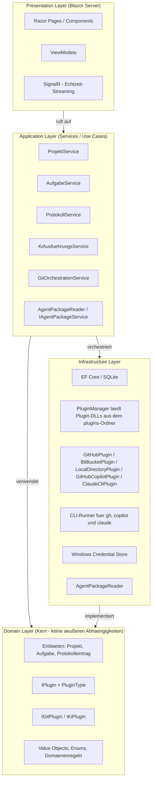

# 🔨 Softwareschmiede

> **KI-gestützter Softwareentwicklungs-Workflow — lokal, strukturiert und erweiterbar**

[](https://dotnet.microsoft.com/)
[](https://blazor.net/)
[](https://learn.microsoft.com/dotnet/desktop/wpf/)
[](https://www.sqlite.org/)
[](https://www.microsoft.com/windows)
[](https://github.com/martin-stromberg/Softwareschmiede/actions/workflows/release.yml)
[](#-lizenz)

---

## Inhaltsverzeichnis

1. [Projektbeschreibung](#-projektbeschreibung)
2. [Implementierungsstatus](#-implementierungsstatus)
3. [Features](#-features)
4. [UI-Status](#-ui-status)
5. [Voraussetzungen](#-voraussetzungen)
6. [Installation](#-installation)
7. [Usage](#-usage)
8. [Konfiguration & Plugin-Setup](#-konfiguration--plugin-setup)
9. [Agentenpakete](#-agentenpakete)
10. [Projektstruktur](#-projektstruktur)
11. [Architektur](#-architektur)
12. [Tests](#-tests)
13. [Deployment](#-deployment)
14. [Changelog](#-changelog)
15. [Roadmap](#-roadmap)
16. [Dokumentation](#-dokumentation)
17. [Beitragen](#-beitragen)
18. [Lizenz](#-lizenz)
19. [Kontakt](#-kontakt)

> **Hinweis:** Das Projekt befindet sich in der Migration von Blazor Server zu einer nativen **WPF-Desktopanwendung**. Beide Frontends nutzen dieselben Domain- und Service-Schichten. Details unter [WPF-Desktopanwendung (in Entwicklung)](#️-wpf-desktopanwendung-in-entwicklung).

---

## 📖 Projektbeschreibung

**Softwareschmiede** ist eine **Einzelnutzer-Anwendung**, die den vollständigen Workflow der **KI-gestützten Softwareentwicklung** in einer einheitlichen Oberfläche verwaltet.

Die Anwendung läuft vollständig **lokal unter Windows**, erfordert **keinen Login** und verbindet Projektmanagement, Git-Integration, Aufgabenverwaltung und KI-Steuerung an einem zentralen Ort.

Aktuell wird die Anwendung von **Blazor Server (.NET 10+)** auf eine native **WPF-Desktopanwendung** migriert. Das neue WPF-Projekt (`src/Softwareschmiede.App`) ist bereits in der Solution enthalten; die bisherige Blazor-Oberfläche ist weiterhin aktiv bis zur vollständigen Ablösung.

### Geschäftsziele

| # | Ziel |
|---|------|
| Z-1 | Verwaltung mehrerer Softwareprojekte an einem zentralen Ort |
| Z-2 | Strukturierte Erfassung von Anforderungen je Aufgabe |
| Z-3 | Automatisierte Umsetzung von Anforderungen durch KI-Plugins |
| Z-4 | Nachvollziehbarer Verlauf jeder KI-gesteuerten Entwicklungsaufgabe |
| Z-5 | Erweiterbarkeit für weitere Git-Provider und KI-Systeme ohne Kernänderungen |

---

## 📌 Implementierungsstatus

Stand: **2026-07-14**

| Bereich | Status | Hinweise |
|---|---|---|
| Projekt-, Aufgaben- und Protokollverwaltung | ✅ Implementiert | Blazor-UI inkl. Dashboard, Detailseiten und Verlauf |
| SCM-Plugins | ✅ Implementiert | `GitHub`, `BitBucket` und `LocalDirectoryPlugin` produktiv verfügbar |
| Separates Arbeitsverzeichnis mit Git-Workflow-Fallback | ✅ Implementiert | `git init`-Fallback, Pull ohne Merge (inkl. Nutzerhinweis), Push als Datei-Sync inkl. Delete-Sync über `git status` |
| KI-Plugins | ✅ Implementiert | `GitHub Copilot`, `Claude CLI` und `Codex CLI` produktiv verfügbar |
| Standardplugin-Mechanik | ✅ Implementiert | Auflösung: explizite Auswahl → gespeichertes Standardplugin → Fallback |
| Folgeanweisungen mit Kontextsteuerung | ✅ Implementiert | Kontext mitgeben / ignorieren / neu beginnen |
| Lokale Deploymentfähigkeit | ✅ Implementiert | Windows-zentrierter Betrieb, lokale SQLite + Credential Store |
| Repository-Startskript mit freier Portzuweisung | ✅ Implementiert | Repositorybezogene Startkonfiguration, Portreservierung und PowerShell-Skriptlauf beim Prozessstart; optional in konfiguriertem Unterverzeichnis des Repositories |
| Branch-Commit-Anzeige im Dateibaum + Commit-Diff-Preview | ✅ Implementiert | Branch-Commits relativ zur Basisreferenz (`origin/HEAD` inkl. Fallback), lazy Commit-Dateibaum und commit-spezifische Vorschau mit Retry-/Hint-Handling |
| Diff-Funktionalität (`/api/diff`) | ✅ Implementiert | `DiffController` + `DiffService` inkl. Persistenz, Statistik und Cache-Invalidierung |
| **Automatische issue.md-Dateierstellung beim Repository-Setup** | ✅ Implementiert | Beim Repository-Klon werden automatisch `issue.md` mit Aufgabendaten und `.gitignore`-Eintrag erstellt; `CreateIssueFileAsync` und `UpdateGitignoreAsync` in `EntwicklungsprozessService`; graceful degradation bei Fehlern; Tests implementiert |
| **Arbeitsverzeichnis für KI-Ausführung (Issue #98)** | ✅ Implementiert | Repository-Startskript kann in konfigurierbarem Unterverzeichnis ausgeführt werden; UI-Dialog mit Verzeichnisstruktur-Vorschau oder manueller Eingabe bei Abruffehlern; `WorkingDirectoryRelativePath` in `RepositoryStartKonfiguration`; `DirectoryStructureBrowserService` mit Caching; Path-Traversal-Sicherheit; E2E-Tests implementiert |
| **ConPTY-Terminal-Integration** | ✅ Implementiert | Windows Pseudo Console API für interaktive KI-CLI-Prozesse; `TerminalControl` mit VT100-Parsing, `AnsiSequenceParser`, `TerminalBuffer`, `KeyToVt100Encoder`; Farbunterstützung (3-bit/8-bit/24-bit), Tastatureingabe-Handling, automatische Größenanpassung, CLI-Laufzeitstatus in der Fußzeile (`Ausführung läuft`/`Wartet auf Eingabe`); Voraussetzung: Windows 10 Build 17763+ |
| **Promptvorlagen für CLI-Eingaben** | ✅ Implementiert | In den Einstellungen verwaltbare Promptvorlagen mit Name und Prompttext; Sofortversand aus der Aufgabendetailansicht an die laufende CLI; Platzhalter `%ProjectName%`, `%TaskName%` und `%RepositoryUrl%` werden vor dem Senden aufgelöst |
| **WPF-Desktopanwendung (Migration)** | 🔄 In Entwicklung | `src/Softwareschmiede.App` — WPF-UI-Gerüst, ViewModels, Dark Mode, ConPTY-Terminal-Integration, Recovery-Banner, Audio-Benachrichtigungen; Projektdetailansicht vollständig implementiert mit Ribbon-Menü (Navigation, Projekt, Aufgaben, Repository), Projekt-Kachel (bearbeitbar), Aufgaben-Kachel (filterbar), Repository-Zuweisungs-Dialog und E2E-Tests; Einstellungsansicht mit Plugin-Registerkarten (SCM/KI) mit dynamischen Plugin-Einstellungspanels und globalen Dark-Mode-Styles; **Aufgabendetailansicht mit Ribbon-Menü und expliziten Info-/CLI-/Diff-Ansichten vollständig implementiert; Fenstertitel zeigt die geöffnete Aufgabe, die Fußzeile den tatsächlich aktiven CLI-Namen, Info bleibt auch bei gestarteten und beendeten Aufgaben erreichbar**; **Separate Aufgabendetailansicht implementiert (✅): Auslagerung aus Inline-Position in fensterumfassende View mit Callback-basierter Navigation zwischen ProjectDetailView und TaskDetailView**; **Aufgabenworkflow-Optimierung (Feature #72) in Arbeit: Vereinfachtes Statusmodell (ArbeitsverzeichnisEingerichtet/InArbeit entfernt), neuer `StartenCommand` mit kombiniertem Klone+CLI-Start, Plugin-Dialog mit Projekt-Level-Speicherung, `PluginAendernCommand` für Plugin-Wechsel, automatischer CLI-Neustart bei Aufgabe-Laden; Git-Plugin-Aufgaben ohne Issue-Bezug können gestartet werden**; **Repository-Suggestion-Panel in Arbeit: Neue Service-Methode `GetUnassignedRepositoriesAsync()`, ViewModel-Integration mit `UnassignedRepositories`-Property und `RepositoryDoubleclickCommand`, XAML-Panel mit ItemsControl und Value Converter für relative Datumsformatierung, E2E-Tests**; **Issue 81: Aktive Aufgaben im Menü (in Arbeit): Anzeige von Aufgaben mit Status `Gestartet` oder `Wartend` in der Navigations-Seitenleiste als gerahmte Kacheln mit Titel und KI-Ausführungsstatus; Sektion automatisch verborgen wenn Dashboard aktiv ist; neue `KiAusfuehrungsStatusConverter` für Status-Ermittlung basierend auf `AktiveRunId` und `LastHeartbeatUtc`; erweiterte ViewModels (`MainWindowViewModel`, `DashboardViewModel`) und neue Service-Methode `GetAktiveAufgabenAsync()` in `AufgabeService`**; **Issue 107: Programmsymbol für Softwareschmiede.App (✅): Hammer-Icon (🔨) über `<ApplicationIcon>`-Property in `Softwareschmiede.App.csproj` eingebettet und als WPF-Pack-Resource verfügbar; `Window.Icon="/images/Softwareschmiede.ico"` in `MainWindow.xaml` gesetzt für konsistente Darstellung in Windows-Explorer, Taskleiste und Fenster-Titelleiste** |
| **Absturzstabilisierung (globale Exception-Handler, SafeFireAndForget)** | ✅ Implementiert | Drei globale Exception-Handler (`DispatcherUnhandledException`, `AppDomain.CurrentDomain.UnhandledException`, `TaskScheduler.UnobservedTaskException`) in `App.xaml.cs`; neue Erweiterungsmethode `AsyncTaskExtensions.SafeFireAndForget` für alle Fire-and-Forget-Aufrufe; konsolidierter, try-catch-geschützter `Process.Exited`-Handler in `KiAusfuehrungsService` (klassischer und ConPTY-Start); Heartbeat-Aktualisierung pro Aufgabe über eigenes `SemaphoreSlim` in `CliProcessManager` statt einer klassenweiten Sperre; `TerminalControl.ReadLoopAsync` mit vollständigem Exception-Handling und überwachtem Hintergrund-Task; Startfehler von `CliProcessManager`-Initialisierung und `MainWindow.Show()` führen nicht mehr zum Abbruch des Anwendungsstarts |
| **Issue 108: Automatische Statusaktualisierung aktiver Aufgaben** | ✅ Implementiert | Seitenleisten- und Dashboard-Aufgabenlisten zeigen KI-Ausführungsstatus (▶ Läuft, ⏸ Wartet, ✓ Bereit) in Echtzeit an. Hybrid-Mechanismus: `IRunningAutomationStatusSource.RunningCountChanged`-Event für Sofortaktualisierung bei Prozess-Start/-Stopp, `DispatcherTimer` (5 s Intervall) als Fallback für Heartbeat-Ablauf und Rate-Limit-Übergänge. `SemaphoreSlim`-Re-Entrancy-Schutz verhindert DbContext-Konflikte. `StatusAenderungsErkennung` nutzt `Aufgabe.Id`-Keying, um Übergangsanimation nur bei echtem Statuswechsel auszulösen (dezente Opacity-Fade). `StatusUebergangsAnimation` als Attached Behavior mit in Code konstruiertem DoubleAnimation (250 ms EaseOut). E2E-Tests mit FlaUI über `AutomationProperties.HelpText`. |
| **Issue 86: Parallele CLI-Ausführungen ohne Blockade bei verborgener Aufgabenseite** | ✅ Implementiert | Entkopplung der ReadLoop vom `TerminalControl`-Lebenszyklus: `PseudoConsoleSession` verwaltet die Leseschleife unabhängig und feuert `BufferChanged`-Events. `TerminalControl` wird zu reinem Renderer, der Events abonniert statt ReadLoop zu steuern. CLI-Prozesse laufen parallel weiter, auch wenn ihre Aufgabenseite nicht angezeigt wird. Betroffene Komponenten: `TerminalControl` (Unloaded-Handler entfernt, Event-Binding hinzugefügt), `PseudoConsoleSession` (ReadLoop ab Konstruktion aktiv), `KiAusfuehrungsService` (Cleanup-Logik angepasst). Unit-Tests für parallele Sessions, View-Wechsel und Session-Cleanup vorhanden; Details siehe [docs/help/terminal](docs/help/terminal/index.md) |
| **Issue 85: CLI-Konsole optimieren — Buffer-Stabilitäts-Fix und Clipboard-Paste** | ✅ Implementiert | Neue Methode `TerminalBuffer.GetSnapshot()` für konsistentes Rendering unter Lock zur Vermeidung von Race Conditions bei paralleler CLI-Ausgabe. Clipboard-Paste-Unterstützung (Ctrl+V) mit neuer `KeyToVt100Encoder.EncodeClipboardText()`-Methode und Tastaturhandling in `TerminalControl`. Betroffene Komponenten: `TerminalBuffer`, `TerminalControl`, `KeyToVt100Encoder`. Unit-Tests für Thread-Sicherheit, Clipboard-Encoding und Keyboard-Input vorhanden; Details siehe [docs/help/terminal/beschreibung.md](docs/help/terminal/beschreibung.md) |
| **Issue 122: Zeitgesteuerter Prompt-Versand** | ✅ Implementiert | Neue Funktion in der Aufgabendetailansicht: Benutzer können einen Prompt zeitverzögert versenden. Zwei `TextBox`-Eingabefelder für Stunde (0–23) und Minute (0–59) in der CLI-Ribbon-Gruppe; ist keine Zielzeit angegeben, wird der Prompt sofort versendet (bestehendes Verhalten), ansonsten zeitgesteuert nach `PromptZeitVersandService.SchedulePromptAsync`. Neuer Singleton-Service mit `Dictionary<Guid, ScheduledPromptInfo>` und ereignisgesteuerten pro-Eintrag-Timern (`ITimer` via `TimeProvider.CreateTimer`); Timer-basierte Versendung bei Zielzeit-Erreichen oder sofortiger Versand bei vergangener Zielzeit. Neue ViewModel-Properties: `ScheduledPromptTargetHours`, `ScheduledPromptTargetMinutes`, `ScheduledPromptStatus`, `ScheduledPromptTimeDisplay`, `CanSchedulePrompt`, `SchedulePromptCommand`. Neue `PseudoConsoleSession.WritePromptAsync()` für DRY-Prompt-Logik. Unit-Tests mit `FakeTimeProvider` für deterministische Timer-Tests, E2E-Tests für Happy-Path. Betroffene Komponenten: `PromptZeitVersandService` (neu, Service Layer, Singleton), `ScheduledPromptInfo` (neu, Value Object), `TaskDetailViewModel` (erweitert), `TaskDetailView.xaml` (erweitert), `PseudoConsoleSession` (erweitert), `App.xaml.cs` (DI-Registrierung), Test-NuGet `Microsoft.Extensions.TimeProvider.Testing` hinzugefügt. |
| **Dateiexplorer für Aufgabendetailansicht** | ✅ Implementiert | Split-View-Dateibrowser in `TaskDetailView` mit zwei Modi: **Standard** (Arbeitsbaum des geklonten Repositories mit `.git`-Ausschluss) und **Vergleich** (Commit-gerichtete Ansicht mit nur geänderten Dateien). Neue Komponenten: `FileExplorerViewModel` (Presentation Model), `FileExplorerView` (UserControl mit Mode-Toggle, TreeView, GridSplitter), `DiffViewer` (ItemsControl-basierter Diff-Renderer), `DiffLineStatusToBrushConverter` (Statusfarben grün/rot/orange, theme-fähig). Neue Services: `ITextDiffService`/`TextDiffService` (präsentations-neutrale Zeilendiff-Engine mit Modified-Paarung und Inline-Segmenten für Wortabschnitts-Granularität), Erweiterung `IGitWorkspaceBrowserService.LoadWorkingTreeAsync()` (Directory-Walk mit Obergrenze und `.git`-Ausschluss). Neue Value Objects: `TextDiffLine`, `InlineDiffSegment`, `FileTextDiff` in Domain Layer. Betroffene Dateien: `TaskDetailViewModel`, `TaskDetailView.xaml`, `IGitWorkspaceBrowserService`, `GitWorkspaceBrowserService`, `App.xaml.cs` (DI-Setup). Unit-Tests für `TextDiffService`, `LoadWorkingTreeAsync`, `FileExplorerViewModel`; E2E-Tests für UI-Interaktion. Details siehe [docs/help/dateiexplorer](docs/help/dateiexplorer/index.md). Bekannte offene Punkte (siehe Doku): fehlende Obergrenze für die Zeilendiff-Berechnung bei sehr großen Commit-Vorschauen, Race-Condition-Härtung bei schnellem Aufgabenwechsel. |
| Öffentliche HTTP-API | ⚠️ Teilweise | Aktuell fokussiert auf Diff-Endpunkte; weitere API-Bereiche weiterhin plugin-/servicebasiert |
| CI/CD-Pipeline für Release | ✅ Implementiert | Automatisierter Release-Workflow (`.github/workflows/release.yml`): Semantic Release (Conventional Commits) bestimmt die Version, `dotnet publish` erstellt den .NET-10-Build, das Ergebnis wird als `release.zip` verpackt und als GitHub-Release veröffentlicht; manueller Tag-Override (`vX.Y.Z`) möglich; Details in [CONTRIBUTING.md](CONTRIBUTING.md) und [docs/CI_CD.md](docs/CI_CD.md) |

---

## 🚀 Features

#### Automatische issue.md-Dateierstellung beim Repository-Setup (implementiert ✅)

**Automatische Erstellung einer aufgabenbezogenen `issue.md`-Datei beim Repository-Klon:**

- **Automatische Dateienerstellung:** Beim Start eines Prozesses wird nach dem Repository-Klon automatisch eine `issue.md`-Datei im geklonten Repository erstellt
- **Aufgabendaten erfasst:** Die Datei enthält Titel, Aufgaben-ID, Branch-Name, Erstellungsdatum und Anforderungsbeschreibung im Markdown-Format
- **Fallback-Handling:** Bei leerer oder fehlender Anforderungsbeschreibung wird automatisch ein Fallback-Text verwendet
- **`.gitignore`-Eintrag:** Nach der `issue.md`-Erstellung wird die Datei automatisch in die `.gitignore` eingetragen (Duplikatsprüfung, nur neue Einträge)
- **Graceful Degradation:** Fehler bei der Datei-Erstellung oder `.gitignore`-Anpassung unterbrechen den Prozessstart nicht; sie werden nur geloggt
- **Betroffene Komponenten:** Neue private Methoden `CreateIssueFileAsync` und `UpdateGitignoreAsync` in `EntwicklungsprozessService`; Integration in `ProzessStartenAsync` mit Try-Catch-Fehlerbehandlung
- **Tests:** Unit-Tests für Datei-Erstellung, Fallback-Text, `.gitignore`-Anpassung, Duplikatsprüfung und Fehlerbehandlung; Integrationstests für den Prozessablauf

#### Arbeitsverzeichnis für KI-Ausführung (Issue #98, implementiert ✅)

**Konfigurierbare Arbeitsverzeichnisse für Repository-Startskripte in Monorepos und Monolithen:**

- **Relative Pfadkonfiguration:** Für jedes Repository-Startskript kann ein Arbeitsverzeichnis relativ zum Repository-Root definiert werden (z. B. `"backend"`, `"apps/cli"`, `"."` für Root)
- **UI-Dialog mit Vorschau:** Bei der Repository-Zuweisung werden die verfügbaren Verzeichnisse aus dem externen Repository vorgeladen und als ComboBox angezeigt; wenn der Abruf fehlschlägt, wechselt der Dialog auf ein manuelles Eingabefeld
- **Nachträgliches Bearbeiten:** Neuer Dialog „Arbeitsverzeichnis bearbeiten" (Ribbon-Button „Arbeitsverzeichnis" auf der Projektdetailseite) erlaubt die Änderung des Arbeitsverzeichnisses eines bereits zugewiesenen Repositories, ohne dieses neu zuzuweisen — siehe `ArbeitsverzeichnisBearbeitenDialog`/`ArbeitsverzeichnisBearbeitenViewModel`
- **Verzeichnisstruktur-Abruf:** `IGitPlugin.GetRepositoryStructureAsync()` ist für alle drei mitgelieferten SCM-Plugins implementiert — `LocalDirectoryPlugin` (rekursiv bis konfigurierbarer Tiefe, `.git`-Ausschluss, Reparse-Point-Schutz), `GitHubPlugin` (remote über die GitHub Git-Trees-API, `gh api repos/{owner}/{repo}/git/trees/{branch}?recursive=1`, kein lokaler Klon nötig, Warnung bei `truncated`-Antworten) und `BitbucketPlugin` (remote über die Bitbucket-REST-API; Cloud rekursiv über die Source-API mit `next`-Link-Pagination, Self-Hosted levelweise über die `browse`-API mangels rekursivem Tiefen-Parameter). `DirectoryStructureBrowserService` cacht erfolgreiche Ergebnisse (Default 2 Ebenen, 5 Min TTL)
- **Path-Traversal-Sicherheit:** Validierung gegen `../../../etc`-Pfade sowie Sibling-Präfix-Escapes (z. B. `"task-1"` vs. `"task-12"`) mittels `Path.GetFullPath()`-Normalisierung und Root-Präfix-Check in `WorkingDirectoryResolver`
- **Fehlerrobustheit:** Falls der Verzeichnisabruf fehlschlägt (fehlende Berechtigung, nicht parsbare Repository-URL, API-Fehler), wird statt der ComboBox ein manuelles Eingabefeld angezeigt; leere Eingaben werden als Root (`"."`) gespeichert, existierende Verzeichnisse müssen nach Klon vorhanden sein
- **Frühe Validierung nach Klon:** `GitOrchestrationService.ValidateWorkingDirectoryAfterCloneAsync(...)` prüft direkt nach dem Git-Klon (vor Branch-Erstellung), ob das konfigurierte Arbeitsverzeichnis existiert — liefert ein früheres, klareres Fehlerbild als erst beim CLI-Start
- **CLI-Ausführung:** `KiAusfuehrungsService` löst das effektive Arbeitsverzeichnis auf und übergibt es dem Prozess-Starter als Working Directory. Dabei wird der tatsächliche Repository-Pfad zuerst über `IGitPlugin.ResolveEffectiveRepositoryPathAsync(...)` aufgelöst (relevant für `LocalDirectoryPlugin` im Workspace-Modus `InSourceDirectory`, wo der Klon-Pfad nur eine Pointer-Datei auf das tatsächliche Quellverzeichnis enthält), bevor der relative Arbeitsverzeichnis-Pfad kombiniert wird
- **Datenbankschema:** Neue nullable Spalte `WorkingDirectoryRelativePath` in `RepositoryStartKonfiguration`
- **Konfiguration:** Neue `appsettings`-Einträge `DirectoryStructureCacheDurationSeconds` (300), `DirectoryStructureMaxDepth` (2), `DirectoryStructureEnabled` (true)
- **Betroffene Komponenten:** `RepositoryStartKonfiguration`, `KiAusfuehrungsService`, `GitOrchestrationService`, `DirectoryStructureBrowserService`, `RepositoryAssignViewModel`, `RepositoryAssignDialog.xaml`, `ArbeitsverzeichnisBearbeitenViewModel`, `ArbeitsverzeichnisBearbeitenDialog.xaml`, `LocalDirectoryPlugin`, `GitHubPlugin`, `BitbucketPlugin`, `IGitPlugin.ResolveEffectiveRepositoryPathAsync`
- **Tests:** Unit-Tests für Pfad-Auflösung, Path-Traversal-Prevention, Verzeichnis-Validierung, Caching-Verhalten, Verzeichnisstruktur-Abruf (inkl. Abbruch während Traversierung, GitHub/BitBucket-Remote-Abruf mit gemocktem `ICliRunner`); Regressionstests für `LocalDirectoryPlugin` im `InSourceDirectory`-Modus gegen `KiAusfuehrungsService`/`GitOrchestrationService`; E2E-Tests für Dialog und CLI-Prozessausführung

**Beispiel-Dateiinhalt (`issue.md`):**

```markdown
# Aufgabe: [Titel]

**Aufgaben-ID:** [aufgabe.Id]  
**Branch:** [branchName]  
**Erstellt:** [aufgabe.ErstellungsDatum]  

## Anforderung

[aufgabe.AnforderungsBeschreibung]
```

**Beispiel-`.gitignore`-Eintrag:**

```
issue.md
```

#### Repository-Suggestion-Panel auf der Projektübersichtsseite (in Arbeit)

**Neues Panel mit Vorschlägen unzugeordneter Repositories:**

- **Aggregation aller Git-Plugins:** Zeigt unzugeordnete Repositories aus **allen** verfügbaren SCM-Plugins (GitHub, BitBucket, LocalDirectory, etc.) in einer einheitlichen Liste an
- **Sortierung nach letzter Aktivität:** Repositories werden nach `UpdatedAt` absteigend sortiert; neuste zuerst (mit Case-insensitive Fallback auf Repository-Namen)
- **Relative Zeitformatierung:** Anzeige der letzten Änderung in lesbaren relativen Formaten (z. B. "vor 2 Stunden", "vor 1 Tag")
- **Panel-Platzierung:** Neuer Bereich unterhalb der Projektkacheln auf der Projektübersichtsseite (ProjectListView), volle Breite und dynamische Höhe
- **Projekt-Schnellerstellung:** Doppelklick auf ein Repository in der Suggestions-Liste erstellt ein neues Projekt mit automatischer Repository-Zuordnung
- **Echtzeit-Updates:** Beim Laden der Seite und nach Rückkehr von der Projektdetailansicht wird die Liste automatisch aktualisiert
- **Fehlerrobustheit:** Fehler bei einzelnen Plugins werden abgefangen; andere Plugins funktionieren weiterhin

**Betroffene Komponenten und Änderungen:**

- `ProjektService.GetUnassignedRepositoriesAsync()` – neue Service-Methode zum Aggregieren, Filtern und Sortieren
- `ProjectListViewModel.UnassignedRepositories` – neue Property (ObservableCollection) für UI-Binding
- `ProjectListViewModel.IsLoadingRepositories` – Loading-Flag für Suggestions-Panel
- `ProjectListViewModel.RepositoryDoubleclickCommand` – neuer Command für Projekt-Schnellerstellung
- `UnassignedRepositoriesConverter` – neuer Value Converter für relative Datumsformatierung
- `ProjectListView.xaml` – neues Panel mit ItemsControl für Repositories
- Unit-Tests für Service-Methode, ViewModel und Converter
- E2E-Tests für Repository-Vorschläge, Sortierung, Datumsformatierung und Projekt-Schnellerstellung

#### Issue 81/111: Aktive Aufgaben im Menü (implementiert ✅)

**Anzeige aktiver Aufgaben in der Navigations-Seitenleiste der WPF-Desktopanwendung:**

- **Aktive Aufgaben anzeigen:** Aufgaben mit Status `Gestartet` oder `Wartend` werden in der Seitenleiste als gerahmte Kacheln mit Aufgabentitel, Projekt, SCM-/SCI-Plugin, KI-Plugin und KI-Ausführungsstatus angezeigt
- **KI-Ausführungsstatus:** Dynamische Status-Anzeige basierend auf `AktiveRunId` und `LastHeartbeatUtc`:
  - "▶ Läuft" — wenn aktive Run vorhanden und letzter Heartbeat < 5 Minuten
  - "⏸ Wartet" — wenn Status `Wartend`
  - "✓ Bereit" oder Status-String als Fallback
- **Seitenleisten-Sektion:** Neue Sektion unterhalb der Navigationseinträge (Dashboard, Projekte, Einstellungen) mit Scroll-Begrenzer (MaxHeight 300px) zur Anzeige mehrerer Aufgaben
- **Dashboard-abhängige Sichtbarkeit:** Sektion wird automatisch ausgeblendet wenn Dashboard aktiv ist, um Redundanz zu vermeiden
- **Aktive Markierung:** Wenn im Inhaltsbereich eine Aufgabe geöffnet ist, wird genau diese Aufgabe in der Seitenleiste hervorgehoben
- **Navigation zu Aufgabendetail:** Pfeil-Button auf jeder Kachel ermöglicht Direktzugriff auf Aufgabendetailansicht
- **Dashboard-Integration:** Dashboard zeigt dieselbe Aufgabenliste ohne Höhenbeschränkung (volle Länge)
- **Sortierung:** Aufgaben sind stabil nach letztem echten CLI-Start sortiert (`LetzterCliStartUtc` absteigend, Fallback auf `ErstellungsDatum`, Titel und ID). Das erneute Anzeigen einer laufenden Hintergrundaufgabe verändert diese Reihenfolge nicht.
- **On-Demand Aktualisierung:** Liste wird bei Navigation und Aufgabe-Laden aktualisiert

**Betroffene Komponenten und Änderungen:**

- `KiAusfuehrungsStatusConverter` – Value Converter für Status-String-Berechnung aus `Aufgabe` oder `AktiveAufgabePanelItem`
- `AufgabeService.GetAktiveAufgabenAsync(CancellationToken)` – Service-Methode zum Filtern und Sortieren aktiver Aufgaben nach letztem CLI-Start
- `Aufgabe.LetzterCliStartUtc` – neuer persistierter Zeitstempel für den letzten echten CLI-Prozessstart
- `MainWindowViewModel.AktiveAufgabenListe` – Property mit `ObservableCollection<AktiveAufgabePanelItem>` für Sidebar- und Dashboard-Kacheln
- `MainWindowViewModel.IsDashboardVisible` – neue computed Property für Dashboard-Sichtbarkeits-Logik
- `MainWindowViewModel.AktiveAufgabenAktualisierenAsync()` – neue Methode zum Abrufen und Befüllen der Collection
- `MainWindowViewModel.NavigateZuAufgabeCommand` – neuer AsyncRelayCommand<Guid> zur Navigation zur Aufgabendetail
- `DashboardViewModel.AktiveAufgabenListe` – neue Property (ObservableCollection<Aufgabe>, read-only)
- `DashboardViewModel.LadenAsync()` – erweitert um Abruf und Befüllung der aktiven Aufgaben
- `MainWindow.xaml` – Seitenleiste um neue Sektion mit Aufgabenkacheln erweitert
- `DashboardView.xaml` – neue Sektion mit Aufgabenliste unterhalb Statistik-Kacheln
- `App.xaml` – KiAusfuehrungsStatusConverter registriert als XAML-Ressource
- Unit-Tests für Service-Methode, Converter, ViewModels und Commands
- E2E-Tests für Menü-Anzeige, Navigation, Sichtbarkeits-Toggle und Status-Anzeige

#### Issue 88: Aufgabendetailansicht optimieren (implementiert ✅)

**Mehr Kontext und klare Ansichten in der WPF-Aufgabendetailansicht:**

- **Fenstertitel mit Aufgabenname:** Beim Öffnen einer Aufgabe setzt die Detailnavigation den Programmtitel auf die aktuell geladene Aufgabe. Während des asynchronen Ladens wird ein neutraler Aufgabentitel verwendet, damit kein Titel einer vorherigen Ansicht stehen bleibt.
- **Aktiver CLI-Name in der Fußzeile:** Die Statusleiste zeigt den Namen der tatsächlich laufenden KI-CLI aus dem aufgelösten Plugin an. Wenn keine CLI läuft oder ein Start/Stop fehlschlägt, wird der Wert geleert, damit kein veralteter Pluginname sichtbar bleibt.
- **Explizite Ansichtsleiste:** Die Aufgabendetailansicht nutzt eigene `Info`-, `CLI`- und `Diff`-Ansichten statt einer reinen Umschaltung. `Info` öffnet die Stammdaten und bleibt bei neuen, gestarteten, wartenden und beendeten Aufgaben erreichbar.
- **Statusabhängige Standardansicht:** Neue Aufgaben starten in der Info-/Stammdatenansicht, laufende Aufgaben in der CLI-Ansicht, beendete Aufgaben bevorzugt in der Diff-Ansicht und fallen ohne Diff auf Info zurück.
- **Git-Plugin-Aufgaben ohne Issue-Bezug:** Der Startpfad setzt keinen Issue-Bezug mehr voraus. Aufgaben, die aus einem Git-Plugin ohne referenziertes Issue erstellt wurden, können gestartet und mit einem `task/{aufgabe.Id:N}-{slug}`-Branch ausgeführt werden.

**Betroffene Komponenten und Änderungen:**

- `MainWindowViewModel` – setzt beim Navigieren zur Aufgabendetailansicht den Fenstertitel und aktualisiert ihn nach dem Laden der Aufgabe.
- `TaskDetailViewModel` – verwaltet die explizite Ansichtsauswahl (`Info`, `CLI`, `Diff`), meldet Titeländerungen und stellt den aktiven CLI-Namen getrennt vom Laufstatus bereit.
- `TaskDetailView.xaml` – gemeinsame Ansichtsleiste mit explizitem `Info`-Button sowie statusabhängigen `CLI`-/`Diff`-Buttons.
- `EntwicklungsprozessService` – Startlogik für Aufgaben ohne `IssueReferenz` abgesichert.
- Unit-Tests decken Fenstertitel, aktiven CLI-Namen, Info-Navigation in mehreren Statuszuständen und issue-lose Git-Plugin-Aufgaben ab.

#### Issue 108: Automatische Statusaktualisierung aktiver Aufgaben (implementiert ✅)

**Echtzeitstatus-Updates für aktive Aufgaben ohne manuelles Neuladen:**

Die in der Navigations-Seitenleiste und im Dashboard angezeigten aktiven Aufgaben zeigen ihren aktuellen KI-Ausführungsstatus stets mit aktuellen Symbolen (▶ Läuft, ⏸ Wartet, ✓ Bereit) an. Die Anzeige aktualisiert sich automatisch, ohne dass der Benutzer die Ansicht manuell neu laden muss.

**Aktualisierungsmechanismus (Hybrid-Ansatz):**

- **Event-getriebene Sofortaktualisierung:** Das `IRunningAutomationStatusSource.RunningCountChanged`-Event wird bei Prozess-Start oder -Stopp ausgelöst. Ein Handler im `MainWindowViewModel` marshallt auf den UI-Thread und aktualisiert die `AktiveAufgabenListe`.
- **Timer-Fallback (5-Sekunden-Intervall):** Ein `DispatcherTimer` triggert zyklisch die Aktualisierung, um Status-Übergänge zu erfassen, die kein Event auslösen:
  - Heartbeat-Ablauf: Nach 5 Minuten ohne Heartbeat wechselt Status von "▶ Läuft" zu "✓ Bereit"
  - Rate-Limit-Übergang: Status-Wechsel von "Gestartet" zu "Wartend"
- **Re-Entrancy-Schutz:** Ein `SemaphoreSlim(1,1)` mit nicht-blockierendem `Wait(0)` verhindert überlappende DbContext-Zugriffe; bei bereits laufender Aktualisierung wird die Anfrage ignoriert (kein Queueing).
- **Collection-Update:** Die bestehende `AktiveAufgabenListe` wird via `ObservableCollectionExtensions.ReplaceAll()` vollständig neu befüllt, wodurch die Bindings aller `Aufgabe`-Instanzen erzwungen werden.

**Übergangsanimation bei echtem Statuswechsel:**

- **Wechsel-Erkennung:** Die Klasse `StatusAenderungsErkennung` merkt sich je `Aufgabe.Id` den letzten beobachteten Status-Text. Nur bei tatsächlicher Änderung wird die Animation ausgelöst (kein Flackern bei Routine-Refreshs).
- **Attached Behavior:** `StatusUebergangsAnimation` als Static Class mit Attached Property `Status` (string). Der `PropertyChangedCallback` startet eine dezente Opacity-Fade-`DoubleAnimation` (250 ms, `0.3 → 1.0`, `EaseOut`-Easing).
- **Keine Layout-Verschiebung:** Die Animation ändert nur die Opazität, nicht die Position oder Größe des Status-`TextBlock`.

**Betroffene Komponenten und Änderungen:**

- `MainWindowViewModel` – neue Parameter (`IRunningAutomationStatusSource runningStatusSource`, optionaler `Action<Action> dispatcherInvoke`), Felder (`DispatcherTimer`, `SemaphoreSlim _refreshGate`), Handler (`OnRunningCountChanged`, `OnAktualisierungsTimerTick`), `IDisposable`-Implementierung
- `MainWindow.xaml.cs` – Code-behind ruft `(DataContext as IDisposable)?.Dispose()` in `OnClosed` auf
- `StatusAenderungsErkennung` – neue POCO-Klasse mit `Dictionary<Guid,string?>` und Methode `HatSichGeaendert(Guid, string?)` (unit-testbar, keine WPF-Abhängigkeit)
- `StatusUebergangsAnimation` – neuer Static class (Attached Behavior) mit `Status`-Property und `PropertyChangedCallback` für Animation-Auslösung
- `ActiveTasksListControl.xaml` – Status-`TextBlock` erhält `AutomationProperties.Name` (Bezeichner) und `AutomationProperties.HelpText` (Converter-Ergebnis) für E2E-Testbarkeit, sowie `StatusUebergangsAnimation.Status`-Binding

**Ressource-Freigabe:**

Bei `MainWindow.Close` wird das ViewModel disposed, was den Timer stoppt, den Event-Handler abmeldet und den `SemaphoreSlim` freigibt (idempotent über `_disposed`-Flag).

**Tests:**

- Unit-Tests: `StatusAenderungsErkennung` (Erstbeobachtung, unverändert, Wechsel, mehrere Ids), `MainWindowViewModel` (Event-Neuladen, Re-Entrancy-Skip, Dispose-Abmeldung)
- E2E-Tests: Aufgabe starten → Statuswechsel in Seitenleiste ohne Neuladen wird über `AutomationProperties.HelpText` verifiziert

#### Issue 107: Programmsymbol für Softwareschmiede.App (implementiert ✅)

**Visuelles Branding der WPF-Anwendung mit eingebettetem Programmsymbol:**

Die Softwareschmiede.App erhält ein konsistentes Hammer-Icon (🔨), das in mehreren Kontexten des Betriebssystems angezeigt wird:

- **Executable-Icon im Windows-Explorer:** Das Icon wird direkt in die `Softwareschmiede.App.exe` eingebettet und ist sofort nach dem Build im Explorer sichtbar
- **Taskleisten-Symbol:** Das eingebettete Icon wird automatisch von Windows angezeigt, wenn die Anwendung läuft
- **Fenster-Titelleiste:** Das Icon wird zusätzlich explizit über `Window.Icon` in `MainWindow.xaml` gesetzt

**Technische Implementierung:**

- **Icon-Asset:** Konvertierte Multi-Resolution-`.ico`-Datei (`src/Softwareschmiede.App/images/Softwareschmiede.ico`) mit eingebetteten Auflösungen (16x16, 32x32, 64x64, 256x256) für optimale Darstellung in verschiedenen Kontexten
- **Einbettung in Executable:** Property `<ApplicationIcon>images\Softwareschmiede.ico</ApplicationIcon>` in `Softwareschmiede.App.csproj` bindet das Icon beim MSBuild-Prozess in die ausführbare Datei
- **WPF-Pack-Resource:** Zusätzlicher `<Resource>`-Eintrag in der `.csproj` macht das Icon als WPF-Pack-Resource verfügbar
- **Window-Icon-Binding:** XAML-Attribut `Icon="/images/Softwareschmiede.ico"` auf dem `<Window>`-Root-Element in `MainWindow.xaml` setzt das Titelleisten-Symbol explizit

**Betroffene Dateien:**

- `src/Softwareschmiede.App/images/Softwareschmiede.ico` – neu hinzugefügt
- `src/Softwareschmiede.App/Softwareschmiede.App.csproj` – `<ApplicationIcon>`-Property und `<Resource>`-Item ergänzt
- `src/Softwareschmiede.App/Views/MainWindow.xaml` – `Icon`-Attribut auf `<Window>`-Element gesetzt

**Verifikation:**

Nach einem erfolgreichen Build (`dotnet build`) ist das Hammer-Symbol sichtbar in:
- Windows-Explorer bei der Anzeige der `Softwareschmiede.App.exe`
- Taskleiste während Laufzeit der Anwendung
- Fenster-Titelleiste der MainWindow-Instanz

#### Issue 122: Zeitgesteuerter Prompt-Versand (✅)

**Zeitverzögerte Versendung von Prompts an die laufende CLI mit Zielzeitplanung:**

Die Promptvorlagen-Auswahlbox in der Aufgabendetailansicht wird um die Möglichkeit erweitert, einen Prompt zu einer gewählten Uhrzeit automatisch zu versenden. Statt sofort zu versendet, können Benutzer zwei Eingabefelder (Stunde: 0–23, Minute: 0–59) ausfüllen und den Prompt planen.

**Funktionales Verhalten:**

- **Sofortversand (unverändert):** Sind beide Zeitfelder leer, wird der ausgewählte Prompt sofort versendet (bestehendes Verhalten)
- **Zeitgesteuerte Planung:** Bei Angabe einer Zielzeit wird der Prompt in eine Laufzeit-Warteschlange gepuffert und zum Erreichen der Zielzeit automatisch versendet
- **Zielzeitberechnung:** Die eingegebene Stunde und Minute werden als lokale Wanduhrzeit interpretiert (via `DateTime.Now`/`DateTimeOffset.Now`); liegt die Zielzeit in der Vergangenheit, wird der Prompt sofort versendet
- **Statusanzeige:** Während der Wartezeit zeigt ein `TextBlock` den Status „Prompt in Wartestellung" sowie die Zielzeit im Format `HH:mm`
- **Nur ein Prompt pro Aufgabe:** Wird ein zweiter Prompt für dieselbe Aufgabe geplant, ersetzt er den ersten; der alte Timer wird abgebrochen

**Technische Implementierung:**

- **Neuer Service `PromptZeitVersandService` (Singleton):**
  - Verwaltet pro Aufgabe maximal einen geplanten Prompt in einem `Dictionary<Guid, ScheduledPromptInfo>`
  - Nutzt ereignisgesteuerte Timer (`ITimer` via `TimeProvider.CreateTimer`) statt globaler Polling-Schleife — ressourcenschonend und testbar
  - Öffentliche Methoden: `SchedulePromptAsync(aufgabeId, promptText, targetTime)`, `CancelScheduledPrompt(aufgabeId)`, `GetScheduledPromptStatus(aufgabeId)`
  - Event `PromptVersendet(aufgabeId)` wird beim erfolgreichen Versand gefeuert (abonniert vom ViewModel zur UI-Aktualisierung)
  - Fehlerbehandlung: Ist die CLI-Session bei Zielzeit-Erreichen nicht mehr vorhanden, wird der Prompt still verworfen (nur Log-Warnung, kein Event)
  - Thread-Sicherheit: Dictionary-Zugriffe geschützt durch `lock`

- **Neue `ScheduledPromptInfo`-Record (Value Object):**
  - Eigenschaften: `AufgabeId` (Guid), `PromptText` (string), `TargetTime` (DateTimeOffset)
  - Unveränderlich, für Datenaustausch zwischen ViewModel und Service

- **Neue `PseudoConsoleSession.WritePromptAsync()`-Methode:**
  - Kapselt die Prompt-Schreiblogik (Encoding, `WriteAsync`, `FlushAsync`, `MarkInputActivity`) — verwenden vom Sofort-Versand im ViewModel und vom zeitgesteuerten Versand im Service
  - Eliminiert Code-Duplikat

- **Erweiterung `TaskDetailViewModel`:**
  - Neue bindbare Properties: `ScheduledPromptTargetHours` (int?), `ScheduledPromptTargetMinutes` (int?), `ScheduledPromptStatus` (string?), `ScheduledPromptTimeDisplay` (string?)
  - Neue computed Property `CanSchedulePrompt` (bool): true wenn CLI läuft, Vorlage gewählt, und gültige Zeit eingegeben
  - Neuer `SchedulePromptCommand` (AsyncRelayCommand) mit CanExecute = `CanSchedulePrompt`
  - Modifizierte `PromptVorlageAuswaehlenAsync`: Unterscheidung zwischen leeren Feldern (Sofortversand) und befüllten Feldern (kein Sofortversand; ViewModel-Dialog ignorieren)
  - Private Methode `SchedulePromptAsync`: Validierung (Stunde 0–23, Minute 0–59), Zielzeitberechnung, Platzhalterauflösung, Service-Aufruf, UI-Update
  - `Dispose`: Storniert geplante Prompts via `_promptZeitVersandService.CancelScheduledPrompt(_aufgabeId)`
  - Event-Handler für `PromptZeitVersandService.PromptVersendet`: Setzt `ScheduledPromptStatus = null`, wechselt zur CLI-Ansicht, via `_dispatcherInvoke` auf UI-Thread

- **Erweiterung `TaskDetailView.xaml`:**
  - Zwei `TextBox`-Felder (Stunde, Minute) mit `UpdateSourceTrigger=PropertyChanged` und automatischer Input-Validierung (nur Ziffern)
  - Button „Zeitgesteuert senden" (Binding auf `SchedulePromptCommand`), deaktiviert wenn `CanSchedulePrompt` false
  - `TextBlock` für Statusanzeige („Prompt in Wartestellung"), sichtbar nur wenn `ScheduledPromptStatus` nicht null/leer

- **DI-Registrierung (`App.xaml.cs`):**
  - `services.AddSingleton<PromptZeitVersandService>()` mit Abhängigkeiten `KiAusfuehrungsService`, `TimeProvider.System` (neu registriert falls nötig), `ILogger<PromptZeitVersandService>`
  - `TaskDetailViewModelTestFactory` erweitert um Übergabe der neuen Service-Instanz

**Testing:**

- **Unit-Tests `PromptZeitVersandServiceTests`:**
  - Vergangene Zielzeit → sofortiger Versand ohne Timer-Eintrag
  - Zukünftige Zielzeit → Eintrag in Warteschlange, Status abrufbar
  - Timer-Fälligkeit (deterministisch mit `FakeTimeProvider.Advance()`) → `WritePromptAsync` aufgerufen, `PromptVersendet` gefeuert
  - Stornierung → entfernt Eintrag, Timer disposed
  - Mehrfache Planung → neuer Timer ersetzt alten
  - Fehlende Session bei Fälligkeit → still verworfen, kein Event

- **Unit-Tests `TaskDetailViewModelTests`:**
  - Properties binden, PropertyChanged feuert
  - Leere Zeitfelder → `CanSchedulePrompt` false, Sofortversand unverändert
  - Gültige Zeitangabe → Service wird aufgerufen, Status = „Prompt in Wartestellung"
  - Ungültige Eingaben → `FehlerMeldung` gesetzt, kein Scheduling
  - `Dispose` → ruft `CancelScheduledPrompt` auf

- **E2E-Tests `E2E_ZeitgesteuerterPrompt`:**
  - Happy-Path: CLI läuft, Zielzeit eingeben, Vorlage wählen, Button klicken → Status-Anzeige sichtbar, kein Fehler-Banner

**NuGet-Abhängigkeit hinzugefügt:**

- `Microsoft.Extensions.TimeProvider.Testing` (für `FakeTimeProvider` in Unit-Tests) in `Softwareschmiede.Tests.csproj`

#### Feature 72: Aufgabenworkflow Optimierung (in Arbeit)

**Vereinfachter Aufgabenworkflow mit direktem Start und Plugin-Dialog:**

- **Direkter Übergang von "Neu" zu "Gestartet":** Neuer `StartenCommand` kombiniert Repository-Klone und CLI-Start in einem Schritt. Zwischenstatus `ArbeitsverzeichnisEingerichtet` und `InArbeit` wurden entfernt.
- **Plugin-Auswahl-Dialog:** Bei fehlendem KI-Plugin wird ein Dialog angezeigt. Checkbox "Für dieses Projekt verwenden" ermöglicht optionale Speicherung als Projekt-Standard.
- **Plugin-Wechsel bei laufender CLI:** Neuer `PluginAendernCommand` öffnet Dialog zur Plugin-Auswahl, stoppt alte CLI und startet neue mit gewähltem Plugin.
- **Automatischer CLI-Neustart:** Beim Öffnen einer Aufgabe mit Status "Gestartet" wird die CLI automatisch neu gestartet, falls kein Prozess läuft.
- **Vereinfachtes Statusmodell:** Neue Status-Übergänge: `Neu` → `Gestartet` → `Wartend`/`Beendet`/`Archiviert` (direkt, ohne Zwischenstatus).

**Betroffene Komponenten und Änderungen:**

- `AufgabeStatus` (Enum) – `ArbeitsverzeichnisEingerichtet` und `InArbeit` entfernt
- `EntwicklungsprozessService` – neue Methode `ProzessStartenUndCliStartenAsync` für kombinierten Ablauf
- `PluginSelectionService` – Projekt-Level Plugin-Speicherung via `PluginDefaultSettingsService`
- `TaskDetailViewModel` – neue Commands `StartenCommand`, `PluginAendernCommand` mit automatischem CLI-Neustart in `LadenAsync`
- `PluginSelectionDialog.xaml` – neuer Dialog für Plugin-Auswahl mit Checkbox
- `PluginSelectionDialogService`, `PluginSelectionResult` – neue Service-Klasse und DTO für Dialog-Integration
- Datenbankmigrationen – `20260616112522_SimplifyAufgabeStatusEnum` migriert alte Status zu `Gestartet`

#### Feature 72: WPF separate Aufgabendetailansicht (implementiert ✅)

**Aufgabendetailansicht aus der Inline-Position ausgelagert in eine fensterumfassende, separate View:**

- **Navigation zwischen Projekt- und Aufgabendetail:** Nach Doppelklick auf eine Aufgabe in der Aufgabenliste navigiert die Anwendung zur separaten `TaskDetailView`. Die `ProjectDetailView` wird nicht mehr angezeigt.
- **Zurück-Navigation:** Ein Zurück-Button in der Aufgabendetail führt zurück zur Projektdetailansicht.
- **Neuanlage von Aufgaben:** "Neue Aufgabe"-Button in der `ProjectDetailView` öffnet die `TaskDetailView` mit leerem Bearbeitungsformular. Nach dem Speichern wird die neue Aufgabe mit Status "Neu" persistiert und die Navigation kehrt zur `ProjectDetailView` zurück.
- **Callback-basierte Navigation:** Navigationsmechanismus nutzt Callbacks (`NavigateToTaskViewCallback`, `NavigateBackToProjectCallback`) für konsistente Architektur. Keine zentrale Service-Klasse erforderlich.
- **Fehlerbehandlung:** Bei Speicherfehlern wird eine Fehlermeldung angezeigt und die `TaskDetailView` bleibt offen zur Korrektur. Keine automatische Navigation.

**Betroffene Komponenten und Änderungen:**

- `ProjectDetailViewModel` – neue Callbacks und Methoden für Task-Navigation
- `TaskDetailViewModel` – unverändert; erhält Callbacks für Rücknavigation
- `ProjectListViewModel` – neue Methoden `ZeigeTaskDetailView()` und `KehreZuProjectZurueck()` zum Content-Switching
- `ProjectDetailView.xaml` – Entfernung der inline `<views:TaskDetailView>`-Bindung
- MainWindow (XAML) – Content-Switching zwischen `ProjectDetailView` und `TaskDetailView` via DataTemplate-Matching

#### Feature 72: WPF-Aufgabendetailansicht mit Ribbon-Menü und Status-abhängigem Content-Switching (implementiert ✅)

**Ribbon-basierte Aktionsleiste und Status-abhängiges Content-Switching in der Aufgabendetailansicht:**

- **Ribbon-Menü mit drei Gruppen:**
  - **Navigation:** Zurück-Button zur Aufgabenliste
  - **Aufgabe:** Speichern, Löschen, Starten (sichtbar wenn Status=Neu), Beenden (sichtbar wenn Status=Gestartet/InArbeit/Wartend)
  - **CLI:** KI-Plugin-Auswahl (ComboBox), CLI-Starten- und Stoppen-Buttons

- **Status-abhängiges Content-Switching:** Drei verschiedene Panels je nach Aufgabenstatus:
  - **Status=Neu (Edit-Panel):** Bearbeitbare TextBox-Felder für Titel und Anforderungsbeschreibung mit Speichern-Button im Ribbon
  - **Status=Gestartet/InArbeit/Wartend (CLI-Panel):** Eingebettetes CLI-Fenster mit optionalem Toggle-Button zur Info-Ansicht (zeigt Aufgabeeigenschaften + Protokoll)
  - **Status=Beendet (Diff-Panel):** Platzhalter für Diff-Ansicht der Arbeitsverzeichnisänderungen

- **Neue ViewModel-Eigenschaften und Commands:**
  - `ShowEditPanel`, `ShowCliPanel`, `ShowDiffPanel` (computed Properties je nach Status)
  - `IsInfoViewVisible` (Toggle zwischen CLI-Fenster und Info-Panel bei laufender Aufgabe)
  - `EditTitel`, `EditAnforderungsBeschreibung` (bearbeitbare Kopien für Edit-Modus)
  - `KannSpeichern`, `KannLoeschen` (CanExecute-Logik je nach Status und CLI-Zustand)
  - `SpeichernCommand`, `LoeschenCommand`, `InfoCliToggleCommand` (neue Commands mit CanExecute-Validierung)

- **Validierung und Fehlerbehandlung:**
  - Speichern nur möglich wenn Status ∈ {Neu, Gestartet} und CLI läuft nicht und Titel ≠ leer
  - Löschen nur möglich wenn Status ∉ {Beendet, Archiviert} und CLI läuft nicht
  - Bestätigungsdialog vor dem Löschen einer Aufgabe
  - Fehlerbehandlung mit Fehlermeldungs-Banner

- **Betroffene Komponenten:**
  - `TaskDetailViewModel` – erweitert um neue Properties und Commands
  - `TaskDetailView.xaml` – neuer Aufbau mit Ribbon (Grid.Row="0"), Content-Switching-Grid (Grid.Row="2")
  - `AufgabeStatusToVisibilityConverter` – neuer Converter für Sichtbarkeitsbindung nach Status

#### Feature 72: WPF Plugin-Einstellungen & Styling (implementiert ✅)

**Einstellungsregisterkarten für Quellcodeverwaltung und KI-Plugins mit dynamischen Plugin-Einstellungspanels:**

- **Plugin-Auswahl pro Kategorie:** Getrennte Register für **Quellcodeverwaltung** (SCM) und **KI** mit ComboBox zur Auswahl eines Standard-Plugins pro Kategorie
- **Dynamische Plugin-Einstellungspanels:** Nach Plugin-Auswahl werden die vom Plugin bereitgestellten Einstellungsgruppen (via `GetSettingGroups()`) dynamisch geladen und als Eingabefelder in der UI angezeigt
- **Feldtyp-spezifische Eingabekomponenten:** Automatisches Rendering verschiedener Feldtypen:
  - `Text` → TextBox
  - `Secret` → PasswordBox
  - `Integer` → numerisches TextBox-Feld
  - `Boolean` → CheckBox
  - `Enum` → ComboBox mit Optionsauswahl
  - `FilePath` → TextBox mit Browse-Button
- **Globale Dark-Mode-kompatible Styles:** Einheitliche Styles für Label, CheckBox, TextBox und weitere Eingabekomponenten in den Theme-Dictionaries (`DarkTheme.xaml`, `LightTheme.xaml`) mit konsistenten Farben und Hover-/Checked-Zuständen
- **Plugin-spezifische Einstellungspersistierung:** Alle Einstellungswerte werden über `PluginSettingsService` in der Credential-Datenbank persistiert; Standard-Plugins werden als String-Namen in `AppEinstellung` gespeichert
- **Codex-CLI-Parameter als Anwenderwert:** `Softwareschmiede.Codex.CommandLineParameters` wird nur aus gespeicherter Anwenderkonfiguration verwendet. Automatische Defaults werden für Codex nicht in die Settings-UI übernommen; ein leer gespeicherter Wert bleibt leer.

#### Feature 72: WPF-Plugin-Verfügbarkeit & Dialog-Erweiterung (implementiert ✅)

Der Repository-Zuweisungs-Dialog (`RepositoryAssignDialog`) wird um die Auswahl eines SCM-Plugins erweitert:

- **Plugin-Auswahl:** ComboBox zur expliziten Auswahl des SCM-Plugins vor der Repository-Zuordnung
- **Plugin-gefilterte Repositories:** Nach Plugin-Auswahl werden nur die Repositories für dieses Plugin angezeigt
- **Hilfe-Panel bei fehlenden Plugins:** Falls keine SCM-Plugins vorhanden sind, wird statt der Eingabekomponenten ein Hilfe-Panel mit Instruktionen angezeigt
- **Dark-Mode Button-Fix:** Sichtbarkeitsproblem des „Zuweisen"-Buttons im Dark-Mode behoben (`Foreground`-Binding statt hardcodiertes Weiß)

**Betroffene Komponenten:**
- `RepositoryAssignViewModel` – neue Properties: `AvailableScmPlugins`, `SelectedScmPlugin`, `HasScmPlugins`
- `RepositoryAssignDialog.xaml` – ComboBox für Plugin-Auswahl, Hilfe-Panel, Grid-Struktur erweitert
- `RepositoryAssignViewModelTests` – neue Unit-Tests für Plugin-Laden und Repository-Filterung

### 📁 Projektmanagement
- Beliebig viele Softwareprojekte anlegen, bearbeiten, archivieren und löschen
- Repositories plugin-gesteuert verknüpfen (dynamische Felder je SCM-Plugin) und Issues automatisch laden
- Repositorybezogene Startskript-Konfiguration mit Portmodus (`Auto` / `Fest` / `ScriptGesteuert`) pro verknüpftem Repository
- Projektübersicht mit Status und aktiven Aufgaben
- Konfigurierbares Basis-Arbeitsverzeichnis für lokale Repository-Klone (persistiert als `repositories.workdir`, inkl. Runtime-Fallback)

### 🔗 Git-Integration (Plugin-System)
- **Plugin-Architektur** über `IGitPlugin`-Interface – austauschbar für verschiedene Git-Provider
- **GitHub-Plugin**: vollständige GitHub-Integration via `gh` CLI (inkl. Push/Pull/Pull Request/Issues)
- **BitBucket-Plugin**: BitBucket Cloud und Self-Hosted Integration mit Jira-Support
- **LocalDirectoryPlugin**: lokales SCM-Plugin ohne Remote-Provider mit `WorkspaceMode` (`SeparateWorkingDirectory` oder `InSourceDirectory`) und lokalisierten UI-Optionen
- **Projektspezifische `IGitPlugin`-Auflösung:** `GitOrchestrationService` und `AufgabeDetail` nutzen primär das an Aufgabe/Projekt gebundene Repository-Plugin (inkl. lokalem Repository via `LocalDirectoryPlugin`) und nur bei fehlender/mehrdeutiger Zuordnung den Standard-Fallback.
- **Live Project Browser mit Git-Status:** Auf der Aufgabenseite werden Branch-Commit-Zahl (relativ zur Basisreferenz), lokale Änderungen, Tree-/Listenansicht und Datei-Vorschau direkt aus dem lokalen Repositoryzustand geladen.
- **Branch-Commit-Anzeige + Commit-Diff-Preview:** Branch-Commits werden als eigene Knoten im Dateibaum angezeigt; Commit-Dateien werden lazy geladen und für commit-basierte Dateiknoten wird eine commit-spezifische Vorschau geladen.
- **Changed Artifact Detection im Workspace-Browser:** Geänderte Planungsdokumente unter `docs/requirements`, `docs/architecture`, `docs/improvements` werden zusätzlich zu Codedateien erkannt und separat weiterverarbeitet (inkl. Fallback-Erkennung für Slash-/Dot-Pfadvarianten).
- **Capability-gesteuerte Aktionsmatrix für LocalDirectory-Arbeitskopien:** Bei `LocalDirectory + SeparateWorkingDirectory` blendet die Aufgabenansicht Push/Pull/PR aus und zeigt stattdessen **Merge** (Workspace -> Source) an.
- **SeparateWorkingDirectory-Git-Workflow-Fallback**: `git init`-Fallback (policy-gesteuert), Pull ohne Merge mit Nutzerhinweis, Push als Datei-Synchronisation statt `git push`, Delete-Sync über `git status --porcelain`
- Lokale Git-Basisoperationen: Klonen/Workspace vorbereiten, Branch anlegen, Committen und Reset
- Aufgabenspezifische Branches (`task/<aufgaben-id>-<kurzname>`) bzw. bei Issue-Verknüpfung `task/issue-<issue>-<aufgaben-id>-<kurzname>`
- PR-Erstellung ergänzt bei verknüpfter Issue automatisch eine Closing-Direktive (`Closes #<Issue>`), damit GitHub das Issue beim Merge schließt
- Commit-Verwaltung inkl. Rollback (soft / mixed / hard)

#### Feature-Fokus: Changed Artifact Detection & Agentendefinitions-Compliance
- **Ziel:** Geänderte Planungsdokumente im Workspace-Browser zusätzlich zu Codedateien sichtbar machen und Agentenpakete robust auf Struktur-/Lesekompatibilität prüfen.
- **Verhalten:** `WorkspaceSnapshot` trennt Änderungen in `CodeFiles` und `PlanningDocuments`; die Erkennung umfasst `docs/requirements`, `docs/architecture`, `docs/improvements` inkl. Fallback für Slash-/Dot-Pfadvarianten.
- **Betroffene Komponenten:** `GitWorkspaceBrowserService`, `WorkspaceSnapshot`, `AufgabeDetail`, `GitHubCopilotPlugin`, `ClaudeCliPlugin`, `AgentPackageReader`.
- **Compliance:** Agentenpakete werden auf kompatible Struktur (u. a. `.github`) sowie robuste Fehlerpfade bei fehlenden Pfaden/Beschreibungen geprüft.
- **Testabdeckung:** `GitWorkspaceBrowserServiceTests`, `AufgabeDetailWorkspacePreviewBunitTests`, `GitHubCopilotPluginTests`, `ClaudeCliPluginTests`, `AgentPackageReaderTests`; ergänzend [Testplan](docs/tests/testplan-changed-artifact-detection-agent-compliance.md) und [Testlückenanalyse](docs/tests/testluecken-changed-artifact-detection-agent-compliance.md).
- **Workflow-Auswirkung:** In der Aufgabenseite werden geänderte Planungsartefakte getrennt von Codedateien verarbeitet; Agentenpaket-Auswahl und KI-Lauf bleiben bei unvollständigen Paketinhalten fehlertolerant nutzbar.
- **Doku-Links:** [API Live Project Browser](docs/api/live-project-browser-git-status.md), [API Plugin-Interfaces](docs/api/plugin-interfaces.md), [Flow](docs/flows/live-project-browser-git-status-flow.md), [Business F021](docs/business/features/F021-live-project-browser-git-status.md), [Business F004](docs/business/features/F004-agentenpakete.md), [Planungsübersicht](docs/planning-overview-changed-artifact-detection.md).

#### Feature-Fokus: Branch-Commit-Anzeige im Dateibaum + Commit-Diff-Preview
- **Ziel:** Commit-Kontext direkt in der Aufgabenansicht sichtbar machen und für Commit-Dateien eine gezielte Vorschau ohne Wechsel in externe Tools bereitstellen.
- **Verhalten:** `WorkspaceSnapshot` liefert `BranchCommits`; pro Commit werden Dateiknoten lazy über `LoadCommitFilesAsync` geladen und bei Dateiauswahl mit `LoadCommitPreviewAsync` angezeigt.
- **Betroffene Komponenten:** `GitWorkspaceBrowserService`, `IGitWorkspaceBrowserService`, `WorkspaceSnapshot`, `WorkspaceFileNode`, `BranchCommit`, `CommitTreePresenter`, `AufgabeDetail.razor` / `AufgabeDetail.razor.cs`.
- **Bekannte Grenzen:** Wenn keine Basisreferenz (`origin/HEAD`, `origin/main`, `origin/master`, `main`, `master`) auflösbar ist, werden keine Branch-Commits angezeigt; Verzeichnisse und Binärdateien haben keine Inline-Commit-Vorschau (Hint statt Diff-Inhalt).
- **Testabdeckung (Codebestand):** `GitWorkspaceBrowserServiceTests` (Basisreferenz-Fallback, Branch-Commit-Parsing, Commit-Dateibaum, Commit-Preview), `CommitTreePresenterTests` (Expand/Retry/Flatten), `AufgabeDetailWorkspacePreviewBunitTests` (Lazy-Load-Fehler + Retry, Commit-Preview-Auswahl).
- **Doku-Links:** [Dokumentationsplan (2026-05-27)](docs/documentation-plan.md), [API Live Project Browser](docs/api/live-project-browser-git-status.md), [Flow Live Project Browser](docs/flows/live-project-browser-git-status-flow.md), [Business F021](docs/business/features/F021-live-project-browser-git-status.md), [Business F022](docs/business/features/F022-diff-vergleichskomponente.md).

#### Dateiexplorer für Aufgabendetailansicht

**Split-View-Dateibrowser mit Standard- und Vergleichmodus in der WPF-Aufgabendetailansicht:**

- **Split-View-Architektur:** Linke Seite zeigt Verzeichnis-/Dateibaum, rechte Seite zeigt Dateiinhalt oder Diff-Vergleich
- **Zwei Betriebsmodi:**
  - **Standard:** Zeigt den kompletten Arbeitsbaum des geklonten Repositories mit `.git`-Ausschluss und Knoten-Obergrenze zur Performanzabsicherung
  - **Vergleich:** Zeigt nur im Branch geänderte Dateien, gruppiert nach Commits; lazy-geladen mit Commit-Datei-Strukturen
- **Diff-Ansicht für geänderte Dateien:** Neue `DiffViewer`-UserControl rendert zeilenweise Diffs mit farblicher Kennzeichnung (grün für hinzugefügte, rot für gelöschte, orange für geänderte Zeilen mit Inline-Highlighting geänderter Wortteile); Farben sind über `DynamicResource`-Brushes in `DarkTheme.xaml`/`LightTheme.xaml` theme-fähig
- **Zeilendiff-Engine:** Präsentations-neutrale `ITextDiffService` mit `TextDiffService`-Implementierung; parst Alt-/Neu-Inhalt mit Modified-Paarung und Inline-Segmenten basierend auf gemeinsamen Präfix/Suffix-Wortabschnitten
- **Repository-Integration:** Wiederverwendung bestehender `IGitWorkspaceBrowserService` mit neuer Methode `LoadWorkingTreeAsync()` für Standard-Baum-Aufzählung; Erweiterung der Diff-APIs für Vergleichsmodus
- **UI-Komponenten:**
  - `FileExplorerView` – MainUserControl mit Ribbon-Buttons (Standard/Vergleich/Aktualisieren), TreeView und Inhaltsbereich
  - `DiffViewer` – ItemsControl-basierter Renderer mit Zeilennummerspalte und Inline-Highlighting
  - `FileExplorerViewModel` – Presentation Model für Zustand, Auswahl, Modus, Laden und Refresh
  - `DiffLineStatusToBrushConverter` – Value Converter für Status→Farbe-Mapping
- **Navigation:** Neuer „Dateien"-Button in der Ansicht-Umschaltgruppe der `TaskDetailView`; nur sichtbar wenn `Aufgabe.LokalerKlonPfad` gesetzt und Verzeichnis existiert
- **Bekannte Nicht-Umfangsmerkmale:** Feineres Inline-Highlighting (Token-/LCS-basiert), Syntax-Highlighting für Code, Lazy-Nachladen bei sehr großen Repositories
- **Bekannte offene Punkte:** Fehlende Obergrenze für die Zeilendiff-Berechnung bei sehr großen Commit-Vorschauen (Speicherrisiko), Race-Condition-Härtung bei schnellem Aufgabenwechsel bzw. Refresh während eines laufenden Ladevorgangs, fehlende Fehleranzeige beim Laden von Commit-Dateien in der WPF-Ansicht
- **Testabdeckung:** Unit-Tests für `TextDiffService` (Context/Added/Removed/Modified/Inline-Segmente), `LoadWorkingTreeAsync` (Baum-Struktur, `.git`-Ausschluss, ungültige Pfade), `FileExplorerViewModel` (Initialisierung, Dateiauswahl, Modus-Wechsel, Aktualisierung); E2E-Tests für UI-Navigation und Renderer
- **Details:** [docs/help/dateiexplorer](docs/help/dateiexplorer/index.md)

### 🔍 Diff-Vergleichskomponente
- Öffentliche REST-Endpunkte unter `/api/diff` für Erzeugung, Abruf, Auflistung, Statistik, Löschung und Cache-Invalidierung von Diffs
- Persistenz von Diff-Ergebnissen inkl. Blöcken/Zeilen sowie Kennzahlen (`AddedLines`, `RemovedLines`, `ModifiedLines`)
- Caching-Strategien (`TTL`, `LRU`, `Manual`) mit expliziter Invalidierung pro Diff
- UI-Integration als eingebettete Vorschau (`AufgabeDetail`/`DiffPreviewPanel`) und als Standalone-Route `/diff/{DiffResultId:guid}` über `DiffViewerPage`
- Dateispezifische Diff-Auflösung in `AufgabeDetail`: die Vorschau lädt den passenden Diff pro ausgewählter Datei (inkl. Pfadnormalisierung und Source-Fallback)
- Stabiler Parameterwechsel im `DiffViewer`: bei Wechsel der `DiffResultId` wird zuverlässig auf den neuen Diff neu geladen (ohne stale Anzeige)
- FR-4-Fallback-Handling im Preview-Flow: klare Fallbacks bei fehlender Auswahl, fehlendem DiffResult, gelöschten/binären Dateien und Hint-basierten Vorschauzuständen

### ✅ Aufgabenverwaltung
- Aufgaben aus GitHub Issues oder Jira (BitBucket) anlegen (Titel, Body, Labels/Kategorien werden übernommen)
- Freie Aufgaben ohne Issue-Referenz anlegen
- Durchgängige Issue-Verknüpfung von Aufgabenanlage über Branch bis Pull Request
- Statusmodell: `Offen` → `In Bearbeitung` → `KI aktiv` / `Tests laufen` → `Abgeschlossen` / `Fehlgeschlagen`
- Offene Aufgaben direkt verwerfen (Archivieren oder dauerhaft löschen), ohne sie vorher zu starten
- Automatisches Aufräumen (Branch & Klon löschen) nach Abschluss oder Abbruch

### 🤖 KI-Steuerung (Plugin-System)
- **Plugin-Architektur** über `IKiPlugin`-Interface – austauschbar für verschiedene KI-Systeme
- **GitHub Copilot-Plugin**: KI-Integration via `copilot` CLI
- **Claude-CLI-Plugin** (`claude-cli-integration`): KI-Integration via `claude` CLI inkl. `ANTHROPIC_API_KEY`-Weitergabe aus dem Windows Credential Store
- **Codex-CLI-Plugin**: KI-Integration via `codex` CLI mit optional konfigurierbarem Executable-Pfad und anwenderdefinierten `CommandLineParameters` ohne automatische Default-Übernahme
- Provider-spezifische Kontext- und Task-Dateien (`*.copilot.context.md`, `*.claude.context.md`, `*.codex.context.md`, `*.copilot-task.md`, `*.claude-task.md`, `*.codex-task.md`)
- Echtzeit-Streaming der KI-Ausgabe (< 500 ms Latenz pro Stream-Chunk)
- Sidebar-Footer zeigt live die Anzahl laufender Automatisierungen; optionaler Auto-Shutdown-Toggle erscheint nur bei aktiven Läufen
- **Benachrichtigungssystem für abgeschlossene KI-Aufgaben:** Abschlussereignisse aus `KiStartenAsync` werden über den `KiAufgabenBenachrichtigungsHub` verteilt und im `MainLayout` als Toast/Hinweiston verarbeitet (Modi: `Deaktiviert`, `NurAufgabenseite`, `Global`)
- In den Einstellungen sind je Kanal (`Toast`, `Hinweiston`) eigene Modi sowie ein optionaler benutzerdefinierter Audio-Upload (`.mp3/.wav/.ogg`, max. 10 MB) verfügbar
- Iterative Entwicklung durch Folge-Prompts direkt aus dem Protokoll
- Optionaler Startskript-Lauf beim Prozessstart mit reserviertem Port (`SOFTWARESCHMIEDE_FREE_PORT`) für branchspezifische lokale Run-Konfiguration
- Agentenpaket-Auswahl und Agenten-Auswahl pro Prompt
- **Issue 58: KI-Plugin-spezifische Agenten-Discovery/Auswahl** mit **KI-Plugin als Pflichtfeld** und **optionalem Agentenpaket/Agent**
- Standardplugin je Pluginart in den Einstellungen (SCM und KI) persistierbar
- Explizite KI-Plugin-Auswahl beim Prompt-Senden, inkl. vorausgewähltem Standardplugin
- Folgeanweisungen mit eigener Agenten-Auswahl (Initial-Agent als Standardwert, Rücksetzung nach dem Senden)
- Persistenz der KI-Plugin-Auswahl pro Aufgabe über `KiPluginPrefix` (inkl. Fallback-Auflösung explizit → Aufgabe → Default → Fallback)
- **Kontextsteuerung bei Folgeanweisungen (implementiert):** pro Folgeanweisung wählbar zwischen **Kontext mitgeben**, **Kontext ignorieren** und **Kontext neu beginnen**
- Erweiterte Testabdeckung für Folgeanweisungen inkl. Kontextmodi in UI- und Service-Tests
- Test-Ausführung und strukturierte Auswertung der Ergebnisse

### 📋 Aufgabenprotokoll
- Lückenloses, chronologisches Protokoll aller Prompts, KI-Antworten und Zeitstempel
- KI-Arbeitsprotokoll als strukturiertes Markdown mit Datumszeile (`# {Datum}`) und Schritttrennung
- Status-Übergänge und Git-Aktionen werden protokolliert
- Volltextsuche über alle Protokolleinträge einer Aufgabe
- Webausgabe rendert Markdown inkl. Sanitizing und nutzt bei Bedarf eine lesbare Fallback-Ansicht
- Test-Ergebnisse strukturiert: Testname, Status, Fehlermeldung, Dauer
- **Neu (F027): KI-Protokoll Auto-Scroll** – beim Öffnen wird automatisch zum neuesten Protokolleintrag gescrollt; bei neuem Inhalt folgt die Ansicht nur dann automatisch, wenn die Nutzerin/der Nutzer zuvor am Ende war
- **Manueller Scroll-Lock beim Lesen** – beim Hochscrollen bleibt die Leseposition stabil, auch wenn währenddessen neue KI-Logzeilen eintreffen

### 📦 Agentenpakete
- Verzeichnisbasierte Pakete mit `.agent.md`-Dateien
- Deployment ins Repository-Verzeichnis beim Start eines KI-Laufs
- Vorschau von Dateiliste, Beschreibung und verfügbaren Agenten in der Oberfläche
- Compliance-Regeln für Agentendefinitionen: kompatible Paketstruktur (`.github`), robuste Behandlung fehlender Pfade und fehlertolerantes Auslesen von Agent-Beschreibungen

### 🏠 Dashboard
- Projektübergreifende Übersicht aller aktiven Aufgaben
- Farbkodierte Statusanzeige (KI aktiv = blau, Fehlgeschlagen = rot, Abgeschlossen = grün)
- Direktnavigation zum Aufgabenprotokoll per Klick

### 🖥️ WPF-Desktopanwendung (in Entwicklung)

Das Projekt `src/Softwareschmiede.App` enthält die neue native WPF-Oberfläche als Ablösung der Blazor-Anwendung:

#### Kernfeatures

- **MVVM-Architektur:** Alle Views besitzen eigene ViewModels (`ViewModelBase` mit `INotifyPropertyChanged`)
- **Dark Mode:** `DarkModeService` wechselt WPF-ResourceDictionary zwischen `DarkTheme.xaml` und `LightTheme.xaml`
- **ConPTY-Terminal-Integration:** Interaktive KI-CLI-Prozesse (Claude CLI, Codex CLI, GitHub Copilot) laufen in einem eingebetteten `TerminalControl` mit nativer VT100-Ansi-Sequenz-Unterstützung; Tastatureingaben funktionieren nativ ohne Verzögerung
- **Recovery-Banner:** `RecoveryBannerControl` zeigt beim Start automatisch erkannte Recovery-Kandidaten an (Aufgaben mit Heartbeat > 5 Min und Status `InArbeit`/`Wartend`)
- **Status-Anzeige:** `StatusIndicatorControl` visualisiert den aktuellen Aufgabenstatus
- **Audio-Benachrichtigungen:** `WpfAudioService` spielt WAV/MP3-Dateien über WPF-`MediaPlayer` ab
- **Eingebettetes DI:** Startup via `Microsoft.Extensions.Hosting` + `Microsoft.Extensions.DependencyInjection`
- **Logging:** Serilog mit File- und Console-Sink
- **Plugin-Kopie via MSBuild:** Nach dem Build werden Plugin-DLLs automatisch in `bin/<Config>/plugins/` kopiert

#### Projektdetailansicht (neu)

Die erweiterte Projektdetailansicht (`ProjectDetailView.xaml`) bietet eine vollständige Bearbeitungsoberfläche mit:

- **Ribbon-Menü:** Gruppierte Aktionsleiste mit vier Gruppen:
  - **Navigation:** Zurück-Button zur Projektübersicht
  - **Projekt:** Speichern und Löschen von Projektdaten
  - **Aufgaben:** Neue Aufgabe anlegen, Status-Filter für Aufgabenliste
  - **Repository:** Zuweisen von Repositories, Öffnen im Browser
- **Projekt-Kachel:** Anzeige und Bearbeitung von Projektsymbol (📁), Titel und Beschreibung
- **Aufgaben-Kachel:** Nicht beendete Aufgaben sind direkt sichtbar; beendete Aufgaben stehen getrennt in einem initial zugeklappten Expander/Register
- **Repository-Zuweisungs-Dialog:** Wahl und Zuweisung aus bestehenden Repositories (`RepositoryAssignDialog`, `RepositoryAssignViewModel`)
- **Konsistente UX:** Ansicht für Projektanlage und -bearbeitung (Status "Neu" bei Anlage, bearbeitbare Felder)
- **Validierung:** Projektname erforderlich, max. 100 Zeichen; Beschreibung max. 500 Zeichen
- **Bestätigungsdialog:** MessageBox-Bestätigung vor dem Löschen eines Projekts

#### Terminal-Integration via ConPTY (neu)

Die Aufgabendetailansicht nutzt **Windows Pseudo Console (ConPTY) API** zur direkten, interaktiven Ausführung von KI-CLI-Prozessen:

- **TerminalControl**: WPF-Element, das den Prozess-Output in Echtzeit rendert
- **VT100-ANSI-Parsing**: `AnsiSequenceParser` zerlegt Escape-Sequenzen in strukturierte Events (Text, Cursor-Bewegung, Farben, Erase)
- **Farbunterstützung**: SGR 3-bit (8 Farben), 8-bit (256 Farben) und 24-bit (True Color) RGB
- **Keyboard-Input**: `KeyToVt100Encoder` konvertiert WPF-Tastatureingaben (Pfeiltasten, F1–F12, Ctrl+C, etc.) in VT100-Sequenzen
- **Größenanpassung**: Terminal-Zeilen/-Spalten passen sich automatisch an verfügbare Pixel an; `ResizePseudoConsole` synchronisiert die echte Terminalsize
- **Scrollback-Puffer**: 1000-Zeilen-Ringpuffer für Scroll-Funktionalität

**Technische Komponenten:**
- `PseudoConsole` — P/Invoke-Wrapper für ConPTY-Handle und Pipes
- `PseudoConsoleSession` — koordiniert Prozess, Input/Output-Pipes, Resize
- `PseudoConsoleProcessStarter` — startet CLI-Prozess mit PROC_THREAD_ATTRIBUTE_PSEUDOCONSOLE
- `TerminalBuffer` — 2D-Grid aus `TerminalCell`-Objekten mit Farben und Attributen
- `AnsiSequenceParser` — zustandsbehafteter VT100-Parser
- `KeyToVt100Encoder` — WPF Key → VT100 Byte-Sequenz Mapping

**Beispiele:**
- Claude CLI direkt in der Aufgabenansicht bedienen, ohne das Fenster zu wechseln
- Codex CLI mit voller Farbunterstützung interaktiv nutzen
- Tastatureingaben funktionieren nativ ohne Verzögerung

**Bekannte Grenzen:**
- Scrollback-Puffer auf 1000 Zeilen begrenzt (ältere Zeilen gehen verloren)
- Mouse-Tracking-Sequenzen werden nicht unterstützt (nicht erforderlich für Standard-CLI-Verwendung)
- OSC-Sequenzen (z. B. Fenstertitel) werden verworfen

**Voraussetzung:** Windows 10 Build 17763+ erforderlich (Projekt zielt auf `net10.0-windows10.0.17763.0`)

**Vereinfachtes Aufgaben-Statusmodell (WPF):**

| Status | Bedeutung |
|--------|-----------|
| `Neu` | Aufgabe angelegt, noch nicht gestartet |
| `Gestartet` | Git-Repository geklont, Branch erstellt, CLI läuft |
| `Wartend` | Rate-Limit erkannt oder Prompt-Vorschlag gespeichert |
| `Beendet` | Aufgabe abgeschlossen oder fehlgeschlagen |
| `Archiviert` | Aufgabe archiviert |

#### Issue 86: Parallele CLI-Ausführungen ohne Blockade

**Entkopplung der Leseschleife vom Terminal-Control-Lebenszyklus für echte Parallelisierung mehrerer KI-Prozesse:**

Die Aufgabendetailansicht unterstützt die gleichzeitige Ausführung mehrerer CLI-Prozesse ohne gegenseitige Blockade, auch wenn nur eine Aufgabenseite sichtbar ist.

**Architektur-Änderungen:**

- **ReadLoop in Service-Layer:** Die `PseudoConsoleSession` verwaltet die Leseschleife (`ReadLoopAsync`) unabhängig ab Konstruktion bis `Dispose()`. Sie läuft völlig unabhängig vom `TerminalControl`-Lebenszyklus.
- **Event-basiertes UI-Update:** `TerminalControl` ist jetzt reiner Renderer – es abonniert das `BufferChanged`-Event der Session und ruft `InvalidateVisual()` auf, statt die ReadLoop selbst zu steuern.
- **Entfernte Blockierung bei View-Wechsel:** Der `Unloaded`-Handler in `TerminalControl` wurde entfernt; ReadLoop wird nicht mehr bei Control-Unload abgebrochen.
- **Puffer-Erhalt:** Der `TerminalBuffer` bleibt in der Session persistent, auch wenn die Aufgabenseite verborgen ist. Navigation zurück zur Aufgabe zeigt die komplette Ausgabe-Historie ohne Lücken.

**Verhalten:**

- **Während View sichtbar:** `TerminalControl` rendert den Buffer in Echtzeit, während `PseudoConsoleSession.ReadLoopAsync()` parallel neue Ausgabe verarbeitet
- **Bei View-Wechsel:** Alte Session's ReadLoop läuft asynchron weiter im Hintergrund; neue Session beginnt zu rendern
- **Bei Rückkehr:** Buffer-Inhalt ist vollständig erhalten; Anwender sieht keine Ausgabe-Lücken
- **Mehrere parallele CLI-Prozesse:** Alle Sessions laufen gleichzeitig, jede mit eigener ReadLoop und eigenem Buffer, ohne sich zu blockieren

**Betroffene Komponenten:**

- `TerminalControl` (`src/Softwareschmiede.App/Controls/TerminalControl.cs`):
  - Unloaded-Handler und ReadLoop-Logik entfernt
  - Neue Event-Handler: `OnBufferChanged()` abonniert `session.BufferChanged`
  - `OnSessionChanged()` registriert/deregistriert Event-Handler je nach Session-Wechsel

- `PseudoConsoleSession` (`src/Softwareschmiede/Infrastructure/Terminal/PseudoConsoleSession.cs`):
  - Neue Felder: `_readCts` (CancellationTokenSource), `_readLoopTask` (Task-Referenz)
  - Neues Event: `BufferChanged` – wird nach jeder Buffer-Update gefeuert
  - `ReadLoopAsync()` läuft im Konstruktor als Background-Task
  - `Dispose()` cancelled ReadLoop sauber (mit Timeout)

- `KiAusfuehrungsService` (Cleanup-Logik angepasst):
  - `HandleProcessExited()` disposed Session vollständig vor Entfernung
  - `Dispose()` cancelt alle aktiven ReadLoops beim App-Shutdown

**Beispiel-Szenario:**

1. Aufgabe A startet CLI mit langer laufendem Prozess (z. B. `claude` Editor)
2. Anwender wechselt zu Aufgabe B und startet dort auch einen CLI-Prozess
3. Aufgabe A's ReadLoop läuft weiter asynchron, obwohl Aufgabe B angezeigt wird
4. Beide Prozesse produzieren Ausgabe parallel, ohne sich zu blockieren
5. Anwender navigiert zurück zu Aufgabe A
6. Aufgabe A's Buffer ist vollständig erhalten, keine Ausgabe-Lücke

**Testing:**

- Unit-Tests für `TerminalControl` Event-Binding, Session-Wechsel und parallele Sessions ohne Buffer-Interferenz (`TerminalControlTests`)
- Unit-Tests für `PseudoConsoleSession` ReadLoop-Lebenszyklus, Exception-Handling und Dispose-Verhalten (`PseudoConsoleSessionTests`)
- Unit-Tests für `KiAusfuehrungsService` Session-Cleanup bei Prozess-Ende und Service-Shutdown (`KiAusfuehrungsServiceTests`)

**Dokumentation:** siehe [docs/help/terminal](docs/help/terminal/index.md) und [docs/help/stabilitaet](docs/help/stabilitaet/index.md)

#### Issue 85: CLI-Konsole optimieren — Buffer-Stabilitäts-Fix und Clipboard-Paste

**Verbesserung der Terminal-Rendering-Stabilität und Hinzufügung der Clipboard-Paste-Funktionalität:**

Die Terminal-Integration wurde mit zwei kritischen Verbesserungen erweitert:

**1. Buffer-Stabilitäts-Optimierung via Snapshot:**

- **Problem:** Bei schnellen, aufeinanderfolgenden CLI-Ausgaben (insbesondere bei parallelen Prozessen) entstanden Race Conditions zwischen `PseudoConsoleSession.ReadLoopAsync()` (schreibender Thread) und `TerminalControl.OnRender()` (lesender UI-Thread), was zu Ausgabe-Vermischung oder Überschreibungen führte.

- **Lösung:** Neue Methode `TerminalBuffer.GetSnapshot()` erstellt unter einem einzelnen Lock einen konsistenten Snapshot des aktuellen Buffer-Zustands (Grid-Kopie, Cursor-Position, Größe). `TerminalControl.OnRender()` nutzt diesen Snapshot, um alle Render-Operationen mit konsistenten Daten durchzuführen — Lock-Contention ist minimal und Race Conditions sind eliminiert.

- **Betroffene Komponenten:**
  - `TerminalBuffer` (`src/Softwareschmiede/Domain/Terminal/TerminalBuffer.cs`): neue Methode `GetSnapshot()`
  - `TerminalControl.OnRender()` nutzt `TerminalBuffer.GetSnapshot()` statt direkter Grid-Zugriffe

**2. Clipboard-Paste-Funktionalität (Ctrl+V):**

- **Feature:** Benutzer können mit **Ctrl+V** Text aus der Windows-Zwischenablage direkt in die CLI einfügen — keine manuelle Eingabe mehr nötig.

- **Implementierung:**
  - `KeyToVt100Encoder.EncodeClipboardText(string text)` – neue statische Methode zur Konvertierung von Clipboard-Text zu UTF-8-Bytes
    - Alle Newline-Varianten (`\n`, `\r\n`, `\r`) werden einheitlich zu `\r` (Carriage Return) normalisiert für Windows-CLI-Kompatibilität
  - `TerminalControl.OnPreviewKeyDown()` – erweitert um Prüfung auf `Ctrl+V` (`e.Key == Key.V && (Keyboard.Modifiers & ModifierKeys.Control) != 0`)
  - `TerminalControl.ReadClipboardAndInsertAsync()` – neue private Methode zum asynchronen Lesen der Zwischenablage und Schreiben in `session.InputStream`
  - `TerminalControl.GetClipboardText()` – Hilfsmethode für sicheren Clipboard-Zugriff mit Exception-Handling

- **Fehlerbehandlung:**
  - Clipboard-Zugriff-Fehler werden geloggt statt abgebrochen (z. B. wenn Clipboard leer oder nicht zugänglich)
  - Große Paste-Operationen laufen asynchron über `WriteAsync()` ohne UI-Blockade

- **Betroffene Komponenten:**
  - `KeyToVt100Encoder` (`src/Softwareschmiede.App/Controls/KeyToVt100Encoder.cs`)
  - `TerminalControl` (`src/Softwareschmiede.App/Controls/TerminalControl.cs`)

**Testing:**

- Unit-Tests für `KeyToVt100Encoder.EncodeClipboardText()` – Single-line, Multi-line, Unicode, Sonderzeichen, Leerstring
- Unit-Tests für `TerminalControl` – Ctrl+V Handling, Clipboard-Fehler, InputStream-Write, Activity-Tracking
- Unit-Tests für `TerminalBuffer` – Thread-Sicherheit von parallelen `Apply()` + `GetSnapshot()` Zugriffe

**Dokumentation:** siehe [docs/help/terminal/beschreibung.md](docs/help/terminal/beschreibung.md)

### 🎨 Branding & UI-Assets
- Anwendung nutzt ein dediziertes SVG-Favicon `favicon-hammer-pick.svg` (gekreuzter Hammer/Pickel) aus `src/Softwareschmiede/wwwroot/`
- Browser-Head enthält konsistente SVG-Referenzen (`icon`, `shortcut icon`, `mask-icon`) für moderne Browserdarstellung
- Legacy-Favicon-Verweise (`favicon.ico`, `favicon.png`) wurden aus `App.razor` entfernt

---

## 📸 UI-Status

Aktuell ist kein versionierter Screenshot im Repository abgelegt.  
Die wichtigsten UI-Abläufe sind im [Benutzerleitfaden](docs/user-guide.md) sowie in der [Flow-Dokumentation](docs/flows/README.md) beschrieben.

---

## ✅ Voraussetzungen

| Voraussetzung | Version | Hinweis |
|---------------|---------|---------|
| **Windows** | 10 (Build 17763+) / 11 | Pflicht – Windows Credential Store, WPF und Pseudo Console API (ConPTY) werden benötigt |
| **.NET SDK** | 10.0+ | [dotnet.microsoft.com](https://dotnet.microsoft.com/download) – WPF-Projekt (`net10.0-windows10.0.17763.0`) erfordert Windows-SDK und Zielversion mindestens Build 17763 |
| **GitHub CLI** (`gh`) | aktuell | [cli.github.com](https://cli.github.com/) – für GitHub-Operationen |
| **Git** | aktuell | [git-scm.com](https://git-scm.com/) |
| **Copilot CLI** (`copilot`) | aktuell | Optional – benötigt für das GitHub-Copilot-Plugin (`copilot --version`) |
| **Claude CLI** (`claude`) | aktuell | Optional – benötigt für `Softwareschmiede.Plugin.ClaudeCli` (`claude --version`) |
| **Codex CLI** (`codex`) | aktuell | Optional – benötigt für `Softwareschmiede.Plugin.Codex` (`codex --version`) |
| **GitHub Copilot** | aktives Abo | Optional – nur für Copilot-basierte KI-Läufe |
| **Anthropic API Key** | vorhanden | Optional – nur für Claude-CLI-Läufe (Credential `Softwareschmiede.ClaudeCli.Token`) |

> Für den Aufgabenstart ist ein **KI-Plugin Pflicht**.  
> **Agentenpaket und Agent sind optional** und können leer bleiben.

**CLI-Tools prüfen/einrichten:**

```powershell
# GitHub CLI installieren (z. B. via winget)
winget install --id GitHub.cli

# Authentifizieren
gh auth login

# Copilot-CLI prüfen
copilot --version

# Claude-CLI prüfen
claude --version
```

---

## 🛠️ Installation

### 1. Repository klonen

```powershell
git clone https://github.com/<your-org>/Softwareschmiede.git
cd Softwareschmiede
```

### 2. Abhängigkeiten wiederherstellen & bauen

**Blazor Server (aktuell produktiv):**

```powershell
dotnet restore
dotnet build src/Softwareschmiede/Softwareschmiede.csproj
```

**WPF-Desktopanwendung (in Entwicklung):**

```powershell
dotnet restore
dotnet build src/Softwareschmiede.App/Softwareschmiede.App.csproj
```

Beim Build werden die Plugin-DLLs automatisch nach `bin/<Config>/plugins/` kopiert (MSBuild-Target `CopyPluginsToOutput`).

### 3. Anwendung starten

**Blazor Server:**

```powershell
dotnet run --project src/Softwareschmiede/Softwareschmiede.csproj
```

Die Blazor-Anwendung ist danach unter **`https://localhost:5001`** (oder dem konfigurierten Port) erreichbar.

**WPF-Desktop:**

```powershell
dotnet run --project src/Softwareschmiede.App/Softwareschmiede.App.csproj
```

Das WPF-Fenster öffnet sich direkt als native Windows-Anwendung.

### 4. Erste Schritte

1. **GitHub-Token einrichten** – Credential Manager öffnen und Token speichern (siehe [Konfiguration](#-konfiguration--plugin-setup))
2. **Optional: Claude-Token einrichten** – Anthropic API Key als Credential speichern (`Softwareschmiede.ClaudeCli.Token`)
3. **Projekt anlegen** – Auf der Seite *Projekte* ein neues Projekt erstellen und ein SCM-Plugin wählen
4. **Aufgabe anlegen** – Issue aus dem Repository wählen oder freie Anforderung erfassen
5. **KI-Plugin wählen (Pflicht)** – Copilot, Claude CLI oder Codex CLI auswählen (explizit oder via Standardplugin/Fallback)
6. **Optional: Agentenpaket wählen** – bei Bedarf ein kompatibles Paket aus `agent-packages/` zuweisen
7. **Optional: Agent wählen** – bei Bedarf einen Agenten aus dem gewählten Paket setzen
8. **KI-Lauf starten** – Prompt eingeben und den Prozess starten

---

## 🖥️ Usage

### Typischer Ablauf in der Anwendung

1. **Projekt erstellen oder öffnen** und ein Repository verknüpfen.
2. **Aufgabe anlegen** (frei oder aus GitHub-Issue).
3. **Entwicklungsprozess starten** (lokaler Klon + Aufgaben-Branch; bei Issue mit issuebezogenem Branchnamen; optionales Repository-Startskript mit freiem Port wird ausgeführt; KI-Plugin wird über Default/Fallback aufgelöst).
4. **KI-Lauf ausführen** (Prompt + **KI-Plugin Pflicht**; **Agentenpaket/Agent optional**; Standardplugin ist vorausgewählt).
5. **Ergebnis prüfen**, optional weitere Folge-Prompts senden.
6. **Commits durchführen**, bei Remote-SCM optional Push/PR (bei Issue inkl. `Closes #<Issue>`), und Aufgabe abschließen oder abbrechen.

### `start.ps1` für Visual-Studio-Debug (freier HTTP-Port)

- Skript: `.\start.ps1` im Repository-Root ausführen, danach F5 in Visual Studio starten.
- Optionale Übergabe: `.\start.ps1 -Port 53123`.
- Portpriorität: `-Port` → `SOFTWARESCHMIEDE_FREE_PORT` → `SOFTWARESCHMIEDE_RESERVED_PORT` → automatische freie Portsuche.
- Exit-Codes: `0` (Erfolg), `10` (launchSettings fehlt), `11` (JSON/Profil ungültig), `12` (Port ungültig/belegt), `13` (Write-Fehler), `99` (unerwartet).
- Detailvertrag: [docs/api/start-ps1-visual-studio-freier-http-port.md](docs/api/start-ps1-visual-studio-freier-http-port.md)

### Arbeitsverzeichnis für Repository-Startskripte

Für Monorepos und Monolithen können Sie ein Unterverzeichnis definieren, in dem das Repository-Startskript ausgeführt werden soll:

1. **Projekt öffnen** → **Repository zuweisen** oder **Bestehendes Repository auswählen**
2. Im **Repository-Zuweisungs-Dialog** wird nach der Auswahl eines Repositories die **Verzeichnisstruktur** automatisch vorgeladen
3. **Arbeitsverzeichnis wählen:**
   - **`"."` (Standard)** — Startskript läuft im Repository-Root
   - Oder ein spezifisches Unterverzeichnis (z. B. `"backend"`, `"apps/cli"`)
4. **Zuweisung speichern** — Das Arbeitsverzeichnis wird persistiert
5. **KI-Ausführung** — Das Startskript und alle folgenden Operationen laufen im angegebenen Verzeichnis

**Nachträglich ändern:** Auf der Projektdetailseite über den Ribbon-Button **„Arbeitsverzeichnis"**
(Gruppe „Repository", nur aktiv bei ausgewähltem Repository) kann das Arbeitsverzeichnis eines bereits
zugewiesenen Repositories jederzeit angepasst werden, ohne die Zuweisung selbst zu wiederholen.

**Fehlbehandlung:**
- Das konfigurierte Verzeichnis wird direkt nach dem Klon geprüft (vor Branch-Erstellung/Startskript) und
  zusätzlich erneut beim CLI-Start; existiert es nicht, wird ein Fehler mit aussagekräftiger Meldung angezeigt
- Path-Traversal-Versuche (z. B. `"../../../etc"`) werden aus Sicherheitsgründen blockiert
- Bei Repositories, deren Verzeichnisstruktur nicht ermittelt werden kann (z. B. fehlende Berechtigung,
  nicht erreichbare Remote-API), wird statt der Auswahlliste ein manuelles Eingabefeld angezeigt; leere
  Eingaben werden als Root-Verzeichnis `"."` gespeichert
- Im `LocalDirectoryPlugin`-Workspace-Modus `InSourceDirectory` (siehe unten) wird ein konfiguriertes
  Unterverzeichnis korrekt gegen den tatsächlichen Quellordner geprüft, nicht gegen das in diesem Modus nur
  als Zeiger dienende Klon-Zielverzeichnis (`IGitPlugin.ResolveEffectiveRepositoryPathAsync(...)`)

**Konfigurierbare Einstellungen** (in `appsettings.json`):
- `DirectoryStructureMaxDepth` (int, Default: 2) — Maximale Verzeichnis-Tiefe beim Abruf
- `DirectoryStructureCacheDurationSeconds` (int, Default: 300) — Cache-Dauer für Verzeichnisstrukturen
- `DirectoryStructureEnabled` (bool, Default: true) — Aktiviert/deaktiviert die Voraus-Ladung

### LocalDirectoryPlugin & WorkspaceMode

- Für lokale Quellordner kann in den Einstellungen als SCM-Plugin **Local Directory** gewählt werden.
- `WorkspaceMode = SeparateWorkingDirectory` (Standard): Es wird eine getrennte Arbeitskopie erstellt; das Quellverzeichnis bleibt unverändert.
- `WorkspaceMode = InSourceDirectory`: Es wird direkt im Quellverzeichnis gearbeitet; falls dort noch kein Git-Repository existiert, ist `ConfirmGitInitInSourceDirectory=true` erforderlich.
- In der UI erscheinen dafür die Optionen **„Mit separatem Arbeitsverzeichnis arbeiten“** und **„Direkt im Quellverzeichnis arbeiten“**.
- Im Modus `SeparateWorkingDirectory` wird die Quelle per Dateikopie in das Arbeitsverzeichnis übernommen, dort `git init` ausgeführt und ein initialer Snapshot-Commit erstellt.
- Im Modus `SeparateWorkingDirectory` arbeitet **Pull ohne Merge** und protokolliert einen expliziten Nutzerhinweis („kein Merge“).
- Im Modus `SeparateWorkingDirectory` arbeitet **Push als Dateisynchronisation statt `git push`** (Copy/Overwrite inkl. Delete-Sync über `git status --porcelain`).
- In der Aufgaben-Aktionsleiste gilt bei `LocalDirectory + Arbeitskopie`: **Push/Pull/Pull Request ausblenden, Merge einblenden** (gesteuert über `GitActionCapabilities`).
- Nicht unterstützte Remote-Provider-Operationen (z. B. Pull Request/Issues/Remote-Branch-Abfragen) werden im LocalDirectoryPlugin mit `NotSupportedException` abgelehnt.

### Diff-Funktionalität über REST nutzen

- `POST /api/diff/generate` erzeugt ein Diff aus Source-/Target-Inhalt.
- `GET /api/diff/{id}` lädt ein bestehendes Diff mit Blöcken und Zeilen.
- `GET /api/diff?aufgabeId=...` listet Diffs einer Aufgabe paginiert.
- `GET /api/diff/statistics?aufgabeId=...` liefert aggregierte Kennzahlen.
- `DELETE /api/diff/{id}` entfernt ein Diff; `POST /api/diff/{id}/invalidate-cache` invalidiert nur den Cache.
- Referenzdokumentation: [HTTP-Endpunkte](docs/api/http-endpoints.md), [API-Index](docs/api/README.md)

### KI-Plugin-Auswahl (Copilot, Claude CLI oder Codex CLI)

- In den Einstellungen kann je Pluginart (`SourceCodeManagement`, `DevelopmentAutomation`) ein Standardplugin gespeichert werden.
- Beim Prompt-Senden kann das KI-Plugin explizit ausgewählt werden; in der UI ist das Standardplugin für `DevelopmentAutomation` vorausgewählt.
- Auflösungskette zur Laufzeit: **explizite Auswahl → gespeichertes Standardplugin → Fallback auf verfügbares Plugin**.
- Für Start/Senden muss ein KI-Plugin aufgelöst werden (explizit oder über Standard/Fallback).
- Agentenpaket und Agent bleiben optional; ohne Auswahl greift das Standardverhalten des gewählten KI-Plugins.
- Bei installierten Plugins stehen aktuell **GitHub Copilot**, **Claude CLI** und **Codex CLI** zur Verfügung.
- Claude-Läufe nutzen den Credential-Key `Softwareschmiede.ClaudeCli.Token` und setzen `ANTHROPIC_API_KEY` für den CLI-Prozess.
- Codex-Läufe nutzen standardmäßig `codex`; optional kann `Softwareschmiede.Codex.ExecutablePath` gesetzt werden.
- Agentenpakete müssen für Claude einen `.github`-Ordner enthalten, damit sie als kompatibel gelten.

### Issue 58: Plugin-spezifische Agenten-Discovery/Auswahl

1. In der Aufgabe zuerst das **KI-Plugin** wählen (**Pflicht**).
2. Optional ein kompatibles **Agentenpaket** wählen.
3. Optional einen verfügbaren **Agenten** wählen (wenn ein Paket gewählt wurde).
4. Bei Pluginwechsel werden Paket und Agent zurückgesetzt, bei Paketwechsel der Agent.
5. Die Auswahl wird pro Aufgabe als `KiPluginPrefix` gespeichert und in Start-/Folgeprompt konsistent genutzt.
6. Start/Senden bleibt mit reinem KI-Plugin möglich; Paket/Agent sind Zusatzkontext.

Vertiefende Dokumentation:
- [Business: F026 – KI-Plugin-spezifische Agenten-Discovery und -Auswahl](docs/business/features/F026-ki-plugin-spezifische-agenten-discovery-auswahl.md)
- [API-Contract: Issue 58](docs/api/ki-plugin-spezifische-agenten-discovery-auswahl.md)
- [Flow: Issue 58](docs/flows/ki-plugin-spezifische-agenten-discovery-auswahl-flow.md)
- [Dokumentationsplan (Sollzustand 2026-05-25)](docs/documentation-plan.md)

### Benachrichtigungssystem für abgeschlossene KI-Aufgaben

1. In **Einstellungen → KI-Aufgaben-Benachrichtigungen** Toast- und Hinweiston-Modus je Kanal konfigurieren.
2. Optional einen benutzerdefinierten Hinweiston hochladen (`.mp3`, `.wav`, `.ogg`, max. 10 MB) und über **Testton** prüfen.
3. Nach Abschluss oder Fehler eines KI-Laufs erscheint abhängig vom Modus ein Toast und/oder ein Hinweiston.
4. Bei Browser-Autoplay-Blockierung wird der Ton nach der nächsten Nutzerinteraktion automatisch erneut versucht.

### Folgeanweisungen mit Agent- und Kontextsteuerung (Aufgabe-Detailseite)

1. Wenn die Aufgabe auf `In Bearbeitung` steht und mindestens eine KI-Antwort vorliegt, erscheint im Bereich **🔄 Folge-Prompt** eine eigene Agenten- und Kontextauswahl.
2. Die Agentenauswahl ist initial auf den beim Start gespeicherten Aufgaben-Agenten gesetzt.
3. Für jede Folgeanweisung wählen Sie zusätzlich den Kontextmodus: **Kontext mitgeben**, **Kontext ignorieren** oder **Kontext neu beginnen**.
4. Beim Senden wird die Folgeanweisung mit den aktuell gewählten Optionen ausgeführt.
5. Danach setzt die UI den Folge-Prompt zurück; die Agentenauswahl wird wieder auf den Initial-Agenten gestellt.

### KI-Protokoll Auto-Scroll (F027)

1. Beim Öffnen eines Aufgabenprotokolls scrollt die Ansicht automatisch ans Ende, sodass sofort der neueste Eintrag sichtbar ist.
2. Während eines laufenden KI-Streams folgt die Ansicht neuen Einträgen nur dann automatisch, wenn Sie sich bereits am unteren Rand befinden.
3. Sobald Sie manuell nach oben scrollen, bleibt die aktuelle Leseposition erhalten (kein erzwungenes Zurückspringen).
4. Um das automatische Mitlaufen wieder zu aktivieren, scrollen Sie wieder bis ganz nach unten.

Details zu den einzelnen Schritten:
- [Benutzerleitfaden](docs/user-guide.md)
- [Feature-Dokumentation](docs/business/features.md)
- [Requirements: Kontextsteuerung bei Folgeanweisungen](docs/requirements/kontextsteuerung-folgeanweisungen-requirements-analysis.md)
- [Architektur: Kontextsteuerung bei Folgeanweisungen](docs/architecture/kontextsteuerung-folgeanweisungen-architecture-blueprint.md)

### SVG-Favicon im Browser verifizieren

1. Anwendung lokal starten (`dotnet run --project src/Softwareschmiede/Softwareschmiede.csproj`).
2. Browser-Tab der App öffnen und Favicon prüfen (Hammer/Pickel-Symbol).
3. Optional DevTools öffnen und im `<head>` prüfen, dass `favicon-hammer-pick.svg` in `icon`, `shortcut icon` und `mask-icon` referenziert wird.

---

## ⚙️ Konfiguration & Plugin-Setup

### Plugin-Architektur (kurz)

- **Contracts:** `src/Softwareschmiede.Plugin.Contracts` definiert `IPlugin`, `IGitPlugin`, `IKiPlugin`, `PluginType`
- **Plugin-Projekte:** liegen als eigenständige Klassenbibliotheken unter `plugins/`
- **Host-Referenzen:** `src/Softwareschmiede/Softwareschmiede.csproj` referenziert Plugin-Projekte mit `ReferenceOutputAssembly="false"`
- **Build/Publish-Kopie:** MSBuild-Targets kopieren Plugin-Artefakte nach `$(OutDir)plugins` bzw. `$(PublishDir)plugins`
- **Discovery zur Laufzeit:** `PluginManager` lädt alle `*.dll` aus `AppContext.BaseDirectory/plugins` und registriert sie nach `PluginType`
- **Aktuelle KI-Plugins:** `Softwareschmiede.Plugin.GitHubCopilot` und `Softwareschmiede.Plugin.ClaudeCli`

### GitHub-Token im Windows Credential Store speichern

Softwareschmiede speichert API-Tokens **ausschließlich im Windows Credential Store** – kein Klartext in Konfigurationsdateien oder der Datenbank.

**Option A – Credential Manager UI:**

1. Startmenü → *Windows-Anmeldeinformationsverwaltung* (Credential Manager) öffnen
2. *Windows-Anmeldeinformationen* → *Generische Anmeldeinformation hinzufügen*
3. Felder ausfüllen:
   - **Internetadresse oder Netzwerkadresse:** `Softwareschmiede.GitHub.Token`
   - **Benutzername:** *(beliebig, z. B. `github`)*
   - **Kennwort:** Dein GitHub Personal Access Token (PAT) mit den Scopes `repo`, `read:org`

**Option B – Kommandozeile (`cmdkey`):**

```powershell
cmdkey /generic:Softwareschmiede.GitHub.Token /user:github /pass:<DEIN_TOKEN>
```

**Token entfernen:**

```powershell
cmdkey /delete:Softwareschmiede.GitHub.Token
```

### Credential-Schlüssel (Referenz)

| Schlüssel | Inhalt |
|-----------|--------|
| `Softwareschmiede.GitHub.Token` | GitHub Personal Access Token |
| `Softwareschmiede.ClaudeCli.Token` | Anthropic API Key für Claude CLI (`ANTHROPIC_API_KEY`) |
| `Softwareschmiede.Codex.ExecutablePath` | Optionaler absoluter Pfad zur Codex-CLI |
| `Softwareschmiede.Codex.CommandLineParameters` | Anwenderdefinierte zusätzliche Codex-CLI-Argumente; keine automatische Default-Übernahme |

### Weitere Plugin-Konfiguration

Projektbezogene Verknüpfungen werden in der Oberfläche unter *Projekte → Repository verknüpfen* plugin-gesteuert konfiguriert und in der lokalen SQLite-Datenbank gespeichert.  
Beispiel: Beim GitHub-Plugin sind `RepositoryUrl` und `RepositoryName` Pflichtfelder; beim LocalDirectoryPlugin wird `SourceDirectory` abgefragt.

Für das Claude-CLI-Plugin kann der API-Key alternativ per `cmdkey` gesetzt werden:

```powershell
cmdkey /generic:Softwareschmiede.ClaudeCli.Token /user:anthropic /pass:<DEIN_ANTHROPIC_API_KEY>
```

### Standardplugin je Pluginart konfigurieren

- In **Einstellungen → Quellcodeverwaltung** und **Einstellungen → KI** können Standard-Plugins pro Pluginart gewählt und konfiguriert werden:
  - **Quellcodeverwaltung** (SourceCodeManagement): z. B. GitHub oder Local Directory
  - **KI** (DevelopmentAutomation): z. B. GitHub Copilot, Claude CLI oder Codex CLI
- Die Auswahl wird persistent in den App-Einstellungen (`DefaultScmPluginKey`, `DefaultKiPluginKey`) gespeichert und beim nächsten Prompt automatisch als Vorauswahl genutzt
- Nach Plugin-Auswahl können plugin-spezifische Einstellungen konfiguriert werden:
  - Die verfügbaren Felder werden vom Plugin via `GetSettingGroups()` definiert
  - Feldtypen (Text, Secret, Integer, Boolean, Enum, FilePath) werden entsprechend gerendert
  - Einstellungswerte werden über `PluginSettingsService` in der Credential-Datenbank persistiert
- Für Git-Aktionen gilt: eine projektspezifische Repository-Auswahl (Aufgabe/Projekt) hat Vorrang; das Standardplugin dient als Fallback
- Ist ein gespeicherter Wert nicht mehr verfügbar, greift automatisch die Fallback-Auflösung auf ein verfügbares Plugin

### Arbeitsverzeichnis für lokale Klone

Das Basis-Arbeitsverzeichnis für lokale Repository-Klone ist in den Einstellungen konfigurierbar und wird als globale App-Einstellung `repositories.workdir` in SQLite gespeichert.  
Wenn keine Einstellung gesetzt ist oder der konfigurierte Pfad zur Laufzeit nicht nutzbar ist, verwendet die Anwendung automatisch den Fallback auf Basis von `Path.GetTempPath()`.

Der finale Klonpfad wird immer unterhalb von:

`<Basispfad>/softwareschmiede/<aufgabeId>`

gebildet, z. B.:

- Konfiguriert: `D:/Repos` → `D:/Repos/softwareschmiede/<aufgabeId>`
- Fallback: `Path.GetTempPath()` → `<temp>/softwareschmiede/<aufgabeId>`

### LocalDirectoryPlugin-Konfiguration (Workspace)

LocalDirectoryPlugin-spezifische Einstellungen werden ebenfalls über das Plugin-Settings-Schema `<PluginPrefix>.<Key>` persistiert:

| Schlüssel | Bedeutung | Default |
|-----------|-----------|---------|
| `LocalDirectoryPlugin.WorkspaceMode` | Arbeitsmodus (`SeparateWorkingDirectory` oder `InSourceDirectory`) | `SeparateWorkingDirectory` |
| `LocalDirectoryPlugin.SourceDirectory` | Optionaler Fallback-Quellpfad, wenn kein Repository-Pfad übergeben wurde | leer |
| `LocalDirectoryPlugin.ConfirmGitInitInSourceDirectory` | Explizite Bestätigung für `git init` im Quellverzeichnis; in `SeparateWorkingDirectory` ausgeblendet | `false` |
| `LocalDirectoryPlugin.CopyTimeoutSeconds` | Guardrail für Kopierdauer | `600` |
| `LocalDirectoryPlugin.CopyMaxFiles` | Guardrail für maximale Dateianzahl pro Kopie | `100000` |
| `LocalDirectoryPlugin.CopyMaxMegabytes` | Guardrail für maximale Datenmenge pro Kopie | `10240` |

Hinweise:
- Ein plugin-spezifisches `WorkingDirectory`-Setting existiert nicht; der Zielpfad wird aus `repositories.workdir` + `softwareschmiede/<aufgabeId>` gebildet.
- Bei ungültigem gespeichertem `WorkspaceMode` fällt das Plugin zur Laufzeit auf `SeparateWorkingDirectory` zurück.

### Verzeichnisstruktur-Abruf für Repository-Arbeitsverzeichnisse

Die Verzeichnisstruktur-Abfrage beim Repository-Dialog wird über folgende `appsettings.json`-Einträge gesteuert:

| Schlüssel | Typ | Default | Bedeutung |
|-----------|-----|---------|-----------|
| `DirectoryStructureEnabled` | bool | `true` | Aktiviert/deaktiviert die automatische Verzeichnisstruktur-Voraus-Ladung im Repository-Dialog |
| `DirectoryStructureMaxDepth` | int | `2` | Maximale Verzeichnis-Tiefe beim Abruf (z. B. `2` = Root + 1 Ebene + 1 Ebene) |
| `DirectoryStructureCacheDurationSeconds` | int | `300` | Cache-Dauer für abgerufene Verzeichnisstrukturen in Sekunden (5 Minuten) |

**Beispiel-Konfiguration in `appsettings.json`:**

```json
{
  "DirectoryStructureEnabled": true,
  "DirectoryStructureMaxDepth": 3,
  "DirectoryStructureCacheDurationSeconds": 600
}
```

**Verhalten:**
- Falls `DirectoryStructureEnabled = false`: Dialog zeigt nur Root-Verzeichnis `"."` an
- Der Cache wird pro Plugin, Repository-URL und Abruftiefe gepuffert und nach Ablauf der TTL verworfen
- Bei fehlgeschlagenem Abruf oder fehlender Strukturunterstützung wird ein manuelles Eingabefeld angezeigt; erfolgreiche leere Repositories bleiben im Auswahlmodus mit Root `"."`

### Git-Workflow-Fallback im separaten Arbeitsverzeichnis

- **Source-Copy-Bootstrap:** Im Modus `SeparateWorkingDirectory` wird die Quelle per Dateikopie übernommen, im Arbeitsverzeichnis `git init` ausgeführt und ein initialer Snapshot-Commit erstellt.
- **Pull ohne Merge + Nutzerhinweis:** Pull im `LocalDirectoryPlugin` ist ein No-Merge-Sync mit verpflichtendem Hinweistext im Service-Protokoll.
- **Push als Datei-Sync:** Push synchronisiert den Dateistand `WorkingDirectory -> SourceDirectory`; ein Remote-`git push` wird nicht ausgeführt.
- **Delete-Sync via Git-Status:** Löschkandidaten werden über `git status --porcelain` im Working Directory ermittelt und beim Push im Source Directory gespiegelt.

### Grenzen, bekannte Einschränkungen und nächste Schritte (LocalDirectoryPlugin)

- **Kein Remote-Provider:** `LocalDirectoryPlugin` unterstützt keine PR-/Issue-/Remote-Branch-Funktionen.
- **Kein `git push`/`git pull` gegen Remote:** Push/Pull sind lokale Dateisynchronisationen zwischen Workspace und Quelle.
- **Konfliktbehandlung bei Pull:** Bei uncommitted Changes im Workspace wird Pull aus Sicherheitsgründen abgebrochen.
- **Nächster Schritt (offen):** UI-seitiger Bestätigungsdialog für Pull in der Aufgabenansicht ist fachlich vorgesehen, aber noch nicht automatisiert getestet.

---

## 📦 Agentenpakete

### Was sind Agentenpakete?

Agentenpakete sind **Verzeichnisse mit `.agent.md`-Dateien**, die KI-Agenten und deren Instruktionen definieren. Sie werden beim Start eines KI-Laufs automatisch in das Arbeitsverzeichnis des Branches kopiert und vom KI-Plugin (z. B. GitHub Copilot, Claude CLI oder Codex CLI) ausgewertet.

### Speicherort

```
<Programmverzeichnis>/agent-packages/
```

Das Verzeichnis wird beim App-Start automatisch angelegt, falls es noch nicht existiert.

### Struktur eines Agentenpakets

```
agent-packages/
├── mein-agentenpaket/               # Unterordner = ein Agentenpaket
│   ├── planner.agent.md             # Agent: Planer
│   ├── implementer.agent.md         # Agent: Implementierer
│   ├── reviewer.agent.md            # Agent: Reviewer
│   └── README.md                    # Optionale Beschreibung des Pakets
└── weiteres-paket/
    └── ...
```

### Aufbau einer `.agent.md`-Datei

Eine `.agent.md`-Datei beschreibt einen einzelnen Agenten mit seinen Instruktionen, Werkzeugen und Rollen. Das Format folgt dem Standard für GitHub Copilot Custom Agents.

Wichtig: Der **gesamte Inhalt eines Agentenpaket-Verzeichnisses** muss der Dateistruktur entsprechen, die das jeweils verwendete KI-Plugin erwartet. Diese Strukturvorgaben kommen vom jeweiligen KI-Anbieter und sind in dessen Dokumentation beschrieben (z. B. bei GitHub Copilot in den Vorgaben zu Custom Agents).

Für **Claude CLI** gilt zusätzlich: Der Paketinhalt muss einen `.github`-Ordner enthalten, da dieses Layout zur Kompatibilitätsprüfung verwendet wird.

### Agentenpakete in der Oberfläche

- Seite *Agentenpakete*: Liste aller verfügbaren Pakete mit Vorschau
- Beim Anlegen einer Aufgabe kann ein Agentenpaket zugewiesen werden
- Vor jedem KI-Lauf kann der Anwender den gewünschten Agenten aus dem Paket auswählen

---

## 🗂️ Projektstruktur

```
Softwareschmiede/                            # Solution Root
├── src/
│   ├── Softwareschmiede/                    # Blazor Server Hauptprojekt (Host)
│   │   ├── Application/
│   │   │   └── Services/                    # EntwicklungsprozessService, ProjektService,
│   │   │                                    # AufgabeService, ProtokollService,
│   │   │                                    # AsyncTaskExtensions (SafeFireAndForget), ...
│   │   ├── Domain/
│   │   │   ├── Entities/                    # Projekt, Aufgabe, Protokolleintrag, ...
│   │   │   ├── Interfaces/                  # IPluginManager, ...
│   │   │   ├── ValueObjects/
│   │   │   └── Enums/                       # AufgabeStatus, ProtokolleintragTyp, ...
│   │   ├── Infrastructure/
│   │   │   ├── Data/                        # EF Core DbContext, Migrations
│   │   │   ├── Plugins/                     # PluginManager (Discovery/Loading)
│   │   │   └── Services/                    # CliRunner, WindowsCredentialStore, ...
│   │   ├── Components/
│   │   │   └── Pages/                       # Blazor Razor Pages
│   │   │       ├── Home.razor               # Dashboard
│   │   │       ├── Projekte/
│   │   │       ├── Aufgaben/
│   │   │       └── Agentenpakete/
│   │   └── wwwroot/                         # Statische Assets (CSS, JS, Bilder)
│   ├── Softwareschmiede.App/                # WPF-Desktopanwendung (net10.0-windows)
│   │   ├── Views/                           # MainWindow, Dashboard-, Projekt-, Aufgaben-, Einstellungs-Views
│   │   │   ├── ProjectDetailView.xaml       # Projektdetailansicht mit Ribbon-Menü und Kacheln
│   │   │   ├── RepositoryAssignDialog.xaml # Dialog zur Repository-Zuweisung
│   │   │   ├── MainWindow.xaml              # Hauptfenster mit Seitenleiste (aktive Aufgaben)
│   │   │   ├── DashboardView.xaml           # Dashboard mit Aufgabenliste
│   │   │   └── ...
│   │   ├── ViewModels/                      # MVVM-ViewModels (ViewModelBase, MainWindowViewModel, ...)
│   │   │   ├── MainWindowViewModel.cs       # Haupt-ViewModel mit aktiven Aufgaben
│   │   │   ├── DashboardViewModel.cs        # Dashboard-ViewModel mit Aufgabenliste
│   │   │   ├── ProjectDetailViewModel.cs    # ViewModel für Projektdetailansicht
│   │   │   ├── RepositoryAssignViewModel.cs # ViewModel für Repository-Dialog
│   │   │   └── ...
│   │   ├── Controls/                        # ProcessWindowHost, StatusIndicatorControl, RecoveryBannerControl
│   │   ├── Services/                        # DarkModeService, WpfAudioService
│   │   ├── Themes/                          # DarkTheme.xaml, LightTheme.xaml
│   │   ├── Converters/                      # AppConverters, KiAusfuehrungsStatusConverter (WPF-Wertkonverter)
│   ├── Softwareschmiede.Client/             # Blazor WebAssembly Client Assembly
│   ├── Softwareschmiede.IntegrationTests/   # Integrations-Tests
│   ├── Softwareschmiede.Plugin.Contracts/   # IPlugin, IGitPlugin, IKiPlugin, PluginType
│   └── Softwareschmiede.Tests/              # Unit-Tests (xUnit, FluentAssertions, Moq)
├── plugins/                                 # Plugin-Projekte (separate Klassenbibliotheken)
│   ├── Softwareschmiede.Plugin.GitHub/      # Git-Provider Plugin
│   ├── Softwareschmiede.Plugin.BitBucket/   # BitBucket Cloud & Self-Hosted Plugin
│   ├── Softwareschmiede.Plugin.LocalDirectory/ # Lokales SCM-Plugin (WorkspaceMode)
│   ├── Softwareschmiede.Plugin.GitHubCopilot/ # KI-Plugin (Copilot CLI)
│   ├── Softwareschmiede.Plugin.ClaudeCli/   # KI-Plugin (Claude CLI)
│   └── Softwareschmiede.Plugin.Codex/       # KI-Plugin (Codex CLI)
├── docs/                                    # Planungsdokumente und Architektur
│   ├── features/72-wpf/                     # WPF-Migrationsdokumentation
│   │   ├── requirement.md                   # Technische Anforderungsspezifikation
│   │   └── plan.md                          # Umsetzungsplan inkl. Designentscheidungen
│   ├── requirements/
│   │   ├── requirements-analysis.md
│   │   └── plugin-klassenbibliotheken-github-und-copilot.md
│   ├── architecture/
│   │   ├── architecture-blueprint.md
│   │   ├── entity-relationship-model.md
│   │   └── plugin-klassenbibliotheken-github-und-copilot-architecture-blueprint.md
│   ├── improvements/
│   └── tests/
└── Softwareschmiede.slnx               # Solution-Datei
```

---

## 🏗️ Architektur

Softwareschmiede folgt einer **Clean Architecture** mit vier klar getrennten Schichten. Die Präsentationsschicht wird derzeit von Blazor Server auf WPF migriert; Domain, Application und Infrastructure bleiben für beide Frontends identisch:



| Schicht | Verantwortung |
|---------|---------------|
| **Presentation (Blazor)** | UI-Rendering, Benutzerinteraktion, ViewModel-Binding, Echtzeit-Updates via SignalR |
| **Presentation (WPF, in Entwicklung)** | Native Windows-UI, MVVM (ViewModelBase), Dark Mode, CLI-Fenstereinbettung via Win32 SetParent |
| **Application** | Anwendungsfalllogik, Koordination von Domain und Infrastructure, Plugin-Aufruf |
| **Domain** | Fachentitäten, Domänenregeln, Plugin-Interfaces – **keine** äußeren Abhängigkeiten |
| **Infrastructure** | DB-Zugriff, CLI-Prozesse, Credential Store, Dateisystem |

### Plugin-Interfaces

```csharp
// Basisvertrag für alle Plugins
public interface IPlugin
{
    string PluginName { get; }
    string PluginPrefix { get; }
    PluginType PluginType { get; } // SourceCodeManagement | DevelopmentAutomation
}

public interface IGitPlugin : IPlugin { /* Git operations */ }
public interface IKiPlugin : IPlugin { /* AI operations */ }
```

`IPluginManager` lädt Plugin-DLLs aus `plugins/` dynamisch und ordnet sie über `PluginType` den Kategorien zu.

### Discovery- und Build-Flow

1. Plugin-Projekte unter `plugins/*` referenzieren nur `Softwareschmiede.Plugin.Contracts`
2. Das Host-Projekt baut Plugins als Projekt-Referenzen (ohne statisches Linken in den Host)
3. Nach Build/Publish kopieren MSBuild-Targets die Plugin-DLLs in den `plugins`-Unterordner der Ausgabe
4. `PluginManager` scannt beim ersten Zugriff den Ordner `AppContext.BaseDirectory/plugins` (`*.dll`, TopDirectoryOnly)
5. Gefundene Typen werden per `ActivatorUtilities` instanziiert und anhand von `PluginType` als Git- oder KI-Plugin registriert

### Architekturbezug: Branch-Commit-Anzeige + Commit-Diff-Preview

- `GitWorkspaceBrowserService` ermittelt eine Basisreferenz (bevorzugt `origin/HEAD`, sonst Fallback) und berechnet daraus `BranchCommits` relativ zu `HEAD`.
- Commit-Knoten werden in `AufgabeDetail` über den `CommitTreePresenter` zustandsbasiert expandiert (lazy Laden, Fehlerzustand, Retry).
- Commit-Dateiknoten tragen `WorkspaceFileNode.CommitSha`; damit wird die Vorschau commit-spezifisch über `LoadCommitPreviewAsync` geladen.
- Für reguläre Workspace-Dateien bleibt die bestehende Vorschaukette (`LoadPreviewAsync` und dateispezifische Diff-Auflösung) unverändert aktiv.

### Architekturbezug: Aktive Aufgaben im Menü (Issue 81)

- `KiAusfuehrungsStatusConverter` (`IValueConverter`, Presentation-Layer) konvertiert `Aufgabe`-Objekte zu Status-Strings basierend auf Laufzeit-Properties (`AktiveRunId`, `LastHeartbeatUtc`).
- `AufgabeService.GetAktiveAufgabenAsync()` filtert Aufgaben nach Status (`Gestartet`, `Wartend`) und sortiert nach letzter Aktivität (Application-Layer).
- `MainWindowViewModel` und `DashboardViewModel` nutzen die Service-Methode um `AktiveAufgaben`-Collections zu befüllen und Navigation zwischen Views zu koordinieren.
- `NavigateZuAufgabeCommand` nutzt Callbacks zur fensterübergreifenden Navigation zwischen Projekt- und Aufgabendetail (Presentation-Layer Orchestrierung).
- `IsDashboardVisible` (computed Property) steuert die Sichtbarkeit der Seitenleisten-Sektion über XAML-Binding mit `InvertedBoolToVisibilityConverter`.

### Architekturbezug: Absturzstabilisierung (Stabilität & Fehlerbehandlung)

- `App.OnStartup()` registriert vor dem Aufruf von `StartupAsync()` drei globale Exception-Handler (`DispatcherUnhandledException`, `AppDomain.CurrentDomain.UnhandledException`, `TaskScheduler.UnobservedTaskException`), die ausschließlich über `Log.Logger` protokollieren; `DispatcherUnhandledException` setzt zusätzlich `e.Handled = true`, `UnobservedTaskException` ruft `e.SetObserved()` auf.
- `AsyncTaskExtensions.SafeFireAndForget(this Task, ILogger, string)` (`src/Softwareschmiede/Application/Services/AsyncTaskExtensions.cs`) kapselt alle bewusst nicht abgewarteten Aufrufe; ein `ContinueWith`-Callback loggt Fehler (`LogError`) bzw. Abbrüche (`LogInformation`), ohne die Exception zum Aufrufer zu propagieren.
- `CliProcessManager` verwaltet pro Aufgabe ein eigenes `SemaphoreSlim` in einem `ConcurrentDictionary<Guid, SemaphoreSlim>` statt einer einzigen klassenweiten Sperre — Heartbeat-Updates unabhängiger Aufgaben blockieren sich dadurch nicht mehr gegenseitig, überlappende Timer-Ticks derselben Aufgabe werden weiterhin serialisiert.
- `KiAusfuehrungsService` kapselt die Verarbeitung des `Process.Exited`-Events (klassischer und ConPTY-basierter CLI-Start) in einer zentralen, try-catch-geschützten Methode, damit ein Fehler bei einem Abonnenten nicht die Statusbenachrichtigung der übrigen Abonnenten verhindert.
- `App.StartupAsync()` sichert `GetRequiredService<CliProcessManager>()` und `mainWindow.Show()` jeweils mit eigenem try-catch ab, sodass ein Fehler in einem der beiden Schritte nicht zum Abbruch des gesamten Anwendungsstarts führt.

---

## 🧪 Tests

Das Projekt enthält Unit-Tests im Projekt `Softwareschmiede.Tests`:

```powershell
# Alle Tests ausführen
dotnet test

# Tests mit Coverage-Report
dotnet test --collect:"XPlat Code Coverage"
```

**Test-Stack:**
- [xUnit](https://xunit.net/) – Test-Framework
- [FluentAssertions](https://fluentassertions.com/) – Lesbare Assertions
- [Moq](https://github.com/moq/moq4) – Mocking von Plugin-Interfaces und Services

Feature-spezifische Testartefakte:
- Service-Tests (Diff-Pipeline/Cache/Algorithmus): `src/Softwareschmiede.Tests/Application/Services/DiffServiceTests.cs`, `src/Softwareschmiede.Tests/Application/Services/DiffCachingServiceTests.cs`, `src/Softwareschmiede.Tests/Application/Services/DiffAlgorithmServiceTests.cs`
- Wiring-Test (DI-Registrierung der Diff-Services): `src/Softwareschmiede.Tests/ProgramDiWiringTests.cs`
- UI-bUnit-Tests (DiffViewer: Embedded/Standalone + Parameterwechsel): `src/Softwareschmiede.Tests/Components/Diff/DiffViewerBunitTests.cs`
- UI-bUnit-Tests (DiffPreviewPanel: FR-4-Fallbacks + DiffViewer-Einbettung): `src/Softwareschmiede.Tests/Components/Diff/DiffPreviewPanelBunitTests.cs`
- UI-bUnit-Tests (Standalone-Route `/diff/{DiffResultId:guid}`): `src/Softwareschmiede.Tests/Components/Pages/Diff/DiffViewerPageBunitTests.cs`
- UI-bUnit-Tests (AufgabeDetail Workspace-Preview/Stabilität): `src/Softwareschmiede.Tests/Components/Pages/Aufgaben/AufgabeDetailWorkspacePreviewBunitTests.cs`
- Service-Tests (Changed Artifact Detection: `CodeFiles` + `PlanningDocuments`, Fallback-Pfade): `src/Softwareschmiede.Tests/Application/Services/GitWorkspaceBrowserServiceTests.cs`
- Service-Tests (Branch-Commit-Baum & Commit-Preview): `src/Softwareschmiede.Tests/Application/Services/GitWorkspaceBrowserServiceTests.cs`
- UI-bUnit-Tests (Commit-Knoten Lazy Load, Fehler/Retry, Commit-Preview): `src/Softwareschmiede.Tests/Components/Pages/Aufgaben/AufgabeDetailWorkspacePreviewBunitTests.cs`
- Presenter-Tests (Expand/Retry/Flatten/Commit-Preview-Entscheidung): `src/Softwareschmiede.Tests/Components/Pages/Aufgaben/CommitTreePresenterTests.cs`
- Service-Tests (dateispezifische Diff-Auflösung): `src/Softwareschmiede.Tests/Application/Services/AufgabeServiceTests.cs`
- Service-Tests (Pluginauswahl/Fallback): `src/Softwareschmiede.Tests/Application/Services/GitOrchestrationServiceTests.cs`
- Service-Tests (Issue 58 Pluginauswahl/Persistenz): `src/Softwareschmiede.Tests/Application/Services/PluginSelectionServiceTests.cs`, `src/Softwareschmiede.Tests/Application/Services/EntwicklungsprozessServiceTests.cs`, `src/Softwareschmiede.Tests/Application/Services/AufgabeServiceTests.cs`
- UI-bUnit-Tests (Issue 58 Reihenfolge/Weitergabe): `src/Softwareschmiede.Tests/Components/Pages/Aufgaben/AufgabeDetailFolgePromptTests.cs`
- Protokoll-Tests (Markdown-Struktur + Sanitizing/Fallback): `src/Softwareschmiede.Tests/Application/Services/EntwicklungsprozessServiceTests.cs`, `src/Softwareschmiede.Tests/Components/Pages/Aufgaben/AufgabeDetailFolgePromptTests.cs`
- Service-Tests (Startskript/Portreservierung): `src/Softwareschmiede.Tests/Application/Services/RepositoryStartskriptServiceTests.cs`, `src/Softwareschmiede.Tests/Application/Services/PortReservationServiceTests.cs`
- UI-bUnit-Tests (Git-Aktionsleiste/Pluginauswahl): `src/Softwareschmiede.Tests/Components/Pages/Aufgaben/AufgabeDetailGitActionsBunitTests.cs`
- UI-Tests (Projektdetail Startkonfiguration): `src/Softwareschmiede.Tests/Components/Pages/Projekte/ProjektDetailRepositoryFormTests.cs`
- Unit-Tests: `src/Softwareschmiede.Tests/Infrastructure/Plugins/LocalDirectoryPluginTests.cs`
- Integrationstests: `src/Softwareschmiede.IntegrationTests/Infrastructure/Plugins/LocalDirectoryPluginIntegrationTests.cs`
- UI/Settings-Tests: `src/Softwareschmiede.Tests/Components/Pages/EinstellungenBaseArbeitsverzeichnisTests.cs`
- Compliance-Tests Agentendefinitionen:
  - Copilot-Plugin Health/CLI/Package-Kompatibilität: `src/Softwareschmiede.Tests/Infrastructure/Plugins/GitHubCopilotPluginTests.cs`
  - Claude-Plugin Package-/Description-Robustheit: `src/Softwareschmiede.Tests/Infrastructure/Plugins/ClaudeCliPluginTests.cs`
  - AgentPackageReader I/O-Fallback: `src/Softwareschmiede.Tests/Infrastructure/Services/AgentPackageReaderTests.cs`
- Benachrichtigungssystem für abgeschlossene KI-Aufgaben:
  - Service-Events (Publikation bei Erfolg/Fehler): `src/Softwareschmiede.Tests/Application/Services/EntwicklungsprozessServiceTests.cs`
  - UI-/Dispatch-Logik (Modusmatrix, Dedupe, Audio-/Toast-Verhalten, Audit): `src/Softwareschmiede.Tests/Components/Layout/MainLayoutTests.cs`
  - Einstellungs- und Audio-Validierung/Persistenz: `src/Softwareschmiede.Tests/Application/Services/BenachrichtigungsEinstellungenServiceTests.cs`
- SVG-Favicon (Hammer/Pickel):
  - Markup-Referenzen in `App.razor` (SVG-Link-Tags, keine Legacy-Favicon-Dateien): `src/Softwareschmiede.Tests/Components/AppTests.cs`
  - Statisches Asset (Existenz + SVG-Struktur/Branding-Marker): `src/Softwareschmiede.Tests/Infrastructure/StaticAssets/FaviconHammerPickSvgTests.cs`
- [Testplan: Arbeitsverzeichnis](docs/tests/testplan-arbeitsverzeichnis.md)
- [Testlücken: Arbeitsverzeichnis](docs/tests/testluecken-arbeitsverzeichnis.md)
- [Testplan: Separates Arbeitsverzeichnis mit Git-Workflow-Fallback](docs/tests/testplan-separates-arbeitsverzeichnis-git-workflow-fallback.md)
- [Testlücken: Separates Arbeitsverzeichnis mit Git-Workflow-Fallback](docs/tests/testluecken-separates-arbeitsverzeichnis-git-workflow-fallback.md)
- [Testplan: Lokales Verzeichnis Plugin – Copy-Flow/Aktionsmatrix](docs/tests/testplan-lokales-verzeichnis-plugin-kopie-aktionsmatrix.md)
- [Testlücken: Lokales Verzeichnis Plugin – Copy-Flow/Aktionsmatrix](docs/tests/testluecken-lokales-verzeichnis-plugin-kopie-aktionsmatrix.md)
- [Testplan: Pull-Request-Repository-ID entfernen](docs/tests/testplan-pull-request-repository-id-removal.md)
- [Testlücken: Pull-Request-Repository-ID entfernen](docs/tests/testluecken-pull-request-repository-id-removal.md)
- [Testplan: Kontextsteuerung bei Folgeanweisungen](docs/tests/testplan-kontextsteuerung-folgeanweisungen.md)
- [Testlücken: Kontextsteuerung bei Folgeanweisungen](docs/tests/testluecken-kontextsteuerung-folgeanweisungen.md)
- [Testplan: Claude-CLI-Integration](docs/tests/testplan-claude-cli-integration.md)
- [Testlücken: Claude-CLI-Integration](docs/tests/testluecken-claude-cli-integration.md)
- [Testplan: Repository-Startskript mit freier Portzuweisung](docs/tests/testplan-repository-startskript-freier-port.md)
- [Testlücken: Repository-Startskript mit freier Portzuweisung](docs/tests/testluecken-repository-startskript-freier-port.md)
- [Testplan: AufgabeDetail Markdown-Rendering & Sanitizing](docs/tests/testplan-aufgabe-detail-markdown-rendering-sanitizing.md)
- [Testlückenanalyse: AufgabeDetail Markdown-Rendering & Sanitizing](docs/tests/testluecken-aufgabe-detail-markdown-rendering-sanitizing.md)
- [Testplan: DiffViewer für geänderte Dateien](docs/tests/testplan-diffviewer-geaenderte-dateien.md)
- [Testlückenanalyse: DiffViewer für geänderte Dateien](docs/tests/testluecken-diffviewer-geaenderte-dateien.md)
- [Testplan: Changed Artifact Detection & Agentendefinitions-Compliance](docs/tests/testplan-changed-artifact-detection-agent-compliance.md)
- [Testlückenanalyse: Changed Artifact Detection & Agentendefinitions-Compliance](docs/tests/testluecken-changed-artifact-detection-agent-compliance.md)
- Issue 81 — Aktive Aufgaben im Menü (in Arbeit):
  - Service-Tests: `AufgabeServiceTests` — `GetAktiveAufgabenAsync()` Filterung nach Status, Sortierung nach Aktivität
  - Converter-Tests: `KiAusfuehrungsStatusConverterTests` — Status-String-Berechnung (Läuft, Wartet, Fallback)
  - ViewModel-Tests: `MainWindowViewModelTests` — Properties (`AktiveAufgaben`, `IsDashboardVisible`), `AktiveAufgabenAktualisierenAsync()`, `NavigateZuAufgabeCommand`
  - ViewModel-Tests: `DashboardViewModelTests` — `AktiveAufgabenListe` Befüllung in `LadenAsync()`
  - E2E-Tests: Menü-Anzeige, Navigation zu Aufgabendetail, Sichtbarkeits-Toggle (Dashboard-abhängig), Status-Anzeige
- Absturzstabilisierung (globale Exception-Handler, SafeFireAndForget, Prozess-Handler-Härtung):
  - Neue Testklasse `AppTests` (`src/Softwareschmiede.Tests/App/AppTests.cs`): `DispatcherUnhandledException_Handler_LogsAndHandlesException()`, `UnhandledException_Handler_Logs()`, `UnobservedTaskException_Handler_LogsAndSetsObserved()`
  - Neue Testklasse `AsyncTaskExtensionsTests` (`src/Softwareschmiede.Tests/Application/Services/AsyncTaskExtensionsTests.cs`): `SafeFireAndForget_LogsErrorOnTaskException()`, `SafeFireAndForget_LogsInfoOnTaskCancellation()`, `SafeFireAndForget_DoesNotLogErrorOrInfo_OnSuccessfulTask()`
  - Neue Testklasse `CliProcessManagerTests` (`src/Softwareschmiede.Tests/Application/Services/CliProcessManagerTests.cs`): `AktualisierungAsync_WithConcurrentTimerTicks_Serializes()`, `AktualisierungAsync_WithDifferentAufgaben_DoesNotSerializeAcrossTasks()`
  - Neue Testklasse `TerminalControlTests` (`src/Softwareschmiede.Tests/App/Controls/TerminalControlTests.cs`): `ReadLoopAsync_WithException_LogsAndDoesNotThrow()`, `OnSessionChanged_StoresReadLoopTask()`, `OnSessionChanged_ReadLoopThrows_LogsErrorViaInjectedLogger()`, `OnTextInput_WriteThrows_LogsWarning()`
  - Erweiterung `KiAusfuehrungsServiceTests` um `ProcessExited_SubscriberThrows_LogsAndDoesNotCrash()` und `ConPtyProcessExited_SubscriberThrows_LogsAndDoesNotCrash()`
  - Erweiterung `MainWindowViewModelTests` um `CurrentView_Setter_UsesFireAndForgetSafely()`, `ProjectDetailViewModelTests` um `ProjektId_Setter_UsesFireAndForgetSafely()`, `TaskDetailViewModelTests` um `AufgabeId_Setter_UsesFireAndForgetSafely()`

---

## 🚀 Deployment

Softwareschmiede ist für den **lokalen Betrieb unter Windows** ausgelegt.

**Blazor Server:**

- **Development:** `dotnet run --project src/Softwareschmiede/Softwareschmiede.csproj`
- **Publish:** `dotnet publish src/Softwareschmiede/Softwareschmiede.csproj -c Release`
- Das Publish-Output enthält automatisch den Ordner `plugins/` mit den Plugin-DLLs.

**WPF-Desktopanwendung (in Entwicklung):**

- **Development:** `dotnet run --project src/Softwareschmiede.App/Softwareschmiede.App.csproj`
- **Publish:** `dotnet publish src/Softwareschmiede.App/Softwareschmiede.App.csproj -c Release`
- Log-Dateien werden unter `{Programmverzeichnis}/logs` abgelegt (Serilog File-Sink).

Für die Inbetriebnahme müssen `gh`, `git` und mindestens eine KI-CLI verfügbar sein (`copilot` oder `claude`; für Claude-Läufe zusätzlich `ANTHROPIC_API_KEY` als Credential).

**Automatisierte Release-Pipeline:**

Bei jedem Push auf `main` erstellt der GitHub-Actions-Workflow `.github/workflows/release.yml` automatisch eine neue Version (Semantic Release nach Conventional Commits), baut die Anwendung, verpackt den Build als `release.zip` und veröffentlicht ein GitHub-Release. Ein manueller Git-Tag (`vX.Y.Z`) überschreibt die automatische Versionierung. Commit-Konventionen und Team-Regeln siehe [CONTRIBUTING.md](CONTRIBUTING.md), Workflow-Details und Troubleshooting siehe [docs/CI_CD.md](docs/CI_CD.md).

---

## 📝 Changelog

Es gibt aktuell keine separate `CHANGELOG.md`. Änderungen werden über Git-Historie und Pull Requests nachvollzogen. Ergänzend wird lokal eine `changes.log` im Projektstamm mit stichwortartigen Änderungsvermerken je Aufgabe geführt (aktuell nicht versioniert, siehe `*.log`-Regel in `.gitignore`).

Zuletzt dokumentiert (README-/Doku-Update):
- **Issue 88: Aufgabendetailansicht optimieren:** WPF-Aufgabendetailansicht zeigt den Namen der geöffneten Aufgabe im Fenstertitel, trennt den aktiven CLI-Namen in der Fußzeile vom Laufstatus, bietet explizite `Info`-, `CLI`- und `Diff`-Ansichten mit dauerhaft erreichbarer Info-Ansicht für neue, gestartete, wartende und beendete Aufgaben und erlaubt den Start von Git-Plugin-Aufgaben ohne Issue-Bezug; Anforderungsanalyse und Umsetzungsplan in requirement.md und plan.md dokumentiert (**2026-07-11**)
- **Bereitstellung der fertigen Anwendung (CI/CD-Release-Pipeline, Review-Verbesserungen):** Release-Workflow (`.github/workflows/release.yml`) im Review überarbeitet: gemeinsame Composite Action `.github/actions/build-and-package` löst die zuvor doppelten Build-/Publish-/ZIP-Schritte in beiden Jobs ab; `cycjimmy/semantic-release-action` und `softprops/action-gh-release` auf einen festen Commit-SHA statt auf einen beweglichen Versions-Tag gepinnt (Supply-Chain-Absicherung); neuer Guard-Step prüft das `publish/`-Verzeichnis vor dem Zippen auf Vollständigkeit; `concurrency`-Guard verhindert parallele Release-Läufe für denselben Ref; CI-Status-Badge für den Release-Workflow in der README ergänzt; Details siehe [docs/CI_CD.md](docs/CI_CD.md) (**2026-07-08**)
- **Bereitstellung der fertigen Anwendung (CI/CD-Release-Pipeline):** Neuer automatisierter GitHub-Actions-Workflow `.github/workflows/release.yml`, der bei jedem Push auf `main` mittels Semantic Release (Conventional Commits) die Version bestimmt, einen .NET-10-Release-Build erstellt, das Ergebnis als `release.zip` verpackt und als GitHub-Release veröffentlicht; manueller Versions-Override per Git-Tag (`vX.Y.Z`) möglich; neue Konfigurationsdateien `package.json` und `.releaserc.json` im Repository-Root; neue Dokumentation `CONTRIBUTING.md` (Commit-Konventionen, Team-Regeln) und `docs/CI_CD.md` (Workflow-Beschreibung, Troubleshooting, Recovery); Anforderungsanalyse und Umsetzungsplan in requirement.md und plan.md dokumentiert (**2026-07-07**)
- **Beseitigung von Fehlerpotentialen (Absturzstabilisierung):** Drei globale Exception-Handler (`DispatcherUnhandledException`, `AppDomain.CurrentDomain.UnhandledException`, `TaskScheduler.UnobservedTaskException`) in `App.xaml.cs` registriert und loggen alle unbehandelten Fehler zentral über Serilog; neue Erweiterungsmethode `AsyncTaskExtensions.SafeFireAndForget` sichert alle Fire-and-Forget-Aufrufe (Heartbeat-Updates, verzögertes Senden von CLI-Befehlen, Laden von Projekten/Aufgaben, Terminal-Lesevorgang) gegen unbeobachtete Exceptions ab; `Process.Exited`-Handler in `KiAusfuehrungsService` (klassischer und ConPTY-Start) konsolidiert und vollständig try-catch-geschützt; `CliProcessManager` serialisiert Heartbeat-Updates nun pro Aufgabe über ein eigenes `SemaphoreSlim` statt einer klassenweiten Sperre; `TerminalControl.ReadLoopAsync` um generisches Exception-Handling und überwachten Hintergrund-Task erweitert; Startfehler von `CliProcessManager` und `MainWindow.Show()` führen nicht mehr zum Abbruch des Anwendungsstarts; neue fachliche Dokumentation unter `docs/help/stabilitaet/`; Anforderungsanalyse und Umsetzungsplan in requirement.md und plan.md dokumentiert (**2026-07-04**)
- **Issue 81: Aktive Aufgaben im Menü (in Arbeit):** Neue Seitenleisten-Sektion in der WPF-Desktopanwendung zeigt aktive Aufgaben (Status `Gestartet` oder `Wartend`) als gerahmte Kacheln mit Titel und dynamischem KI-Ausführungsstatus an; `KiAusfuehrungsStatusConverter` bestimmt Status basierend auf `AktiveRunId` und `LastHeartbeatUtc` (< 5 Min = "Läuft", Wartend = "Wartet"); neue Service-Methode `AufgabeService.GetAktiveAufgabenAsync()` filtert und sortiert Aufgaben nach Aktivität; erweiterte ViewModels mit Properties (`AktiveAufgaben`, `IsDashboardVisible`) und Commands (`NavigateZuAufgabeCommand`); Seitenleisten-Sektion automatisch verborgen wenn Dashboard aktiv; Dashboard zeigt gleiche Liste ohne Höhenlimit; XAML-Erweiterungen in MainWindow und DashboardView; Anforderungsanalyse und Umsetzungsplan in requirement.md und plan.md dokumentiert (**2026-07-01**)
- **Automatische issue.md-Dateierstellung beim Repository-Setup (implementiert ✅):** Beim Repository-Klon wird automatisch eine `issue.md`-Datei mit Aufgabendaten (Titel, ID, Branch, Datum, Anforderungsbeschreibung) im Markdown-Format erstellt; `.gitignore` wird automatisch um den Eintrag `issue.md` erweitert (mit Duplikatsprüfung); Fallback-Text bei leerer Anforderung; Fehlerbehandlung mit Logging (graceful degradation); Neue Methoden `CreateIssueFileAsync` und `UpdateGitignoreAsync` in `EntwicklungsprozessService`, Integration in `ProzessStartenAsync`; Unit-Tests für alle Szenarien (erfolgreiche Erstellung, Fallback-Text, Duplikatsprüfung, Fehlerbehandlung); Anforderungsanalyse und Umsetzungsplan in requirement.md und plan.md dokumentiert (**2026-06-30**)
- **Repository-Suggestion-Panel (in Arbeit):** Neues Panel auf der Projektübersichtsseite mit Vorschlägen unzugeordneter Repositories aus allen Git-Plugins, sortiert nach letzter Aktivität mit relativer Datumsformatierung; Doppelklick erstellt neues Projekt mit automatischer Repository-Zuordnung; Echtzeit-Updates beim Laden und nach Rückkehr von Projektdetail; Fehlerrobustheit bei Plugin-Ausfällen; Anforderungsanalyse und Umsetzungsplan in requirement.md und plan.md dokumentiert (**2026-06-26**)
- **WPF Aufgabenworkflow-Optimierung (Feature #72):** Vereinfachtes Aufgaben-Statusmodell mit direktem Übergang von "Neu" zu "Gestartet"; neuer `StartenCommand` kombiniert Repository-Klone und CLI-Start in einem Schritt; Plugin-Auswahl-Dialog mit optionaler Projekt-Level-Speicherung; `PluginAendernCommand` für Plugin-Wechsel bei laufender CLI mit Prozess-Neustart; automatischer CLI-Neustart beim Aufgabe-Laden; Enum-Vereinfachung (`ArbeitsverzeichnisEingerichtet` und `InArbeit` entfernt); Datenbankmigrationen und Status-Validierung; E2E-Tests für alle Szenarien; Anforderungsanalyse und Umsetzungsplan in requirement.md und plan.md dokumentiert (**2026-06-17**)
- **WPF separate Aufgabendetailansicht (Feature #72):** Aufgabendetailansicht aus der Inline-Position in `ProjectDetailView` ausgelagert in eine fensterumfassende, separate View; Callback-basierte Navigation (`NavigateToTaskViewCallback`, `NavigateBackToProjectCallback`) zwischen `ProjectDetailView` und `TaskDetailView` implementiert; Neuanlage von Aufgaben öffnet `TaskDetailView` mit leerem Formular und persistiert neue Aufgabe mit Status "Neu"; Fehlerbehandlung mit lokaler Fehlermeldung; Dokumentation in requirement.md und plan.md aktualisiert (**2026-06-16**)
- **WPF Plugin-Einstellungen & Styling (Feature #72):** Einstellungsansicht um zwei neue Register (Quellcodeverwaltung, KI) mit Plugin-Auswahl und dynamisch geladenen Einstellungspanels erweitert; feldtyp-spezifische Eingabekomponenten (TextBox, PasswordBox, CheckBox, ComboBox, FilePath); globale Dark-Mode-kompatible Styles in Theme-Dictionaries; StandardPlugin-Persistierung in AppEinstellung (**2026-06-15**)
- **WPF-Projektdetailansicht (Feature #72):** Projektdetailansicht mit Ribbon-Menü (Navigation, Projekt, Aufgaben, Repository), Projekt-Kachel (Symbol, Titel, Beschreibung — bearbeitbar), Aufgaben-Kachel (filterbar nach Status), Repository-Zuweisungs-Dialog und E2E-Tests vollständig implementiert; README und Roadmap aktualisiert (**2026-06-13**)
- **WPF-Migration (Feature #72):** `src/Softwareschmiede.App` als neues WPF-Projekt ergänzt — MVVM-Gerüst, Views, Dark Mode, CLI-Fenstereinbettung, Recovery-Banner, Audio-Service, neues Aufgaben-Statusmodell (`Neu` → `ArbeitsverzeichnisEingerichtet` → `Gestartet` → `InArbeit` → `Wartend` → `Beendet`) in README dokumentiert (**2026-06-11**)
- Feature **„Branch-Commit-Anzeige im Dateibaum + Commit-Diff-Preview”** ergänzt (Implementierungsstatus, Features, Architektur- und Testbezug, Grenzen) auf Basis des Dokumentationsplan-Abschnitts vom **2026-05-27**
- Sollzustand vom **2026-05-25** eingearbeitet: **KI-Plugin Pflicht**, **Agentenpaket/Agent optional** in Voraussetzungen, Installation, Usage und Issue-58-Beschreibung vereinheitlicht
- Feature **„KI-Protokoll Auto-Scroll“ (F027)** in README ergänzt (Features/Usage/Changelog) inkl. Verweis auf die neue Fachdokumentation und den Dokumentationsplan-Abschnitt vom 2026-05-25
- Diff-Funktionalität in README konsolidiert (Implementierungsstatus, Feature- und Usage-Abschnitte) inkl. Verweisen auf `/api/diff`
- Testsektion um Diff-spezifische Service-/DI-Tests ergänzt (`DiffService`, `DiffCachingService`, `DiffAlgorithmService`, `ProgramDiWiringTests`)
- LocalDirectoryPlugin als produktiv verfügbares SCM-Plugin ergänzt (inkl. WorkspaceMode und Guardrails)
- Konfiguration, Usage, Architektur und Testsektion auf LocalDirectoryPlugin-Stand synchronisiert
- README auf Feature „Separates Arbeitsverzeichnis mit Git-Workflow-Fallback“ aktualisiert (`git init`-Fallback, Pull ohne Merge + Nutzerhinweis, Push-Sync, Delete-Sync über Git-Status)
- Erweiterte Testabdeckung für den separaten Workspace-Workflow ergänzt (u. a. Guard-/Fehlerpfade für Push/Pull, Delete-Sync und Fallback-Auflösung)
- Claude-CLI-Integration als produktiv verfügbares KI-Plugin ergänzt
- Testartefakte für `lokales-verzeichnis-plugin` und `claude-cli-integration` in der Dokumentationsübersicht verlinkt
- WorkspaceMode-Übersetzungen, dynamische Repository-Felder und Standardplugin-Vorauswahl konsistent dokumentiert
- Projektspezifische `IGitPlugin`-Auflösung in `GitOrchestrationService`/`AufgabeDetail` präzisiert (inkl. LocalDirectory-/LocalRepository-Szenarien und Fallback-Verhalten)
- Testabsicherung für diese Auflösung ergänzt (Service: `GitOrchestrationServiceTests`, UI: `AufgabeDetailGitActionsBunitTests`)
- Repository-Startskript mit freier Portzuweisung dokumentiert (Business/API/Flow) inkl. Persistenzmodell `RepositoryStartKonfiguration`
- Testsektion und Dokumentationsindex um neue Startskript-/Port-Tests und Planungsartefakte erweitert
- `start.ps1`-Skriptvertrag für Visual-Studio-Debug ergänzt (Aufruf, Parameter/Env-Priorität, Exit-Codes, F5-Workflow)
- DiffViewer-Korrektur dokumentiert: dateispezifische Diff-Auflösung für geänderte Dateien in `AufgabeDetail` inkl. Pfadnormalisierung/Fallback und ergänzter Testabdeckung
- SVG-Favicon `favicon-hammer-pick.svg` dokumentiert (Features/Usage) inkl. ergänzter Testabdeckung für Head-Markup und statische Asset-Validierung
- Feature-Dokumentation für „Erkennung geänderter Planungsdokumente + Agentendefinitions-Compliance“ konsolidiert (API/Flow/Business/Tests): getrennte Workspace-Klassifikation (`CodeFiles`/`PlanningDocuments`), Fallback-Erkennung und Compliance-Regeln für Agentenpakete
- Feature-Dokumentation für **Issue 58** ergänzt (API/Flow/Business/README): plugin-spezifische Agenten-Discovery/Auswahl, `KiPluginPrefix`-Persistenz und konsistente Auflösung in Start-/Folgeprompt
- Dokumentation für **KI-Arbeitsprotokoll als Markdown** präzisiert (API-/Flow-/Business-/Guide-/Test-Doku): verbindliche Struktur `# Datum` + `## Schritt n`, Markdown-Rendering in der Webausgabe und Sanitizing-/Fallback-Regeln

---

## 🗺️ Roadmap

### v1.0 – MVP (vollständig implementiert ✅)
- [x] Anforderungsanalyse und Architektur-Blueprint
- [x] Domänenmodell und EF Core Datenbankschema
- [x] GitHub-Plugin (gh CLI) – vollständige Git-Integration
- [x] GitHub Copilot-Plugin (copilot CLI) – KI-Steuerung mit Echtzeit-Streaming
- [x] Claude-CLI-Plugin (claude CLI) – KI-Steuerung inkl. Credential-Integration und Agentenpaket-Kompatibilitätsprüfung
- [x] Codex-CLI-Plugin (codex CLI) – KI-Steuerung mit optional konfigurierbarem Executable-Pfad
- [x] Blazor UI: Dashboard, Projekte, Aufgaben, Protokoll, Agentenpakete
- [x] Folgeanweisungen mit Agent- und Kontextsteuerung (Kontext mitgeben / ignorieren / neu beginnen)
- [x] Windows Credential Store Integration

### v2.0 – WPF-Desktopanwendung (in Entwicklung)
- [x] WPF-Projekt `src/Softwareschmiede.App` erstellt (net10.0-windows)
- [x] MVVM-Gerüst: Views, ViewModels, ViewModelBase
- [x] Dark Mode via `DarkModeService` + ResourceDictionary-Themes
- [x] CLI-Fenstereinbettung via `ProcessWindowHost` (Win32 SetParent)
- [x] Recovery-Banner (`RecoveryBannerControl`) und Status-Indikator (`StatusIndicatorControl`)
- [x] Audio-Benachrichtigungen via `WpfAudioService` (WPF MediaPlayer)
- [x] Plugin-DLL-Kopie via MSBuild-Target
- [x] Projektdetailansicht mit Ribbon-Menü, Projekt-/Aufgaben-Kacheln und Repository-Verwaltung
- [x] E2E-Tests für Projektdetailansicht (Bearbeitung, Löschen, Aufgaben, Repository-Verwaltung, Navigation)
- [x] Einstellungsansicht mit Registerkarten für Plugin-Konfiguration (SCM/KI) mit dynamischen Einstellungspanels
- [x] Globale Dark-Mode-kompatible Styles für UI-Komponenten (Label, CheckBox, TextBox, etc.)
- [x] Aufgabendetailansicht mit Ribbon-Menü und Status-abhängigem Content-Switching (Edit/CLI/Diff)
- [x] Separate Aufgabendetailansicht (fensterumfassende View statt inline) – Feature 72
- [x] Aufgabendetailansicht optimiert: Fenstertitel mit Aufgabenname, Fußzeile mit aktivem CLI-Namen, explizite Info-/CLI-/Diff-Ansichten und Startbarkeit von Git-Plugin-Aufgaben ohne Issue-Bezug
- [x] Automatische issue.md-Dateierstellung beim Repository-Setup
- [ ] Aufgabenworkflow-Optimierung – Feature 72 (in Entwicklung)
  - [ ] Enum-Vereinfachung: `ArbeitsverzeichnisEingerichtet` und `InArbeit` entfernen
  - [ ] `StartenCommand` mit kombiniertem Repository-Klone + CLI-Start
  - [ ] Plugin-Auswahl-Dialog mit optionalem Projekt-Level-Standard
  - [ ] `PluginAendernCommand` für Plugin-Wechsel bei laufender CLI
  - [ ] Automatischer CLI-Neustart bei Aufgabe-Laden
  - [ ] E2E-Tests für alle Szenarien
  - [ ] Datenbankmigrationen und Status-Validierung
- [ ] Repository-Suggestion-Panel (in Entwicklung)
  - [ ] Service-Methode `GetUnassignedRepositoriesAsync()` implementieren
  - [ ] Value Converter für relative Datumsformatierung (`UnassignedRepositoriesConverter`)
  - [ ] ProjectListViewModel erweitern um `UnassignedRepositories` und `RepositoryDoubleclickCommand`
  - [ ] ProjectListView XAML mit neuem Suggestions-Panel
  - [ ] Unit-Tests für Service und ViewModel
  - [ ] E2E-Tests für Anzeige, Sortierung und Projekt-Schnellerstellung
- [ ] Neues Aufgaben-Statusmodell vollständig aktiviert (DB-Migration)
- [ ] `IKiPlugin`-Interface-Anpassung (neue CLI-Start-Methoden)
- [ ] Blazor-Code vollständig entfernt

### v2.x – Erweiterungen
- [ ] GitLab-Plugin
- [ ] Azure DevOps-Plugin
- [ ] Weitere KI-Plugins (z. B. OpenAI, Gemini als dedizierte Provider)
- [ ] Export des Aufgabenprotokolls (PDF / Markdown)
- [ ] Erweiterte Agentenpaket-Verwaltung (Upload, Bearbeitung in der UI)

---

## 📚 Dokumentation

| Dokument | Beschreibung |
|----------|-------------|
| [API-Dokumentation (Index)](docs/api/README.md) | Technische Schnittstellen, Plugin-Contracts und Auflösungslogik (inkl. Standardplugin-Mechanik) |
| [Business-Dokumentation (Index)](docs/business/features.md) | Fachliche Feature-Sicht für Nutzer:innen und Stakeholder (inkl. F014) |
| [Flow-Dokumentation (Index)](docs/flows/README.md) | Ablaufdiagramme für Services und End-to-End-Prozesse (inkl. Plugin-Default-Flow) |
| [Anforderungsanalyse](docs/requirements/requirements-analysis.md) | Funktionale und nicht-funktionale Anforderungen, Use Cases, Domänenmodell |
| [Architektur-Blueprint](docs/architecture/architecture-blueprint.md) | Schichtenarchitektur, Plugin-System, Sequenzdiagramme, Technologieentscheidungen |
| [Entity-Relationship-Modell](docs/architecture/entity-relationship-model.md) | Datenbankstruktur und Entitäten-Beziehungen |
| [Planungsübersicht](docs/planning-overview.md) | Projektplanung und Meilensteine |
| [Benutzerleitfaden](docs/user-guide.md) | Schritt-für-Schritt-Anleitung für Endanwender |
| [Feature-Dokumentation](docs/business/features.md) | Fachliche Beschreibung aller Features für nicht-technische Stakeholder |
| [Feature F005: Aufgabenprotokoll](docs/business/features/F005-aufgabenprotokoll.md) | Fachliche Beschreibung des strukturierten Protokollformats mit Markdown-Darstellung, Sanitizing und Fallback |
| [Feature F009: Arbeitsverzeichnis konfigurieren](docs/business/features/F009-arbeitsverzeichnis-konfigurieren.md) | Fachliche Beschreibung des konfigurierbaren Arbeitsverzeichnisses inkl. Fallback und Migration |
| [Feature F010: Plugin-Prinzip für Integrationen](docs/business/features/F010-plugin-prinzip-integrationen.md) | Fachliche Beschreibung des ausgelagerten Plugin-Prinzips für Git- und KI-Integrationen |
| [Feature F017: Lokales Verzeichnis Plugin](docs/business/features/F017-lokales-verzeichnis-plugin.md) | Fachliche Beschreibung von LocalDirectoryPlugin, WorkspaceMode und Grenzen gegenüber Remote-Providern |
| [Feature F018: Automatisches Herunterfahren](docs/business/features/F018-automatisches-herunterfahren.md) | Fachliche Beschreibung des automatischen Herunterfahrens nach dem letzten laufenden KI-Lauf |
| [Feature F019: Issue-, Branch- und PR-Verknüpfung](docs/business/features/F019-issue-branch-pr-verknuepfung.md) | Fachliche Beschreibung der durchgängigen Verbindung von Issue-Auswahl, Branch-Namensbildung und PR-Auto-Close |
| [Feature F020: Repository-Startskript mit freier Portzuweisung](docs/business/features/F020-repository-startskript-freier-port.md) | Fachliche Beschreibung der repositorybezogenen Startskript-Konfiguration mit Portreservierung beim Prozessstart |
| [Feature F021: Live Project Browser mit Git-Status](docs/business/features/F021-live-project-browser-git-status.md) | Fachliche Beschreibung des Live Project Browsers auf der Aufgabenseite mit Git-Status, Tree-/Listenansicht und Dateivorschau |
| [Dokumentationsplan: Feature „Branch-Commit-Anzeige im Dateibaum + Commit-Diff-Preview“ (2026-05-27)](docs/documentation-plan.md) | Änderungs- und Kontextdokumentation im Abschnitt „Dokumentationsplan – Feature „Branch-Commit-Anzeige im Dateibaum + Commit-Diff-Preview“ – 2026-05-27“ |
| [Planning Overview: Changed Artifact Detection](docs/planning-overview-changed-artifact-detection.md) | Überblick zu Zielbild, Codeänderungen und verlinkten Planungsartefakten für die erweiterte Artefakt-Erkennung |
| [Requirements: Changed Artifact Detection](docs/requirements/changed-artifact-detection-requirements-analysis.md) | Anforderungen und Akzeptanzkriterien zur getrennten Erkennung von Code- und Planungsartefakten |
| [Architektur: Changed Artifact Detection](docs/architecture/changed-artifact-detection-architecture-blueprint.md) | Architekturpfad für Snapshot-Klassifikation, Fallback-Prüfung und Reporting-Trennung |
| [ERM: Changed Artifact Detection](docs/architecture/changed-artifact-detection-entity-relationship-model.md) | Datenmodell der Artefaktkategorien und Planungsdokument-Regeln |
| [Architecture Review: Changed Artifact Detection](docs/improvements/changed-artifact-detection-architecture-review.md) | Review-Findings inkl. Empfehlungen zur Wartbarkeit der Erkennungsregeln |
| [Testplan: Changed Artifact Detection & Agentendefinitions-Compliance](docs/tests/testplan-changed-artifact-detection-agent-compliance.md) | Priorisierte Teststrategie für Feature- und Compliance-Absicherung |
| [Testlücken: Changed Artifact Detection & Agentendefinitions-Compliance](docs/tests/testluecken-changed-artifact-detection-agent-compliance.md) | Dokumentation der abgedeckten und verbleibenden Randpfade |
| [Feature F022: Diff-Vergleichskomponente](docs/business/features/F022-diff-vergleichskomponente.md) | Fachliche Beschreibung des Diff-Viewers inkl. eingebetteter Nutzung und Standalone-Route |
| [API: Live Project Browser mit Git-Status](docs/api/live-project-browser-git-status.md) | Technischer Contract für Workspace-Snapshot, Baum-/Listenmodell und Vorschaupfad in der Aufgabenseite |
| [Flow: Live Project Browser mit Git-Status](docs/flows/live-project-browser-git-status-flow.md) | Ablauf vom Repository-Snapshot bis zur Darstellung im Workspace-Browser der Aufgabenseite |
| [Feature F025: Gebrandetes Favicon (Hammer & Spitzhacke)](docs/business/features/F025-favicon-hammer-pick-svg.md) | Fachliche Beschreibung des SVG-Favicons für Browser-Tab, Lesezeichen und angeheftete Kontexte |
| [Feature F026: KI-Plugin-spezifische Agenten-Discovery und -Auswahl](docs/business/features/F026-ki-plugin-spezifische-agenten-discovery-auswahl.md) | Fachliche Beschreibung der plugin-spezifischen Auswahl mit **KI-Plugin als Pflichtfeld** sowie optionalem Agentenpaket/Agent inkl. Persistenz je Aufgabe |
| [Feature F027: KI-Protokoll Auto-Scroll](docs/business/features/F027-ki-protokoll-auto-scroll.md) | Fachliche Beschreibung des Scroll-Verhaltens im KI-Protokoll (Initial-Scroll, bedingtes Follow-Scrolling, manueller Scroll-Lock) |
| [Feature F072: WPF Aufgabenworkflow-Optimierung](docs/features/72-wpf-aufgabenworkflow/requirement.md) | Anforderungsanalyse zur Vereinfachung des Aufgabenworkflows durch Enum-Vereinfachung, direkten Start mit kombiniertem Klone+CLI, Plugin-Dialog mit Projekt-Standard-Speicherung, Plugin-Wechsel und automatischen CLI-Neustart |
| [Plan: WPF Aufgabenworkflow-Optimierung](docs/features/72-wpf-aufgabenworkflow/plan.md) | Umsetzungsplan mit Designentscheidungen, Programmabläufen für jeden Schritt (Starten, Plugin-Dialog, Plugin-Wechsel, automatischer CLI-Neustart), Enum-Änderungen, neue Service-Methoden und Datenbankmigrationen |
| [Feature F072: WPF separate Aufgabendetailansicht](docs/features/72-wpf-separate-aufgabenansicht/requirement.md) | Anforderungsanalyse für die Auslagerung der Aufgabendetailansicht aus der Inline-Position in eine fensterumfassende, separate View mit Callback-basierter Navigation |
| [Plan: WPF separate Aufgabendetailansicht](docs/features/72-wpf-separate-aufgabenansicht/plan.md) | Umsetzungsplan mit Designentscheidungen (Callback-basierte Navigation, sofortiger Wechsel ohne Animation, Fehlerbehandlung), Programmabläufen (Aufgabe öffnen, neue Aufgabe erstellen, zurück navigieren, speichern und navigieren), Änderungen an bestehenden Klassen und Validierungsregeln |
| [Feature F072: WPF Plugin-Einstellungen & Styling](docs/features/72-wpf-plugineinstellungen/requirement.md) | Anforderungsanalyse für Einstellungsansicht mit Plugin-Registerkarten, dynamischen Einstellungspanels und globalen Dark-Mode-Styles |
| [Plan: WPF Plugin-Einstellungen & Styling](docs/features/72-wpf-plugineinstellungen/plan.md) | Umsetzungsplan mit Designentscheidungen, Programmabläufen, neuen Klassen und Validierungsregeln |
| [Anforderungen: Repository-Suggestion-Panel](docs/features/repository-suggestion/requirement.md) | Fachliche Anforderungsanalyse zur Anzeige unzugeordneter Repositories auf der Projektübersichtsseite mit Aggregation, Filterung, Sortierung und Fehlerbehandlung |
| [Plan: Repository-Suggestion-Panel](docs/features/repository-suggestion/plan.md) | Umsetzungsplan mit Designentscheidungen, Programmabläufen (Laden, Rückkehr, Doppelklick), Änderungen an bestehenden Klassen, Datenbankmigrationen (keine) und Tests |
| [Bestandsaufnahme: Repository-Suggestion-Panel](docs/features/repository-suggestion/inventory.md) | Analyse des bestehenden Codes bezüglich der Anforderung inkl. kritische Erkenntnisse und Implementierungsempfehlungen |
| [Anforderungen: Automatische issue.md-Dateierstellung beim Repository-Setup](docs/features/task/d9106b2c17ad42438fedda88f33672c4-issuemd/requirement.md) | Fachliche Anforderungsanalyse zur automatischen Erstellung und `.gitignore`-Eintragsmanagement |
| [Plan: Automatische issue.md-Dateierstellung beim Repository-Setup](docs/features/task/d9106b2c17ad42438fedda88f33672c4-issuemd/plan.md) | Umsetzungsplan mit Designentscheidungen, Programmabläufen, neuen Methoden (`CreateIssueFileAsync`, `UpdateGitignoreAsync`), Fehlerbehandlung und umfassender Testabdeckung |
| [Dokumentationsplan: Feature „KI-Protokoll Auto-Scroll” (2026-05-25)](docs/documentation-plan.md) | Änderungs- und Kontextdokumentation zum Feature im Abschnitt „Dokumentationsplan – Feature „KI-Protokoll Auto-Scroll” – 2026-05-25” |
| [API: Issue 58 Agenten-Discovery/Auswahl](docs/api/ki-plugin-spezifische-agenten-discovery-auswahl.md) | Technischer Contract für plugin-spezifische Discovery, Prefix-Auflösung und Persistenz (`KiPluginPrefix`) |
| [Flow: Issue 58 Agenten-Discovery/Auswahl](docs/flows/ki-plugin-spezifische-agenten-discovery-auswahl-flow.md) | Ablaufdiagramm für UI-Reihenfolge, Kompatibilitätsprüfung und Start-/Folgeprompt-Dispatch |
| [Requirements: Issue 58](docs/requirements/issue-58-agenten-discovery-agenten-auswahl-ki-plugin-spezifisch-requirements-analysis.md) | Anforderungen und Akzeptanzkriterien für plugin-spezifische Discovery/Auswahl |
| [Architektur: Issue 58](docs/architecture/issue-58-agenten-discovery-agenten-auswahl-ki-plugin-spezifisch-architecture-blueprint.md) | Architekturentscheidungen und Komponenten für Reihenfolge, Zustände und Auflösung |
| [ERM: Issue 58](docs/architecture/issue-58-agenten-discovery-agenten-auswahl-ki-plugin-spezifisch-entity-relationship-model.md) | Persistenzsicht auf `Aufgabe.KiPluginPrefix` und Auflösungsregeln |
| [Architecture Review: Issue 58](docs/improvements/issue-58-agenten-discovery-agenten-auswahl-ki-plugin-spezifisch-architecture-review.md) | Review-Findings und Auflagen zur robusten Umsetzung |
| [Dokumentationsplan: Sollzustand „Agentenpaket/Agent optional beim Aufgabenstart“ (2026-05-25)](docs/documentation-plan.md) | Änderungs- und Kontextdokumentation im Abschnitt „Dokumentationsplan – Sollzustand „Agentenpaket/Agent optional beim Aufgabenstart“ – 2026-05-25“ |
| [Requirements: LocalDirectoryPlugin](docs/requirements/lokales-verzeichnis-plugin-requirements-analysis.md) | Umsetzungsnahe Anforderungen und Akzeptanzkriterien für WorkspaceMode, Guardrails und Fehlerverhalten |
| [Architektur: LocalDirectoryPlugin](docs/architecture/lokales-verzeichnis-plugin-architecture-blueprint.md) | Technische Architektur für LocalDirectoryPlugin, Settings und Integrationspfad |
| [Flow: LocalDirectoryPlugin](docs/flows/local-directory-plugin-flow.md) | Ablaufdarstellung für Clone-/Workspace-Auflösung, Guardrails und Folgeoperationen |
| [Flow: Diff-Pipeline](docs/flows/diff-service-flow.md) | End-to-End-Ablauf der Diff-Erzeugung inkl. Cache-/Persistenzpfad und Fehlerbehandlung |
| [Flow: DiffViewer-Integration](docs/flows/diffviewer-integration-flow.md) | UI-Integrationsfluss zwischen AufgabeDetail, DiffPreviewPanel und DiffViewer inkl. FR-4-Fallbacklogik |
| [Flow: Favicon-Auslieferung](docs/flows/favicon-delivery-flow.md) | Ablauf der Favicon-Referenzierung im Head und statischen Auslieferung von `favicon-hammer-pick.svg` |
| [Flow: Issue-, Branch- und PR-Verknüpfung](docs/flows/issue-branch-pr-linking-flow.md) | End-to-End-Ablauf von der Issue-Auswahl über den issuebezogenen Branch bis zur PR-Closing-Direktive |
| [Flow: Repository-Startskript mit freier Portzuweisung](docs/flows/repository-startskript-freier-port-flow.md) | Ablauf für Startkonfiguration, Portreservierung und Skriptausführung beim Aufgabenstart |
| [API: Repository-Startskript mit freier Portzuweisung](docs/api/repository-startskript-freier-port.md) | Technischer Contract für Persistenz, Validierung, Portmodus und Skript-Execution |
| [API: Diff-Endpunkte](docs/api/http-endpoints.md) | Übersicht der öffentlichen REST-Endpunkte des Diff-Bereichs (`/api/diff`) |
| [API: Diff Viewer (`/diff/{DiffResultId:guid}`)](docs/api/diff-viewer.md) | Technischer Contract der Standalone-Route und ihres Wrapper-Verhaltens zur eingebetteten Komponente |
| [API: App-Favicon-Integration](docs/api/favicon-hammer-pick-svg.md) | Technischer App-/Asset-Contract für die SVG-Favicon-Einbindung ohne neue REST-Endpunkte |
| [API: `start.ps1` für Visual-Studio-Debug](docs/api/start-ps1-visual-studio-freier-http-port.md) | Technischer Skriptvertrag für Aufruf, Portquellen-Priorität, Exit-Codes und Debug-Workflow |
| [Flow: `start.ps1` für Visual-Studio-Debug](docs/flows/start-ps1-visual-studio-freier-http-port-flow.md) | Ablauf von Portauflösung über `launchSettings`-Update bis zur Rückgabe der Exit-Codes |
| [Requirements: Repository-Startskript mit freier Portzuweisung](docs/requirements/repository-startskript-freier-port-requirements-analysis.md) | Anforderungen und Akzeptanzkriterien für Startskript-Auswahl und konfliktfreie Portzuweisung |
| [Architektur: Repository-Startskript mit freier Portzuweisung](docs/architecture/repository-startskript-freier-port-architecture-blueprint.md) | Architekturpfad für Portreservierung, Skriptaufruf und Integration in den Prozessstart |
| [ERM: Repository-Startskript mit freier Portzuweisung](docs/architecture/repository-startskript-freier-port-entity-relationship-model.md) | Datenmodell der `RepositoryStartKonfiguration` und Beziehung zu GitRepository |
| [Architecture Review: Repository-Startskript mit freier Portzuweisung](docs/improvements/repository-startskript-freier-port-architecture-review.md) | Review-Findings und Auflagen zur Absicherung von Port-/Skriptpfaden |
| [Requirements: Separates Arbeitsverzeichnis mit Git-Workflow-Fallback](docs/requirements/separates-arbeitsverzeichnis-git-init-fallback-requirements-analysis.md) | Anforderungen für `git init`-Fallback, Pull ohne Merge, Push-Sync und Delete-Sync |
| [Architektur: Separates Arbeitsverzeichnis mit Git-Workflow-Fallback](docs/architecture/separates-arbeitsverzeichnis-git-init-fallback-architecture-blueprint.md) | Architekturentscheidungen und Sequenzen für den separaten Workspace-Workflow |
| [Architecture Review: Separates Arbeitsverzeichnis mit Git-Workflow-Fallback](docs/improvements/separates-arbeitsverzeichnis-git-init-fallback-architecture-review.md) | Review-Findings und Qualitätsauflagen für Pull-/Push-/Delete-Sync-Regeln |
| [ERM: Separates Arbeitsverzeichnis mit Git-Workflow-Fallback](docs/architecture/separates-arbeitsverzeichnis-git-init-fallback-entity-relationship-model.md) | Domänenmodell für Sync-Delta, Delete-Kandidaten und Workflow-Zustände |
| [Dokumentationsplan](docs/documentation-plan.md) | Analyse und Maßnahmenplan zur Doku-Aktualisierung (u. a. DiffViewer, Benachrichtigungssystem, SVG-Favicon `favicon-hammer-pick.svg`) |
| [Anforderungen: Plugin-Klassenbibliotheken](docs/requirements/plugin-klassenbibliotheken-github-und-copilot.md) | Feature-Anforderungen für Plugin-Architektur und Build-Auslieferung |
| [Architektur: Plugin-Klassenbibliotheken](docs/architecture/plugin-klassenbibliotheken-github-und-copilot-architecture-blueprint.md) | Technische Architektur für Discovery, Build/Pipeline und Plugin-Design |
| [Architecture Review: Plugin-Klassenbibliotheken](docs/improvements/plugin-klassenbibliotheken-github-und-copilot-architecture-review.md) | Architekturprüfung mit Findings und Maßnahmen |
| [Requirements: Diff-Vergleichskomponente](docs/requirements/diff-comparison-component-requirements.md) | Anforderungen und Akzeptanzkriterien für den diff-basierten Vergleich |
| [Architektur: Diff Viewer](docs/architecture/diff-viewer-blueprint.md) | Technische Architektur der Diff-Pipeline und Viewer-Integration |
| [ERM: Diff-Vergleichskomponente](docs/architecture/diff-vergleichskomponente-entity-relationship-model.md) | Datenmodell für DiffResult, DiffBlock, DiffLine und Cache |
| [Requirements: Kontextsteuerung bei Folgeanweisungen](docs/requirements/kontextsteuerung-folgeanweisungen-requirements-analysis.md) | Anforderungsbasis für Kontextmodi bei Folgeanweisungen |
| [Architektur-Blueprint: Kontextsteuerung bei Folgeanweisungen](docs/architecture/kontextsteuerung-folgeanweisungen-architecture-blueprint.md) | Technische Umsetzung der Kontextmodi, Persistenz und Prompt-Komposition |
| [Architecture Review: Kontextsteuerung bei Folgeanweisungen](docs/improvements/kontextsteuerung-folgeanweisungen-architecture-review.md) | Review-Ergebnisse und Auflagen zur Robustheit/UX |
| [Testplan: Kontextsteuerung bei Folgeanweisungen](docs/tests/testplan-kontextsteuerung-folgeanweisungen.md) | Testabdeckung für Kontextmodi in UI- und Service-Schicht |
| [Testlücken: Kontextsteuerung bei Folgeanweisungen](docs/tests/testluecken-kontextsteuerung-folgeanweisungen.md) | Nachverfolgung offener Rand- und Fehlerpfade |
| [Testplan: Claude-CLI-Integration](docs/tests/testplan-claude-cli-integration.md) | Abdeckungsnachweis für Claude-Plugin, Services und Basisklassen |
| [Testlücken: Claude-CLI-Integration](docs/tests/testluecken-claude-cli-integration.md) | Aktueller Lückenstand (alle identifizierten Punkte geschlossen) |
| [Plugin-Interfaces](docs/api/plugin-interfaces.md) | Technische Dokumentation der Plugin-Schnittstellen für Plugin-Entwickler |
| [Issue-/Branch-/PR-Linking (technisch)](docs/api/issue-branch-pr-linking.md) | Technischer Contract für IssueReferenz, Branch-Namensmuster und PR-Closing-Direktive |
| [Workdir-Konfiguration (technisch)](docs/api/workdir-configuration.md) | Technische Umsetzung von Settings, Resolver, Klonpfadbildung und Reason-Codes |
| [Programmablaufpläne](docs/flows/development-process-flow.md) | Grafische Ablaufpläne und technische Prozessbeschreibungen |
| [Tests-Dokumentationsindex](docs/tests/README.md) | Index der Testdokumente inkl. Verweis auf bestehende Testabdeckung für das Benachrichtigungssystem |
| [Flow: Arbeitsverzeichnis-Auflösung](docs/flows/workdir-resolution-flow.md) | Sequenzablauf für Konfiguration, Laufzeit-Auflösung und Fallback-Verhalten |
| [Flow: Plugin-Discovery und Laden](docs/flows/plugin-discovery-load-flow.md) | Ablauf der dynamischen Plugin-Erkennung und robusten Registrierung |
| [Testplan: Issue-/Branch-/PR-Linking](docs/tests/testplan-issue-branch-pr-linking.md) | Verifikation der Featurekette von Issue-Auswahl bis PR Auto-Close |
| [Testlücken: Issue-/Branch-/PR-Linking](docs/tests/testluecken-issue-branch-pr-linking.md) | Dokumentation des geschlossenen Lückenstands für das Linking-Feature |
| [Testplan: Plugin-Klassenbibliotheken](docs/tests/testplan-plugin-klassenbibliotheken-github-und-copilot.md) | Abgedeckte Testbereiche für Plugin-Discovery, Build-Kopie und Laufzeitverhalten |
| [Testlücken: Plugin-Klassenbibliotheken](docs/tests/testluecken-plugin-klassenbibliotheken-github-und-copilot.md) | Aktueller Stand der offenen Testlücken für das Plugin-Feature |
| [Anforderungen: Beseitigung von Fehlerpotentialen (Absturzstabilisierung)](docs/features/task/f78a2ed88da84da28f3e5c34724b5aec-beseitigung-von-fehlerpotentia/requirement.md) | Fachliche Anforderungsanalyse zu 19 identifizierten Fehlerquellen für unkontrollierte Abstürze der WPF-Anwendung während der CLI-Ausführung |
| [Plan: Beseitigung von Fehlerpotentialen (Absturzstabilisierung)](docs/features/task/f78a2ed88da84da28f3e5c34724b5aec-beseitigung-von-fehlerpotentia/plan.md) | Umsetzungsplan mit Designentscheidungen (globale Exception-Handler, `SafeFireAndForget`, Heartbeat-Concurrency-Schutz pro Aufgabe, abgesicherte `Process.Exited`-Handler), Programmabläufen, neuen Klassen und Testabdeckung |

---

## 🤝 Beitragen

Beiträge zum Projekt sind willkommen! Bitte beachte die folgenden Konventionen.

### Branch-Konvention

| Typ | Muster | Beispiel |
|-----|--------|---------|
| Neues Feature | `feature/<kurz-beschreibung>` | `feature/gitlab-plugin` |
| Fehlerbehebung | `bugfix/<id>` | `bugfix/42-stream-timeout` |
| Refactoring | `refactor/<bereich>` | `refactor/ki-plugin-interface` |

### Commit-Format (Conventional Commits)

Commits folgen dem **[Conventional Commits](https://www.conventionalcommits.org/)**-Standard:

```
feat:     Neues Feature
fix:      Fehlerbehebung
refactor: Code-Umstrukturierung ohne Verhaltensänderung
test:     Tests hinzufügen oder korrigieren
docs:     Nur Dokumentationsänderungen
chore:    Build, Abhängigkeiten, CI-Konfiguration
```

**Beispiele:**
```
feat: GitHub Copilot Streaming-Unterstützung hinzugefügt
fix: Token-Speicherung im Credential Store repariert
refactor: KiAusfuehrungsService in kleinere Methoden aufgeteilt
```

### Pull Requests

- Jeder PR benötigt **mindestens 1 Approver** (Code-Review-Pflicht)
- Branch muss aktuell mit `main` sein (rebase oder merge vor dem PR)
- Alle Tests müssen bestehen (`dotnet test`)
- PR-Beschreibung enthält: Kontext, Änderungen, Testnachweis

### Coding-Guidelines

- **Naming:** PascalCase für Klassen/Methoden, camelCase für Parameter/Variablen, Präfix `I` für Interfaces
- **Async:** Alle I/O-Operationen konsequent `async`/`await` – keine `.Result`- oder `.Wait()`-Aufrufe
- **Logging:** `ILogger<T>` in allen Services – strukturiertes Logging mit aussagekräftigen Nachrichten und Parametern
- **Plugin-Erweiterungen:** Neue Plugins implementieren `IPlugin` + `IGitPlugin`/`IKiPlugin`, setzen `PluginType` und werden als eigenes Projekt unter `plugins/` eingebunden (Discovery via `PluginManager`, keine direkte `AddScoped<...>`-Bindung)

---

## 📄 Lizenz

Die Lizenz ist noch nicht final festgelegt.  
Vor einem öffentlichen Release wird eine `LICENSE`-Datei ergänzt und diese Sektion aktualisiert.

---

## 📬 Kontakt

- Aktuell kein öffentlicher Maintainer-Kontakt hinterlegt.
- Für Rückfragen/Feedback bitte Issues im Repository verwenden.

---

*Softwareschmiede – KI-gestützter Entwicklungsworkflow, lokal und unter Ihrer Kontrolle.*
