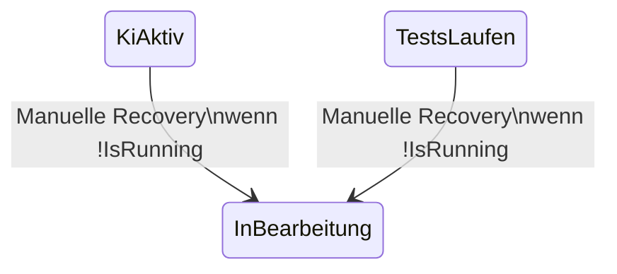

# API-/Service-Contract – Manuelle Aufgaben-Recovery

## Zweck

Dokumentiert den technischen Vertrag für die manuelle Recovery einer festhängenden Aufgabe auf der Seite `AufgabeDetail`.

> Hinweis: Es gibt aktuell **keinen öffentlichen HTTP-Endpunkt** für Recovery.  
> Der Contract ist ein interner Service-/UI-Contract.

---

## Einstiegspunkte

| Ebene | Artefakt | Verantwortung |
|---|---|---|
| UI | `AufgabeDetail.razor` / `AufgabeDetail.razor.cs` | Anzeige Aktion, Bestätigung, Fehler-/Erfolgsmeldung |
| Application | `AufgabeRecoveryService.RecoverManuellAsync(Guid, CancellationToken)` | Eligibility, Statusmutation, Audit, Logging |
| Domain Contract | `IRunningAutomationStatusSource.IsRunning(Guid)` | Laufstatus-Guard pro Aufgabe |
| Persistenz | `SoftwareschmiededDbContext` + Migration | Concurrency-Token und Audit-Persistenz |

---

## Zulässige Zustände und Transition

- **Recoverbar:** `AufgabeStatus.KiAktiv`, `AufgabeStatus.TestsLaufen`
- **Zielstatus:** `AufgabeStatus.InBearbeitung`
- **Zusätzliche Bedingung:** `IsRunning(aufgabeId) == false`

---

## Verhaltensvertrag `RecoverManuellAsync`

1. Log `TaskRecoveryRequested` mit `CorrelationId`.
2. Aufgabe laden (`AsNoTracking`), ansonsten Fehler `NotFound`.
3. Prüfen, ob recoverbarer Status vorliegt, sonst `InvalidState`.
4. Laufstatus prüfen (`IsRunning`):
   - Fehler bei Prüfung: `RunningStatusUnavailable`
   - `true`: `StillRunning`
5. Bedingtes Update mit `Status` + `RecoveryVersion` als Guard.
6. Bei Erfolg:
   - Status `InBearbeitung`
   - `RecoveryVersion++`
   - Audit-`Protokolleintrag` vom Typ `StatusUebergang`
   - Log `TaskRecoverySucceeded`
7. Bei `rowCount == 0`:
   - `TaskRecoveryConcurrencyConflict`
   - Benutzerfehler: „Status wurde bereits geändert. Ansicht wurde aktualisiert.“

---

## Fehlercodes und Benutzertexte

| ReasonCode / Fall | Benutzertext |
|---|---|
| `NotFound` | Aufgabe wurde nicht gefunden. |
| `InvalidState` | Wiederherstellung für aktuellen Status nicht verfügbar. |
| `StillRunning` | Wiederherstellung nicht möglich, Verarbeitung läuft noch. |
| `RunningStatusUnavailable` | Prüfung der Laufzeit war nicht möglich. |
| Concurrency conflict | Status wurde bereits geändert. Ansicht wurde aktualisiert. |

---

## Audit und Logging

### Audit (`Protokolleintrag`)

- `Typ = StatusUebergang`
- `Inhalt` enthält:
  - `Manuelle Wiederherstellung: <FromStatus> → InBearbeitung`
  - `ReasonCode: RecoveryManual`
  - `CorrelationId: <id>`

### Logs

- `TaskRecoveryRequested`
- `TaskRecoveryEligibilityChecked`
- `TaskRecoveryRejected`
- `TaskRecoveryConcurrencyConflict`
- `TaskRecoverySucceeded`

---

## Operative Hinweise

- Bei Supportfällen immer `CorrelationId` aus UI-Fehlerkontext/Logs und Audit-Eintrag zusammen auswerten.
- Bei `StillRunning` zuerst normalen Abbruchpfad der laufenden Automatisierung durchführen.
- Bei `RunningStatusUnavailable` Infrastruktur-/Servicezustand prüfen, dann Recovery erneut versuchen.

---

## Testreferenzen

- `src/Softwareschmiede.Tests/Application/Services/AufgabeRecoveryServiceTests.cs`
- `src/Softwareschmiede.IntegrationTests/Services/AufgabeRecoveryServiceTests.cs`
- `src/Softwareschmiede.Tests/Components/Pages/Aufgaben/AufgabeDetailRecoveryTests.cs`

