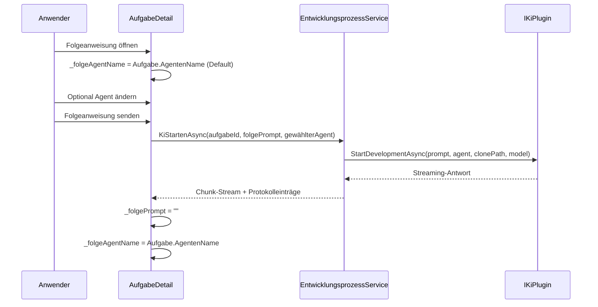

# Architektur-Blueprint – Agent-Auswahl bei Folgeanweisungen

> **Dokument-Typ:** Architektur-Blueprint  
> **Status:** Umgesetzt  
> **Betroffene Komponente:** `src/Softwareschmiede/Components/Pages/Aufgaben/AufgabeDetail.razor`  
> **Betroffene Logik:** `src/Softwareschmiede/Components/Pages/Aufgaben/AufgabeDetail.razor.cs`

---

## 1. Referenzen

- Requirements: [`../requirements/agent-selection-follow-up-prompts-requirements-analysis.md`](../requirements/agent-selection-follow-up-prompts-requirements-analysis.md)
- Architektur-Review: [`../improvements/agent-selection-follow-up-prompts-architecture-review.md`](../improvements/agent-selection-follow-up-prompts-architecture-review.md)

---

## 2. Zielbild

Folgeanweisungen sollen mit einer expliziten Agenten-Auswahl ausführbar sein. Die Auswahl startet mit dem Initial-Agenten, bleibt vor dem Senden änderbar und wird nach dem Senden wieder auf den Initial-Agenten gesetzt. Der Initialprompt-Flow bleibt unverändert.

---

## 3. Betroffene Schichten

- **Presentation:** Folge-Prompt-Card mit Agenten-Auswahl (`_folgeAgentName`) in `AufgabeDetail.razor`
- **Application:** Weitergabe von Prompt + Agent über `KiMitPromptStartenAsync` an den bestehenden KI-Lauf
- **Domain:** Nutzung vorhandener `Aufgabe.AgentenName` als Initial-Agent
- **Infrastructure:** Unverändert (kein Schnittstellen- oder Schema-Change)

---

## 4. Ablauf

---

## 5. Qualitätsziele

| Ziel | Umsetzung |
|---|---|
| Bedienkonsistenz | Folge-Prompt-Default entspricht immer dem Initial-Agenten |
| Korrekte Weitergabe | Gesendet wird exakt mit dem aktuell gewählten Agenten |
| Rückfall auf sicheren Standard | Nach Versand Reset auf Initial-Agenten |
| Regressionsschutz | Initialprompt bleibt getrennt über `_kiAgentName` |

---

## 6. Änderungsumfang

### Implementierte Änderungen
1. UI-Agenten-Auswahl für Folge-Prompts (`AufgabeDetail.razor`)
2. Default-/Reset-Logik für `_folgeAgentName` (`AufgabeDetail.razor.cs`)
3. Testabdeckung für UI-Bindung, Default, Weitergabe, Reset und Initialprompt-Verhalten

### Nicht geändert
1. `IKiPlugin`-Contract (`StartDevelopmentAsync` unverändert)
2. Datenbankschema
3. Initialprompt-Ablauf

---

## 7. Akzeptanzkriterien

1. Agent-Auswahl bei Folgeanweisungen ist sichtbar/verfügbar.  
2. Standardwert ist der initial gewählte Agent.  
3. Nutzer kann Auswahl vor dem Absenden ändern.  
4. Folgeanweisung wird an den tatsächlich ausgewählten Agenten gesendet.  
5. Verhalten beim Initialprompt bleibt unverändert.  

