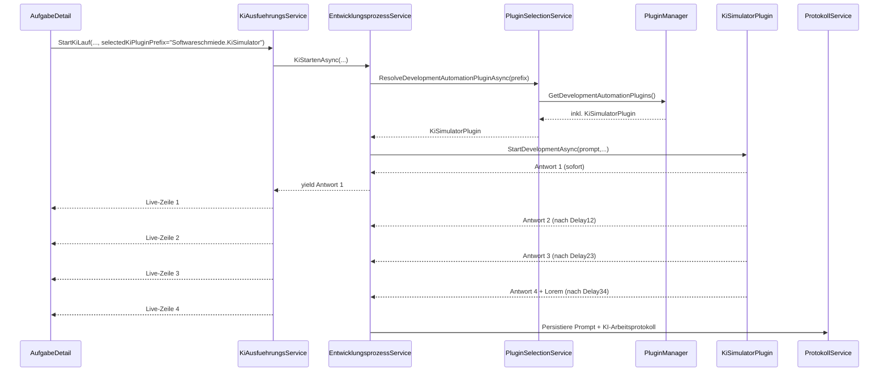

# Architektur-Blueprint – KI-Simulator-Plugin (4 feste Antworten, Delays, Streaming)

> **Dokument-Typ:** Feature-spezifischer Architektur-Blueprint  
> **Projekt:** Softwareschmiede  
> **Anforderungsbasis:** `docs/requirements/AI-Plugin-Simulator-Requirements.md`  
> **Status:** 🔄 In Arbeit  
> **Version:** 1.0.0

---

## 1. Zielarchitektur

Das Feature erweitert die bestehende Plugin-Architektur um ein neues Development-Automation-Plugin:

- **Projekt:** `plugins/Softwareschmiede.Plugin.KiSimulator`
- **Klasse:** `KiSimulatorPlugin : CliKiPluginBase`
- **Discovery:** unverändert über `PluginManager` (`<AppBase>/plugins/*.dll`)
- **Verwendung:** wie bestehende KI-Plugins über `PluginSelectionService`, `EntwicklungsprozessService`, `KiAusfuehrungsService` und `AufgabeDetail`

Das Plugin liefert für **jeden Prompt** deterministisch genau vier Streaming-Ausgaben:

1. `Ich kümmere mich darum, die Anforderung zu verstehen.`
2. `Ich habe die Anforderung verstanden. ich mache mir nun einen Plan.`
3. `Der Plan ist fertig. Ich begebe mich nun an die Umsetzung.`
4. `Fertig. Hier ist das Ergebnis:` + vollständiger hinterlegter Lorem-Ipsum-Block aus `606a91d3-d33c-4eba-8a3d-dbdf559c8c6b.copilot-task.md`

Zwischen 1→2, 2→3, 3→4 liegt jeweils ein konfigurierbarer Delay (Default 2000 ms, gültig 0–10000, sonst Fallback 2000).

---

## 2. Komponenten (Ist + Ziel)

| Komponente | Ist-Zustand | Ziel für Simulator |
|---|---|---|
| `IKiPlugin` / `CliKiPluginBase` | Vertrag für KI-Plugins inkl. `StartDevelopmentAsync`, `RunTestsAsync`, `CheckHealthAsync` | Simulator implementiert Vertrag vollständig ohne neue Host-Schnittstelle |
| `PluginManager` | Lädt Development-Automation-Plugins aus `plugins`-Ordner | Erkennt `Softwareschmiede.Plugin.KiSimulator.dll` automatisch |
| `PluginSelectionService` | Auflösung explizit → Default → Fallback | Simulator wird gleichberechtigte auswählbare Plugin-Instanz |
| `EntwicklungsprozessService.KiStartenAsync` | Streamt `IKiPlugin.StartDevelopmentAsync` nach UI/Protokoll | Simulator-Streaming läuft ohne Sonderpfad durch identische Pipeline |
| `KiAusfuehrungsService` | Hintergrundlauf + Live-Buffering + Subscription | Sichtbares zeitversetztes Streaming durch Delays |
| `PluginSettingsService` (`<PluginPrefix>.<FieldKey>`) | Persistiert Plugin-Konfiguration | Speichert Delay-Werte pro Simulator-Plugin |

---

## 3. End-to-End-Datenfluss

---

## 4. Integrationspunkte (konkret)

1. **Neues Plugin-Projekt unter `plugins/`**
   - `plugins/Softwareschmiede.Plugin.KiSimulator/Softwareschmiede.Plugin.KiSimulator.csproj`
   - Referenz auf `src/Softwareschmiede.Plugin.Contracts/Softwareschmiede.Plugin.Contracts.csproj`

2. **Solution-Aufnahme**
   - `Softwareschmiede.slnx`: neuer `<Project Path="plugins/Softwareschmiede.Plugin.KiSimulator/...csproj" />`

3. **Host-Build/Publish-Artefakte**
   - `src/Softwareschmiede/Softwareschmiede.csproj`  
     Ergänzung in `CopyPluginsToHostOutput` und `CopyPluginsToPublishOutput` um:
     - `plugins\Softwareschmiede.Plugin.KiSimulator\bin\$(Configuration)\$(TargetFramework)\*.dll`

4. **Test-Projektreferenz**
   - `src/Softwareschmiede.Tests/Softwareschmiede.Tests.csproj` um KiSimulator-Plugin-Projektreferenz ergänzen.

5. **Keine Änderungen nötig**
   - `PluginManager`-Discovery-Logik bleibt unverändert.
   - `IKiPlugin` und `CliKiPluginBase` bleiben unverändert.

---

## 5. Konfiguration

### 5.1 Plugin-Metadaten

- `PluginName`: `KI Simulator`
- `PluginPrefix`: `Softwareschmiede.KiSimulator`
- `ProviderDateiPraefix`: `simulator`
- `PluginType`: `PluginType.DevelopmentAutomation`

### 5.2 Einstellungsfelder (über `GetSettingGroups`)

Gruppe `Simulation` mit Integer-Feldern:

- `Delay12Ms`
- `Delay23Ms`
- `Delay34Ms`

Persistenz über bestehende Schlüsselkonvention:

- `Softwareschmiede.KiSimulator.Delay12Ms`
- `Softwareschmiede.KiSimulator.Delay23Ms`
- `Softwareschmiede.KiSimulator.Delay34Ms`

Validierung je Wert:

- gültig: `0..10000`
- ungültig/leer/nicht parsebar: `2000` (Default/Fallback)

---

## 6. Fehlerverhalten

| Fall | Verhalten |
|---|---|
| Delay ungültig (`<0`, `>10000`, kein Integer) | Wert wird auf 2000 gesetzt, Warning-Log mit Feldname |
| `Task.Delay` abgebrochen (`CancellationToken`) | Lauf wird durch bestehende Pipeline sauber beendet (`OperationCanceledException`) |
| Leerer oder beliebiger Prompt | Wird akzeptiert, Ausgaben bleiben unverändert deterministisch |
| Agentenpaket-Prüfung | Simulator liefert kompatibel/No-Op, damit kein `.github`-Zwang entsteht |
| `RunTestsAsync` / `CheckHealthAsync` | Keine externe CLI-Abhängigkeit, deterministisches Simulator-Ergebnis |

---

## 7. Qualitätsziele (priorisiert)

| ID | Ziel | Konkretisierung |
|---|---|---|
| Q1 | Determinismus | 100 Läufe liefern identische 4 Texte in identischer Reihenfolge |
| Q2 | Streaming-Treue | Ausgaben erscheinen einzeln nach Delay-Grenzen, nicht gepuffert am Ende |
| Q3 | Robustheit | Ungültige Delay-Konfiguration führt nicht zum Fehlerlauf |
| Q4 | Integrationsstabilität | Keine Anpassung an `PluginManager` oder Host-Verträgen erforderlich |
| Q5 | Betriebsunabhängigkeit | Funktion ohne `copilot`/`claude` CLI und ohne Netzabhängigkeit |

---

## 8. Umsetzungsreihenfolge (implementierungsreif)

1. **Plugin-Projekt erzeugen**  
   `plugins/Softwareschmiede.Plugin.KiSimulator` inkl. `KiSimulatorPlugin.cs`.

2. **Plugin-Verhalten implementieren**  
   - 4 feste Antwortkonstanten (inkl. vollständigem Lorem-Text)
   - Delay-Lesen + Validierungsfunktion
   - `StartDevelopmentAsync` mit `yield return` + `Task.Delay`

3. **Betriebsmethoden implementieren**  
   - `CheckHealthAsync` => `true`
   - `RunTestsAsync` => deterministisches `TestResult`
   - `IsAgentPackageCompatibleAsync` / `DeployAgentPackageAsync` als simulatorgerechter No-Dependency-Pfad

4. **Build-/Solution-Integration**  
   - `Softwareschmiede.slnx`
   - `Softwareschmiede.csproj` CopyTargets
   - `Softwareschmiede.Tests.csproj` ProjectReference

5. **Tests ergänzen**  
   - neue `KiSimulatorPluginTests`
   - PluginManager-/Selection-Tests um Simulator-Fall erweitern

---

## 9. Teststrategie

### 9.1 Unit-Tests Plugin (`src/Softwareschmiede.Tests/Infrastructure/Plugins/KiSimulatorPluginTests.cs`)

- Metadaten (`PluginName`, `PluginPrefix`, `ProviderDateiPraefix`, `PluginType`)
- `GetSettingGroups` enthält genau 3 Delay-Felder
- `StartDevelopmentAsync` gibt exakt 4 Schritte in korrekter Reihenfolge zurück
- Schritt 4 enthält vollständigen Lorem-Ipsum-Block unverändert
- Delay-Fallback bei `-1`, `10001`, `abc`, leer -> 2000
- Delay-Grenzwerte `0` und `10000` funktionieren

### 9.2 Integration/Service-Tests

- `PluginManagerTests`: Discovery enthält zusätzlich `KI Simulator`
- `PluginSelectionServiceTests`: explizite Auswahl `Softwareschmiede.KiSimulator` wird aufgelöst
- `KiAusfuehrungsServiceTests`/`EntwicklungsprozessServiceTests`: Streaming-Lines kommen inkrementell an

### 9.3 Nicht-funktionale Verifikation

- Timing-Test mit Toleranz (z. B. ±150 ms je Delay)
- 100-fach-Lauf ohne ungefangene Exception

---

## 10. Architektur-Entscheidungen

1. **Simulator als normales `IKiPlugin` statt Sonderlogik im Host**  
   -> minimales Risiko, volle Wiederverwendung der bestehenden Pipeline.

2. **Delay-Konfiguration über bestehende Plugin-Settings**  
   -> keine neue Persistenztechnik, keine Schemaänderung.

3. **Deterministische Antwortkonstanten im Plugin-Code**  
   -> stabile Testbarkeit und reproduzierbare UI-/QA-Szenarien.

4. **No-Dependency Health/Test-Pfad**  
   -> erfüllt Requirement „ohne externe CLI“ vollständig.

---

## 11. Versionshistorie

| Version | Datum | Änderung | Autor |
|---|---|---|---|
| 1.0.0 | 2026-05-14 | Initiale implementierungsreife Zielarchitektur für KI-Simulator-Plugin auf Basis Ist-Code und Requirements | Architektur- & Lösungsdesign |

