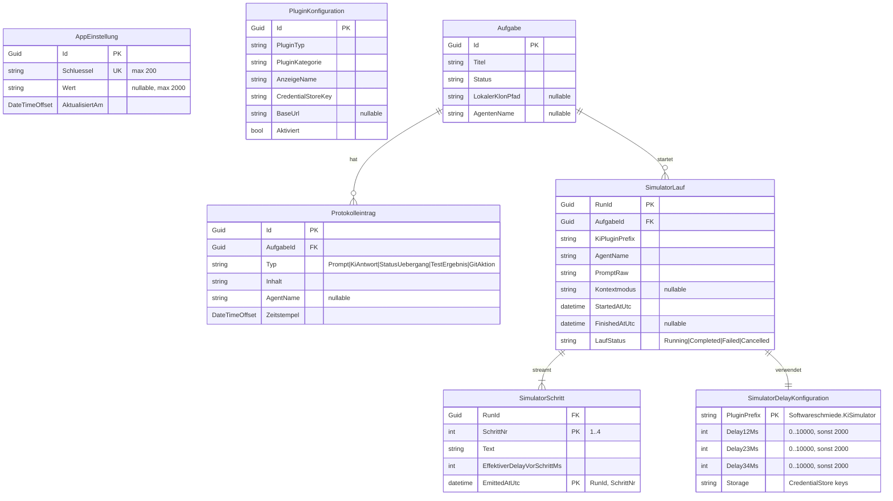

# Entity-Relationship-Modell – KI-Simulator-Plugin

> **Dokument-Typ:** Feature-spezifisches ERM (DB + Credential-Store + Runtime)  
> **Anforderungsbasis:** `docs/requirements/AI-Plugin-Simulator-Requirements.md`  
> **Architekturbasis:** `docs/architecture/ai-plugin-simulator-architecture-blueprint.md`  
> **Status:** 🔄 In Arbeit  
> **Version:** 1.0.0

---

## 1. Ziel und Scope

Dieses ERM beschreibt das **umsetzungsnahe fachlich-technische Modell** für:

1. **Konfigurationsdaten** des KI-Simulators (Delay-Werte, Default-Plugin-Auswahl),
2. **Laufdaten** eines KI-Simulator-Laufs (Prompt, Streaming-Schritte, persistiertes Ergebnis),
3. **Mapping auf den Ist-Stand** in Softwareschmiede (`AppEinstellung`, `PluginKonfiguration`, Plugin-Auswahlfluss).

Es führt **keine zwingende DB-Migration** ein, sondern modelliert primär die bestehende Persistenz plus logische Runtime-Objekte.

---

## 2. ERM-Diagramm (Mermaid)

---

## 3. Entitäten, Schlüssel, Constraints, Kardinalitäten

| Entität | Ebene | Schlüssel | Kernattribute | Kardinalität / Beziehung | Wichtige Constraints |
|---|---|---|---|---|---|
| `AppEinstellung` | DB (bestehend) | `Id` (PK), `Schluessel` (UK) | `Wert`, `AktualisiertAm` | technisch unabhängig; fachlich von Plugin-Auswahl genutzt | `Schluessel` eindeutig, max 200 |
| `PluginKonfiguration` | DB (bestehend) | `Id` (PK) | `PluginTyp`, `PluginKategorie`, `CredentialStoreKey` | derzeit keine FK-Beziehungen | dient als Registry-Metadatenebene; keine referenzielle Kopplung |
| `Aufgabe` | DB (bestehend) | `Id` (PK) | `Status`, `LokalerKlonPfad`, `AgentenName` | 1:n zu `Protokolleintrag`; 1:n zu `SimulatorLauf` (fachlich) | Lauf nur zulässig wenn `LokalerKlonPfad` gesetzt |
| `Protokolleintrag` | DB (bestehend) | `Id` (PK), `AufgabeId` (FK) | `Typ`, `Inhalt`, `AgentName`, `Zeitstempel` | n:1 zu `Aufgabe` | `Typ=Prompt` enthält RunId + verwendetes Plugin; `Typ=KiAntwort` enthält aggregiertes Ergebnis |
| `SimulatorDelayKonfiguration` | logisch (Credential Store) | `PluginPrefix` | `Delay12Ms`,`Delay23Ms`,`Delay34Ms` | 1:1 pro Simulator-PluginPrefix | jeder Delay: gültig `0..10000`, sonst Fallback `2000` |
| `SimulatorLauf` | logisch (Runtime/Protokoll-Korrelation) | `RunId` | `AufgabeId`, `KiPluginPrefix`, `PromptRaw`, `LaufStatus` | n:1 zu `Aufgabe`; 1:n zu `SimulatorSchritt` | `KiPluginPrefix` muss auf verfügbares KI-Plugin auflösbar sein |
| `SimulatorSchritt` | logisch (Runtime-Streaming) | `(RunId, SchrittNr)` | `Text`, `EffektiverDelayVorSchrittMs`, `EmittedAtUtc` | n:1 zu `SimulatorLauf` | für Simulator exakt 4 Schritte, `SchrittNr ∈ {1,2,3,4}` |

---

## 4. Mapping zu bestehenden Entitäten und Settings-Keys

### 4.1 Konfigurationsdaten

| Fachobjekt | Ist-Speicher | Konkreter Key/Feldname | Mapping-Regel |
|---|---|---|---|
| Default-KI-Plugin für Plugin-Auswahl | `AppEinstellungen` | `plugins.default.DevelopmentAutomation` | Wert = `PluginPrefix` (z. B. `Softwareschmiede.KiSimulator`) |
| Arbeitsverzeichnis (indirekt laufrelevant) | `AppEinstellungen` | `repositories.workdir` | bestimmt Basis für lokale Klonpfade/Runtime-Dateien |
| Simulator Delay 1→2 | Credential Store | `Softwareschmiede.KiSimulator.Delay12Ms` | String→Int; bei ungültig/leer außerhalb Range => `2000` |
| Simulator Delay 2→3 | Credential Store | `Softwareschmiede.KiSimulator.Delay23Ms` | String→Int; bei ungültig/leer außerhalb Range => `2000` |
| Simulator Delay 3→4 | Credential Store | `Softwareschmiede.KiSimulator.Delay34Ms` | String→Int; bei ungültig/leer außerhalb Range => `2000` |

### 4.2 Laufdaten

| Fachobjekt | Ist-Speicher | Mapping-Regel |
|---|---|---|
| explizite Plugin-Auswahl im UI | nur Runtime (`_selectedKiPluginPrefix`) | wird bei Start an `KiAusfuehrungsService.StartKiLauf(..., selectedKiPluginPrefix)` übergeben |
| effektive Plugin-Auflösung | `PluginSelectionService` (Runtime-Logik) | Reihenfolge: explizit gewählt → gespeicherter Default (`AppEinstellung`) → deterministischer Fallback |
| Lauf-Korrelation | `Protokolleintrag.Inhalt` (`Typ=Prompt`/`Typ=KiAntwort`) | `RunId` wird im Text serialisiert (`[RunId:{guid}]`) |
| Streaming-Schritte | `KiSession` (In-Memory) | einzelne Zeilen werden live gepuffert; persistiert wird am Ende ein aggregierter `KiAntwort`-Eintrag |

---

## 5. Fachliche und technische Invarianten

1. **Genau 3 Delay-Felder** für das Simulator-Plugin: `Delay12Ms`, `Delay23Ms`, `Delay34Ms`.
2. **Delay-Range:** `0..10000`; ungültig/nicht parsebar/leer => **Fallback 2000 ms**.
3. **Deterministische Schrittfolge:** pro Simulatorlauf exakt 4 Schritte in fester Reihenfolge.
4. **Prompt-Akzeptanz:** leerer oder beliebiger Prompt ist zulässig; beeinflusst Simulatortexte nicht.
5. **Plugin-Auswahlkonsistenz:** Persistierte Defaults referenzieren `PluginPrefix`, nicht Anzeigename.
6. **Persistenz der Laufdaten:** strukturierte Schritt-Einzelwerte sind aktuell Runtime; DB-seitig bleibt `Protokolleintrag` die persistierte Quelle.

---

## 6. Konsistenzabgleich mit Architektur-Blueprint

| Blueprint-Aussage | ERM-Abbildung | Status |
|---|---|---|
| Delay-Konfiguration über Plugin-Settings `<PluginPrefix>.<FieldKey>` | `SimulatorDelayKonfiguration` + Mapping-Tabelle 4.1 | ✅ Konsistent |
| Default-Plugin-Auswahl über bestehende App-Einstellungen | `AppEinstellung` Key `plugins.default.DevelopmentAutomation` | ✅ Konsistent |
| Auflösung explizit → Default → Fallback | `SimulatorLauf.KiPluginPrefix` + Invariante 5 | ✅ Konsistent |
| Streaming-Ausgabe mit Delays | `SimulatorLauf` + `SimulatorSchritt` (Runtime), persistiertes Ergebnis in `Protokolleintrag` | ✅ Konsistent |
| Keine zwingende Schemaänderung | Nutzung bestehender `AppEinstellung`, `Aufgabe`, `Protokolleintrag` | ✅ Konsistent |

---

## 7. Modellierungsentscheidungen (kurz begründet)

- **Keine neue Pflicht-DB-Tabelle für Simulator-Läufe:** passt zum Ist-Stand (Protokoll als Persistenz, Streaming in-memory).
- **`SimulatorLauf`/`SimulatorSchritt` als logische Entitäten:** macht Laufdaten, Kardinalitäten und Tests explizit spezifizierbar.
- **`PluginKonfiguration` bleibt entkoppelt:** aktueller Code nutzt primär Plugin-Discovery + Prefix-basierte Auswahl; daher semantische, nicht FK-basierte Kopplung.
- **Key-basierte Konfiguration beibehalten:** konsistent zu existierendem `PluginSettingsService` und `PluginDefaultSettingsService`.

---

## 8. Versionshistorie

| Version | Datum | Änderung |
|---|---|---|
| 1.0.0 | 2026-05-14 | Initiales Feature-ERM für KI-Simulator-Konfigurations- und Laufdaten auf Basis Requirements + Architektur-Blueprint + Ist-Stand |

