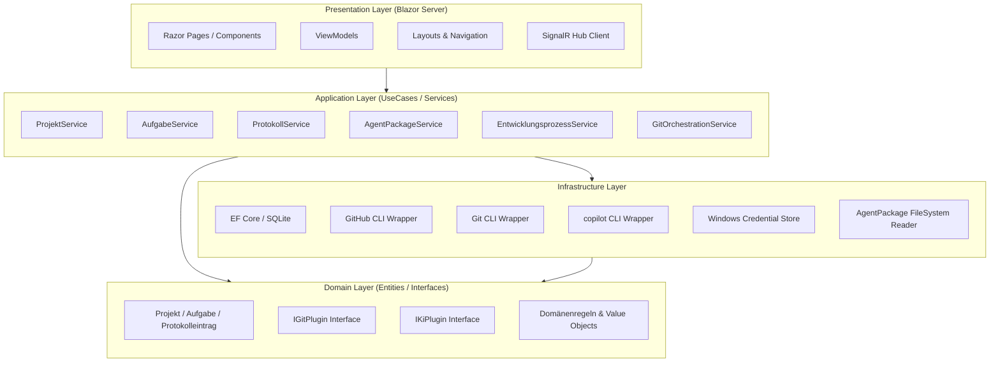
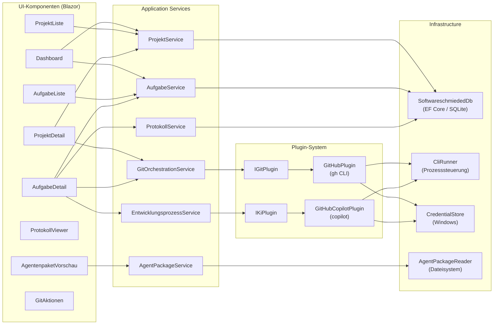
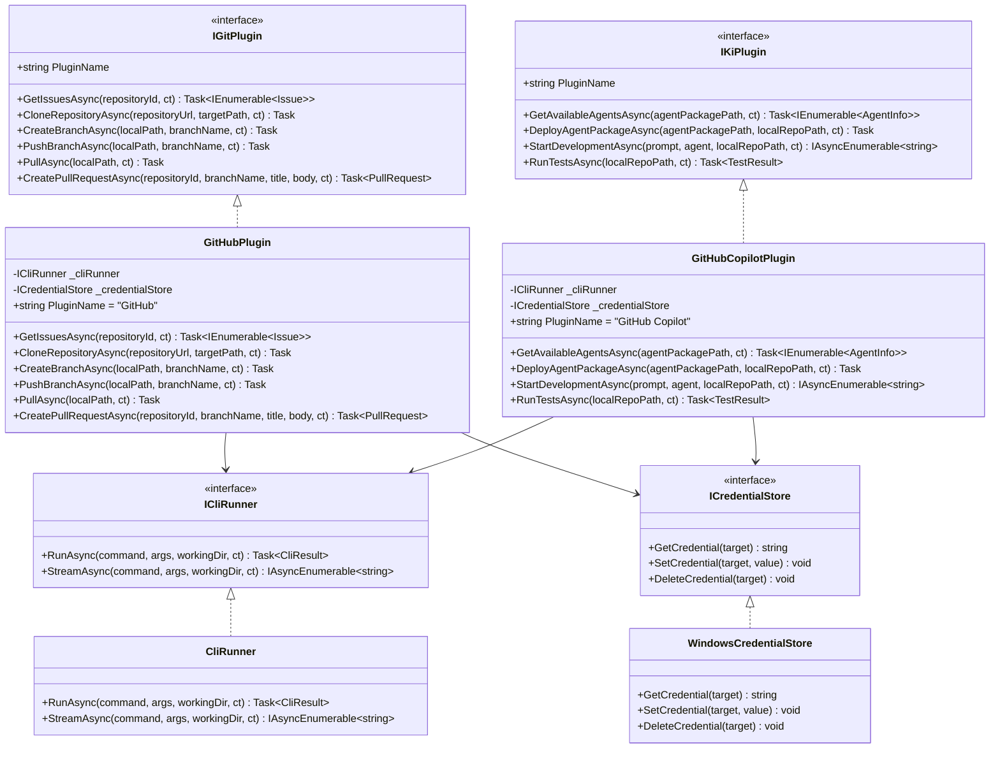
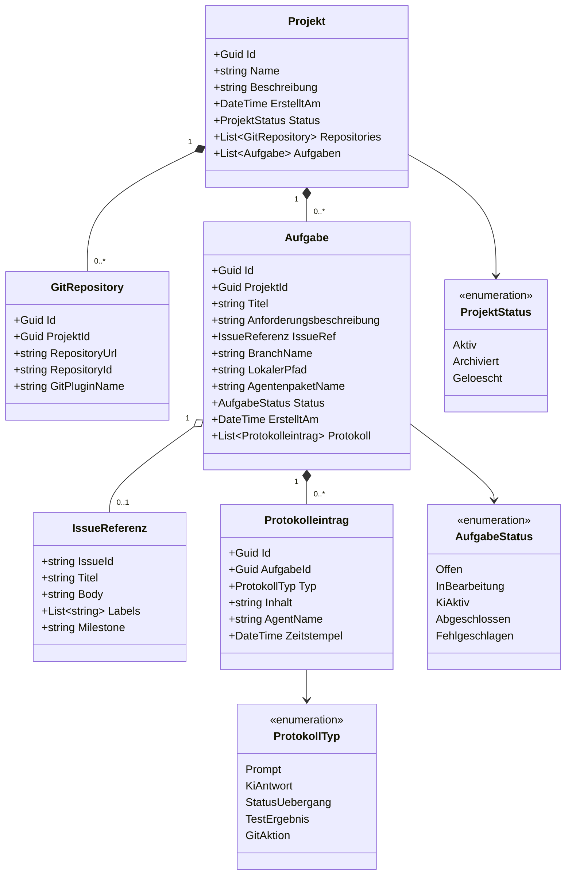
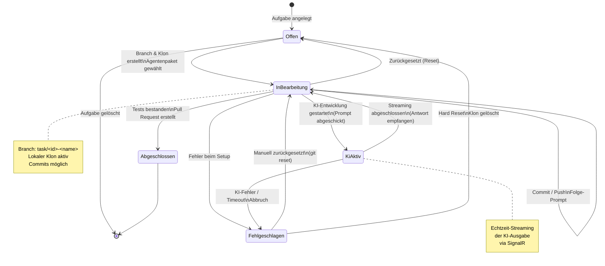
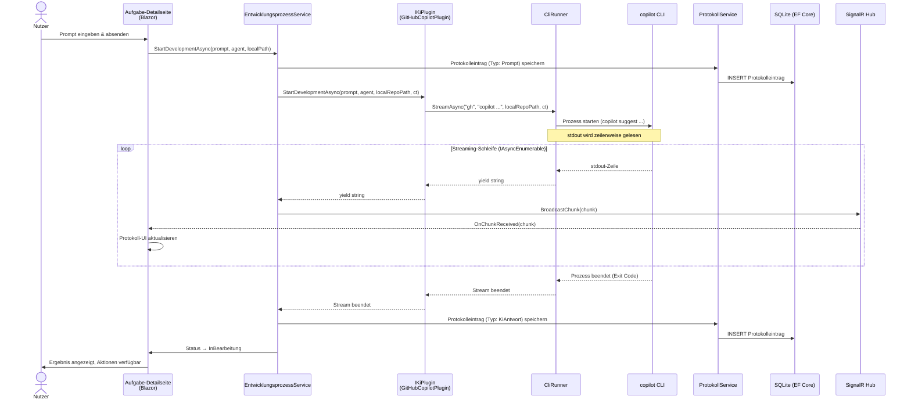
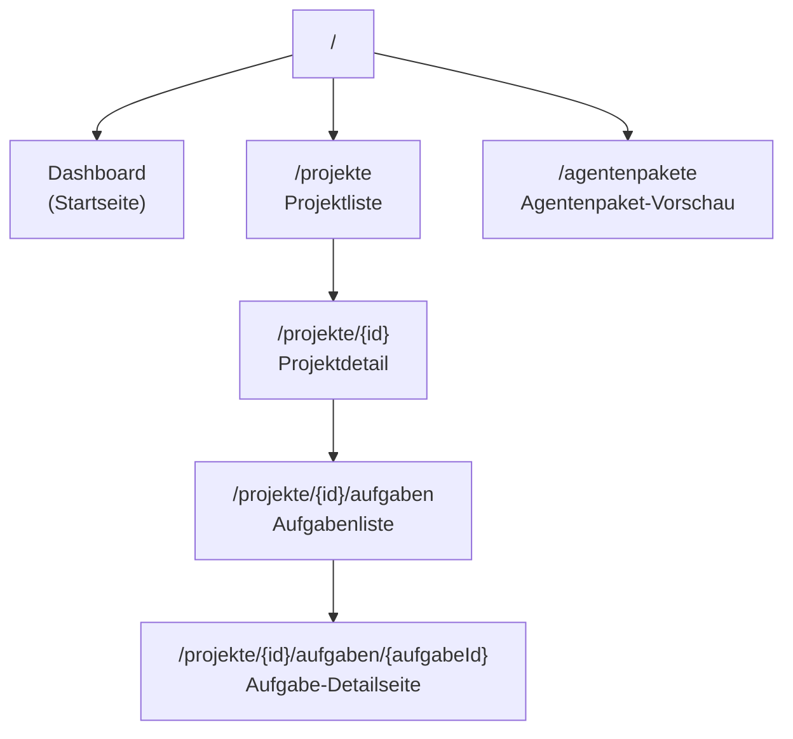

# Architektur-Blueprint: Softwareschmiede

**Version:** 1.0  
**Datum:** 2025  
**Status:** Freigegeben  

---

## Verwandte Dokumente

- [Anforderungsanalyse](../requirements/requirements-analysis.md)
- [Entity-Relationship-Modell](entity-relationship-model.md)
- [Architektur-Review](../improvements/architecture-review.md)

---

## Inhaltsverzeichnis

1. [Systemübersicht](#1-systemübersicht)
2. [Schichtenarchitektur](#2-schichtenarchitektur)
3. [Komponentenstruktur](#3-komponentenstruktur)
4. [Plugin-System](#4-plugin-system)
5. [Domänenmodell](#5-domänenmodell)
6. [Aufgaben-Lebenszyklus](#6-aufgaben-lebenszyklus)
7. [KI-Entwicklungsprozess (Sequenz)](#7-ki-entwicklungsprozess-sequenz)
8. [Technologieentscheidungen](#8-technologieentscheidungen)
9. [CLI-Prozesssteuerung und Streaming](#9-cli-prozesssteuerung-und-streaming)
10. [Sicherheitskonzept](#10-sicherheitskonzept)
11. [Datenbankkonzept (EF Core)](#11-datenbankkonzept-ef-core)
12. [UI/UX-Konzept](#12-uiux-konzept)
13. [Qualitätsziele](#13-qualitätsziele)
14. [Projektstruktur (Solution-Layout)](#14-projektstruktur-solution-layout)

---

## 1. Systemübersicht

**Softwareschmiede** ist eine lokal betriebene Blazor Server-Webanwendung (.NET 10+), die den gesamten Workflow der KI-gestützten Softwareentwicklung orchestriert. Die Anwendung verbindet:

- **Projektmanagement** – Verwaltung von Softwareprojekten und deren Repositories
- **Git-Integration** – Klonen, Branchen, Committen, Pushen und Pull Requests via austauschbarer Git-Plugins
- **Aufgabenverwaltung** – Issue-basierte oder freie Aufgaben mit eigenem Branch und lokalem Klon
- **KI-Steuerung** – Orchestrierung von KI-Agenten über austauschbare KI-Plugins mit Echtzeit-Streaming
- **Aufgabenprotokoll** – Lückenloses Protokoll aller Prompts, Antworten und Statusübergänge

Die Anwendung läuft **ausschließlich lokal unter Windows**, erfordert **keinen Login**, und ist für **Einzelnutzer** konzipiert. Alle Zugangsdaten werden sicher im **Windows Credential Store** gespeichert.

---

## 2. Schichtenarchitektur



### Schichtverantwortlichkeiten

| Schicht | Verantwortung | Abhängigkeiten |
|---|---|---|
| **Presentation** | UI-Rendering, Benutzerinteraktion, ViewModel-Binding, Echtzeit-Updates via SignalR | Application |
| **Application** | Anwendungsfalllogik, Koordination von Domain und Infrastructure, Plugin-Aufruf | Domain, Infrastructure |
| **Domain** | Fachentitäten, Domänenregeln, Plugin-Interfaces, keine äußeren Abhängigkeiten | – (rein) |
| **Infrastructure** | DB-Zugriff, CLI-Prozesse, Credential Store, Dateisystem | Domain (Interfaces) |

---

## 3. Komponentenstruktur



---

## 4. Plugin-System

### 4.1 Klassendiagramm



### 4.2 Plugin-Registrierung

Plugins werden per Dependency Injection im `Program.cs` registriert:

```csharp
// Git-Plugin
builder.Services.AddScoped<IGitPlugin, GitHubPlugin>();

// KI-Plugin
builder.Services.AddScoped<IKiPlugin, GitHubCopilotPlugin>();

// Infrastruktur
builder.Services.AddSingleton<ICliRunner, CliRunner>();
builder.Services.AddSingleton<ICredentialStore, WindowsCredentialStore>();
```

Durch den Einsatz von Interfaces ist jedes Plugin ohne Änderung der Anwendungslogik austauschbar (z.B. GitLab statt GitHub, Claude statt Copilot).

---

## 5. Domänenmodell



---

## 6. Aufgaben-Lebenszyklus



---

## 7. KI-Entwicklungsprozess (Sequenz)



---

## 8. Technologieentscheidungen

### 8.1 Blazor Server (InteractiveServer)

| Kriterium | Begründung |
|---|---|
| **C# durchgehend** | Keine JavaScript-Entwicklung notwendig; voller Zugriff auf .NET-Bibliotheken |
| **Server-seitiges Rendering** | Sensible Daten (Credential Store, CLIs) bleiben serverseitig |
| **SignalR inklusive** | Echtzeit-Streaming der KI-Ausgabe ohne zusätzliche Infrastruktur |
| **Einzelnutzer lokal** | Keine Skalierungsanforderungen, kein State-Management-Overhead |
| **Kein WASM** | Blazor WebAssembly ist ausgeschlossen, da direkter Dateisystem-/CLI-Zugriff benötigt wird |

### 8.2 SQLite via EF Core

| Kriterium | Begründung |
|---|---|
| **Lokal & dateibasiert** | Keine Serverinstallation; einfache Datensicherung per Dateikopie |
| **EF Core Code-First** | Typsichere Datenbankoperationen; Migrations für Schemaevolution |
| **Einzelnutzer** | SQLite-Einschränkungen (keine parallelen Schreibzugriffe) irrelevant |
| **Kein ORM-Overhead** | Ausreichend für die Datenmenge einer lokalen Entwicklungsumgebung |

### 8.3 Windows Credential Store

| Kriterium | Begründung |
|---|---|
| **Kein Klartext** | API-Tokens (GitHub PAT, Copilot) werden nicht in der DB oder Konfigurationsdateien gespeichert |
| **OS-Integration** | Windows Data Protection API (DPAPI) sichert Credentials mit Nutzerschlüssel |
| **Bekannte API** | `System.Security.Credentials` / `CredentialManagement` NuGet-Paket |
| **Windows-only** | Anwendung ist explizit Windows-only; kein Cross-Platform-Overhead |

### 8.4 CLI-Steuerung (gh, git)

| Kriterium | Begründung |
|---|---|
| **gh CLI** | Offizielles GitHub-Tool; vollständige API-Abdeckung; stabil und gepflegt |
| **copilot** | Einzige offizielle Schnittstelle für GitHub Copilot in der CLI; Streaming-Ausgabe verfügbar |
| **git CLI** | Standard; verfügbar auf jedem Entwicklerrechner; keine Lib-Abhängigkeiten |
| **Kein SDK** | GitHub .NET SDK wäre möglich, bindet aber an konkrete Implementation; CLI über Interface leichter austauschbar |

### 8.5 SignalR für Echtzeit-Streaming

| Kriterium | Begründung |
|---|---|
| **Blazor-integriert** | SignalR ist die native Echtzeit-Lösung in Blazor Server |
| **IAsyncEnumerable** | CLI-Ausgabe wird als `IAsyncEnumerable<string>` durch alle Schichten gereicht |
| **Kein Polling** | Echtes Push-Modell; geringe Latenz bei der Darstellung der KI-Ausgabe |

### 8.6 i18n-Vorbereitung (resx)

Alle UI-Texte werden über `.resx`-Ressourcendateien verwaltet. Auch wenn die Anwendung initial nur Deutsch unterstützt, ermöglicht dies eine spätere Mehrsprachigkeit ohne Codeänderungen.

---

## 9. CLI-Prozesssteuerung und Streaming

### 9.1 Prozessstart

Der `CliRunner` kapselt `System.Diagnostics.Process` vollständig. Jeder CLI-Aufruf läuft in einem eigenen Prozess:

```csharp
public interface ICliRunner
{
    Task<CliResult> RunAsync(string command, string args,
        string workingDirectory, CancellationToken ct);

    IAsyncEnumerable<string> StreamAsync(string command, string args,
        string workingDirectory, CancellationToken ct);
}
```

**Implementierungsdetails `RunAsync`:**
- `ProcessStartInfo` mit `RedirectStandardOutput = true`, `RedirectStandardError = true`, `UseShellExecute = false`
- `Process.WaitForExitAsync(ct)` für asynchrones Warten
- `stdout` und `stderr` werden vollständig gelesen und in `CliResult` zurückgegeben
- Exit-Code-Prüfung; bei Fehler wird `CliException` geworfen

**Implementierungsdetails `StreamAsync`:**
- Gleiche `ProcessStartInfo`-Konfiguration
- `process.OutputDataReceived += (_, e) => channel.Writer.TryWrite(e.Data)`
- `System.Threading.Channels.Channel<string>` als Puffer zwischen Prozess-Event und `IAsyncEnumerable`
- `CancellationToken` löst `process.Kill()` aus
- `stderr` wird parallel gepuffert und bei Stream-Ende ausgewertet

### 9.2 Streaming-Konzept (Ende-zu-Ende)

```
copilot CLI (stdout)
    → CliRunner (Channel<string> → IAsyncEnumerable<string>)
        → GitHubCopilotPlugin (IAsyncEnumerable<string> via yield)
            → EntwicklungsprozessService (await foreach)
                → SignalR Hub (BroadcastChunk)
                    → Blazor Component (OnChunkReceived → StateHasChanged)
                        → Nutzer sieht Streaming-Ausgabe
```

### 9.3 Fehlerbehandlung

- `CancellationToken` wird überall weitergegeben; Abbruch tötet den CLI-Prozess sauber
- Timeout via `CancellationTokenSource.CreateLinkedTokenSource` mit konfigurierbarem Timeout
- Fehler in CLI-Prozessen werden als `CliException` mit Exit-Code und stderr-Inhalt weitergegeben
- Protokolleintrag vom Typ `Fehlgeschlagen` wird bei Ausnahmen automatisch gespeichert

---

## 10. Sicherheitskonzept

### 10.1 Windows Credential Store Integration

```mermaid
sequenceDiagram
    participant Plugin as GitHubPlugin /<br/>CopilotPlugin
    participant CredStore as ICredentialStore<br/>(WindowsCredentialStore)
    participant WinAPI as Windows DPAPI<br/>(Credential Manager)

    Plugin->>CredStore: GetCredential("Softwareschmiede/GitHub/PAT")
    CredStore->>WinAPI: CredRead(target, GENERIC)
    WinAPI-->>CredStore: Credential (verschlüsselt entschlüsselt)
    CredStore-->>Plugin: Token als string (im Speicher)
    Note over Plugin: Token nur im Arbeitsspeicher;\nnicht in DB, nicht in Logs
    Plugin->>Plugin: Token als Prozessumgebungsvariable\noder CLI-Argument übergeben
```

**Credential-Targets (Namenskonvention):**

| Zweck | Target-Name |
|---|---|
| GitHub Personal Access Token | `Softwareschmiede/GitHub/PAT` |
| GitHub Copilot Token | `Softwareschmiede/GitHub/CopilotToken` |

### 10.2 Sicherheitsprinzipien

- **Keine Secrets in DB:** API-Tokens werden ausschließlich im Windows Credential Store gespeichert
- **Keine Secrets in Logs:** Protokolleinträge enthalten keine Tokens oder Passwörter
- **Keine Secrets als CLI-Argument sichtbar:** Token werden als Umgebungsvariablen an CLI-Prozesse übergeben (nicht über Kommandozeilenargumente, die in Prozesslisten sichtbar wären)
- **Lokale Anwendung:** Kein Netzwerkzugriff auf die Anwendung von außen; kein Auth-System nötig
- **Kein Login:** Einzelnutzer; Windows-Anmeldung ist die implizite Authentifizierung

---

## 11. Datenbankkonzept (EF Core)

### 11.1 DbContext und Tabellen

```
SoftwareschmiededDbContext (EF Core)
├── DbSet<Projekt>           → Tabelle: Projekte
├── DbSet<GitRepository>     → Tabelle: GitRepositories
├── DbSet<Aufgabe>           → Tabelle: Aufgaben
├── DbSet<IssueReferenz>     → Tabelle: IssueReferenzen (owned entity)
├── DbSet<Protokolleintrag>  → Tabelle: Protokolleintraege
├── DbSet<TestErgebnis>      → Tabelle: TestErgebnisse
├── DbSet<PluginKonfiguration> → Tabelle: PluginKonfigurationen
└── DbSet<AppEinstellung>    → Tabelle: AppEinstellungen (z. B. repositories.workdir)
```

### 11.2 Migrations

- **Code-First-Ansatz:** Schema wird aus den Entitätsklassen generiert
- **EF Core Migrations:** Schemaänderungen werden als Migrationsskripte versioniert
- **Automatische Migration beim Start:** `dbContext.Database.MigrateAsync()` in `Program.cs` (nur für Einzelnutzer-Lokalbetrieb akzeptabel)
- **SQLite-Datei:** Standardpfad `<ContentRoot>/softwareschmiede.db` (gemäß `Program.cs`)

### 11.3 Abfragestrategie

| Szenario | Strategie |
|---|---|
| **Lesende Abfragen (Listen, Dashboard)** | `AsNoTracking()` – kein Change-Tracking-Overhead |
| **Schreibende Operationen (Erstellen, Bearbeiten)** | Tracking aktiv; `SaveChangesAsync()` |
| **Protokolleinträge (Append-only)** | `AsNoTracking()`; nur INSERTs, niemals UPDATEs |
| **Aufgaben-Status-Änderung** | Explizites Laden mit Tracking; atomarer Update + Protokolleintrag in einer Transaktion |

### 11.4 Transaktionen

Statusübergänge und zugehörige Protokolleinträge werden in einer Transaktion gespeichert:

```csharp
await using var transaction = await _dbContext.Database.BeginTransactionAsync(ct);
try
{
    aufgabe.Status = neuerStatus;
    _dbContext.Aufgaben.Update(aufgabe);
    _dbContext.Protokolleintraege.Add(protokolleintrag);
    await _dbContext.SaveChangesAsync(ct);
    await transaction.CommitAsync(ct);
}
catch
{
    await transaction.RollbackAsync(ct);
    throw;
}
```

### 11.5 Indizes

- `Aufgaben.ProjektId` – für Aufgaben-Listen-Abfragen
- `Protokolleintraege.AufgabeId` – für Protokoll-Abruf
- `Protokolleintraege.Zeitstempel` – für Sortierung und Suche
- `Projekte.Status` – für Dashboard-Filterung

---

## 12. UI/UX-Konzept

### 12.1 Seitenstruktur (Informationsarchitektur)



### 12.2 Layout-Konzept

**Grundlayout:**
- Linke Seitennavigation: Dashboard, Projekte, Agentenpakete
- Hauptbereich: Seiteninhalt
- Keine Top-Navigation (Einzelnutzer, kein Login)

**Seitenlayout (Standard):**
```
┌─────────────────────────────────────────────┐
│  [Seitentitel]                              │
├─────────────────────────────────────────────┤
│  [Aktionsleiste: Symbol-Buttons]            │
├─────────────────────────────────────────────┤
│                                             │
│  [Seiteninhalt]                             │
│                                             │
└─────────────────────────────────────────────┘
```

Die **Aktionsleiste** befindet sich zwischen Überschrift und Inhalt. Sie enthält Icon-Buttons aus `sprite.svg` (z.B. Bearbeiten, Archivieren, Löschen, Branch anlegen, Push, Pull Request).

### 12.3 Seitenkonzepte

#### Dashboard (Startseite)
- **Inhalt:** Status-Karten für alle aktiven Aufgaben über alle Projekte
- **Karten zeigen:** Projektname, Aufgabentitel, aktueller Status, letzter Protokolleintrag-Zeitstempel
- **Aktion:** Klick auf Karte → Aufgabe-Detailseite

#### Projektverwaltung
- **Übersicht:** Tabelle mit Name, Status, Anzahl Aufgaben, Erstellungsdatum; Aktionen pro Zeile
- **Detailseite:** Metadaten, Repository-Verknüpfungen (via Git-Plugin), Aufgaben-Schnellübersicht
- **Aktionsleiste:** Neu, Bearbeiten, Archivieren, Löschen

#### Aufgabenliste (pro Projekt)
- **Übersicht:** Tabelle mit Titel, Status, Branch, letzter Aktivität
- **Neue Aufgabe:** Issue-Auswahl (via Git-Plugin) oder freie Texteingabe
- **Aktionsleiste:** Neue Aufgabe, Filter nach Status

#### Aufgabe-Detailseite
- **Oberer Bereich:** Status-Badge, Branch-Name, lokaler Pfad, Agentenpaket/Agent
- **Aktionsleiste (Git):** Push, Pull, Commit, Reset (soft/mixed/hard), Pull Request
- **Prompt-Eingabe:** Textfeld + Agenten-Auswahl + Absenden-Button
- **Protokoll-Viewer:** Chronologische Liste der Einträge; Echtzeit-Streaming wird am Ende angefügt; Einträge sind nach Typ farblich unterschieden
- **Folge-Prompt:** Aus jedem Protokolleintrag (Typ: KiAntwort) heraus neuen Prompt starten

#### Agentenpaket-Vorschau
- **Inhalt:** Liste der `agent-packages/`-Ordner; Klick → Dateiliste, README, enthaltene Agenten

### 12.4 Icon-System

Alle Icons werden aus einer zentralen `sprite.svg`-Datei referenziert:

```html
<svg class="icon">
  <use href="/icons/sprite.svg#icon-bearbeiten" />
</svg>
```

### 12.5 Responsive Design

- Breakpoints: Mobile (< 768px), Tablet (768–1024px), Desktop (> 1024px)
- Navigation: Bei Mobile einklappbar (Hamburger-Menü)
- Protokoll-Viewer: Vollbreite auf allen Geräten; Scrollbereich fixiert

---

## 13. Qualitätsziele

### 13.1 Erweiterbarkeit

| Maßnahme | Umsetzung |
|---|---|
| Plugin-Interfaces | `IGitPlugin` und `IKiPlugin` ermöglichen Austausch ohne Codeänderung in Application/Presentation |
| Dependency Injection | Alle Services und Repositories via DI; einfaches Austauschen von Implementierungen |
| i18n via resx | Alle UI-Texte in Ressourcendateien; Sprache ohne Codeänderung erweiterbar |
| Feature-Module | Services und Komponenten sind nach Fachdomäne gruppiert; neue Features können unabhängig hinzugefügt werden |

### 13.2 Testbarkeit

| Maßnahme | Umsetzung |
|---|---|
| Interfaces überall | `IGitPlugin`, `IKiPlugin`, `ICliRunner`, `ICredentialStore` – alle einfach mock-bar |
| ViewModels | Blazor-Seiten delegieren Logik an ViewModels; ViewModels sind ohne Blazor testbar |
| EF Core InMemory | Unit-Tests können `DbContextOptions` mit InMemory-Provider nutzen |
| Pure Domain | Domain-Layer hat keine externen Abhängigkeiten; reine Unit-Tests möglich |
| Application Services | Können mit gemockten Infrastruktur-Interfaces getestet werden |

**Testpyramide:**
```
     /\
    /  \   E2E (Playwright, wenige)
   /----\
  /      \  Integrationstests (EF Core InMemory, CLI-Wrapper)
 /--------\
/          \ Unit-Tests (Domain, ViewModels, Application Services)
```

### 13.3 Performance

| Maßnahme | Umsetzung |
|---|---|
| `AsNoTracking()` | Lesende Abfragen ohne Change-Tracking-Overhead |
| Paginierung | Protokolleinträge und Aufgaben-Listen werden paginiert geladen |
| Streaming statt Buffering | KI-Ausgabe wird als Stream verarbeitet; keine vollständige Pufferung im Speicher |
| Lazy Loading vermeiden | Explizites Laden von Navigations-Properties via `Include()` |
| Indizes | Relevante Fremdschlüssel und Sortierfelder indiziert |
| SQLite WAL-Modus | Write-Ahead-Logging für bessere Lese/Schreib-Parallelität (auch bei Einzelnutzer relevant für Streaming-Schreibvorgänge) |

### 13.4 Sicherheit

| Maßnahme | Umsetzung |
|---|---|
| Keine Secrets in DB | Windows Credential Store für alle API-Tokens |
| Keine Secrets in Logs | Protokolleinträge werden auf sensitive Inhalte geprüft |
| Token als Umgebungsvariablen | CLI-Prozesse erhalten Tokens via Umgebungsvariablen, nicht als CLI-Argumente |
| Lokale Anwendung | Kein externer Netzwerkzugriff; Windows-Firewall schützt implizit |
| CancellationToken | Alle async-Operationen sind abbrechbar; keine hängenden Prozesse |
| Input-Validierung | Alle Benutzereingaben (Projektnamen, Prompts, Pfade) werden validiert und sanitisiert |

### 13.5 Wartbarkeit

| Maßnahme | Umsetzung |
|---|---|
| Clean Architecture | Klare Schichtentrennung; Abhängigkeiten zeigen nur nach innen |
| XML-Dokumentation | Alle öffentlichen Interfaces und Services dokumentiert |
| Konventionen | Branch-Namenskonvention (`task/<id>-<name>`); Dateibenennungskonventionen |
| EF Core Migrations | Schemaevolution versioniert und reproduzierbar |

---

## 14. Projektstruktur (Solution-Layout)

```
Softwareschmiede/
├── Softwareschmiede.slnx
│
├── src/
│   ├── Softwareschmiede/                          # Blazor Server App (Host)
│   │   ├── Program.cs
│   │   ├── appsettings.json
│   │   ├── wwwroot/
│   │   │   ├── icons/
│   │   │   │   └── sprite.svg
│   │   │   └── css/
│   │   ├── Components/                            # Blazor-Komponenten
│   │   │   ├── Layout/
│   │   │   │   ├── MainLayout.razor
│   │   │   │   └── NavMenu.razor
│   │   │   ├── Pages/
│   │   │   │   ├── Dashboard.razor
│   │   │   │   ├── Projekte/
│   │   │   │   │   ├── ProjektListe.razor
│   │   │   │   │   └── ProjektDetail.razor
│   │   │   │   ├── Aufgaben/
│   │   │   │   │   ├── AufgabeListe.razor
│   │   │   │   │   └── AufgabeDetail.razor
│   │   │   │   └── Agentenpakete/
│   │   │   │       └── AgentenpaketVorschau.razor
│   │   │   └── Shared/                            # Wiederverwendbare Komponenten
│   │   │       ├── Aktionsleiste.razor
│   │   │       ├── StatusBadge.razor
│   │   │       └── ProtokollViewer.razor
│   │   ├── ViewModels/
│   │   │   ├── DashboardViewModel.cs
│   │   │   ├── ProjektListeViewModel.cs
│   │   │   ├── ProjektDetailViewModel.cs
│   │   │   ├── AufgabeListeViewModel.cs
│   │   │   └── AufgabeDetailViewModel.cs
│   │   └── Hubs/
│   │       └── KiStreamingHub.cs                  # SignalR Hub
│   │
│   ├── Softwareschmiede.Application/              # Application Layer
│   │   ├── Services/
│   │   │   ├── ProjektService.cs
│   │   │   ├── AufgabeService.cs
│   │   │   ├── ProtokollService.cs
│   │   │   ├── AgentPackageService.cs
│   │   │   ├── EntwicklungsprozessService.cs
│   │   │   └── GitOrchestrationService.cs
│   │   └── Dtos/
│   │       ├── ProjektDto.cs
│   │       ├── AufgabeDto.cs
│   │       └── ProtokollEintragDto.cs
│   │
│   ├── Softwareschmiede.Domain/                   # Domain Layer
│   │   ├── Entities/
│   │   │   ├── Projekt.cs
│   │   │   ├── GitRepository.cs
│   │   │   ├── Aufgabe.cs
│   │   │   ├── IssueReferenz.cs
│   │   │   └── Protokolleintrag.cs
│   │   ├── Enums/
│   │   │   ├── ProjektStatus.cs
│   │   │   ├── AufgabeStatus.cs
│   │   │   └── ProtokollTyp.cs
│   │   ├── Interfaces/
│   │   │   ├── IGitPlugin.cs
│   │   │   └── IKiPlugin.cs
│   │   └── ValueObjects/
│   │       ├── Issue.cs
│   │       ├── PullRequest.cs
│   │       ├── AgentInfo.cs
│   │       └── TestResult.cs
│   │
│   └── Softwareschmiede.Infrastructure/           # Infrastructure Layer
│       ├── Persistence/
│       │   ├── SoftwareschmiededDbContext.cs
│       │   ├── Configurations/
│       │   │   ├── ProjektConfiguration.cs
│       │   │   ├── AufgabeConfiguration.cs
│       │   │   └── ProtokollEintragConfiguration.cs
│       │   └── Migrations/
│       ├── Plugins/
│       │   ├── Git/
│       │   │   └── GitHubPlugin.cs
│       │   └── Ki/
│       │       └── GitHubCopilotPlugin.cs
│       ├── Cli/
│       │   ├── ICliRunner.cs
│       │   ├── CliRunner.cs
│       │   └── CliResult.cs
│       ├── Credentials/
│       │   ├── ICredentialStore.cs
│       │   └── WindowsCredentialStore.cs
│       └── AgentPackages/
│           └── AgentPackageReader.cs
│
├── tests/
│   ├── Softwareschmiede.Domain.Tests/
│   ├── Softwareschmiede.Application.Tests/
│   └── Softwareschmiede.Infrastructure.Tests/
│
├── agent-packages/                                # Agentenpakete (fest, nicht konfigurierbar)
│   └── <paketname>/
│       ├── README.md
│       ├── agents/
│       │   └── <agent>.md
│       └── ...
│
└── docs/
    ├── architecture/
    │   ├── architecture-blueprint.md              # dieses Dokument
    │   └── entity-relationship-model.md
    ├── requirements/
    │   └── requirements-analysis.md
    └── improvements/
        └── architecture-review.md
```

---

## Anhang: Agentenpaket-Verzeichnisstruktur

```
<Programmverzeichnis>/agent-packages/
└── <paketname>/
    ├── README.md              # Beschreibung des Pakets
    ├── agents/
    │   ├── <agent1>.md        # Agent-Definition (Prompt-Vorlage, Beschreibung)
    │   └── <agent2>.md
    └── <weitere Dateien>      # z.B. Konfigurationen, Vorlagen
```

- Der Pfad `agent-packages/` ist relativ zum Programmverzeichnis und **nicht konfigurierbar**
- `IKiPlugin.GetAvailableAgentsAsync(agentPackagePath, ct)` liest die `agents/`-Unterordner
- `IKiPlugin.DeployAgentPackageAsync(agentPackagePath, localRepoPath, ct)` kopiert das Paket in den lokalen Klon (Branch)

---

## Anhang: Branch-Namenskonvention

Jede Aufgabe erhält beim Start einen dedizierten Branch:

```
task/<aufgaben-id>-<kurzname>
```

Beispiele:
- `task/a1b2c3d4-benutzerverwaltung`
- `task/e5f6a7b8-login-fehler-beheben`

Der `<kurzname>` wird aus dem Aufgabentitel generiert (Kleinbuchstaben, Leerzeichen durch `-` ersetzt, Sonderzeichen entfernt, max. 40 Zeichen).

---

*Dokument erstellt am: 2025 | Version 1.0 | Softwareschmiede Architektur-Team*

