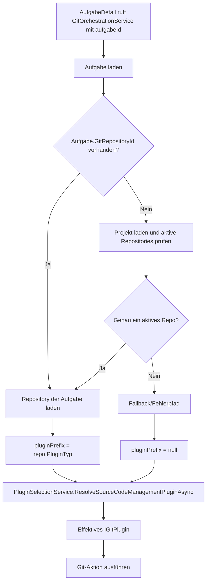

# Architektur-Blueprint – AufgabeDetail: projektspezifische Git-Plugin-Auflösung

> **Dokument-Typ:** Architektur-Blueprint  
> **Status:** Entwurf  
> **Version:** 1.0.0

---

## 1. Referenzen

- Requirements: [`../requirements/aufgabe-detail-project-selected-git-plugin-requirements-analysis.md`](../requirements/aufgabe-detail-project-selected-git-plugin-requirements-analysis.md)
- ERM: [`./aufgabe-detail-project-selected-git-plugin-entity-relationship-model.md`](./aufgabe-detail-project-selected-git-plugin-entity-relationship-model.md)
- Review: [`../improvements/aufgabe-detail-project-selected-git-plugin-architecture-review.md`](../improvements/aufgabe-detail-project-selected-git-plugin-architecture-review.md)
- Übersicht: [`../planning-overview-aufgabe-detail-project-selected-git-plugin.md`](../planning-overview-aufgabe-detail-project-selected-git-plugin.md)

---

## 2. Zielbild

`GitOrchestrationService` soll pro aufgabenbezogener Git-Aktion das effektive `IGitPlugin` anhand des Aufgaben-/Projektkontexts bestimmen.  
Die UI (`AufgabeDetail`) bleibt Consumer und enthält keine eigene Plugin-Auswahllogik.

---

## 3. Betroffene Schichten

- **Presentation:** `AufgabeDetail` nutzt Service wie bisher.
- **Application:** zentrale Auflösung im `GitOrchestrationService`.
- **Domain:** `Aufgabe`, `Projekt`, `GitRepository` liefern den Kontext.
- **Infrastructure:** `PluginSelectionService`/`PluginManager` liefern konkrete Plugininstanzen.

---

## 4. Architekturentscheidungen

| Entscheidung | Begründung |
|---|---|
| Auflösung pro Aufruf statt globales Feld | verhindert falsches Plugin bei mehreren Repository-Typen |
| `PluginSelectionService` als Resolver | bestehende Default-/Fallback-Logik wiederverwenden |
| Einheitliche Auflösungsregel | konsistentes Verhalten über alle Git-Methoden |
| Verhaltensbasierte Tests | robust gegen Refactoring, praxisnah |

---

## 5. Ablauf (Plugin-Auflösung)

---

## 6. Änderungsumfang

### Zu ändern
1. `src/Softwareschmiede/Application/Services/GitOrchestrationService.cs`  
   - Resolver-Methode für effektives Plugin ergänzen  
   - alle relevanten Methoden auf resolvertes Plugin umstellen
2. `src/Softwareschmiede.Tests/Components/Pages/Aufgaben/AufgabeDetailGitActionsBunitTests.cs`  
   - bestehenden Test praxisnah umbauen  
   - zweiten LocalDirectory-Test ergänzen
3. `src/Softwareschmiede/Program.cs`  
   - DI-Setup prüfen (kein impliziter Default-Missbrauch)

### Optional ergänzen
- `src/Softwareschmiede.Tests/Application/Services/GitOrchestrationServiceTests.cs` für reine Service-Regeln

---

## 7. Testarchitektur

Pflichtfälle:
1. **Remote/GitHub:** selected = `Softwareschmiede.GitHub`, default = `LocalDirectoryPlugin` → effektive Nutzung GitHub
2. **LocalDirectory:** selected = `LocalDirectoryPlugin`, default = `Softwareschmiede.GitHub` → effektive Nutzung LocalDirectory

Zusätzlich:
- Regression auf Capability-gesteuerte Button-Sichtbarkeit (Push/Pull/PR/Merge)

---

## 8. Qualitätsziele, Risiken, Maßnahmen

| Ziel/Risiko | Maßnahme |
|---|---|
| Korrekte Plugin-Wahl | zentrale Resolver-Logik, keine UI-Duplikation |
| Regression in Git-Aktionen | zwei Pflichttests + bestehende Tests weiterführen |
| Mehrdeutiger Kontext | deterministische Fallback-Regel dokumentieren und testen |
| Wartbarkeit | verhaltensbasierte Assertions statt Reflection-only |

---

## 9. Akzeptanzkriterien (Architektur)

- Die Service-Logik ist aufgabenkontextbasiert statt Default-Plugin-basiert.
- Beide Pflichttests sind grün.
- Keine Schemaänderung notwendig.
- `AufgabeDetail` bleibt schlank und delegiert.

