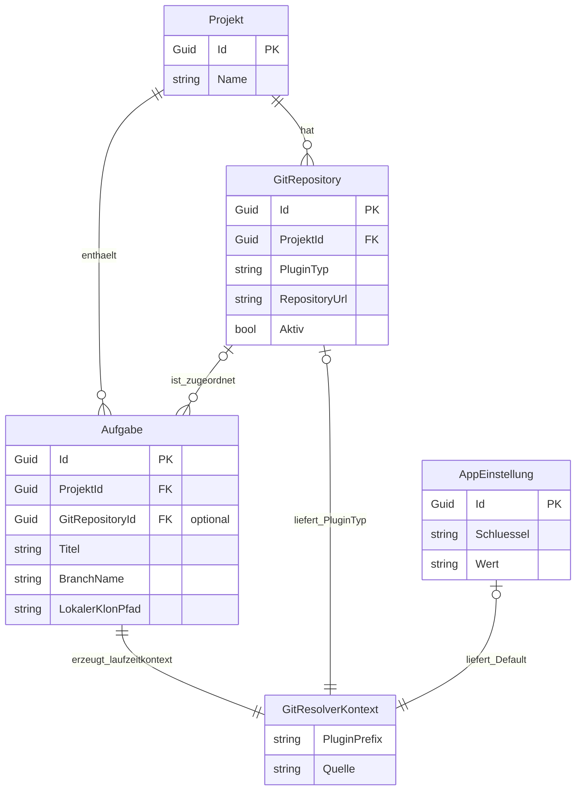

# Entity-Relationship-Modell – AufgabeDetail: Plugin-Auflösung aus Aufgaben-/Projektkontext

> **Dokument-Typ:** Konzeptionelles ERM  
> **Status:** Entwurf  
> **Hinweis:** Keine Schemaänderung geplant

---

## 1. Referenzen

- Requirements: [`../requirements/aufgabe-detail-project-selected-git-plugin-requirements-analysis.md`](../requirements/aufgabe-detail-project-selected-git-plugin-requirements-analysis.md)
- Architektur: [`./aufgabe-detail-project-selected-git-plugin-architecture-blueprint.md`](./aufgabe-detail-project-selected-git-plugin-architecture-blueprint.md)
- Review: [`../improvements/aufgabe-detail-project-selected-git-plugin-architecture-review.md`](../improvements/aufgabe-detail-project-selected-git-plugin-architecture-review.md)
- Übersicht: [`../planning-overview-aufgabe-detail-project-selected-git-plugin.md`](../planning-overview-aufgabe-detail-project-selected-git-plugin.md)

---

## 2. Konzeptionelles Modell

---

## 3. Entitäten- und Beziehungsübersicht

| Entität / Kontext | Schlüssel | Relevante Attribute | Rolle |
|---|---|---|---|
| `Projekt` | `Id` | `Name` | Träger von Repositories und Aufgaben |
| `Aufgabe` | `Id` | `ProjektId`, `GitRepositoryId?`, `BranchName`, `LokalerKlonPfad` | Startpunkt für Git-Aktionen |
| `GitRepository` | `Id` | `ProjektId`, `PluginTyp`, `RepositoryUrl`, `Aktiv` | Fachliche Quelle des auszuwählenden Plugins |
| `AppEinstellung` | `Schluessel` | `plugins.default.SourceCodeManagement` | Fallback-Kontext |
| `GitResolverKontext` (laufzeit) | – | `PluginPrefix`, `Quelle` | Nicht persistent; pro Aktion ermittelt |

---

## 4. Konsistenzcheck

| Aussage | Abbildung im ERM | Ergebnis |
|---|---|---|
| Plugin muss pro Aufgabe aufgelöst werden | `Aufgabe` + optional `GitRepository` → `GitResolverKontext` | ✅ |
| Repository-Plugin ist Primärquelle | `GitRepository.PluginTyp` | ✅ |
| Fallback bleibt möglich | `AppEinstellung` als Default-Quelle | ✅ |
| Keine Persistenzänderung | Resolverkontext nur Laufzeitobjekt | ✅ |

---

## 5. Mapping zum Code

- `src/Softwareschmiede/Application/Services/GitOrchestrationService.cs` (Resolver und Git-Aktionsaufrufe)
- `src/Softwareschmiede/Components/Pages/Aufgaben/AufgabeDetail.razor.cs` (Aufrufkontext)
- `src/Softwareschmiede/Application/Services/PluginSelectionService.cs` (Plugin-Auflösung)
- `src/Softwareschmiede/Program.cs` (DI-Rahmen)
- `src/Softwareschmiede.Tests/Components/Pages/Aufgaben/AufgabeDetailGitActionsBunitTests.cs` (Verhaltensnachweis)

---

## 6. Änderungsbedarf Datenmodell

**Keine Migration erforderlich.**

Begründung:
- Benötigte Datenfelder (`GitRepositoryId`, `PluginTyp`, Default-Einstellung) sind bereits vorhanden.
- Die Änderung liegt in Ablauf-/Resolverlogik, nicht im Schema.

