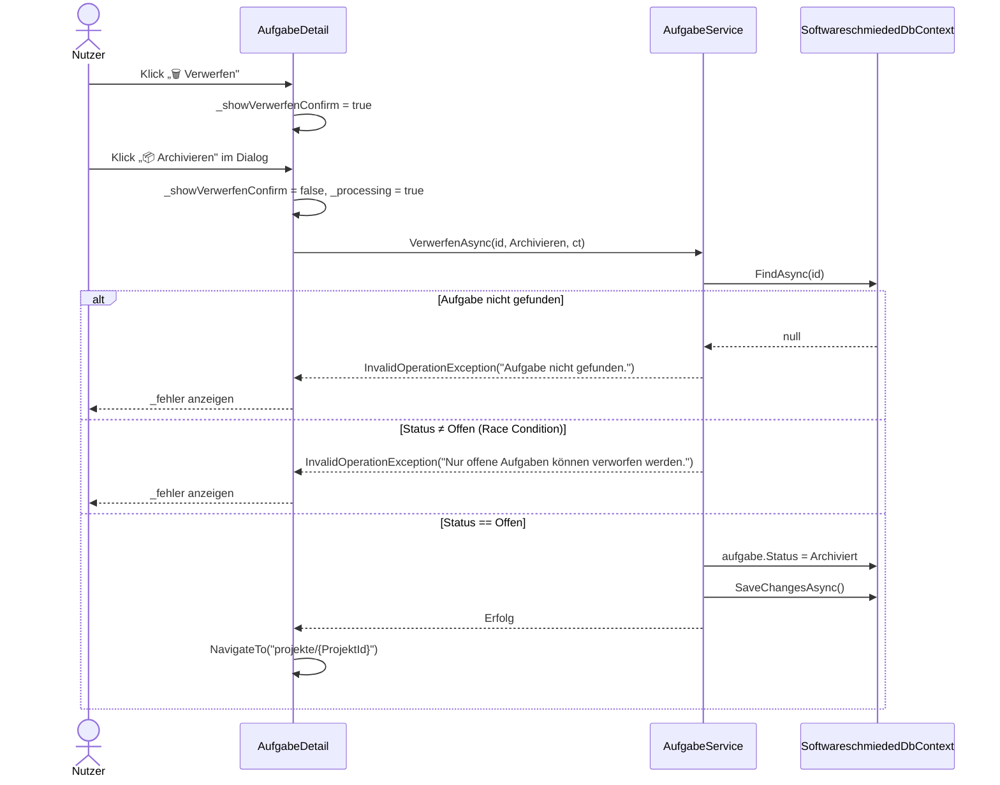
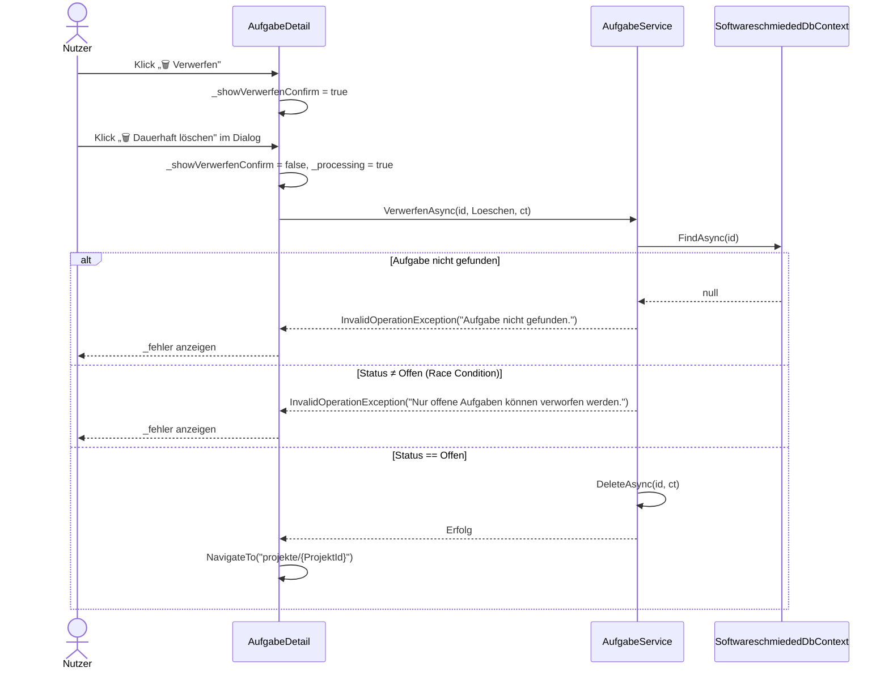
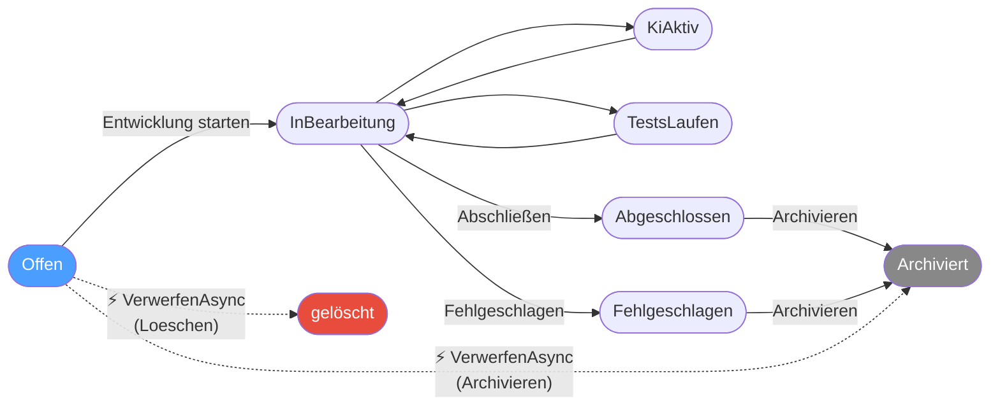

# Architektur-Blueprint – Offene Aufgabe verwerfen (`Offen → Archiviert / gelöscht`)

> **Dokument-Typ:** Architektur-Blueprint  
> **Status:** 📋 Entwurf  
> **Version:** 1.0.0  
> **Datum:** 2026-05-23  
> **Betroffene Komponenten:** `AufgabeDetail`, `AufgabeService`, `VerwerfenAktion`

---

## 1. Referenzen

| Typ | Pfad |
|-----|------|
| Requirements | [`../requirements/aufgabe-offen-verwerfen-requirements-analysis.md`](../requirements/aufgabe-offen-verwerfen-requirements-analysis.md) |
| Basis-Blueprint | [`./architecture-blueprint.md`](./architecture-blueprint.md) |
| ERM | [`./entity-relationship-model.md`](./entity-relationship-model.md) |
| Verwandtes Feature | [`./aufgabe-recovery-wiederherstellung-architecture-blueprint.md`](./aufgabe-recovery-wiederherstellung-architecture-blueprint.md) |
| Verwandtes Feature | [`./status-zuruecksetzen-ki-aktiv-ohne-lauf-architecture-blueprint.md`](./status-zuruecksetzen-ki-aktiv-ohne-lauf-architecture-blueprint.md) |
| Quellcode UI | `src/Softwareschmiede/Components/Pages/Aufgaben/AufgabeDetail.razor` |
| Quellcode Code-behind | `src/Softwareschmiede/Components/Pages/Aufgaben/AufgabeDetail.razor.cs` |
| Quellcode Service | `src/Softwareschmiede/Application/Services/AufgabeService.cs` |
| Domain-Enum | `src/Softwareschmiede/Domain/Enums/AufgabeStatus.cs` |

---

## 2. Problembild und Ziel

### 2.1 Ist-Zustand

Aufgaben entstehen im Status `Offen`. Der reguläre Entwicklungslebenszyklus sieht vor:

```
Offen → InBearbeitung → KiAktiv / TestsLaufen → Abgeschlossen / Fehlgeschlagen → Archiviert
```

Die Aktionen `Archivieren` und `Löschen` sind in `AufgabeDetail.razor` ausschließlich für
`Abgeschlossen`, `Fehlgeschlagen` und `Archiviert` erreichbar (Zeile 82 ff.):

```csharp
@if (_aufgabe.Status is AufgabeStatus.Abgeschlossen
                     or AufgabeStatus.Fehlgeschlagen
                     or AufgabeStatus.Archiviert)
```

`AufgabeService.ArchivierenAsync` enthält zudem einen expliziten Guard, der nur
`Abgeschlossen` und `Fehlgeschlagen` akzeptiert:

```csharp
if (aufgabe.Status is not (AufgabeStatus.Abgeschlossen or AufgabeStatus.Fehlgeschlagen))
    throw new InvalidOperationException("Nur abgeschlossene oder fehlgeschlagene Aufgaben können archiviert werden.");
```

**Folge:** Aufgaben, die nie begonnen wurden (obsolet, doppelt angelegt, Anforderung entfallen),
können nicht ohne einen fachlich sinnlosen Umweg (`Offen → InBearbeitung → … → Archiviert`)
entfernt werden.

### 2.2 Ziel

Eine neue, dedizierte **„Verwerfen"**-Aktion ermöglicht es, eine `Offen`-Aufgabe direkt zu
archivieren **oder** dauerhaft zu löschen, ohne den Entwicklungsprozess zu starten.

- **Pfad 1 – Workflow-Schutz:** Die bestehenden `Archivieren`- und `Löschen`-Buttons bleiben
  für `Offen`-Aufgaben unerreichbar. Keine Änderung an bestehenden Guards.
- **Pfad 2 – Explizites Verwerfen:** Ein eigener „Verwerfen"-Button mit dediziertem
  Bestätigungsdialog eröffnet den Kurzschluss-Pfad `Offen → Archiviert` bzw. `Offen → gelöscht`.

---

## 3. Betroffene Schichten und Module

### 3.1 Schichtenübersicht

| Schicht | Änderung | Umfang |
|---------|----------|--------|
| **Presentation** | `AufgabeDetail.razor` – neuer Button, neuer Dialog-Block | klein |
| **Presentation** | `AufgabeDetail.razor.cs` – neues `_showVerwerfenConfirm`-Flag, neuer Handler `VerwerfenAsync()` | klein |
| **Application** | `AufgabeService.cs` – neue Methode `VerwerfenAsync(Guid, VerwerfenAktion, CancellationToken)` | klein |
| **Domain / Enums** | Neues Enum `VerwerfenAktion` (Archivieren \| Loeschen) in `Domain/Enums/` | minimal |
| **Infrastructure / Persistenz** | Keine Änderung – kein Schema-Change, keine Migration | keiner |

### 3.2 Nicht betroffene Module

- `AufgabeService.ArchivierenAsync` – Guard und Signatur unverändert
- `AufgabeService.DeleteAsync` – Signatur unverändert (wird intern von `VerwerfenAsync` gerufen)
- Alle anderen Status-Transitionsmethoden
- `AufgabeRecoveryService`, `KiAusfuehrungsService`, `EntwicklungsprozessService`
- Datenbank-Schema und EF-Core-Migrationen

---

## 4. Technologieentscheidungen

| Entscheidung | Beschreibung | Begründung |
|---|---|---|
| **Additive Service-Methode** | `VerwerfenAsync` als neue Methode in `AufgabeService` statt Modifikation von `ArchivierenAsync` | Bestehende Guards und Tests bleiben unberührt; Single Responsibility |
| **Enum `VerwerfenAktion`** | Typsicherer Parameter statt `bool`-Flag oder `string` | Lesbarkeit, Erweiterbarkeit, Compiler-Unterstützung |
| **Kein eigener Service** | `VerwerfenAsync` liegt in `AufgabeService`, nicht in einem separaten `AufgabeVerwerfenService` | Feature ist klein; ein eigener Service wäre Overengineering; konsistent mit `ArchivierenAsync` |
| **`DeleteAsync` intern wiederverwenden** | `VerwerfenAsync` ruft für `Loeschen`-Variante `DeleteAsync` auf, nach bestandenem Guard | Keine Code-Duplizierung; `DeleteAsync` enthält keine Status-Prüfung (Invariante bleibt in `VerwerfenAsync`) |
| **Bestätigungsdialog mit zwei Aktions-Buttons** | Einzelner Dialog mit „📦 Archivieren" und „🗑️ Dauerhaft löschen" als separate Buttons | Entspricht dem Pattern aus `_showAbbrechenConfirm` / `_showArchivierenConfirm`; Nutzer trifft endgültige Wahl erst im Dialog |
| **`_showVerwerfenConfirm`-Flag** | Blazor-State nach dem etablierten Muster (vgl. `_showArchivierenConfirm`, `_showDeleteConfirm`) | Einheitliche UI-State-Verwaltung in der Code-behind-Klasse |
| **Weiterleitung nach Verwerfen** | `NavigationManager.NavigateTo($"projekte/{_aufgabe.ProjektId}")` nach Erfolg | Konsistent mit `AufgabeLoeschenAsync`; Aufgabe ist nicht mehr relevant für die Detailansicht |
| **Kein Concurrency-Token** | Keine optimistische Parallelitätssicherung (kein `RecoveryVersion`-Äquivalent) | `Offen`-Aufgaben haben keine laufenden Hintergrundprozesse; Race Condition nur durch manuelles gleichzeitiges Starten; Guard reicht; Komplexität nicht gerechtfertigt |
| **Strukturiertes Logging** | `Information`-Level mit `AufgabeId` und `VerwerfenAktion` | Konsistent mit allen anderen Service-Methoden |
| **Kein Audit-Protokolleintrag** | Kein `Protokolleintrag` für den Verwerfen-Vorgang (Out-of-Scope per Requirements) | Kann als spätere Erweiterung nachgerüstet werden |

---

## 5. Zielablauf

### 5.1 Sequenzdiagramm – Verwerfen (Archivieren-Variante)



### 5.2 Sequenzdiagramm – Verwerfen (Löschen-Variante)



### 5.3 Erweiterter Statusgraph (Änderungen fett)



---

## 6. Service-API-Design

### 6.1 Neues Enum `VerwerfenAktion`

**Datei:** `src/Softwareschmiede/Domain/Enums/VerwerfenAktion.cs`

```csharp
namespace Softwareschmiede.Domain.Enums;

/// <summary>
/// Bestimmt, welche Aktion beim Verwerfen einer offenen Aufgabe ausgeführt wird.
/// </summary>
public enum VerwerfenAktion
{
    /// <summary>Aufgabe wird in den Status <see cref="AufgabeStatus.Archiviert"/> überführt.</summary>
    Archivieren,

    /// <summary>Aufgabe wird dauerhaft aus der Datenbank gelöscht.</summary>
    Loeschen
}
```

### 6.2 Neue Methode `AufgabeService.VerwerfenAsync`

**Datei:** `src/Softwareschmiede/Application/Services/AufgabeService.cs`

```csharp
/// <summary>
/// Verwirft eine offene Aufgabe durch Archivieren oder dauerhaftes Löschen.
/// Nur für Aufgaben im Status <see cref="AufgabeStatus.Offen"/> zulässig.
/// </summary>
/// <param name="id">ID der zu verwerfenden Aufgabe.</param>
/// <param name="aktion">Archivieren oder dauerhaft Löschen.</param>
/// <param name="ct">Abbruch-Token.</param>
/// <exception cref="InvalidOperationException">
/// Wenn die Aufgabe nicht gefunden wird oder nicht im Status <see cref="AufgabeStatus.Offen"/> ist.
/// </exception>
public async Task VerwerfenAsync(Guid id, VerwerfenAktion aktion, CancellationToken ct = default)
{
    _logger.LogInformation(
        "Aufgabe {AufgabeId} verwerfen (Aktion: {Aktion}).", id, aktion);

    var aufgabe = await _db.Aufgaben.FindAsync([id], ct)
        ?? throw new InvalidOperationException($"Aufgabe {id} nicht gefunden.");

    if (aufgabe.Status is not AufgabeStatus.Offen)
        throw new InvalidOperationException(
            "Nur offene Aufgaben können verworfen werden.");

    if (aktion == VerwerfenAktion.Archivieren)
    {
        aufgabe.Status = AufgabeStatus.Archiviert;
        await _db.SaveChangesAsync(ct);
        _logger.LogInformation(
            "Aufgabe {AufgabeId} verworfen und archiviert (Offen → Archiviert).", id);
    }
    else
    {
        await DeleteAsync(id, ct);
        _logger.LogInformation(
            "Aufgabe {AufgabeId} verworfen und dauerhaft gelöscht.", id);
    }
}
```

---

## 7. UI/UX-Auswirkungen

### 7.1 `AufgabeDetail.razor` – Aktionsleiste

Der neue „Verwerfen"-Button erscheint **ausschließlich** für `Status == Offen`, direkt nach
dem „Entwicklung starten"-Button. Bestehende Buttons für andere Status bleiben unverändert.

```razor
@if (_aufgabe.Status == AufgabeStatus.Offen)
{
    <button class="btn btn-primary" @onclick="StartDialogOeffnen" disabled="@_processing">
        🚀 Entwicklung starten
    </button>
    <button class="btn btn-warning" @onclick="() => _showVerwerfenConfirm = true"
            disabled="@_processing">
        🗑️ Verwerfen
    </button>
}
```

**Begründung zur Schaltflächenfarbe:** `btn-warning` (orange/gelb) signalisiert eine
potenziell destruktive, aber nicht sofort irreversible Aktion – konsistent mit dem
`Archivieren`-Button (`btn-warning`) und unterscheidbar vom endgültigen Löschen (`btn-danger`).
Die finale Entscheidung zwischen Archivieren und Löschen trifft der Nutzer erst im Dialog.

### 7.2 `AufgabeDetail.razor` – Bestätigungsdialog

Der Dialog folgt dem Muster von `_showArchivierenConfirm` und `_showDeleteConfirm`.
Er enthält **zwei separate Aktions-Buttons**, damit der Nutzer explizit zwischen den
Varianten wählt:

```razor
@if (_showVerwerfenConfirm)
{
    <div class="alert alert-warning">
        <p>
            <strong>Aufgabe verwerfen?</strong><br />
            Diese Aufgabe wurde <em>nie gestartet</em>.
            Sie können sie archivieren (im Archiv einsehbar) oder dauerhaft löschen
            (nicht wiederherstellbar).
        </p>
        <div>
            <button class="btn btn-warning" @onclick="() => AufgabeVerwerfenAsync(VerwerfenAktion.Archivieren)"
                    disabled="@_processing">
                📦 Archivieren
            </button>
            <button class="btn btn-danger" @onclick="() => AufgabeVerwerfenAsync(VerwerfenAktion.Loeschen)"
                    disabled="@_processing">
                🗑️ Dauerhaft löschen
            </button>
            <button class="btn btn-ghost" @onclick="() => _showVerwerfenConfirm = false">
                Zurück
            </button>
        </div>
    </div>
}
```

### 7.3 `AufgabeDetail.razor.cs` – State und Handler

**Neues Flag:**
```csharp
private bool _showVerwerfenConfirm;
```

**Neuer Handler:**
```csharp
private async Task AufgabeVerwerfenAsync(VerwerfenAktion aktion)
{
    _processing = true;
    _showVerwerfenConfirm = false;
    _fehler = null;
    try
    {
        await AufgabeService.VerwerfenAsync(Id, aktion, _cts.Token);
        if (_aufgabe is not null)
            NavigationManager.NavigateTo($"projekte/{_aufgabe.ProjektId}");
    }
    catch (Exception ex) { _fehler = ex.Message; _processing = false; }
}
```

### 7.4 Sichtbarkeitsmatrix nach Status

| Status | „Entwicklung starten" | „🗑️ Verwerfen" | „📦 Archivieren" | „🗑️ Löschen" |
|--------|----------------------|----------------|-----------------|--------------|
| `Offen` | ✅ | **✅ neu** | ❌ | ❌ |
| `InBearbeitung` | ❌ | ❌ | ❌ | ❌ |
| `KiAktiv` | ❌ | ❌ | ❌ | ❌ |
| `Abgeschlossen` | ❌ | ❌ | ✅ | ✅ |
| `Fehlgeschlagen` | ❌ | ❌ | ✅ | ✅ |
| `Archiviert` | ❌ | ❌ | ❌ | ✅ |

---

## 8. Fehler- und Grenzfälle

| Fall | Ursache | Verhalten |
|------|---------|-----------|
| Aufgabe nicht gefunden | Externe Löschung zwischen Seitenaufruf und Bestätigung | `VerwerfenAsync` wirft `InvalidOperationException("Aufgabe {id} nicht gefunden.")`; `_fehler` wird gesetzt; Seite bleibt geöffnet |
| Race Condition: Aufgabe inzwischen gestartet | Parallele Nutzung (theoretisch; Einzelnutzer-App) | Guard in `VerwerfenAsync` schlägt an: `InvalidOperationException("Nur offene Aufgaben können verworfen werden.")`; kein Statuswechsel; `_fehler` angezeigt |
| `_processing == true` | Doppelklick oder parallele Aktion | Button ist per `disabled="@_processing"` gesperrt; kein doppelter Aufruf möglich |
| Nutzer schließt Dialog ohne Aktion | Klick auf „Zurück" | `_showVerwerfenConfirm = false`; Aufgabe unverändert |
| DB-Fehler beim SaveChanges | Infrastruktur-Problem | Exception wird in `catch` gefangen; `_fehler = ex.Message`; `_processing = false` |
| Aufgabe hat bereits `BranchName` / `LokalerKlonPfad` | Sollte bei `Offen` nicht vorkommen (Invariante) | Guard greift trotzdem; keine Seiteneffekte da `VerwerfenAsync` kein Aufräumen vornimmt (Invariante: diese Felder sind bei `Offen` immer `null`) |

---

## 9. Warum kein ERM/Persistenz-Change erforderlich ist

Die Anforderungsanalyse stellt fest (NFR-1):

> *Für dieses Feature sind keine neuen Tabellen, Spalten, Migrationen oder ERM-Änderungen erforderlich.*

Dies gilt weiterhin aus folgenden Gründen:

1. **`AufgabeStatus.Archiviert` existiert bereits.** Der Transition `Offen → Archiviert` benötigt keinen neuen Enum-Wert; der bestehende Wert deckt auch verworfene Aufgaben ab.
2. **Kein neuer Status `Verworfen` nötig.** Die Anforderungsanalyse schließt einen separaten Status explizit aus (Out-of-Scope). Archivierte verworfene Aufgaben sind fachlich ununterscheidbar von archivierten abgeschlossenen Aufgaben – beide sind „nicht mehr aktiv".
3. **Kein Audit-Feld.** Ein `VerworfenAm`-Timestamp oder ein `VerwerfenGrund`-Feld ist nicht gefordert. Strukturiertes Logging übernimmt die Nachvollziehbarkeit.
4. **`DeleteAsync` erzeugt keine Waisendaten.** EF Core ist für Cascade-Delete konfiguriert; `IssueReferenz` und `Protokolleintraege` werden mitgelöscht.
5. **Das neue `VerwerfenAktion`-Enum** ist ein reines In-Memory-Value-Object ohne Persistenzbedarf; es wird nicht in der Datenbank gespeichert.

**Fazit:** Es ist keine neue Migration, keine neue Tabelle, kein neues Datenbankfeld und kein
neuer ERM-Knoten erforderlich. Das bestehende ERM bleibt vollständig gültig.

---

## 10. Teststrategie

### 10.1 Unit-Tests – `AufgabeService.VerwerfenAsync`

**Datei:** `src/Softwareschmiede.Tests/Application/Services/AufgabeServiceTests.cs`  
(Erweiterung der bestehenden Testklasse; Pattern: `TestDbContextFactory.Create()` + `Mock<ILogger<AufgabeService>>`)

| Test-ID | Bezeichnung | Vorbedingung | Erwartung |
|---------|------------|--------------|-----------|
| T-SVC-1 | Happy Path: `Offen → Archiviert` | Aufgabe mit Status `Offen` | `aufgabe.Status == Archiviert` nach Aufruf |
| T-SVC-2 | Happy Path: `Offen → gelöscht` | Aufgabe mit Status `Offen` | Aufgabe nicht mehr in DB |
| T-SVC-3 | Guard: Status ≠ `Offen` (z. B. `InBearbeitung`) | Aufgabe mit Status `InBearbeitung` | `InvalidOperationException` mit Meldung "Nur offene Aufgaben können verworfen werden." |
| T-SVC-4 | Guard: Aufgabe nicht gefunden | Zufällige/unbekannte ID | `InvalidOperationException` mit Meldung "nicht gefunden" |
| T-SVC-5 | Idempotenz-Schutz der bestehenden Guards | `ArchivierenAsync` mit `Offen`-Aufgabe | Guard weiterhin wirksam (`InvalidOperationException`) – Regression |

### 10.2 Integrationstests – `AufgabeService.VerwerfenAsync`

**Datei:** `src/Softwareschmiede.IntegrationTests/Services/AufgabeServiceTests.cs`  
(Erweiterung der bestehenden Integrationstestklasse; Pattern: `DatabaseFixture`)

| Test-ID | Bezeichnung | Szenario |
|---------|------------|----------|
| T-INT-1 | Verwerfen+Archivieren persistiert korrekt | End-to-end DB-Test: Status in SQLite nach `VerwerfenAsync(Archivieren)` |
| T-INT-2 | Verwerfen+Löschen persistiert korrekt | Aufgabe nach `VerwerfenAsync(Loeschen)` nicht mehr in DB |
| T-INT-3 | Kaskadenlöschung | Aufgabe mit `IssueReferenz` und `Protokolleintraege` wird vollständig entfernt |

### 10.3 Komponententests (bUnit) – `AufgabeDetail`

**Datei:** `src/Softwareschmiede.Tests/Components/Pages/Aufgaben/AufgabeDetailVerwerfenTests.cs`  
(neue Testdatei, analog zu `AufgabeDetailRecoveryTests.cs`)

| Test-ID | Bezeichnung | Szenario |
|---------|------------|----------|
| T-UI-1 | „Verwerfen"-Button sichtbar bei `Offen` | Status `Offen` → Button im gerenderten Markup vorhanden |
| T-UI-2 | „Verwerfen"-Button unsichtbar für andere Status | Status `InBearbeitung`, `Abgeschlossen`, etc. → Button fehlt im Markup |
| T-UI-3 | Bestätigungsdialog öffnet sich nach Klick | Klick auf „Verwerfen" → `_showVerwerfenConfirm`-Block gerendert |
| T-UI-4 | Klick „Zurück" schließt Dialog ohne Aktion | Dialog geschlossen; `VerwerfenAsync` nicht aufgerufen |
| T-UI-5 | Klick „Archivieren" ruft `VerwerfenAsync(Archivieren)` auf | Mock bestätigt Aufruf mit korrekten Parametern |
| T-UI-6 | Klick „Dauerhaft löschen" ruft `VerwerfenAsync(Loeschen)` auf | Mock bestätigt Aufruf mit korrekten Parametern |
| T-UI-7 | Fehlerbehandlung: `InvalidOperationException` → `_fehler` angezeigt | Service wirft Exception; Fehlermeldung im UI sichtbar |
| T-UI-8 | `_processing`-Flag sperrt Buttons während Ausführung | Button disabled solange Processing läuft |
| T-UI-9 | Bestehende `Archivieren`- und `Löschen`-Buttons bei `Offen` nicht sichtbar | Regression: keine Seiteneffekte auf andere Status |

### 10.4 Regressionspflicht

- Alle bestehenden Tests in `AufgabeServiceTests` (Unit + Integration) müssen weiterhin grün sein.
- Alle bestehenden bUnit-Tests in `AufgabeDetailRecoveryTests`, `AufgabeDetailGitActionsBunitTests`
  und `AufgabeDetailFolgePromptTests` müssen unverändert bestehen.

---

## 11. Empfehlung für die Implementierung

### 11.1 Reihenfolge

1. **`VerwerfenAktion`-Enum anlegen**  
   `src/Softwareschmiede/Domain/Enums/VerwerfenAktion.cs` – zwei Werte: `Archivieren`, `Loeschen`

2. **`AufgabeService.VerwerfenAsync` implementieren** (inkl. Guard + Logging)

3. **Unit-Tests T-SVC-1 bis T-SVC-5** schreiben und grün schalten

4. **Integrationstests T-INT-1 bis T-INT-3** schreiben und grün schalten

5. **`AufgabeDetail.razor` erweitern** – Verwerfen-Button in der Aktionsleiste

6. **`AufgabeDetail.razor.cs` erweitern** – `_showVerwerfenConfirm`-Flag + `AufgabeVerwerfenAsync`-Handler

7. **Bestätigungsdialog in `AufgabeDetail.razor`** hinzufügen

8. **bUnit-Tests T-UI-1 bis T-UI-9** schreiben und grün schalten

9. **Manuelle End-to-End-Verifikation** der Akzeptanzkriterien AC-1 bis AC-11

### 11.2 Implementierungsform auf einen Blick

```
Neu anzulegen:
  src/Softwareschmiede/Domain/Enums/VerwerfenAktion.cs
  src/Softwareschmiede.Tests/Components/Pages/Aufgaben/AufgabeDetailVerwerfenTests.cs

Zu erweitern:
  src/Softwareschmiede/Application/Services/AufgabeService.cs
    └─ + VerwerfenAsync(Guid id, VerwerfenAktion aktion, CancellationToken ct)
  src/Softwareschmiede/Components/Pages/Aufgaben/AufgabeDetail.razor
    └─ + Verwerfen-Button (Status == Offen)
    └─ + @if (_showVerwerfenConfirm) { … Dialog … }
  src/Softwareschmiede/Components/Pages/Aufgaben/AufgabeDetail.razor.cs
    └─ + private bool _showVerwerfenConfirm;
    └─ + private async Task AufgabeVerwerfenAsync(VerwerfenAktion aktion)
  src/Softwareschmiede.Tests/Application/Services/AufgabeServiceTests.cs
    └─ + T-SVC-1 … T-SVC-5
  src/Softwareschmiede.IntegrationTests/Services/AufgabeServiceTests.cs
    └─ + T-INT-1 … T-INT-3

Nicht zu ändern:
  AufgabeService.ArchivierenAsync  (Guard bleibt unverändert)
  AufgabeService.DeleteAsync       (Signatur und Verhalten unverändert)
  Datenbankschema / Migrationen    (keine Änderung)
  entity-relationship-model.md     (keine Änderung nötig)
```

---

## 12. Qualitätsziele und Abnahme

| Qualitätsziel | Maßnahme |
|---|---|
| **Korrektheit** | Guard in `VerwerfenAsync` verhindert unzulässige Übergänge; AC-8/AC-9 |
| **Sicherheit** | Keine neue Angriffsfläche; kein Schema-Change; keine neue Dependency |
| **Rückwärtskompatibilität** | Alle bestehenden Tests bleiben grün (NFR-4) |
| **Testbarkeit** | `VerwerfenAsync` ist ohne Mocks testbar via `TestDbContextFactory`; UI via bUnit (NFR-3) |
| **Observability** | Strukturiertes Logging auf `Information`-Level mit AufgabeId + Aktion (NFR-5) |
| **UX-Klarheit** | Dedizierter Button nur bei `Offen`; expliziter Hinweis im Dialog (NFR-2) |
| **Wartbarkeit** | Additives Design; keine Änderung an bestehenden Methoden (NFR-1, FR-4) |

---

## 13. Versionierung

| Version | Datum | Autor | Änderung |
|---------|-------|-------|----------|
| 1.0.0 | 2026-05-23 | planning-architecture-blueprint | Erstfassung |
