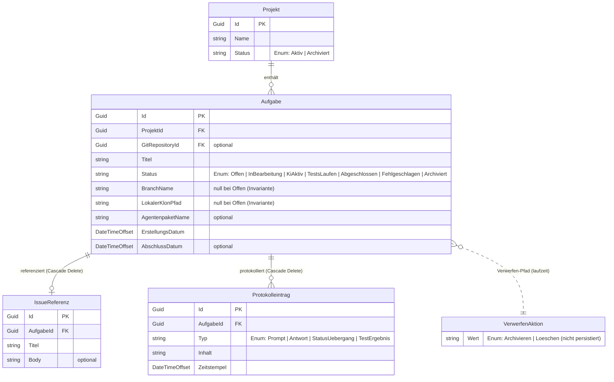
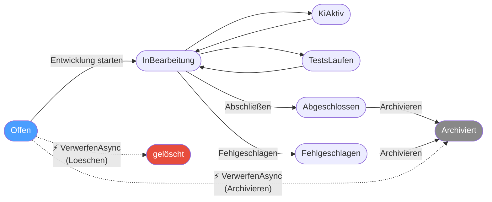

# Entity-Relationship-Modell – Offene Aufgabe verwerfen (`Offen → Archiviert / gelöscht`)

> **Dokument-Typ:** Entity-Relationship-Model  
> **Status:** 📋 Entwurf  
> **Version:** 1.0.0  
> **Datum:** 2026-05-23  
> **Betroffene Komponenten:** `Aufgabe`, `AufgabeStatus`, `VerwerfenAktion`

---

## 1. Referenzen

| Typ | Pfad |
|-----|------|
| Requirements | [`../requirements/aufgabe-offen-verwerfen-requirements-analysis.md`](../requirements/aufgabe-offen-verwerfen-requirements-analysis.md) |
| Architektur-Blueprint | [`./aufgabe-offen-verwerfen-architecture-blueprint.md`](./aufgabe-offen-verwerfen-architecture-blueprint.md) |
| Basis-ERM | [`./entity-relationship-model.md`](./entity-relationship-model.md) |
| Basis-Blueprint | [`./architecture-blueprint.md`](./architecture-blueprint.md) |
| Verwandtes ERM | [`./aufgabe-detail-project-selected-git-plugin-entity-relationship-model.md`](./aufgabe-detail-project-selected-git-plugin-entity-relationship-model.md) |
| Domain-Enum | `src/Softwareschmiede/Domain/Enums/AufgabeStatus.cs` |
| Service | `src/Softwareschmiede/Application/Services/AufgabeService.cs` |

---

## 2. Persistenzrelevanz

**Ergebnis: Das persistente Datenmodell bleibt unverändert. Es sind keine neuen Tabellen, Spalten, Enum-Werte oder Datenbankmigrationen erforderlich.**

Begründung (vgl. Architektur-Blueprint Abschnitt 9 und NFR-1 der Anforderungsanalyse):

| # | Begründung | Beleg |
|---|-----------|-------|
| 1 | `AufgabeStatus.Archiviert` existiert bereits und ist als Endzustand für verworfene `Offen`-Aufgaben fachlich ausreichend. | `AufgabeStatus.cs` |
| 2 | Ein separater Status `Verworfen` ist explizit Out-of-Scope; archivierte verworfene Aufgaben sind fachlich gleichwertig mit archivierten abgeschlossenen Aufgaben. | Requirements, Abschnitt 6 |
| 3 | Das neue Enum `VerwerfenAktion` (Archivieren \| Loeschen) ist ein reines In-Memory-Value-Object; es wird nicht persistiert. | Blueprint, Abschnitt 6.1 |
| 4 | `AufgabeService.DeleteAsync` löscht physisch und löst EF-Core-Cascade-Delete aus; keine Waisendaten entstehen. | Blueprint, Abschnitt 9 |
| 5 | Kein Audit-Feld (`VerworfenAm`, `VerwerfenGrund`) ist gefordert; strukturiertes Logging übernimmt die Nachvollziehbarkeit. | NFR-5 / Out-of-Scope |

---

## 3. Konzeptionelles ERM-Diagramm

Das Diagramm zeigt die betroffenen persistierten Entitäten sowie den neuen Verwerfen-Pfad als gestrichelte Zustandsübergänge. Nicht persistierte Laufzeit-Artefakte (`VerwerfenAktion`) werden zur Vollständigkeit ebenfalls dargestellt.

> **Legende:** Durchgezogene Linien = persistierte FK-Beziehungen. Gestrichelte Linie = Laufzeit-Assoziation ohne Datenbankbezug.

---

## 4. Erweiterter Aufgaben-Statusgraph

Der folgende Graph zeigt den Gesamtlebenszyklus einer `Aufgabe` einschließlich der **neu hinzukommenden Verwerfen-Pfade** (gestrichelt):

**Änderungen gegenüber dem bestehenden Statusgraph:**

| Übergang | Auslöser | Neu? |
|----------|---------|------|
| `Offen → Archiviert` | `VerwerfenAsync(id, Archivieren)` | ✅ **neu** (Kurzschluss-Pfad) |
| `Offen → gelöscht` | `VerwerfenAsync(id, Loeschen)` → `DeleteAsync` | ✅ **neu** (Kurzschluss-Pfad) |
| alle anderen Übergänge | unverändert | ❌ keine Änderung |

---

## 5. Tabellarische Entitätenübersicht

### 5.1 Direkt betroffene Entitäten

| Entität | Primärschlüssel | Relevante Attribute | Rolle im Feature | Schemaänderung |
|---------|----------------|--------------------|-----------------|----|
| `Aufgabe` | `Id` (Guid) | `Status` (AufgabeStatus), `ProjektId`, `BranchName?`, `LokalerKlonPfad?` | Zielobjekt der Verwerfen-Aktion; `Status` wechselt auf `Archiviert` oder Datensatz wird gelöscht | **Keine** |

### 5.2 Mittelbar betroffene Entitäten (Cascade Delete)

| Entität | Fremdschlüssel | Verhalten bei `VerwerfenAsync(Loeschen)` | Schemaänderung |
|---------|---------------|----------------------------------------|----------------|
| `IssueReferenz` | `AufgabeId → Aufgabe.Id` | Wird kaskadierend gelöscht (EF Core Cascade) | **Keine** |
| `Protokolleintrag` | `AufgabeId → Aufgabe.Id` | Wird kaskadierend gelöscht (EF Core Cascade) | **Keine** |
| `TestErgebnis` | `ProtokollEintragId → Protokolleintrag.Id` | Wird kaskadierend gelöscht (transitiv über Protokolleintrag) | **Keine** |

> **Hinweis:** Bei `VerwerfenAsync(Archivieren)` bleibt die Aufgabe erhalten; Cascade-Delete tritt **nicht** ein. `IssueReferenz` und `Protokolleintraege` bleiben vollständig erhalten.

### 5.3 Nicht-persistierte Laufzeit-Artefakte

| Artefakt | Typ | Persistiert | Beschreibung |
|----------|-----|-------------|--------------|
| `VerwerfenAktion` | C#-Enum | ❌ Nein | Steuert in `VerwerfenAsync`, ob archiviert oder gelöscht wird. Kein Datenbankfeld, kein EF-Core-Mapping. |

---

## 6. Beziehungsübersicht – Auswirkungsanalyse

| # | Beziehung | Kardinalität | Verhalten bei Verwerfen-Archivieren | Verhalten bei Verwerfen-Löschen |
|---|-----------|-------------|-------------------------------------|----------------------------------|
| 1 | `Projekt → Aufgabe` | 1 : 0..N | Aufgabe bleibt im Projekt (Status = `Archiviert`) | Aufgabe wird aus Projekt entfernt (physisches Delete) |
| 2 | `Aufgabe → IssueReferenz` | 1 : 0..1 | IssueReferenz bleibt erhalten | IssueReferenz wird kaskadierend gelöscht |
| 3 | `Aufgabe → Protokolleintrag` | 1 : 0..N | Protokolleinträge bleiben erhalten | Protokolleinträge werden kaskadierend gelöscht |
| 4 | `Protokolleintrag → TestErgebnis` | 1 : 0..N | TestErgebnisse bleiben erhalten | TestErgebnisse werden transitiv kaskadierend gelöscht |

> **Invariante:** Eine `Offen`-Aufgabe besitzt per Definition **keine** `Protokolleintraege` (Logging beginnt erst nach `InBearbeitung`) und typischerweise keine `IssueReferenz` (kann aber vorhanden sein, wenn die Aufgabe aus einem Issue angelegt wurde). Cascade-Delete ist daher im Normalfall eine No-op-Operation, funktioniert aber korrekt auch wenn eine IssueReferenz existiert.

---

## 7. Schema- und Migrationsprüfung

| Prüfpunkt | Ergebnis | Begründung |
|-----------|---------|-----------|
| Neue Tabelle(n) | ❌ Nicht erforderlich | Kein neues fachliches Konzept, das Persistenz benötigt |
| Neue Spalte(n) in `Aufgabe` | ❌ Nicht erforderlich | Kein `VerworfenAm`-Timestamp, kein `VerwerfenGrund`-Feld gefordert |
| Neuer `AufgabeStatus`-Wert (`Verworfen`) | ❌ Nicht erforderlich | Out-of-Scope; `Archiviert` ist fachlich ausreichend |
| Neues persistiertes Enum (`VerwerfenAktion`) | ❌ Nicht erforderlich | Reines In-Memory-Value-Object |
| Neue FK-Beziehung | ❌ Nicht erforderlich | Keine neue Entität eingeführt |
| Neue Datenbankindizes | ❌ Nicht erforderlich | Bestehende Indizes auf `Aufgabe.Status` und `Aufgabe.ProjektId` sind ausreichend |
| EF-Core-Migration | ❌ Nicht erforderlich | Kein Schema-Delta vorhanden |
| Rollback auf DB-Ebene | ❌ Entfällt | Da keine Migration erzeugt wird |

**Fazit:** Das bestehende ERM (Version 1.1, `entity-relationship-model.md`) bleibt in seiner Gesamtheit gültig. Dieses Dokument ergänzt es um die Abbildung des neuen Verwerfen-Pfads als logischen Statusübergang.

---

## 8. Modellierungsentscheidungen und Begründungen

### 8.1 `Archiviert` als Zielstatus für verworfene `Offen`-Aufgaben

**Entscheidung:** Der bestehende Status `AufgabeStatus.Archiviert` wird als Endzustand für die Verwerfen-Archivieren-Variante genutzt; kein neuer Enum-Wert `Verworfen` wird eingeführt.

**Begründung:**
- Fachlich sind „verworfene" und „abgeschlossene und dann archivierte" Aufgaben im Endzustand gleichwertig: beide sind nicht mehr aktiv und aus der aktiven Projektarbeit herausgenommen.
- Ein eigener `Verworfen`-Status würde eine neue DB-Migration und Anpassungen in allen Status-Guards, Filterabfragen und UI-Bedingungen erfordern – ein unverhältnismäßiger Aufwand für die erzielte Differenzierung.
- Die Nachvollziehbarkeit, dass eine Aufgabe *nie gestartet* wurde, ergibt sich implizit aus dem fehlenden `AbschlussDatum` und den fehlenden `Protokolleinträgen`. Das strukturierte Logging in `VerwerfenAsync` ergänzt dies auf Betriebsebene.

### 8.2 `VerwerfenAktion` als nicht-persistiertes Enum

**Entscheidung:** `VerwerfenAktion` (Archivieren \| Loeschen) wird ausschließlich als C#-Enum im Domain-Layer definiert und nicht in der Datenbank abgebildet.

**Begründung:**
- Die Aktion steuert nur den Ausführungspfad innerhalb von `VerwerfenAsync`; sie ist kein dauerhafter Zustand der Aufgabe.
- Eine Persistierung der gewählten Aktion (z. B. als zusätzliches Feld `VerwerfenAktionGewaehlt`) würde nur dann Sinn ergeben, wenn ein Audit-Log gefordert wäre – was explizit Out-of-Scope ist.

### 8.3 Kein `VerworfenAm`-Timestamp

**Entscheidung:** Es wird kein neues Zeitstempel-Feld für den Verwerfen-Zeitpunkt eingeführt.

**Begründung:**
- Die Anforderungsanalyse fordert kein Audit-Log auf DB-Ebene (Out-of-Scope, Abschnitt 6).
- Das bestehende `ErstellungsDatum` dokumentiert den Lebensbeginn; für eine verworfene Aufgabe ist kein Ende-Zeitstempel fachlich gefordert.
- Strukturiertes Logging (`Information`-Level in `VerwerfenAsync`) bietet ausreichend Nachvollziehbarkeit auf Betriebsebene.

### 8.4 Cascade-Delete als ausreichender Mechanismus

**Entscheidung:** Die physische Lösch-Variante nutzt die bestehende EF-Core-Cascade-Delete-Konfiguration; kein eigener Aufräum-Code für abhängige Entitäten.

**Begründung:**
- Eine `Offen`-Aufgabe hat per Invariante `BranchName == null` und `LokalerKlonPfad == null`; es existieren keine externen Ressourcen (kein Git-Branch, kein lokaler Klon), die separat bereinigt werden müssten.
- EF Core löscht `IssueReferenz` und `Protokolleintraege` kaskadierend; `TestErgebnisse` werden transitiv über `Protokolleintrag` gelöscht. Die bestehende Konfiguration ist vollständig.

---

## 9. Risiken und Grenzfälle (Datenmodell-Perspektive)

| # | Risiko / Grenzfall | Eintrittswahrscheinlichkeit | Auswirkung | Maßnahme |
|---|-------------------|---------------------------|------------|---------|
| **R-1** | **Race Condition:** Aufgabe wird zwischen Seitenöffnung und Bestätigung von einem parallelen Aufruf auf `InBearbeitung` gesetzt. | Sehr gering (Einzelnutzer-App; kein paralleler Zugriff im Normalfall) | Mittel: Verwerfen würde einen ungültigen Zustand erzeugen | Guard in `VerwerfenAsync`: `if (aufgabe.Status is not AufgabeStatus.Offen) throw InvalidOperationException`; kein DB-Commit ohne bestandene Prüfung. |
| **R-2** | **Orphaned IssueReferenz bei Archivieren-Variante:** Eine Aufgabe mit `IssueReferenz` wird archiviert; die IssueReferenz bleibt erhalten und referenziert eine archivierte Aufgabe. | Möglich (wenn Aufgabe aus Issue angelegt wurde) | Gering: fachlich korrekt; archivierte Aufgaben können mit ihrer IssueReferenz eingesehen werden | Kein Handlungsbedarf; bestehende Archivieren-Logik verhält sich identisch. |
| **R-3** | **Zukünftige Einführung eines `Verworfen`-Status:** Ein späteres Feature könnte doch einen dedizierten Status fordern, was eine Migration und Anpassungen aller betroffenen Guards erfordert. | Gering (explizit Out-of-Scope) | Hoch: Migrationsaufwand, alle Status-bezogenen Abfragen und Guards müssen erweitert werden | Design-Entscheidung dokumentiert (8.1); bei Bedarf als eigenes Feature behandeln. |
| **R-4** | **`DeleteAsync` ohne eigenen Status-Guard:** `AufgabeService.DeleteAsync` enthält keinen Status-Guard und könnte theoretisch von anderen Callern auf Nicht-`Offen`-Aufgaben angewendet werden. | Gering (bestehende UI schützt via Sichtbarkeitsbedingung) | Mittel: unerwarteter Datenverlust möglich | `VerwerfenAsync` kapselt den Guard vor dem Aufruf von `DeleteAsync`; die Invariante ist damit auf Service-Ebene sichergestellt. Kein DB-seitiger Schutz nötig. |
| **R-5** | **`Offen`-Aufgabe mit unerwartet gesetztem `BranchName` / `LokalerKlonPfad`:** Invariante verletzt durch Direktmanipulation oder Migrationsfehler. | Sehr gering | Gering: `VerwerfenAsync` führt kein Aufräumen dieser Felder durch; Feld-Leichen bleiben in der Aufgabe (Archivieren) oder verschwinden mit dem Delete. | Beim Archivieren: keine kritische Auswirkung, da Felder nach `Archiviert` ignoriert werden. Beim Löschen: Felder werden mitgelöscht. Optional: Assertions im Service-Code beim Onboarding von `VerwerfenAsync`. |

---

## 10. Konsistenzprüfung mit dem Architektur-Blueprint

| Aussage im Blueprint | ERM-Abbildung | Konformität |
|---------------------|---------------|-------------|
| „Keine Änderung – kein Schema-Change, keine Migration" (Abschnitt 3.1) | Keine neuen Entitäten, Felder oder Relationen im ERM | ✅ Konform |
| „`AufgabeStatus.Archiviert` existiert bereits" (Abschnitt 9) | `Archiviert` im `AufgabeStatus`-Enum; im ERM als bestehender Zustand abgebildet | ✅ Konform |
| „`VerwerfenAktion`-Enum ohne Persistenzbedarf" (Abschnitt 9) | Als Laufzeit-Artefakt im ERM markiert; kein DB-Mapping | ✅ Konform |
| „`DeleteAsync` erzeugt keine Waisendaten" (Abschnitt 9) | Cascade-Delete-Kette in Beziehungsübersicht dokumentiert | ✅ Konform |
| „Kein Audit-Protokolleintrag" (Abschnitt 4, Out-of-Scope) | Kein `Protokolleintrag`-Eintrag für Verwerfen im ERM vorgesehen | ✅ Konform |
| „Guard reicht; kein Concurrency-Token" (Abschnitt 4) | ERM sieht kein zusätzliches `RowVersion`-/`ConcurrencyToken`-Feld vor | ✅ Konform |
| `Offen`-Aufgabe: `BranchName == null`, `LokalerKlonPfad == null` (Invariante) | Im ERM als Attribut-Constraint dokumentiert (`null bei Offen`) | ✅ Konform |
| Statusübergang `Offen → Archiviert` nur via `VerwerfenAsync` | Im Statusgraph (Abschnitt 4) als neuer Kurzschluss-Pfad dargestellt | ✅ Konform |

---

## 11. Abgrenzung zu anderen ERM-Dokumenten

| Dokument | Beziehung |
|----------|-----------|
| [`entity-relationship-model.md`](./entity-relationship-model.md) | **Basis-ERM** – bleibt unverändert gültig (Version 1.1). Das vorliegende Dokument ist eine Feature-spezifische Ergänzung und ändert das Basis-ERM nicht. |
| [`aufgabe-detail-project-selected-git-plugin-entity-relationship-model.md`](./aufgabe-detail-project-selected-git-plugin-entity-relationship-model.md) | Referenziert dieselbe `Aufgabe`-Entität; keine Überschneidung der Zuständigkeiten. |
| [`kompilierfehler-entity-relationship-model.md`](./kompilierfehler-entity-relationship-model.md) | Analoges Muster: Feature ohne Persistenzänderung; logisches Laufzeitmodell dokumentiert. |

---

## 12. Versionierung

| Version | Datum | Autor | Änderung |
|---------|-------|-------|---------|
| 1.0.0 | 2026-05-23 | planning-entity-relationship-modeler | Erstfassung: Analyse, Diagramme, Entitätenübersicht, Migrationsmatrix, Risiken, Konsistenzcheck |
