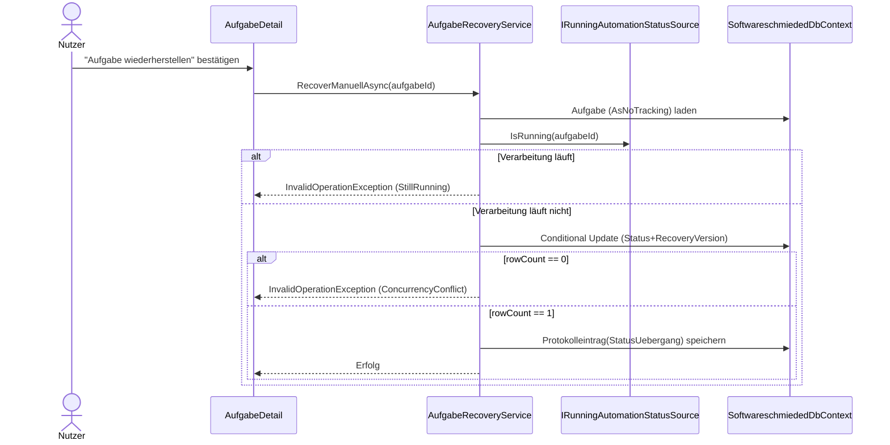

# Architektur-Blueprint – Manuelle Aufgaben-Recovery in AufgabeDetail

> **Dokument-Typ:** Architektur-Blueprint  
> **Status:** ✅ Umgesetzt  
> **Betroffene Komponente:** `AufgabeDetail`, `AufgabeRecoveryService`, `SoftwareschmiededDbContext`

## 1. Referenzen

- Requirements: [../requirements/aufgabe-recovery-wiederherstellung-requirements-analysis.md](../requirements/aufgabe-recovery-wiederherstellung-requirements-analysis.md)  
- Architecture Review: [../improvements/aufgabe-recovery-wiederherstellung-architecture-review.md](../improvements/aufgabe-recovery-wiederherstellung-architecture-review.md)  
- Technical Contract: [../api/aufgabe-recovery.md](../api/aufgabe-recovery.md)  
- Flow: [../flows/aufgabe-recovery-flow.md](../flows/aufgabe-recovery-flow.md)

## 2. Problembild und Ziel

Aufgaben können nach Störungen in `KiAktiv` oder `TestsLaufen` verbleiben, obwohl keine aktive Automatisierung mehr läuft.  
Ziel ist eine **explizit manuelle** Wiederherstellung auf `InBearbeitung` mit klaren Guards, Auditierbarkeit und Schutz gegen konkurrierende Statusänderungen.

## 3. Systemarchitektur und betroffene Schichten/Module

### 3.1 Schichten

- **Presentation:** `AufgabeDetail.razor` + `.razor.cs` (Sichtbarkeit, Disable-Gründe, Bestätigungsdialog)
- **Application:** `AufgabeRecoveryService` (Eligibility, Statusupdate, Audit, Konfliktbehandlung)
- **Domain:** `Aufgabe` (`RecoveryVersion`, Statusinvarianten), `IRunningAutomationStatusSource`
- **Infrastructure:** EF Core `SoftwareschmiededDbContext`, Migration `AddTaskRecoveryIndicators`

### 3.2 Betroffene Module

- `src/Softwareschmiede/Components/Pages/Aufgaben/AufgabeDetail.razor`
- `src/Softwareschmiede/Components/Pages/Aufgaben/AufgabeDetail.razor.cs`
- `src/Softwareschmiede/Application/Services/AufgabeRecoveryService.cs`
- `src/Softwareschmiede/Domain/Entities/Aufgabe.cs`
- `src/Softwareschmiede/Domain/Interfaces/IRunningAutomationStatusSource.cs`
- `src/Softwareschmiede/Infrastructure/Data/SoftwareschmiededDbContext.cs`
- `src/Softwareschmiede/Migrations/20260523052722_202605230001_AddTaskRecoveryIndicators.cs`

## 4. Technologieentscheidungen

| Entscheidung | Beschreibung | Begründung |
|---|---|---|
| Recovery nur manuell | Keine Auto-Heuristik, Aktion nur über UI in AufgabeDetail | Vermeidet unerwartete Statuswechsel |
| Guard über Laufstatusquelle | `IRunningAutomationStatusSource.IsRunning(aufgabeId)` ist harte Zulassungsbedingung | Kein „Recover“, solange echte Verarbeitung läuft |
| Optimistic Concurrency | `RecoveryVersion` als Concurrency-Token + Status-/Version-Filter im Update | Genau-ein-Erfolg unter Parallelität |
| Transaktionale Persistenz (relational) | Statuswechsel und Audit werden gemeinsam committed | Keine inkonsistente Teilpersistenz |
| Strukturierte Audit-Logs | `TaskRecovery*`-Events mit CorrelationId + Protokolleintrag | Support- und Forensikfähigkeit |

### 4.1 Zielablauf

## 5. Datenmodell und Persistenz

Die Entität `Aufgabe` wurde für Recovery ergänzt:

- `AktiveRunId` (`string?`)
- `LastHeartbeatUtc` (`DateTimeOffset?`)
- `RecoveryVersion` (`int`, Default `0`, Concurrency-Token)

**Recovery-Statusregel:** `IstRecoveryStatus = KiAktiv | TestsLaufen`  
**Erfolgszustand:** `InBearbeitung`

## 6. UI/UX-Auswirkungen

- Aktion **„🩹 Aufgabe wiederherstellen“** erscheint nur für Recovery-Status.
- Aktion ist deaktiviert, wenn:
  - `_processing == true`
  - oder Laufstatus „running“ ist
  - oder Laufstatusprüfung fehlschlägt.
- Bei deaktivierter Aktion wird ein konkreter Grund angezeigt.
- Vor Ausführung ist ein Bestätigungsdialog erforderlich.

## 7. Fehler- und Grenzfälle

| Fall | Verhalten |
|---|---|
| Aufgabe nicht gefunden | `InvalidOperationException("Aufgabe wurde nicht gefunden.")` |
| Nicht recoverbarer Status | `InvalidOperationException("Wiederherstellung für aktuellen Status nicht verfügbar.")` |
| Verarbeitung läuft noch | `InvalidOperationException("Wiederherstellung nicht möglich, Verarbeitung läuft noch.")` |
| Laufstatus nicht prüfbar | `InvalidOperationException("Prüfung der Laufzeit war nicht möglich.")` |
| Parallelkonflikt | `InvalidOperationException("Status wurde bereits geändert. Ansicht wurde aktualisiert.")` |

## 8. Operative Hinweise

- Logs nach `TaskRecoveryRequested`, `TaskRecoveryEligibilityChecked`, `TaskRecoveryRejected`, `TaskRecoveryConcurrencyConflict`, `TaskRecoverySucceeded` filtern.
- `CorrelationId` verbindet Laufzeit-Logs und Audit-Eintrag.
- Der Audit-Eintrag enthält:
  - „Manuelle Wiederherstellung: <From> → InBearbeitung“
  - `ReasonCode: RecoveryManual`
  - `CorrelationId: <...>`

## 9. Teststrategie (implementiert)

- **Unit:** `src/Softwareschmiede.Tests/Application/Services/AufgabeRecoveryServiceTests.cs`
- **Integration:** `src/Softwareschmiede.IntegrationTests/Services/AufgabeRecoveryServiceTests.cs`
- **UI-Markup/Bindings:** `src/Softwareschmiede.Tests/Components/Pages/Aufgaben/AufgabeDetailRecoveryTests.cs`

