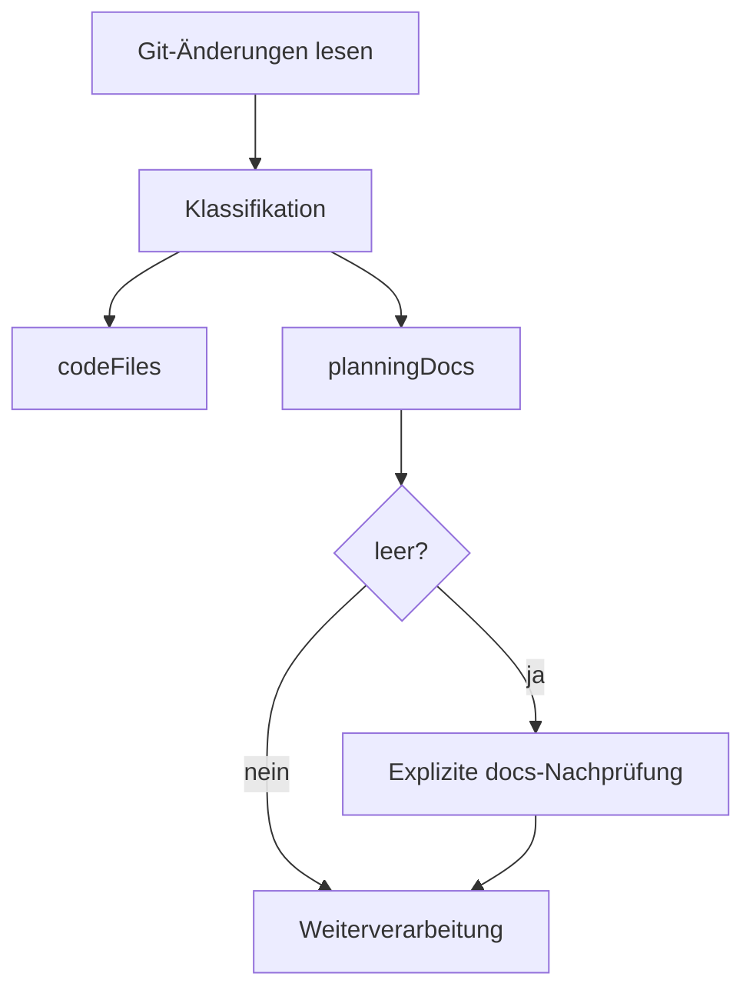

# Architecture Blueprint – Changed Artifact Detection

## Zielbild
Die Ermittlung geänderter Artefakte erfolgt zweistufig:
1. **Änderungsermittlung** aus Git (`git status --porcelain` oder `git diff --name-only`).
2. **Klassifikation** in:
   - `codeFiles`
   - `planningDocs` (`docs/requirements/**/*.md`, `docs/architecture/**/*.md`, `docs/improvements/**/*.md`)

## Komponenten
- **GitWorkspaceBrowserService:** Liest geänderte Dateien aus Git und klassifiziert in `CodeFiles` und `PlanningDocuments`.
- **WorkspaceSnapshot:** Transportiert `FlatFiles`, `CodeFiles` und `PlanningDocuments` getrennt.
- **Reporting-Ebene:** Getrennte Ausweisung beider Artefaktklassen.

## Ablauf

## Qualitätsziele
- **Vollständigkeit:** Keine blinden Flecken bei Planungsdokumenten.
- **Nachvollziehbarkeit:** Trennung von Code- und Planungsänderungen in Berichten.
- **Robustheit:** Fallback-Prüfung verhindert False-Negatives bei Dokumenten.

## Abhängigkeiten
- Git-Statusinformationen im Arbeitsverzeichnis.
- Konsistente Dokumentstruktur unter `docs/requirements`, `docs/architecture`, `docs/improvements`.
