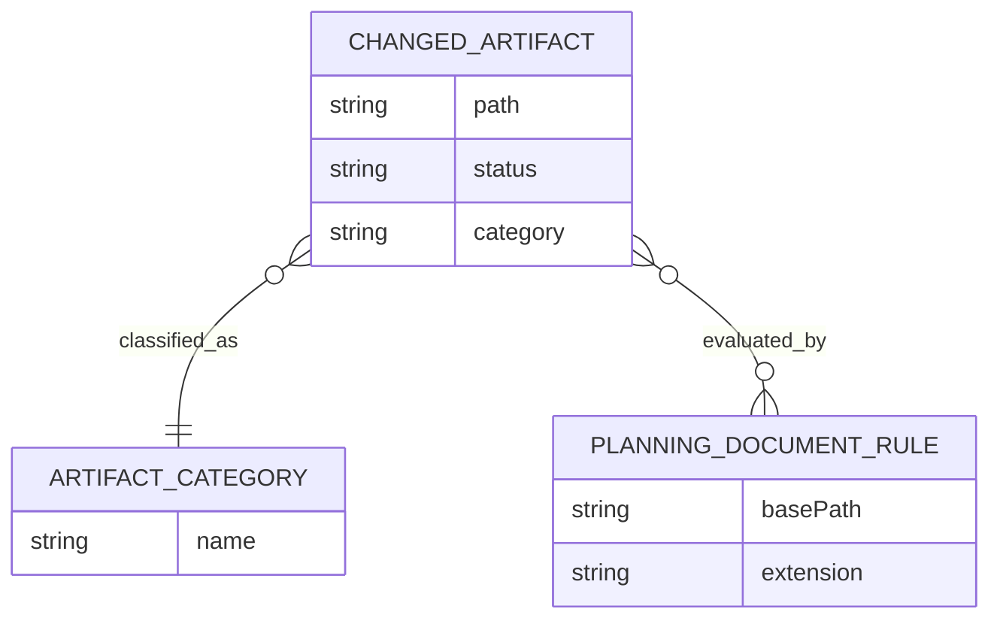

# ERM – Changed Artifact Detection

## Entitäten

| Entität | Attribute | Beschreibung |
|---|---|---|
| `ChangedArtifact` | `path`, `status`, `category` | Repräsentiert eine geänderte Datei aus Git. |
| `ArtifactCategory` | `codeFiles`, `planningDocs` | Klassifiziert Artefakte in technische und planerische Änderungen. |
| `PlanningDocumentRule` | `basePath`, `extension` | Regelwerk zur Erkennung relevanter Planungsdokumente. |

## Beziehungen

| Von | Beziehung | Nach | Kardinalität |
|---|---|---|---|
| `ChangedArtifact` | wird klassifiziert durch | `ArtifactCategory` | N:1 |
| `ChangedArtifact` | wird geprüft gegen | `PlanningDocumentRule` | N:M |

## Mermaid-Diagramm

## Konsistenzhinweis
Die Planungsregeln sind auf die in der Anforderungen definierten Pfade abgestimmt:
- `docs/requirements/**/*.md`
- `docs/architecture/**/*.md`
- `docs/improvements/**/*.md`
