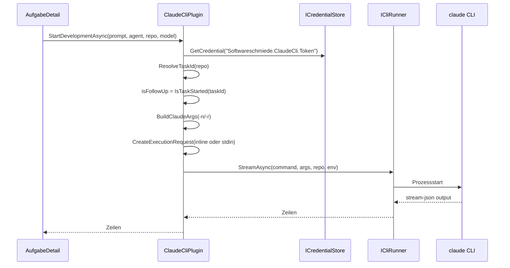

# Architektur-Blueprint – Claude-CLI-Integration (Aufruf-Fix & Session-Wiederverwendung)

## Kontext
Dieses Blueprint beschreibt die technische Umsetzung der Claude-CLI-Integration auf Basis des aktuellen Implementierungsstands in `ClaudeCliPlugin`.

## Komponenten
- **ClaudeCliPlugin** (`plugins/Softwareschmiede.Plugin.ClaudeCli/ClaudeCliPlugin.cs`)
  - Session-Logik (`_repoTaskIds`, `_startedTaskIds`)
  - CLI-Aufrufaufbau (`CreateExecutionRequest`, `BuildClaudeArgs`)
  - Fallback bei `session not found`
- **ICredentialStore**
  - Liefert `Softwareschmiede.ClaudeCli.Token`
- **ICliRunner**
  - Führt CLI-Aufrufe aus und streamt Ausgabe
- **PluginSettingsService / Einstellungen**
  - Persistiert Secret-Wert für Claude

## Kernablauf

## Designentscheidungen
- **Session-Wiederverwendung:** Pro Repository wird eine `taskId` gehalten; vorhandene `*.claude.context.md`-Datei wird bevorzugt.
- **Resilienz:** Folgeaufruf-Fehler `session not found` führt zu automatischem Erstlauf-Fallback mit derselben `taskId`.
- **Aufruf-Fix:** Große Prompts werden nicht inline übergeben, sondern via stdin-Pipe.
- **Sicherheit:** Prompt wird in Task-Datei geschrieben; Debug-Logging redigiert Inline-Prompt.

## Schnittstellenverhalten (relevant)
- Erstlauf: `-p -n <taskId>`
- Follow-up: `-r <taskId> -p`
- Gemeinsame Flags: `--dangerously-skip-permissions --output-format stream-json --model <model>`
- Model-Normalisierung: `null`/`auto` -> `sonnet`

## Risiken & Gegenmaßnahmen
- **Session-Verlust:** Fallback-Logik implementiert und getestet.
- **Sehr lange Prompts:** stdin-Pipe statt Argumentliste verhindert Aufrufprobleme.
- **Fehlendes Token:** Lauf bleibt technisch möglich, aber ohne gesetztes `ANTHROPIC_API_KEY`.

## Verknüpfte Artefakte
- [Requirements Analysis](../requirements/claude-cli-integration-requirements-analysis.md)
- [Entity-Relationship-Model](./claude-cli-integration-entity-relationship-model.md)
- [Architecture-Review](../improvements/claude-cli-integration-architecture-review.md)
- [Flow: Claude-CLI Session Reuse](../flows/claude-cli-session-reuse-flow.md)
- [Testplan](../tests/testplan-claude-cli-integration.md)
- [Lifecycle Report](../lifecycle-report-claude-cli-integration.md)
