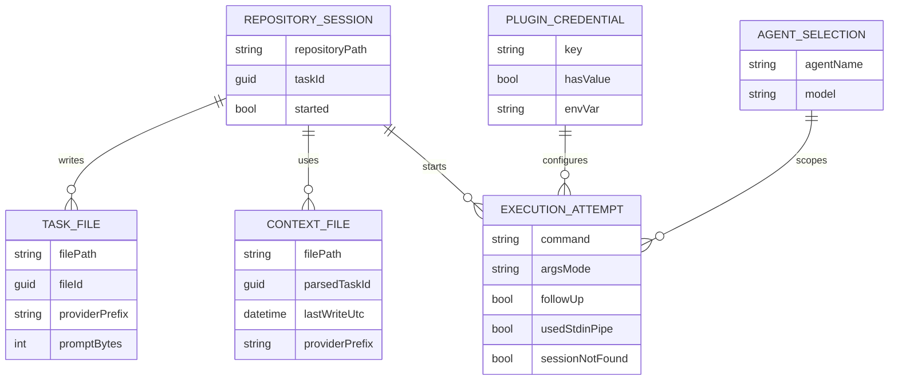

# Entity-Relationship-Model – Claude-CLI-Integration

## Zweck
Dieses ERM beschreibt die fachlich-technischen Laufzeitobjekte rund um Claude-Session-Wiederverwendung und Aufruf-Fix.

## Entitäten
- **REPOSITORY_SESSION:** In-Memory Session-Status pro Repository (`_repoTaskIds`, `_startedTaskIds`).
- **CONTEXT_FILE:** Provider-spezifische Datei `*.claude.context.md`, aus der eine `taskId` gelesen werden kann.
- **TASK_FILE:** Pro Prompt erzeugte Datei `*.claude-task.md`.
- **PLUGIN_CREDENTIAL:** Credential-Key `Softwareschmiede.ClaudeCli.Token` für `ANTHROPIC_API_KEY`.
- **AGENT_SELECTION:** Agent-/Modellparameter für den Lauf.
- **EXECUTION_ATTEMPT:** Einzelner CLI-Aufruf inkl. Fallback-/Pipe-Information.

## Verknüpfte Artefakte
- [Requirements Analysis](../requirements/claude-cli-integration-requirements-analysis.md)
- [Architektur-Blueprint](./claude-cli-integration-architecture-blueprint.md)
- [Architecture-Review](../improvements/claude-cli-integration-architecture-review.md)
- [Testplan](../tests/testplan-claude-cli-integration.md)
