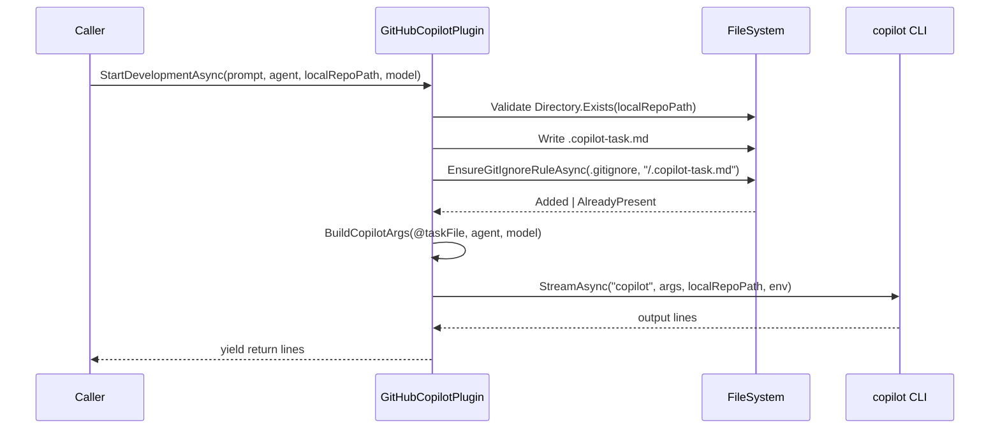

# Architecture Blueprint: `.copilot-task.md`-Verarbeitung im GitHubCopilotPlugin

## 1. Zielbild
- Prompt-Inhalt wird dateibasiert an das `copilot`-CLI übergeben.
- `.gitignore` wird idempotent um `/.copilot-task.md` ergänzt.
- Fehler im Dateisystem stoppen den Prozess vor dem CLI-Aufruf (Fail-Fast).

## 2. Implementierte Komponenten
1. **`StartDevelopmentAsync` (Orchestrierung)**
   - Schreibt Prompt nach `{localRepoPath}\.copilot-task.md`
   - Synchronisiert `.gitignore`
   - Startet `copilot`-CLI als Stream
2. **`BuildCopilotArgs`**
   - Baut CLI-Argumente inkl. `--prompt @<file>`, Agent und Modell
3. **`EnsureGitIgnoreRuleAsync`**
   - Read-modify-write auf `.gitignore`
   - Idempotenzprüfung über Normalisierung
   - Retry bei transienten `IOException`
4. **`IsEquivalentGitIgnoreRule` / `NormalizeGitIgnoreRule`**
   - Vergleich logischer Äquivalenz (`.copilot-task.md` vs `/.copilot-task.md`)
   - Kommentarzeilen werden ignoriert

## 3. Ablaufdiagramm (Ist-Stand)

## 4. Wichtige Designentscheidungen
- **Dateibasierter Prompt** statt Inline-Argument: robust bei langen/multiline Prompts.
- **Idempotente Ignore-Regel**: schützt vor versehentlichen Commits ohne `.gitignore` aufzublähen.
- **Retry bei File-Lock**: erhöht Robustheit auf Windows-Dateisystemen.
- **`Utf8NoBom`** für konsistente `.gitignore`-Ausgabe.

## 5. Qualitätsziele und Erfüllung
| Ziel | Maßnahme | Status |
|------|----------|--------|
| Zuverlässigkeit | Fail-Fast bei ungültigem Repo-Pfad und Schreibfehlern | ✅ |
| Konsistenz | Normalisierte Regelprüfung + Single-Append | ✅ |
| Wartbarkeit | Isolierte Hilfsmethoden für Args/Ignore/Normalisierung | ✅ |
| Testbarkeit | Unit-Tests für Erfolgs- und Fehlerpfade | ✅ |

## 6. Risiken
| Risiko | Bewertung | Umgang |
|-------|-----------|--------|
| Gleichzeitige externe Änderungen an `.gitignore` während Schreibphase | Niedrig bis mittel | Retry-Mechanismus vorhanden; keine transaktionale Datei-Lock-Koordination über Prozessgrenzen |
| Nicht vorhandenes `copilot`-CLI | Mittel | Fehler propagiert aus `_cliRunner.StreamAsync`; Health-Check verfügbar |

## 7. Traceability
- Anforderungen: `../requirements/copilot-task-binding-requirements-analysis.md`
- Datenmodell: `./copilot-task-binding-entity-relationship-model.md`
- Review: `../improvements/copilot-task-binding-architecture-review.md`

