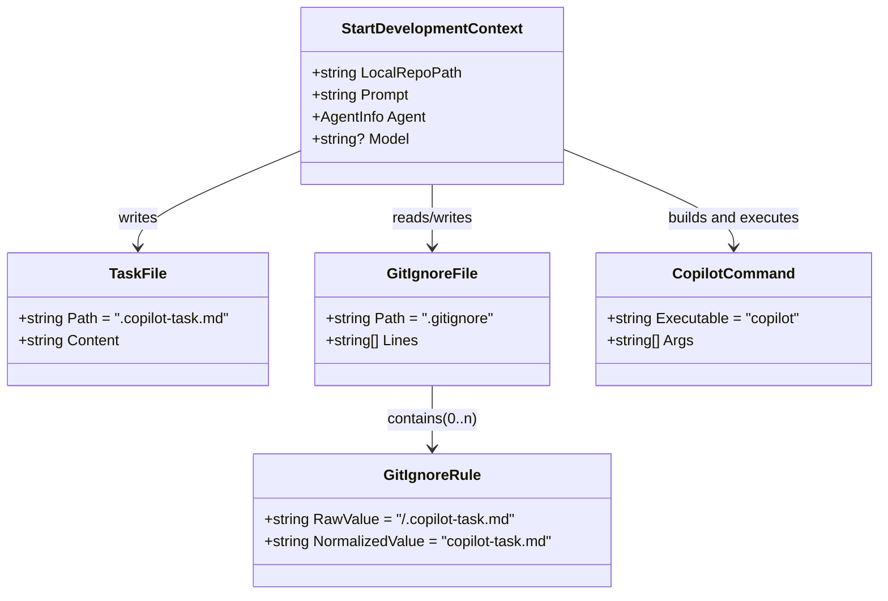
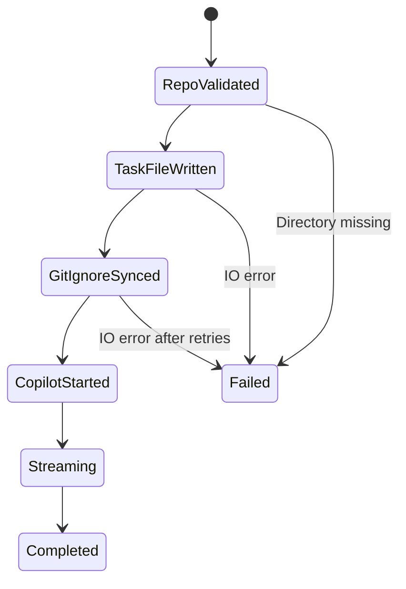

# Daten- und Zustandsmodell: `.copilot-task.md` / `.gitignore`-Synchronisation

## 1. Modellfokus
Für dieses Feature werden keine neuen persistenten DB-Entitäten eingeführt.  
Das Modell beschreibt daher die **Dateiobjekte und Laufzeitzustände** der Implementierung.

## 2. Laufzeitmodell (Mermaid)

## 3. Zustandsübergänge

## 4. Normalisierungsmodell für Regeln
Die Regeläquivalenz basiert auf:
1. `Trim()`
2. `\` → `/`
3. führende `/` entfernen
4. führende `.` entfernen
5. erneute Entfernung führender `/`

Damit werden `/.copilot-task.md` und `.copilot-task.md` als gleichwertig behandelt.

## 5. Mapping zur Implementierung
| Modellbaustein | Code |
|---------------|------|
| `TaskFile` | `StartDevelopmentAsync` (`File.WriteAllTextAsync`) |
| `GitIgnoreFile` + `GitIgnoreRule` | `EnsureGitIgnoreRuleAsync`, `IsEquivalentGitIgnoreRule`, `NormalizeGitIgnoreRule` |
| `CopilotCommand` | `BuildCopilotArgs` + `_cliRunner.StreamAsync("copilot", ...)` |

## 6. Traceability
- Anforderungen: `../requirements/copilot-task-binding-requirements-analysis.md`
- Architektur: `./copilot-task-binding-architecture-blueprint.md`
- Review: `../improvements/copilot-task-binding-architecture-review.md`

