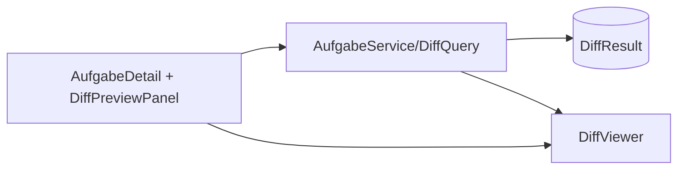
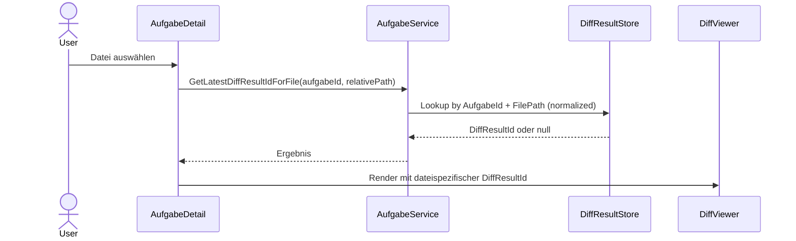

# Architektur-Blueprint: Korrekte Diff-Anzeige im DiffViewer

## 1. Zielarchitektur
Die ausgewählte Datei im Projektverzeichnis steuert die Diff-Ermittlung eindeutig. Der Viewer erhält eine **dateispezifische** DiffResultId statt einer globalen „latest“-ID.

## 2. Systemarchitektur

## 3. Datenfluss

## 4. Technologieentscheidungen
- Bestehender Stack (Blazor + EF Core) bleibt.
- Neue/erweiterte Service-Query für dateispezifische Diff-Zuordnung.
- Pfadnormalisierung zentral (Slash/Case-Konsistenz).
- UI-State-Modell für Loading / Diff vorhanden / Kein-Diff / Fehler.

## 5. UI/UX-Konzept
- **Loading:** Datei wird geladen.
- **Diff vorhanden:** DiffViewer zeigt echten Diff.
- **Kein-Diff:** Info-Hinweis nur bei tatsächlichem Null-Lookup.
- **Fehler:** Technischer Fehlerzustand mit Retry-Hinweis.

## 6. Qualitätsziele
| Ziel | Maßnahme | Zielwert |
|------|----------|----------|
| Zuverlässigkeit | Dateispezifische Zuordnung | 0 % falsche Kein-Diff-Meldungen in Abnahmetests |
| Performance | gezielte Indexed Query | <= 2s Anzeigezeit |
| Testbarkeit | Unit + UI + Integrationstests | +1-Zeile- und Kein-Diff-Fall abgedeckt |
| Wartbarkeit | zentrale Lookup-Logik | keine Duplikation in UI |

## 7. Umsetzungsstrategie
1. Service-Methode für `AufgabeId + FilePath` ergänzen.
2. AufgabeDetail auf dateispezifische DiffResultId umbauen.
3. DiffPreviewPanel strikt zustandsbasiert rendern.
4. Tests für +1-Zeile, Null-Diff und Dateiwechsel ergänzen.

## 8. Validierung
- Referenzfall mit einer geänderten Datei (+1 Zeile) muss sichtbar sein.
- Falsche Meldung „kein DiffResult“ darf nicht erscheinen, wenn Diff existiert.
- Schneller Dateiwechsel zeigt immer den Diff der letzten Auswahl.
