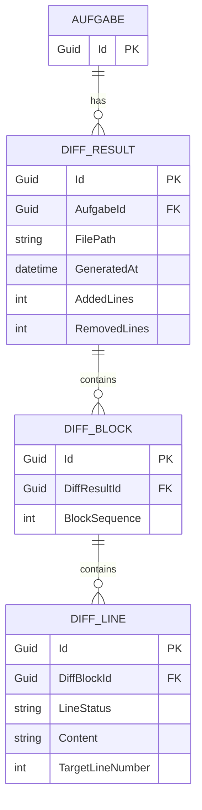

# Entity-Relationship-Modell: DiffViewer korrekte Diff-Anzeige

## 1. ER-Diagramm

## 2. Entitäten, Attribute, Schlüssel
| Entität | Primärschlüssel | Wichtige Attribute | Zweck |
|---------|------------------|--------------------|-------|
| Aufgabe | Id | - | Scope für DiffResults |
| DiffResult | Id | AufgabeId, FilePath, GeneratedAt, AddedLines | dateispezifischer Diff-Container |
| DiffBlock | Id | DiffResultId, BlockSequence | Gruppierung von Zeilenänderungen |
| DiffLine | Id | DiffBlockId, LineStatus, Content | konkrete +/−/~ Zeilen |

## 3. Beziehungen & Kardinalitäten
- Eine Aufgabe hat 0..n DiffResults.
- Ein DiffResult hat 1..n DiffBlocks.
- Ein DiffBlock hat 1..n DiffLines.

## 4. Modellierungsbegründungen
1. **Dateispezifische Zuordnung:** `DiffResult.FilePath` ist der Join-Anker zur ausgewählten Datei.
2. **Historie:** mehrere DiffResults pro Datei sind erlaubt; verwendet wird der neueste (`GeneratedAt DESC`).
3. **Pfadnormalisierung:** Vergleich erfolgt auf normalisiertem relativen Pfad.
4. **+1-Zeile-Nachweis:** `DiffLine.LineStatus = Added` und `AddedLines > 0`.

## 5. Konsistenzabgleich zum Blueprint
| Blueprint-Anforderung | ERM-Abdeckung |
|-----------------------|---------------|
| Datei -> DiffResult korrekt auflösen | `AufgabeId + FilePath` |
| +1-Zeile sichtbar | `DiffLine(LineStatus=Added)` |
| Kein falscher Null-Fallback | null nur wenn kein passender DiffResult |

