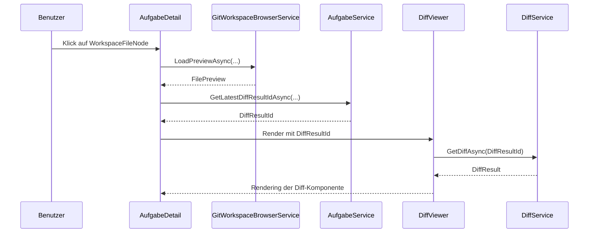

# Architektur-Blueprint: DiffViewer-Integration in AufgabeDetail

**Projekt:** Softwareschmiede  
**Feature:** DiffViewer als wiederverwendbare Blazor-Komponente  
**Ziel:** Einbettung in `AufgabeDetail` bei Erhalt der Route `/diff/{DiffResultId:guid}`  
**Status:** Entwurf  
**Version:** 1.0.0

---

## Inhaltsverzeichnis

1. [Zielbild](#1-zielbild)
2. [System- und Komponentenarchitektur](#2-system--und-komponentenarchitektur)
3. [Refaktorierungsstrategie](#3-refaktorierungsstrategie)
4. [Integrationsarchitektur in AufgabeDetail](#4-integrationsarchitektur-in-aufgabendetail)
5. [Sonderfälle und Fallbacks](#5-sonderfälle-und-fallbacks)
6. [Rückwärtskompatibilität](#6-rückwärtskompatibilität)
7. [Technologieentscheidungen](#7-technologieentscheidungen)
8. [Umsetzungsreihenfolge](#8-umsetzungsreihenfolge)
9. [Qualitätsziele](#9-qualitätsziele)

---

## 1. Zielbild

Der bestehende `DiffViewer` ist aktuell eine geroutete Blazor-Page. Für die Aufgabe-Ansicht soll er zu einer **wiederverwendbaren Komponente** werden, die:

- in `AufgabeDetail` eingebettet werden kann,
- weiterhin per Route aufrufbar bleibt,
- die bestehenden Unterkomponenten `DiffHeader`, `DiffToolbar`, `DiffContent`, `DiffLine`, `DiffFooter` unverändert weiterverwendet,
- keine fachliche Diff-Berechnung im UI neu einführt.

Die bisherige manuelle Vorschau mit zwei `<pre>`-Blöcken wird in der Aufgabe-Ansicht durch die Diff-Komponente ersetzt, jedoch nur dort, wo ein validierbarer Diff-Kontext vorhanden ist.

---

## 2. System- und Komponentenarchitektur

```mermaid
flowchart LR
    A[AufgabeDetail] --> B{Preview-Zustand}
    B -->|keine Datei| C[Hinweis: Datei auswählen]
    B -->|Hint vorhanden| D[Warnhinweis / Fallback]
    B -->|DiffResultId vorhanden| E[DiffViewer Komponente]

    E --> F[DiffService.GetDiffAsync]
    F --> G[DiffResult]
    G --> H[DiffHeader]
    G --> I[DiffToolbar]
    G --> J[DiffContent]
    G --> K[DiffFooter]

    L[Route /diff/{id}] --> M[Route-Wrapper]
    M --> E
```

### Architekturprinzip

- **DiffViewer** wird zur **UI-Komponente ohne eigene Route**.
- Die Route `/diff/{DiffResultId:guid}` wird durch einen **dünnen Wrapper** aufrechterhalten.
- `AufgabeDetail` bleibt für **Dateiauswahl, Preview-Kontext und Sichtbarkeit** zuständig.
- Der DiffViewer bleibt für **Laden, Rendern und Fehlerzustände des Diffs** zuständig.

---

## 3. Refaktorierungsstrategie

### 3.1 Von Page zu Komponente

Der aktuelle `DiffViewer.razor` verliert:

- `@page "/diff/{DiffResultId:guid}"`
- die Route als fachliche Verantwortung
- standortbezogene Navigation wie „Back to Home“ als feste UI-Logik

Der aktuelle Inhalt bleibt erhalten als:

- Ladezustand
- Fehlerzustand
- Rendering von `DiffHeader`, `DiffToolbar`, `DiffContent`, `DiffFooter`
- Diff-Laden über `DiffService`

### 3.2 Öffentliche Schnittstelle der Komponente

Empfohlene Parameter:

| Parameter | Typ | Zweck |
|---|---|---|
| `DiffResultId` | `Guid` | Primärer Schlüssel zum Laden des Diffs |
| `PresentationMode` | `DiffViewerPresentationMode` | Steuert Standalone- vs. Embedded-Verhalten |

Empfohlene Enum:

```csharp
public enum DiffViewerPresentationMode
{
    Embedded,
    Standalone
}
```

### 3.3 Verhalten nach Modus

| Modus | Verhalten |
|---|---|
| **Embedded** | Kein `role="main"`, keine Route-Navigation, keine Home-Links |
| **Standalone** | Vollständige Seitenpräsenz mit Route-konformer Fehlerdarstellung |

### 3.4 Route-Wrapper

Empfehlung: **neue separate Seite** als Wrapper, z. B. `Components/Pages/Diff/DiffViewerPage.razor`.

Der Wrapper:

- enthält `@page "/diff/{DiffResultId:guid}"`
- setzt `@rendermode InteractiveServer`
- rendert nur die Komponente:

```razor
<DiffViewer DiffResultId="DiffResultId" PresentationMode="Standalone" />
```

Vorteil: keine Doppelverantwortung, klare Trennung zwischen Routing und Darstellung.

---

## 4. Integrationsarchitektur in AufgabeDetail

### 4.1 Einbindung im UI

Die bisherige Vorschaufläche wird aufgeteilt in:

1. **kein FileSelection-Kontext** → Hinweis „Wählen Sie links eine Datei aus.“
2. **nicht darstellbarer Preview-Kontext** → Warnhinweis/Fallback
3. **darstellbarer Kontext mit DiffResultId** → eingebetteter `DiffViewer`

### 4.2 Datenfluss



### 4.3 Kontextübergabe

Wichtig: Der aktuelle `FilePreview` ist **nicht** der Diff-Kontext selbst, sondern nur der **Selektions- und Zustandskontext**.

- `WorkspaceNodeClickedAsync(...)` setzt die selektierte Datei.
- `LadeWorkspacePreviewAsync(...)` liefert `FilePreview`.
- `_latestDiffResultId` bleibt der fachliche Diff-Zeiger auf den zuletzt erzeugten Diff.

Damit gilt:

- **Dateiauswahl** bestimmt, *ob* im Previewbereich etwas gerendert wird.
- **DiffResultId** bestimmt, *was* als Diff geladen wird.

### 4.4 Benötigte State-Variablen

Bereits vorhanden und weiterzuverwenden:

- `_selectedWorkspaceNode`
- `_selectedWorkspacePreview`
- `_selectedWorkspacePath`
- `_latestDiffResultId`

Optional sinnvoll als Ergänzung:

- `PreviewRenderMode` als abgeleiteter UI-Zustand (`None`, `Hint`, `Diff`, `Deleted`)
- oder ein Hilfs-Property `CanRenderEmbeddedDiff`

Empfehlung: **keine neue persistente Datenhaltung erzwingen**, sondern die vorhandenen Felder mit abgeleiteten Properties kombinieren.

### 4.5 Renderlogik in AufgabeDetail

Empfohlene Entscheidungstabelle:

| Zustand | Anzeige |
|---|---|
| `_selectedWorkspacePreview is null` | Hinweis auf fehlende Dateiauswahl |
| `Hint != null/leer` | Warnhinweis, optional CurrentContent im Fallback |
| `IsDeleted == true` und kein Diff verfügbar | „Datei gelöscht“ / klarer Hinweis |
| `DiffResultId vorhanden` | `<DiffViewer ... />` |
| kein DiffResultId verfügbar | verständlicher Hinweis „Kein Diff vorhanden“ |

---

## 5. Sonderfälle und Fallbacks

### 5.1 `_selectedWorkspacePreview.Hint`

Wenn `Hint` gesetzt ist, ist die Datei aus fachlicher Sicht **nicht sinnvoll als Diff darstellbar**.

Regel:

- Hinweis anzeigen
- keine Diff-Komponente erzwingen
- optional `CurrentContent` als technische Zusatzinformation anzeigen

### 5.2 Datei gelöscht

Für gelöschte Dateien gibt es zwei Fälle:

1. **DiffResult vorhanden** → DiffViewer kann die Löschung korrekt darstellen
2. **kein DiffResult vorhanden** → Fallback mit Text „Datei gelöscht“

### 5.3 Kein DiffResult für die ausgewählte Datei

Dann darf die UI nicht leer bleiben.

Empfohlener Fallback:

- Hinweis „Für diese Datei ist kein DiffResult vorhanden.“
- optional selektierte Datei weiter anzeigen
- kein Navigationswechsel, kein Fehlerabbruch der Seite

---

## 6. Rückwärtskompatibilität

Die Route `/diff/{DiffResultId:guid}` bleibt erhalten.

Empfohlenes Zielbild:

- Route verweist auf Wrapper-Seite
- Wrapper rendert die Komponente im Standalone-Modus
- bestehende Links, Deep-Links und Tests bleiben funktionsfähig

Damit ist die Umstellung für Konsumenten der Route **nicht brechend**.

---

## 7. Technologieentscheidungen

| Entscheidung | Begründung |
|---|---|
| **Blazor Server / InteractiveServer beibehalten** | Entspricht dem bestehenden Stack und vermeidet Architekturwechsel |
| **DiffViewer als Komponente extrahieren** | Wiederverwendbarkeit, klare Trennung von Routing und Darstellung |
| **Route-Wrapper statt Route im Komponentenkern** | Rückwärtskompatibel und wartbar |
| **DiffService weiter im DiffViewer nutzen** | Minimale API-Oberfläche; bestehende Ladeverantwortung bleibt erhalten |
| **PresentationMode-Parameter** | Verhindert page-spezifische UI in eingebetteten Szenarien |
| **Keine neue Diff-Berechnung im Client** | Vermeidet Duplikation und hält Datenintegrität zentral |
| **Vorhandene Unterkomponenten unverändert nutzen** | Geringes Risiko, schnelle Migration |

### UI/UX-Entscheidungen

- Embedded-Modus ohne `role="main"` verhindert verschachtelte Hauptbereiche.
- Fallback-Texte müssen fachlich verständlich sein.
- Fehlerzustände bleiben lokal im Previewbereich, nicht seitenbreit.

### Qualitätsentscheidung

- Keine zusätzlichen Persistenz- oder Cache-Anpassungen für diese Integration.
- Fokus liegt auf Kompositions- und Zustandslogik im UI.

---

## 8. Umsetzungsreihenfolge

1. **Komponenten-API festlegen**
   - `DiffResultId`
   - `PresentationMode`
2. **DiffViewer entkoppeln**
   - `@page` entfernen
   - route-spezifische UI auslagern
3. **Route-Wrapper anlegen**
   - `/diff/{DiffResultId:guid}` weiterhin bedienen
4. **AufgabeDetail umbauen**
   - alte `<pre>`-Darstellung entfernen
   - eingebettete Komponente/Fallbacks einbauen
5. **Fallbacklogik ergänzen**
   - Hint, gelöscht, kein DiffResult
6. **Tests anpassen**
   - Komponente standalone
   - eingebettet in AufgabeDetail
   - Route bleibt erreichbar
7. **Manuelle UI-Prüfung**
   - Datei auswählen
   - Diff anzeigen
   - Sonderfälle prüfen

---

## 9. Qualitätsziele

| Ziel | Erwartung |
|---|---|
| **Wiederverwendbarkeit** | Eine Komponente für Route und Einbettung |
| **Wartbarkeit** | Keine doppelte Rendering-Logik |
| **Zuverlässigkeit** | Fehler bleiben lokal und brechen die Seite nicht ab |
| **Testbarkeit** | Renderpfade sind über Komponenten- und UI-Tests prüfbar |
| **Kompatibilität** | Bestehende Deep-Links funktionieren weiter |

---

## Fazit

Die robusteste Lösung ist:

- `DiffViewer` zu einer reinen Komponente machen,
- eine kleine Wrapper-Seite für die Route behalten,
- in `AufgabeDetail` die neue Komponente nur bei gültigem Diff-Kontext einbetten,
- Sonderfälle weiterhin über verständliche Fallbacks abfangen.

Damit entsteht eine saubere, wiederverwendbare und rückwärtskompatible Diff-Architektur.
