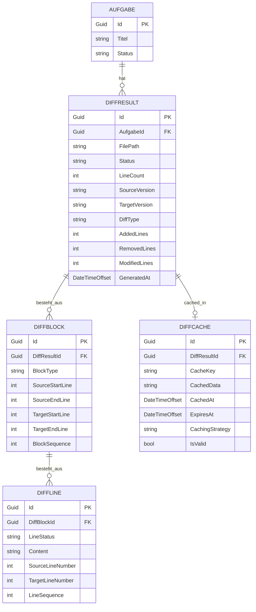
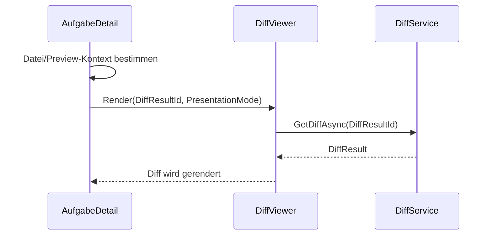

# Entity-Relationship-Modell: DiffViewer-Integration

**Version:** 1.0  
**Datum:** 2026-05-23  
**Status:** Entwurf  
**Kontext:** Reine UI-Refaktorierung; keine Datenbankschemaänderungen

---

## Verwandte Dokumente

- [Architektur-Blueprint: DiffViewer-Integration](diffviewer-integration-blueprint.md)
- [Entity-Relationship-Modell: Softwareschmiede](entity-relationship-model.md)

---

## Inhaltsverzeichnis

1. [Einleitung](#1-einleitung)
2. [ERM-Diagramm](#2-erm-diagramm)
3. [Tabellarische Entitätenübersicht](#3-tabellarische-entit%C3%A4ten%C3%BCbersicht)
4. [UI-Komponenten- und Zustandsdiagramm](#4-ui-komponenten--und-zustandsdiagramm)
5. [Datenfluss](#5-datenfluss-aufgabedetail--diffviewer--diffservice)
6. [Begründungen](#6-begr%C3%BCndungen)
7. [Konsistenzprüfung mit dem Architektur-Blueprint](#7-konsistenzpr%C3%BCfung-mit-dem-architektur-blueprint)

---

## 1. Einleitung

### Kontext

Die DiffViewer-Integration ist eine **reine UI-Refaktorierung**.  
Der bestehende `DiffViewer` wird von einer gerouteten Page zu einer wiederverwendbaren Blazor-Komponente umgebaut und in `AufgabeDetail` eingebettet.

### Abgrenzung

Es werden **keine neuen DB-Entitäten** eingeführt und **kein bestehendes Datenbankschema geändert**.

Nicht-persistierte UI-Typen:

- `DiffViewerPresentationMode` (Enum)
- `WorkspaceFileNode` (In-Memory/ViewModel)
- `FilePreview` (In-Memory ValueObject)
- `DiffViewer` (UI-Komponente)

---

## 2. ERM-Diagramm



---

## 3. Tabellarische Entitätenübersicht

| Entität | Attribute (Auszug) | Schlüssel | Beziehung | Persistenz |
|---|---|---|---|---|
| `Aufgabe` | `Id`, `Titel`, `Status` | PK `Id` | 1:N zu `DiffResult` | DB |
| `DiffResult` | `Id`, `AufgabeId`, `FilePath`, `Status`, `LineCount`, `SourceVersion`, `TargetVersion`, `GeneratedAt` | PK `Id`, FK `AufgabeId` | 1:N zu `DiffBlock`, 0..1:1 zu `DiffCache` | DB |
| `DiffBlock` | `Id`, `DiffResultId`, `BlockType`, `SourceStartLine`, `SourceEndLine`, `TargetStartLine`, `TargetEndLine`, `BlockSequence` | PK `Id`, FK `DiffResultId` | 1:N zu `DiffLine` | DB |
| `DiffLine` | `Id`, `DiffBlockId`, `LineStatus`, `Content`, `SourceLineNumber`, `TargetLineNumber`, `LineSequence` | PK `Id`, FK `DiffBlockId` | Gehört genau zu einem `DiffBlock` | DB |
| `DiffCache` | `Id`, `DiffResultId`, `CacheKey`, `CachedData`, `CachedAt`, `ExpiresAt`, `CachingStrategy`, `IsValid` | PK `Id`, FK `DiffResultId` | 1:1/0..1 zu `DiffResult` | DB |
| `DiffViewerPresentationMode` | `Embedded`, `Standalone` | — | UI-only | Nicht DB |
| `WorkspaceFileNode` | Baum-/Selektionsdaten | — | UI-state | Nicht DB |
| `FilePreview` | `OriginalContent`, `CurrentContent`, `Hint`, `IsDeleted` | — | UI-state | Nicht DB |

---

## 4. UI-Komponenten- und Zustandsdiagramm

```mermaid
flowchart LR
    AD[AufgabeDetail]
    WFN[(WorkspaceFileNode\nin-memory)]
    FP[(FilePreview\nin-memory)]
    DV[DiffViewer\nKomponente]
    PM{DiffViewerPresentationMode\nEmbedded / Standalone}
    DS[DiffService]
    DR[(DiffResult)]
    DB2[(DiffBlock)]
    DL[(DiffLine)]
    DC[(DiffCache)]

    AD -->|selektiert Datei| WFN
    AD -->|Preview-Kontext| FP
    AD -->|DiffResultId| DV

    DV --> PM
    DV -->|GetDiffAsync(DiffResultId)| DS
    DS --> DR
    DR --> DB2
    DB2 --> DL
    DR --> DC
```

---

## 5. Datenfluss: AufgabeDetail → DiffViewer → DiffService



### Interpretation

- `AufgabeDetail` entscheidet, **ob** ein Diff-Kontext vorhanden ist.
- `DiffViewer` entscheidet, **wie** der Diff gerendert wird (`Embedded` oder `Standalone`).
- `DiffService` liefert den fachlichen Inhalt (`DiffResult` inkl. `DiffBlock`, `DiffLine`, `DiffCache`).

---

## 6. Begründungen

- **Keine neuen DB-Entitäten:** Die Änderung betrifft nur die UI-Komposition.
- **`DiffViewerPresentationMode` bleibt UI-only:** Steuerung des Renderverhaltens, keine Persistenz.
- **`WorkspaceFileNode` und `FilePreview` bleiben außerhalb des ERM:** Beide sind Zustands-/ViewModel-Objekte.
- **`DiffResult` bleibt zentraler Container:** Alle Diff-Daten hängen weiterhin an diesem vorhandenen Aggregate Root.
- **`DiffCache` bleibt Teil des bestehenden Modells:** Kein neues Cache-Schema nötig.

---

## 7. Konsistenzprüfung mit dem Architektur-Blueprint

| Blueprint-Vorgabe | ERM-Abgleich |
|---|---|
| DiffViewer wird von einer Page zu einer Komponente refaktoriert | Im ERM als UI-Komponente modelliert, nicht als Entität |
| Einbettung in `AufgabeDetail` | Im Komponenten-/Datenflussdiagramm dargestellt |
| Route `/diff/{DiffResultId:guid}` bleibt kompatibel | Kein Einfluss auf DB; reines UI-Routing |
| Keine DB-Änderungen | ERM enthält nur bestehende Entitäten |
| DiffService bleibt fachlicher Zugriffspunkt | Datenfluss zeigt `DiffViewer → DiffService → DiffResult` |
| In-Memory Preview-Kontext bleibt getrennt | `WorkspaceFileNode` und `FilePreview` als Nicht-DB-Typen markiert |

### Fazit

Das Modell ist konsistent mit dem Blueprint:  
Die Persistenz bleibt unverändert, und die neue UI-Struktur wird ausschließlich auf Komponentenebene abgebildet.
