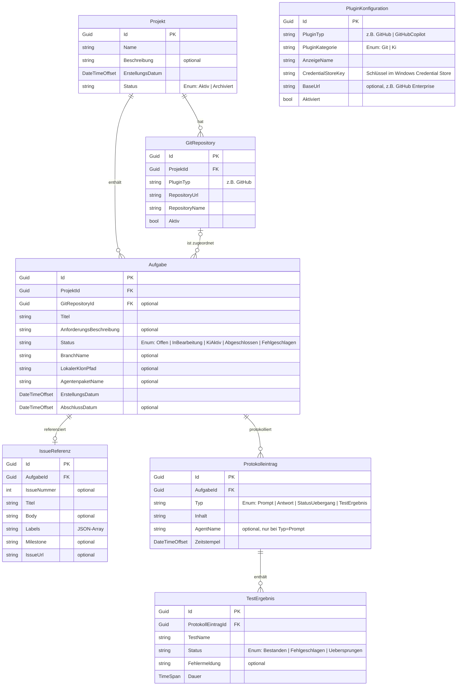

# Entity-Relationship-Modell: Softwareschmiede

**Version:** 1.0  
**Datum:** 2025  
**Status:** Freigegeben  

---

## Verwandte Dokumente

- [Anforderungsanalyse](../requirements/requirements-analysis.md)
- [Architektur-Blueprint](architecture-blueprint.md)
- [Architektur-Review](../improvements/architecture-review.md)

---

## Inhaltsverzeichnis

1. [Einleitung](#1-einleitung)
2. [ERM-Diagramm](#2-erm-diagramm)
3. [Tabellarische Entitätenübersicht](#3-tabellarische-entitätenübersicht)
   - 3.1 [Projekt](#31-projekt)
   - 3.2 [GitRepository](#32-gitrepository)
   - 3.3 [Aufgabe](#33-aufgabe)
   - 3.4 [IssueReferenz](#34-issuereferenz)
   - 3.5 [Protokolleintrag](#35-protokolleintrag)
   - 3.6 [TestErgebnis](#36-testergebnis)
   - 3.7 [PluginKonfiguration](#37-pluginkonfiguration)
4. [Beziehungsübersicht](#4-beziehungsübersicht)
5. [Modellierungsentscheidungen](#5-modellierungsentscheidungen)
6. [Konsistenzprüfung mit dem Architektur-Blueprint](#6-konsistenzprüfung-mit-dem-architektur-blueprint)
7. [Indizes und Performance-Überlegungen](#7-indizes-und-performance-überlegungen)
8. [Querverweise](#8-querverweise)

---

## 1. Einleitung

### Kontext

**Softwareschmiede** ist eine lokal betriebene Blazor Server-Webanwendung (.NET 9+), die den gesamten Workflow der KI-gestützten Softwareentwicklung orchestriert. Die Anwendung verbindet Projektmanagement, Git-Integration, Aufgabenverwaltung, KI-Steuerung und ein lückenloses Aufgabenprotokoll in einem einheitlichen System.

Das vorliegende Entity-Relationship-Modell beschreibt die persistierte Datenstruktur der Anwendung. Es bildet die Grundlage für das EF Core–Datenbankschema (SQLite) und definiert alle Entitäten, deren Attribute sowie die Beziehungen zwischen ihnen.

### Abgrenzung

Folgende Daten werden **nicht** im Datenbankschema abgebildet:

| Datenkategorie | Speicherort | Begründung |
|---|---|---|
| API-Tokens (GitHub, KI-Anbieter) | Windows Credential Store | Sicherheitsanforderung: keine Secrets in der DB |
| Agentenpaket-Inhalte (Prompts, Konfigurationsdateien) | Dateisystem (Ordnerstruktur) | Pakete werden als versionierbare Ordner ausgeliefert; kein DB-Management erforderlich |
| Echtzeit-Streaming-Daten (laufende KI-Ausgaben) | In-Memory / SignalR | Flüchtige Daten; nur das fertige Ergebnis wird als Protokolleintrag persistiert |

---

## 2. ERM-Diagramm



---

## 3. Tabellarische Entitätenübersicht

### 3.1 Projekt

**Beschreibung:** Zentrale Organisationseinheit. Ein Projekt gruppiert Git-Repositories und Aufgaben unter einem gemeinsamen Namen.

**Primärschlüssel:** `Id`  
**Fremdschlüssel:** –

| Attribut | Typ | Constraint | Beschreibung |
|---|---|---|---|
| `Id` | `Guid` | PK, NOT NULL | Eindeutiger Bezeichner des Projekts (datenbankgeneriert) |
| `Name` | `string` | NOT NULL, max. 200 Zeichen | Anzeigename des Projekts |
| `Beschreibung` | `string?` | NULL | Optionale Freitextbeschreibung |
| `ErstellungsDatum` | `DateTimeOffset` | NOT NULL | Zeitpunkt der Projekterstellung |
| `Status` | `string` (Enum) | NOT NULL, Default: `Aktiv` | Projektstatus: `Aktiv` oder `Archiviert` |

---

### 3.2 GitRepository

**Beschreibung:** Repräsentiert ein externes Git-Repository, das einem Projekt zugeordnet ist. Das Plugin-System ermöglicht den Austausch des konkreten Git-Anbieters (z. B. GitHub, Gitea).

**Primärschlüssel:** `Id`  
**Fremdschlüssel:** `ProjektId → Projekt.Id`

| Attribut | Typ | Constraint | Beschreibung |
|---|---|---|---|
| `Id` | `Guid` | PK, NOT NULL | Eindeutiger Bezeichner des Repositories |
| `ProjektId` | `Guid` | FK, NOT NULL | Zugehöriges Projekt |
| `PluginTyp` | `string` | NOT NULL, max. 100 Zeichen | Bezeichner des Git-Plugins, z. B. `"GitHub"` |
| `RepositoryUrl` | `string` | NOT NULL | HTTPS- oder SSH-URL des Repositories |
| `RepositoryName` | `string` | NOT NULL, max. 200 Zeichen | Anzeigename des Repositories (owner/repo) |
| `Aktiv` | `bool` | NOT NULL, Default: `true` | Gibt an, ob das Repository aktiv genutzt wird |

---

### 3.3 Aufgabe

**Beschreibung:** Kernentität des Systems. Eine Aufgabe repräsentiert eine Entwicklungsaufgabe, die durch KI-Agenten bearbeitet wird. Sie besitzt einen eigenen Branch, einen lokalen Klon und ein Aufgabenprotokoll.

**Primärschlüssel:** `Id`  
**Fremdschlüssel:** `ProjektId → Projekt.Id`, `GitRepositoryId → GitRepository.Id` (optional)

| Attribut | Typ | Constraint | Beschreibung |
|---|---|---|---|
| `Id` | `Guid` | PK, NOT NULL | Eindeutiger Bezeichner der Aufgabe |
| `ProjektId` | `Guid` | FK, NOT NULL | Zugehöriges Projekt |
| `GitRepositoryId` | `Guid?` | FK, NULL | Optionale Zuordnung zu einem Git-Repository |
| `Titel` | `string` | NOT NULL, max. 500 Zeichen | Kurztitel der Aufgabe |
| `AnforderungsBeschreibung` | `string?` | NULL | Optionale Anforderungsbeschreibung als Freitext |
| `Status` | `string` (Enum) | NOT NULL, Default: `Offen` | Aufgabenstatus: `Offen`, `InBearbeitung`, `KiAktiv`, `Abgeschlossen`, `Fehlgeschlagen` |
| `BranchName` | `string?` | NULL, max. 300 Zeichen | Git-Branch-Name, z. B. `task/<id>-<kurzname>` |
| `LokalerKlonPfad` | `string?` | NULL | Absoluter Pfad des aufgabenspezifischen lokalen Klons |
| `AgentenpaketName` | `string?` | NULL, max. 200 Zeichen | Name des gewählten Agentenpaket-Ordners im Dateisystem |
| `ErstellungsDatum` | `DateTimeOffset` | NOT NULL | Zeitpunkt der Aufgabenerstellung |
| `AbschlussDatum` | `DateTimeOffset?` | NULL | Zeitpunkt des Abschlusses (gesetzt bei Status `Abgeschlossen` oder `Fehlgeschlagen`) |

---

### 3.4 IssueReferenz

**Beschreibung:** Speichert die Metadaten eines externen Issues (z. B. GitHub Issue), das der Aufgabe zugrunde liegt. Die IssueReferenz ist optional; eine Aufgabe kann auch ohne Issue-Bezug erstellt werden. Die Beziehung zur Aufgabe ist 1:0..1 – jede Aufgabe hat höchstens eine IssueReferenz.

**Primärschlüssel:** `Id`  
**Fremdschlüssel:** `AufgabeId → Aufgabe.Id` (UNIQUE-Constraint zur Durchsetzung der 1:1-Semantik)

| Attribut | Typ | Constraint | Beschreibung |
|---|---|---|---|
| `Id` | `Guid` | PK, NOT NULL | Eindeutiger Bezeichner der IssueReferenz |
| `AufgabeId` | `Guid` | FK, NOT NULL, UNIQUE | Zugehörige Aufgabe (1:1-Beziehung über UNIQUE) |
| `IssueNummer` | `int?` | NULL | Nummer des Issues im externen System |
| `Titel` | `string` | NOT NULL, max. 500 Zeichen | Titel des Issues |
| `Body` | `string?` | NULL | Vollständiger Beschreibungstext des Issues |
| `Labels` | `string` | NOT NULL, Default: `"[]"` | JSON-Array der Label-Namen, z. B. `["bug","enhancement"]` |
| `Milestone` | `string?` | NULL, max. 200 Zeichen | Name des zugehörigen Meilensteins |
| `IssueUrl` | `string?` | NULL | Direkte URL zum Issue im externen System |

---

### 3.5 Protokolleintrag

**Beschreibung:** Lückenlose Aufzeichnung aller relevanten Ereignisse einer Aufgabe. Jeder Prompt an einen KI-Agenten, jede Antwort, jeder Statuswechsel und jedes Testergebnis-Ereignis wird als eigener Eintrag gespeichert.

**Primärschlüssel:** `Id`  
**Fremdschlüssel:** `AufgabeId → Aufgabe.Id`

| Attribut | Typ | Constraint | Beschreibung |
|---|---|---|---|
| `Id` | `Guid` | PK, NOT NULL | Eindeutiger Bezeichner des Protokolleintrags |
| `AufgabeId` | `Guid` | FK, NOT NULL | Zugehörige Aufgabe |
| `Typ` | `string` (Enum) | NOT NULL | Eintragstyp: `Prompt`, `Antwort`, `StatusUebergang`, `TestErgebnis` |
| `Inhalt` | `string` | NOT NULL | Volltext des Prompts / der Antwort / der Statusinformation |
| `AgentName` | `string?` | NULL, max. 200 Zeichen | Name des adressierten KI-Agenten (nur relevant bei `Typ = Prompt`) |
| `Zeitstempel` | `DateTimeOffset` | NOT NULL | Zeitpunkt der Erstellung des Eintrags |

---

### 3.6 TestErgebnis

**Beschreibung:** Detaillierte Testergebnisse, die einem Protokolleintrag vom Typ `TestErgebnis` zugeordnet sind. Ermöglicht strukturierte Auswertung einzelner Tests (z. B. aus `dotnet test`-Ausgaben).

**Primärschlüssel:** `Id`  
**Fremdschlüssel:** `ProtokollEintragId → Protokolleintrag.Id`

| Attribut | Typ | Constraint | Beschreibung |
|---|---|---|---|
| `Id` | `Guid` | PK, NOT NULL | Eindeutiger Bezeichner des Testergebnisses |
| `ProtokollEintragId` | `Guid` | FK, NOT NULL | Zugehöriger Protokolleintrag (muss Typ `TestErgebnis` haben) |
| `TestName` | `string` | NOT NULL, max. 500 Zeichen | Vollständiger Name des Tests (Namespace.Klasse.Methode) |
| `Status` | `string` (Enum) | NOT NULL | Ergebnis: `Bestanden`, `Fehlgeschlagen`, `Uebersprungen` |
| `Fehlermeldung` | `string?` | NULL | Fehlermeldung/Stack Trace bei `Status = Fehlgeschlagen` |
| `Dauer` | `TimeSpan` (gespeichert als `long` Ticks) | NOT NULL | Ausführungsdauer des Tests |

---

### 3.7 PluginKonfiguration

**Beschreibung:** Speichert die Konfigurationsmetadaten aller installierten Plugins (Git und KI). API-Tokens werden **nicht** in der Datenbank gespeichert – stattdessen enthält `CredentialStoreKey` den Schlüssel, unter dem das Token im Windows Credential Store abgelegt ist.

**Primärschlüssel:** `Id`  
**Fremdschlüssel:** –  
**Besonderheit:** `PluginTyp` ist faktisch eindeutig (UNIQUE-Empfehlung).

| Attribut | Typ | Constraint | Beschreibung |
|---|---|---|---|
| `Id` | `Guid` | PK, NOT NULL | Eindeutiger Bezeichner der Plugin-Konfiguration |
| `PluginTyp` | `string` | NOT NULL, UNIQUE, max. 100 Zeichen | Maschinenlesbarer Plugin-Bezeichner, z. B. `"GitHub"`, `"GitHubCopilot"` |
| `PluginKategorie` | `string` (Enum) | NOT NULL | Kategorie: `Git` oder `Ki` |
| `AnzeigeName` | `string` | NOT NULL, max. 200 Zeichen | Benutzerfreundlicher Anzeigename, z. B. `"GitHub"` |
| `CredentialStoreKey` | `string` | NOT NULL, max. 300 Zeichen | Schlüssel im Windows Credential Store (enthält **kein** Token) |
| `BaseUrl` | `string?` | NULL | Optionale Basis-URL, z. B. für GitHub Enterprise-Instanzen |
| `Aktiviert` | `bool` | NOT NULL, Default: `false` | Gibt an, ob das Plugin aktiv genutzt wird |

---

## 4. Beziehungsübersicht

| # | Von | Zu | Kardinalität | Typ | Beschreibung |
|---|---|---|---|---|---|
| 1 | `Projekt` | `GitRepository` | 1 : 0..N | Identifizierend | Ein Projekt kann beliebig viele Git-Repositories besitzen. Ein Repository gehört genau einem Projekt. Bei Löschung des Projekts werden zugehörige Repositories kaskadierend gelöscht. |
| 2 | `Projekt` | `Aufgabe` | 1 : 0..N | Identifizierend | Ein Projekt enthält beliebig viele Aufgaben. Eine Aufgabe gehört genau einem Projekt. Bei Löschung des Projekts werden Aufgaben kaskadierend gelöscht. |
| 3 | `GitRepository` | `Aufgabe` | 0..1 : 0..N | Nicht-identifizierend | Eine Aufgabe kann optional einem Git-Repository zugeordnet sein. Ein Repository kann mehreren Aufgaben zugrunde liegen. Der FK `GitRepositoryId` ist nullable. |
| 4 | `Aufgabe` | `IssueReferenz` | 1 : 0..1 | Identifizierend | Eine Aufgabe kann optional genau eine IssueReferenz besitzen. Die Eindeutigkeit wird über einen UNIQUE-Constraint auf `IssueReferenz.AufgabeId` sichergestellt. Bei Löschung der Aufgabe wird die IssueReferenz kaskadierend gelöscht. |
| 5 | `Aufgabe` | `Protokolleintrag` | 1 : 0..N | Identifizierend | Eine Aufgabe besitzt beliebig viele Protokolleinträge (chronologische Aufzeichnung). Ein Protokolleintrag gehört genau einer Aufgabe. Bei Löschung der Aufgabe werden alle Protokolleinträge kaskadierend gelöscht. |
| 6 | `Protokolleintrag` | `TestErgebnis` | 1 : 0..N | Identifizierend | Ein Protokolleintrag vom Typ `TestErgebnis` kann beliebig viele Einzeltestergebnisse enthalten. Ein TestErgebnis gehört genau einem Protokolleintrag. Bei Löschung des Protokolleintrags werden TestErgebnisse kaskadierend gelöscht. |

> **Hinweis:** `PluginKonfiguration` steht in keiner Fremdschlüssel-Beziehung zu anderen Entitäten. Sie wird über `PluginTyp` (string) semantisch mit `GitRepository.PluginTyp` verknüpft – bewusst ohne referentielle Integrität, da Plugins auch ohne existierende Repositories konfiguriert werden können.

---

## 5. Modellierungsentscheidungen

### 5.1 IssueReferenz als eigene Entität (statt Felder in Aufgabe)

**Entscheidung:** Die Issue-Metadaten werden in einer separaten Entität `IssueReferenz` gespeichert, nicht als nullable Spalten direkt in `Aufgabe`.

**Begründung:**

- **Optionalität ohne Nullable-Inflation:** Ohne separate Entität müssten 6 weitere nullable Spalten in `Aufgabe` eingeführt werden (`IssueNummer`, `IssueUrl`, `Body`, `Labels`, `Milestone`, `Titel`). Das würde die Aufgabe-Tabelle bei aufgabenbasierten Workflows (ohne Issue-Bezug) mit NULL-Werten überladen.
- **Klares Domänenmodell:** Die IssueReferenz ist semantisch ein eigenes Konzept (ein externes Artefakt), das einer Aufgabe zugeordnet wird – nicht Teil der Aufgabe selbst.
- **Erweiterbarkeit:** Zukünftige Erweiterungen (z. B. Unterstützung mehrerer Issues, Issue-Synchronisierung) lassen sich an der separaten Entität vornehmen, ohne die zentrale `Aufgabe`-Tabelle zu ändern.
- **EF Core:** Alternativ wäre ein *Owned Entity Type* möglich, der in dieselbe Tabelle geschrieben wird. Die separate Tabelle wurde bevorzugt, da EF Core Owned Types mit Nullable-Semantik aufwändiger zu handhaben sind und die explizite Tabelle die Abfragen vereinfacht.

---

### 5.2 TestErgebnis als eigene Entität (statt JSON in Protokolleintrag)

**Entscheidung:** Einzelne Testergebnisse werden als strukturierte Zeilen in einer eigenen Tabelle gespeichert, nicht als JSON-Blob im `Inhalt`-Feld des Protokolleintrags.

**Begründung:**

- **Abfragbarkeit:** Einzelne Tests können gezielt abgefragt werden – z. B. „Alle fehlgeschlagenen Tests der letzten 5 Aufgaben" – ohne JSON-Parsing auf Datenbankebene.
- **Typsicherheit:** Enum-Werte (`Bestanden`, `Fehlgeschlagen`, `Uebersprungen`) und `Dauer` sind als typisierte Spalten effizienter indizierbar und auswertbar.
- **Konsistenz:** SQLite unterstützt keine nativen JSON-Indizes; strukturierte Spalten ermöglichen einfachere Filterung und Sortierung.
- **Protokoll-Inhalt bleibt lesbar:** Das `Inhalt`-Feld von `Protokolleintrag` kann weiterhin eine menschenlesbare Zusammenfassung (z. B. „3 Tests bestanden, 1 fehlgeschlagen") enthalten, während die Details in `TestErgebnis` liegen.

---

### 5.3 Labels in IssueReferenz als JSON-String

**Entscheidung:** Die Labels werden als JSON-Array-String gespeichert (z. B. `["bug","enhancement"]`), nicht als separate Tabelle oder EF Core–Collection.

**Begründung:**

- **Schreibgeschützte Herkunft:** Labels stammen aus dem externen Issue-Tracking-System und werden bei jedem Sync überschrieben. Sie werden nicht intern verwaltet oder verändert.
- **Keine Abfrageanforderung:** Es besteht keine Anforderung, nach spezifischen Labels zu filtern oder zu gruppieren. Labels werden nur angezeigt.
- **Aufwandsreduktion:** Eine eigene `Label`-Tabelle mit einer Zwischentabelle `IssueReferenz_Label` wäre für reines Anzeigen überdimensioniert.
- **Einfache Serialisierung:** `System.Text.Json` serialisiert/deserialisiert `string[]` trivial; EF Core Value Converter ermöglichen die transparente Konvertierung beim Lesen/Schreiben.

---

### 5.4 PluginKonfiguration ohne Token (Verweis auf Credential Store)

**Entscheidung:** API-Tokens werden ausschließlich im Windows Credential Store gespeichert. Die `PluginKonfiguration` speichert nur den Schlüssel (`CredentialStoreKey`), unter dem das Token abgelegt ist.

**Begründung:**

- **Sicherheitsanforderung:** SQLite-Datenbankdateien sind ohne weitere Verschlüsselung im Klartext lesbar. Das Speichern von API-Tokens in der DB würde ein erhebliches Sicherheitsrisiko darstellen.
- **Windows-Ökosystem:** Die Anwendung läuft ausschließlich unter Windows. Der Windows Credential Store (`CredentialManager`) ist die plattformspezifische, systemseitig geschützte Lösung für Zugangsdaten.
- **Trennung von Konfiguration und Geheimnis:** Die Plugin-Konfiguration (Anzeigename, URL, aktiviert/deaktiviert) ist nicht vertraulich und kann in der DB liegen. Das Token ist vertraulich und bleibt außerhalb der DB.
- **Keine Migrations-Risiken:** Tokens müssen bei Datenbankmigrationen nicht migriert, transformiert oder verschlüsselt werden.

---

### 5.5 Kein DB-Eintrag für Agentenpakete (nur Ordnername)

**Entscheidung:** Agentenpaket-Inhalte (Prompt-Templates, Agenten-Konfigurationsdateien) werden nicht in der Datenbank gespeichert. In `Aufgabe.AgentenpaketName` wird lediglich der Name des ausgewählten Ordners festgehalten.

**Begründung:**

- **Versionierung durch Dateisystem:** Agentenpakete sind strukturierte Ordner, die unabhängig von der Anwendung versioniert (z. B. per Git) und aktualisiert werden können. Eine Replikation in die DB würde Synchronisierungsprobleme erzeugen.
- **Keine Abfrageanforderung:** Paketinhalte müssen nicht datenbankgebunden abgefragt oder gefiltert werden. Sie werden zur Laufzeit vom `AgentPackageService` aus dem Dateisystem geladen.
- **Erweiterbarkeit:** Neue Paketversionen oder Paket-Typen erfordern keine Datenbankmigrationen – nur die Ordnerstruktur auf dem Dateisystem ändert sich.
- **Reproduzierbarkeit:** Der Paketname in `Aufgabe` ermöglicht nachzuvollziehen, welches Paket bei der KI-Ausführung verwendet wurde, ohne Paketinhalte zu duplizieren.

---

## 6. Konsistenzprüfung mit dem Architektur-Blueprint

| Architektur-Anforderung | ERM-Umsetzung | Status |
|---|---|---|
| Persistenz via EF Core / SQLite | Alle Entitäten sind als EF Core–Entitäten konzipiert; Typen wurden auf SQLite-Kompatibilität geprüft (`TimeSpan` → `long` Ticks, Enums → `string`) | ✅ Konform |
| Keine Lazy Loading; explizite Includes | Das ERM definiert keine Navigation Properties, die implizit geladen werden müssten. Alle Beziehungen sind über FK-Spalten explizit und erfordern `.Include()` in Queries | ✅ Konform |
| AsNoTracking für Leseabfragen | Keine Modellierungskonsequenz; wird auf Service-Ebene umgesetzt | ✅ Konform |
| API-Tokens im Windows Credential Store | `PluginKonfiguration` speichert nur `CredentialStoreKey`; kein Token-Attribut im gesamten ERM | ✅ Konform |
| Agentenpaket-Inhalte im Dateisystem | Nur `Aufgabe.AgentenpaketName` (string) im ERM; keine Paket-Entität | ✅ Konform |
| Aufgaben-Lebenszyklus (Offen → ... → Abgeschlossen/Fehlgeschlagen) | `Aufgabe.Status` (Enum) bildet alle Zustände ab; `AbschlussDatum` wird bei Terminalzustand gesetzt | ✅ Konform |
| Protokollierung aller Ereignisse (Prompt, Antwort, Status, Test) | `Protokolleintrag.Typ` (Enum) deckt alle vier Ereignistypen ab | ✅ Konform |
| Plugin-System (Git + KI, austauschbar) | `PluginKonfiguration.PluginKategorie` (`Git`/`Ki`) + `PluginTyp` (string) ermöglicht beliebige Plugin-Implementierungen | ✅ Konform |
| Einzelnutzer, kein Login | Kein `User`- oder `Session`-Entität im ERM; keine Authentifizierungstabellen erforderlich | ✅ Konform |
| Blazor Server / Schichtenarchitektur | Das ERM beschreibt ausschließlich die Domain-Schicht (Entitäten); Presentation- und Application-Schicht sind nicht Gegenstand des ERM | ✅ Konform |
| Kaskadierendes Löschen | Alle identifizierenden Beziehungen (Projekt→Repository, Projekt→Aufgabe, Aufgabe→IssueReferenz, Aufgabe→Protokolleintrag, Protokolleintrag→TestErgebnis) unterstützen Cascade Delete | ✅ Konform |

---

## 7. Indizes und Performance-Überlegungen

Die folgende Tabelle listet empfohlene Datenbankindizes auf Basis der erwarteten Abfragemuster auf:

| Tabelle | Index-Spalte(n) | Typ | Begründung |
|---|---|---|---|
| `GitRepository` | `ProjektId` | Non-Unique | Häufige Abfrage: „Alle Repositories eines Projekts" |
| `Aufgabe` | `ProjektId` | Non-Unique | Häufige Abfrage: „Alle Aufgaben eines Projekts" |
| `Aufgabe` | `GitRepositoryId` | Non-Unique | Abfrage: „Alle Aufgaben eines Repositories" |
| `Aufgabe` | `Status` | Non-Unique | Filterung nach Status (z. B. alle offenen Aufgaben) |
| `IssueReferenz` | `AufgabeId` | Unique | Durchsetzung der 1:1-Semantik; schnelle Lookup |
| `Protokolleintrag` | `AufgabeId` | Non-Unique | Häufige Abfrage: „Alle Einträge einer Aufgabe" |
| `Protokolleintrag` | `AufgabeId, Zeitstempel` | Composite, Non-Unique | Chronologische Ausgabe des Protokolls einer Aufgabe |
| `Protokolleintrag` | `Typ` | Non-Unique | Filterung nach Eintragstyp (z. B. nur TestErgebnis-Einträge) |
| `TestErgebnis` | `ProtokollEintragId` | Non-Unique | Häufige Abfrage: „Alle Testergebnisse eines Protokolleintrags" |
| `TestErgebnis` | `Status` | Non-Unique | Filterung fehlgeschlagener Tests über alle Aufgaben |
| `PluginKonfiguration` | `PluginTyp` | Unique | Eindeutigkeit des Plugin-Bezeichners; schneller Lookup beim Starten |
| `PluginKonfiguration` | `Aktiviert` | Non-Unique | Abfrage der aktiven Plugins beim Anwendungsstart |

### EF Core–Konfigurationshinweise

```csharp
// Beispiel: Composite Index in OnModelCreating
modelBuilder.Entity<Protokolleintrag>()
    .HasIndex(p => new { p.AufgabeId, p.Zeitstempel });

// Beispiel: Unique Constraint für IssueReferenz
modelBuilder.Entity<IssueReferenz>()
    .HasIndex(i => i.AufgabeId)
    .IsUnique();

// Beispiel: Unique Constraint für PluginKonfiguration
modelBuilder.Entity<PluginKonfiguration>()
    .HasIndex(p => p.PluginTyp)
    .IsUnique();

// Beispiel: TimeSpan → long (Ticks) Konvertierung
modelBuilder.Entity<TestErgebnis>()
    .Property(t => t.Dauer)
    .HasConversion(
        v => v.Ticks,
        v => TimeSpan.FromTicks(v));

// Beispiel: Enum → string Konvertierung
modelBuilder.Entity<Aufgabe>()
    .Property(a => a.Status)
    .HasConversion<string>();
```

---

## 8. Querverweise

| Dokument | Pfad | Relevanz |
|---|---|---|
| Anforderungsanalyse | [`../requirements/requirements-analysis.md`](../requirements/requirements-analysis.md) | Fachliche Grundlage für Entitäten und Attribute |
| Architektur-Blueprint | [`architecture-blueprint.md`](architecture-blueprint.md) | Technische Vorgaben (EF Core, Schichten, Credential Store, Plugins) |
| Architektur-Review | [`../improvements/architecture-review.md`](../improvements/architecture-review.md) | Identifizierte Verbesserungsbedarfe mit Auswirkungen auf das Datenmodell |
