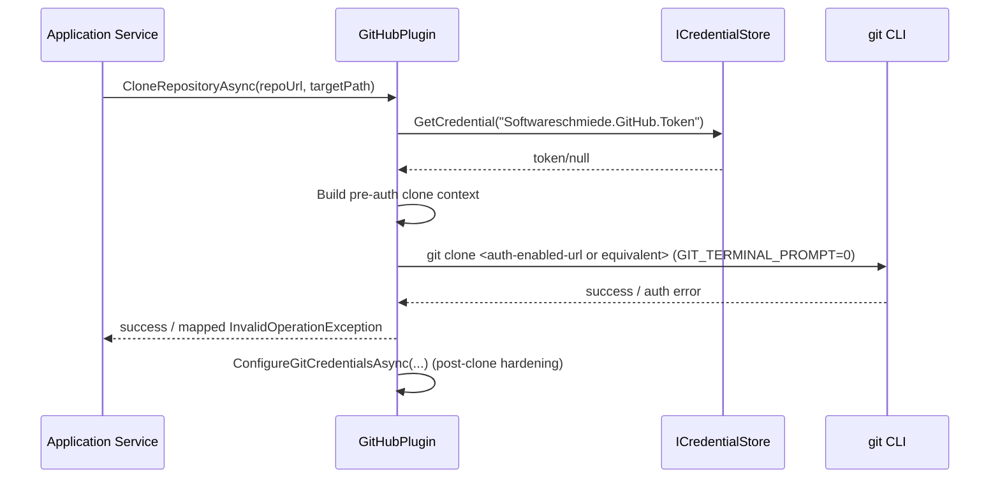

# Architektur-Blueprint: GitHub Clone Authentication Bugfix

> **Dokument-Typ:** Architektur-Blueprint (Bugfix)  
> **Status:** Entwurf  
> **Betroffene Komponente:** `plugins/Softwareschmiede.Plugin.GitHub/GitHubPlugin.cs`  
> **Betroffene Tests:** `src/Softwareschmiede.Tests/Infrastructure/Plugins/GitHubPluginTests.cs`

## 1. Referenzen

- Requirements: [`../requirements/github-clone-authentication-requirements-analysis.md`](../requirements/github-clone-authentication-requirements-analysis.md)
- ERM-Zieldokument: [`./github-clone-authentication-entity-relationship-model.md`](./github-clone-authentication-entity-relationship-model.md)
- Architektur-Review-Zieldokument: [`../improvements/github-clone-authentication-architecture-review.md`](../improvements/github-clone-authentication-architecture-review.md)

## 2. Problembild und Ziel

Beim Aufgabenstart schlägt `git clone` bei privaten Repositories mit folgendem Fehler fehl:

`fatal: could not read Username for 'https://github.com': terminal prompts disabled`

Ursache: Credentials werden aktuell erst **nach** erfolgreichem Clone konfiguriert (`ConfigureGitCredentialsAsync`), für den initialen Clone fehlt damit eine gültige Authentifizierung.

**Ziel:** Authentifizierung muss vor dem Clone deterministisch bereitgestellt werden, ohne interaktive Eingaben.

## 3. Systemarchitektur und betroffene Schichten/Module

### 3.1 Schichten

- **Application/Orchestration:** Startet Repository-Klonprozess über `IGitPlugin`.
- **Infrastructure Plugin Layer:** `GitHubPlugin` kapselt Git/GitHub-CLI-Aufrufe und Credential-Nutzung.
- **External Tools:** `git` CLI (Clone), optional `gh` CLI für andere Operationen.
- **Credential Boundary:** `ICredentialStore` liefert Token (`Softwareschmiede.GitHub.Token`).

### 3.2 Betroffene Module

- `GitHubPlugin.CloneRepositoryAsync(...)`
- `GitHubPlugin.GetGitEnvironment()`
- `GitHubPlugin.ConfigureGitCredentialsAsync(...)`
- Testmodul `GitHubPluginTests` (Clone-Pfad + Fehlerpfad + Env-/Auth-Verifikation)

## 4. Technologieentscheidungen (inkl. Auth-Strategie vor Clone)

| Entscheidung | Beschreibung | Begründung |
|---|---|---|
| Pre-Clone Credential Resolution | Token wird vor `git clone` aus `ICredentialStore` gelesen und für Clone nutzbar gemacht. | Verhindert interaktive Prompt-Anforderung im ersten Netzwerkzugriff. |
| Non-interactive Git | `GIT_TERMINAL_PROMPT=0` bleibt aktiv. | Sicheres, reproduzierbares Verhalten in Headless-/Agent-Kontexten. |
| HTTPS mit tokenbasierter Auth | Für HTTPS-Remotes wird ein authentifizierter Clone-Request vorbereitet (z. B. tokenisierte URL/gleichwertige non-interaktive Credential-Übergabe). | `git clone` kann sofort gegen private Repos authentifizieren. |
| Fehlerabbildung in Domain-nahes Messaging | Auth-spezifische Git-Fehler werden erkannt und als verständliche Fehlermeldung weitergegeben. | Bessere UX und schnellere Diagnose. |
| Testabsicherung über Mocked CLI Runner | Reihenfolge und Parameter der CLI-Aufrufe werden in Unit-Tests geprüft. | Regression-Schutz bei zukünftigen Refactorings. |

### 4.1 Zielablauf (Auth vor Clone)

## 5. UI/UX-Auswirkungen (Fehlermeldung)

- Fehlerbild in der UI wird von generischem Clone-Fehler auf **authentifizierungsbezogene Meldung** verbessert.
- Empfehlung im Fehlertext:
  1. GitHub Token in den Plugin-Einstellungen prüfen/neu setzen.
  2. Token-Scopes prüfen (`repo`, ggf. `read:org`).
  3. Clone erneut starten.
- Keine Token-Ausgabe in UI, Logs oder Exceptions (Maskierung/Sanitizing verpflichtend).

## 6. Qualitätsziele

| Qualitätsziel | Zieldefinition |
|---|---|
| Sicherheit | Kein Klartext-Token in Logs/Exceptions; Credentials nur über Store/ephemere Prozesskontexte. |
| Zuverlässigkeit | Private HTTPS-Repositories klonen ohne Interaktion; deterministisches Verhalten in CI/Agent-Runs. |
| Testbarkeit | Unit-Tests decken Erfolg, Auth-Fehler, fehlenden Token, Aufrufreihenfolge und Umgebungsvariablen ab. |
| Performance | Kein zusätzlicher Netzwerk-Roundtrip vor Clone; nur lokale Token-Aufbereitung. |

## 7. Risiken und Gegenmaßnahmen

| Risiko | Auswirkung | Gegenmaßnahme |
|---|---|---|
| Token versehentlich in Fehlermeldung/Logs | Sicherheitsvorfall | Zentrales Sanitizing + Tests auf tokenfreie Exceptions/Logs. |
| Unterschiedliches Verhalten zwischen HTTPS/SSH-URLs | Fehlende Auth bei Sonderfällen | URL-Typ explizit behandeln; für nicht unterstützte Schemata klare Fehlermeldung. |
| Token fehlt oder ist ungültig | Clone schlägt weiterhin fehl | Frühzeitige Validierung und präzise Nutzerhinweise vor Start/bei Fehler. |
| Regression in Push/Pull-Pfaden | Folgefehler in SCM-Flows | Bestehende Tests erweitern, keine Änderungen ohne Coverage in `GitHubPluginTests`. |

## 8. Rollout-Plan

1. **Implementierung**
   - Pre-Clone-Auth-Strategie in `CloneRepositoryAsync` ergänzen.
   - Fehlermeldungs-Mapping für Auth-Fehler schärfen.
2. **Tests**
   - `GitHubPluginTests` um Clone-Auth-Szenarien (Token vorhanden/fehlend/ungültig) erweitern.
3. **Validierung**
   - Lokale Testausführung + reproduzierbarer Bugfix-Nachweis für private Repository-URLs.
4. **Release**
   - Aufnahme in nächstes Patch-Release mit Changelog-Eintrag „GitHub Clone Authentication Fix“.
5. **Monitoring**
   - Beobachtung von Clone-Fehlern nach Rollout (Rate, Fehlertypen, Time-to-recover).

## 9. Akzeptanzkriterien (architekturseitig)

- Clone startet ohne interaktive Prompts und ohne Username-Abfrage.
- Authentifizierungsfehler sind für Nutzer verständlich und ohne Geheimnis-Leak formuliert.
- Testabdeckung in `GitHubPluginTests` schützt den Pre-Clone-Auth-Pfad.
- Verlinkungen zu Requirements, ERM und Review-Dokumenten sind im Blueprint enthalten.

