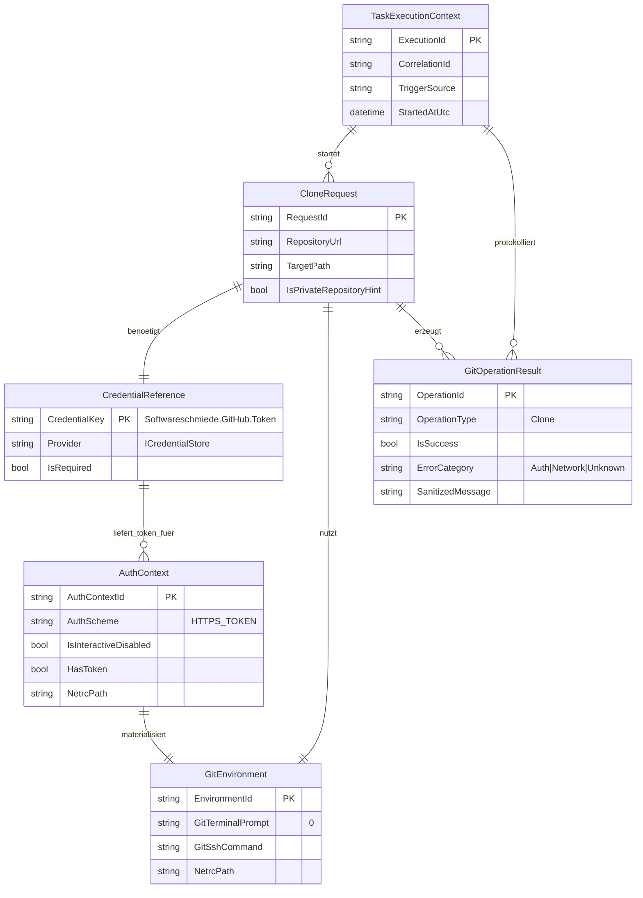

# Entity-Relationship-Modell – GitHub Clone Authentication Bugfix

> **Dokument-Typ:** Feature-spezifisches ERM  
> **Status:** Entwurf  
> **Betroffene Komponente:** `plugins/Softwareschmiede.Plugin.GitHub/GitHubPlugin.cs`

## 1. Referenzen

- Requirements: [`../requirements/github-clone-authentication-requirements-analysis.md`](../requirements/github-clone-authentication-requirements-analysis.md)
- Architektur-Blueprint: [`./github-clone-authentication-architecture-blueprint.md`](./github-clone-authentication-architecture-blueprint.md)
- Architektur-Review: [`../improvements/github-clone-authentication-architecture-review.md`](../improvements/github-clone-authentication-architecture-review.md)

## 2. Kontext und Scope

Dieses ERM beschreibt das **fachlich-technische Authentifizierungsmodell** rund um `CloneRepositoryAsync(...)`, damit `git clone` bei privaten HTTPS-Repositories **ohne interaktive Prompts** ausgeführt werden kann.

Fokus:
- Pre-Clone-Credential-Auflösung (`ICredentialStore`)
- Non-interactive Git-Kontext (`GIT_TERMINAL_PROMPT=0`)
- Clone-Ausführung mit Auth-Kontext
- Ergebnis-/Fehlerabbildung ohne Secret-Leak

## 3. Mermaid-ERM (konzeptionell)

## 4. Tabellarische Übersicht

| Entität / Value Object | Schlüssel | Wichtige Attribute | Beziehungen | Kardinalität |
|---|---|---|---|---|
| `TaskExecutionContext` | `ExecutionId` | `CorrelationId`, `TriggerSource`, `StartedAtUtc` | startet `CloneRequest`, aggregiert `GitOperationResult` | 1:n, 1:n |
| `CloneRequest` | `RequestId` | `RepositoryUrl`, `TargetPath`, `IsPrivateRepositoryHint` | benötigt `CredentialReference`, nutzt `GitEnvironment`, erzeugt `GitOperationResult` | 1:1, 1:1, 1:n |
| `CredentialReference` | `CredentialKey` | `Provider`, `IsRequired` | liefert Token für `AuthContext` | 1:n |
| `AuthContext` | `AuthContextId` | `AuthScheme`, `IsInteractiveDisabled`, `HasToken`, `NetrcPath` | materialisiert `GitEnvironment` | 1:1 |
| `GitEnvironment` | `EnvironmentId` | `GitTerminalPrompt`, `GitSshCommand`, `NetrcPath` | wird durch `CloneRequest` verwendet | 1:1 (pro Request) |
| `GitOperationResult` | `OperationId` | `OperationType`, `IsSuccess`, `ErrorCategory`, `SanitizedMessage` | gehört zu `CloneRequest` und `TaskExecutionContext` | n:1, n:1 |

## 5. Modellierungsentscheidungen

1. **`CredentialReference` statt Secret-Entität:** Das Modell referenziert nur den Store-Key (`Softwareschmiede.GitHub.Token`), nie den Token selbst. Das erfüllt das Sicherheitsziel „kein Klartext-Token in Logs/Exceptions“.
2. **`AuthContext` als eigener Value Object:** Trennt Credential-Auflösung von technischer Git-Umgebung und macht die Pre-Clone-Authentifizierungslogik explizit nachvollziehbar.
3. **`GitEnvironment` separat modelliert:** Variablen wie `GIT_TERMINAL_PROMPT=0`, `GIT_SSH_COMMAND` und optional `NETRC` sind ein eigenständiger, reproduzierbarer Ausführungskontext.
4. **`GitOperationResult` mit `SanitizedMessage`:** Fehler können nutzerverständlich abgebildet werden, ohne Token-Leak; passt zum Blueprint-Ziel der verbesserten Fehlermeldung.
5. **`TaskExecutionContext` als Hülle für Nachvollziehbarkeit:** Verknüpft Request und Ergebnis korrelierbar für Orchestrierung/Diagnose, ohne Plugin-Implementierungsdetails in die Domäne zu ziehen.

## 6. Konsistenzabgleich mit Architektur-Blueprint

| Blueprint-Aussage | ERM-Abbildung | Ergebnis |
|---|---|---|
| Token muss vor `git clone` bereitstehen | `CloneRequest -> CredentialReference -> AuthContext` | ✅ Konsistent |
| Clone muss non-interactive laufen (`GIT_TERMINAL_PROMPT=0`) | `GitEnvironment.GitTerminalPrompt` + Beziehung zu `CloneRequest` | ✅ Konsistent |
| HTTPS-tokenbasierte Auth vor erstem Netzaufruf | `AuthContext.AuthScheme=HTTPS_TOKEN` + `HasToken` | ✅ Konsistent |
| Auth-Fehler nutzerverständlich, ohne Secret-Leak | `GitOperationResult.ErrorCategory`, `SanitizedMessage` | ✅ Konsistent |
| Testbare Reihenfolge/Parameter im Clone-Pfad | explizite Aufspaltung in `CloneRequest`, `AuthContext`, `GitEnvironment`, `GitOperationResult` | ✅ Konsistent |

## 7. Mapping zum betroffenen Code (`GitHubPlugin.cs`)

- `CloneRequest` → `CloneRepositoryAsync(string repositoryUrl, string targetPath, ...)`
- `CredentialReference` → `_credentialStore.GetCredential("Softwareschmiede.GitHub.Token")`
- `AuthContext` / `GitEnvironment` → `GetGitEnvironment()` + Pre/Post-Clone Credential-Konfiguration
- `GitOperationResult` → `ICliRunner.RunAsync("git", ["clone", ...], ..., env, ...)` Ergebnis + Fehlerbehandlung (`InvalidOperationException`)
- `TaskExecutionContext` → aufrufender Orchestrierungskontext (Application-Service-Ebene)

## 8. Änderungsfokus gegenüber bestehendem Modell

- Der Authentifizierungsfluss wird von „post-clone credentials“ auf **„pre-clone auth context“** verlagert.
- `CloneRequest` ist der zentrale Aggregatanker; Credential-/Environment-Bestandteile sind davon abgeleitete Value Objects.
- Fehlermodellierung wird um **auth-spezifische, sanitizte Ergebnissemantik** ergänzt.

