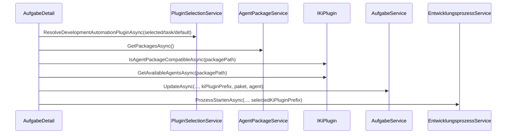
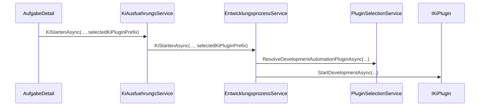

# Architektur-Blueprint – Issue 58: Agenten-Discovery und Agenten-Auswahl KI-Plugin-spezifisch

> **Dokument-Typ:** Feature-spezifischer Architektur-Blueprint  
> **Projekt:** Softwareschmiede  
> **Anforderungsquelle:** [../requirements/issue-58-agenten-discovery-agenten-auswahl-ki-plugin-spezifisch-requirements-analysis.md](../requirements/issue-58-agenten-discovery-agenten-auswahl-ki-plugin-spezifisch-requirements-analysis.md)  
> **Status:** 📋 Geplant  
> **Version:** 1.0.0

---

## 1) Zielbild

Die Lösung erzwingt durchgängig die Pflicht-/Optional-Logik:
1. KI-Plugin auswählen (**Pflicht**),
2. kompatibles Agentenpaket auswählen (**optional**),
3. verfügbaren Agenten auswählen (**optional**).

Discovery und Auswahl sind vollständig plugin-spezifisch. Startprompt und Folgeprompt nutzen dieselbe Auflösung.

---

## 2) Verbindliche Architekturentscheidungen

1. **Default ohne gespeichertes Plugin**  
   `explizit gewählt` → `Aufgabe.KiPluginPrefix` → `Plugin-Default (DevelopmentAutomation)` → `deterministischer Fallback`.

2. **Keine kompatiblen Pakete/Agenten**  
   UI zeigt Hinweiszustände; Start/Senden bleiben zulässig, sofern ein KI-Plugin verfügbar ist.

3. **Rückwärtskompatibilität**  
   `KiPluginPrefix` bleibt nullable; vorhandene Aufgaben ohne Wert werden über Fallback-Kette verarbeitet.

4. **Legacy Discovery entfernen**  
   Agenten-Erkennung liegt ausschließlich bei `IKiPlugin`; generische Discovery ohne Pluginkontext entfällt.

---

## 3) Komponenten und Verantwortlichkeiten

| Komponente | Verantwortung |
|---|---|
| `AufgabeDetail.razor(.cs)` | UI-Reihenfolge, Zustandsübergänge, Reset bei Plugin-/Paketwechsel, Validierung |
| `PluginSelectionService` | Zentrale Auflösung des effektiven KI-Plugins |
| `IAgentPackageService`/`AgentPackageReader` | Paket-Metadaten und Dateistruktur, keine plugin-unabhängige Agentenlogik |
| `IKiPlugin` + konkrete Plugins | Plugin-spezifische Agenten-Discovery und Kompatibilitätsprüfung |
| `EntwicklungsprozessService` | Startflow, Kompatibilitäts-Preflight, Prompt-Ausführung |
| `KiAusfuehrungsService` | Weitergabe von `selectedKiPluginPrefix` in Laufkontext |
| `AufgabeService` | Persistenz (`AgentenpaketName`, `AgentenName`, `KiPluginPrefix`) |

---

## 4) Flows

### 4.1 Startflow

### 4.2 Prompt-/Folgeprompt-Flow

---

## 5) UI/UX-Konzept

### 5.1 Reihenfolge und Zustände

- Reihenfolge ist: **KI-Plugin (Pflicht) → Paket (optional) → Agent (optional)**.
- Bei Pluginwechsel werden Paket/Agent zurückgesetzt.
- Bei Paketwechsel wird Agent zurückgesetzt.
- Aktionen sind aktiv, sobald ein gültiges KI-Plugin verfügbar ist (`ReadyToRun` auch ohne Paket/Agent möglich).

### 5.2 Fehler-/Leerezustände

- **NoPluginAvailable**: Keine KI-Plugins verfügbar.
- **NoCompatiblePackage**: Für gewähltes Plugin kein kompatibles Paket (Hinweis, nicht blockierend).
- **NoCompatibleAgent**: Paket vorhanden, aber keine Agenten (Hinweis, nicht blockierend).
- Nur `NoPluginAvailable` bleibt blockierend; alle anderen Zustände liefern Hinweise bei aktivem Start/Senden.

---

## 6) Daten- und Persistenzdesign

- Feld: `Aufgabe.KiPluginPrefix : string?` (nullable, rückwärtskompatibel).
- Bestehende Migration `AddKiPluginPrefix` wird als verpflichtender Bestandteil geführt.
- Persistenzpunkte:
  - bei Starten des Entwicklungsprozesses,
  - bei Speichern/Ändern der relevanten Aufgabenselektion.

---

## 7) Qualitätsziele

| ID | Ziel | Kriterium |
|---|---|---|
| Q-1 | Korrektheit | Nur kompatible Pakete/Agenten auswählbar |
| Q-2 | Konsistenz | Einheitliche Selektionslogik in Start + Folgeprompt |
| Q-3 | Robustheit | Keine Null-/Inkompatibilitätsabstürze bei fehlender Kompatibilität |
| Q-4 | Rückwärtskompatibilität | Aufgaben ohne `KiPluginPrefix` bleiben lauffähig |
| Q-5 | Wartbarkeit | Legacy-Discovery entfernt, Verantwortlichkeiten klar getrennt |

---

## 8) Risiken und Gegenmaßnahmen

| Risiko | Beschreibung | Gegenmaßnahme |
|---|---|---|
| R-1 | Doppelte UI-Selektion führt zu inkonsistentem Zustand | UI auf einen konsistenten Selektionsflow konsolidieren |
| R-2 | Fehlende kompatible Pakete blockieren Nutzer ohne Erklärung | Explizite Empty-State-Texte und Handlungshinweise |
| R-3 | Veralteter gespeicherter Prefix | Fallback + Warnlogging bei nicht auflösbarem Prefix |
| R-4 | Regressionen durch Entfernen von Legacy-Pfaden | Testmatrix für Discovery/Flow/Fallbacks erweitern |

---

## 9) Umsetzungsreihenfolge

1. Plugin-Auflösung und Discovery-Verantwortung final konsolidieren.
2. UI-Reihenfolge + Zustandsautomat refactoren.
3. Persistenz- und Auflösungsfluss für `KiPluginPrefix` in allen Pfaden vereinheitlichen.
4. Legacy-Discovery-Pfade entfernen.
5. Tests (Unit/bUnit/Integration) aktualisieren.

---

## 10) Versionierung

| Version | Datum | Autor | Änderung |
|---|---|---|---|
| 1.0.0 | 2026-05-24 | planning-orchestrator | Initialer Architektur-Blueprint für Issue 58 |
| 1.1.0 | 2026-05-25 | documentation-orchestrator | Sollzustand aktualisiert: KI-Plugin Pflicht, Agentenpaket/Agent optional |
