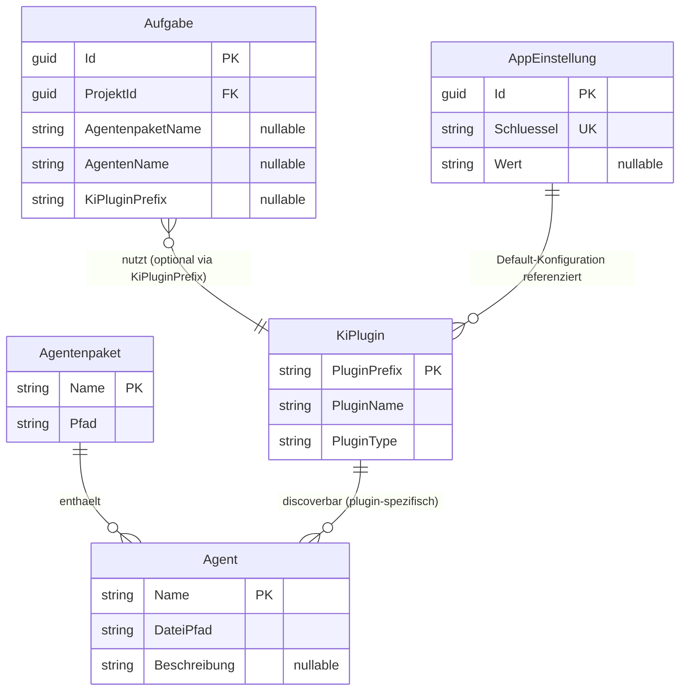

# Entity-Relationship-Modell – Issue 58: Agenten-Discovery und Agenten-Auswahl KI-Plugin-spezifisch

> **Dokument-Typ:** Feature-spezifisches ERM  
> **Projekt:** Softwareschmiede  
> **Anforderungsquelle:** [../requirements/issue-58-agenten-discovery-agenten-auswahl-ki-plugin-spezifisch-requirements-analysis.md](../requirements/issue-58-agenten-discovery-agenten-auswahl-ki-plugin-spezifisch-requirements-analysis.md)  
> **Architekturquelle:** [./issue-58-agenten-discovery-agenten-auswahl-ki-plugin-spezifisch-architecture-blueprint.md](./issue-58-agenten-discovery-agenten-auswahl-ki-plugin-spezifisch-architecture-blueprint.md)  
> **Status:** 📋 Geplant  
> **Version:** 1.0.0

---

## 1) Kontext

Für Issue 58 ist das zentrale Persistenzartefakt `Aufgabe.KiPluginPrefix`.  
Discovery selbst bleibt plugin-spezifische Runtime-Logik und wird nicht als separate Discovery-Tabelle persistiert.

---

## 2) ERM-Diagramm

---

## 3) Tabellarische Übersicht

| Entität | Schlüssel | Wichtige Attribute | Zweck |
|---|---|---|---|
| `Aufgabe` | `Id` | `KiPluginPrefix`, `AgentenpaketName`, `AgentenName` | Persistenter Task-Kontext |
| `AppEinstellung` | `Id`, `Schluessel` | `Wert` | Default-Plugin je Plugin-Typ |
| `KiPlugin` (Runtime) | `PluginPrefix` | `PluginName`, `PluginType` | Auflösbare KI-Plugin-Instanzen |
| `Agentenpaket` (Runtime) | `Name` | `Pfad` | Paketknoten im Dateisystem |
| `Agent` (Runtime) | `Name` | `DateiPfad`, `Beschreibung` | Plugin-spezifisch verfügbare Agenten |

---

## 4) Integritäts- und Auflösungsregeln

1. `Aufgabe.KiPluginPrefix` ist nullable (Rückwärtskompatibilität).
2. Auflösung des effektiven Plugins erfolgt in Reihenfolge:
   - explizit gewählter Prefix,
   - `Aufgabe.KiPluginPrefix`,
   - Default-Einstellung (`plugins.default.DevelopmentAutomation`),
   - deterministischer Fallback.
3. Agenten-Auswahl ist nur gültig, wenn Paket + Agent mit aufgelöstem KI-Plugin kompatibel sind.
4. Inkompatible Pakete/Agenten dürfen nicht ausführbar sein.

---

## 5) Modellierungsentscheidungen

- **Kein Discovery-Persistenzmodell**: Kompatibilität und Agentenlisten bleiben Laufzeitfunktionen der Plugins.
- **Task-zentrierte Persistenz**: `KiPluginPrefix` in `Aufgabe` sichert Konsistenz zwischen Start und Folgeprompt.
- **Default entkoppelt in Einstellungen**: Rückfall auf zentrale Default-Konfiguration bleibt möglich.

---

## 6) Konsistenzabgleich mit Architektur

| Architekturvorgabe | ERM-Abbildung | Ergebnis |
|---|---|---|
| Persistenz pro Aufgabe | `Aufgabe.KiPluginPrefix` | ✅ |
| Rückwärtskompatibilität | Nullable-Spalte | ✅ |
| Plugin-spezifische Discovery | Runtime-Entitäten `KiPlugin`/`Agent` | ✅ |
| Einheitlicher Auflösungsflow | Integritätsregel 2 | ✅ |

---

## 7) Versionierung

| Version | Datum | Autor | Änderung |
|---|---|---|---|
| 1.0.0 | 2026-05-24 | planning-orchestrator | Initiales ERM für Issue 58 |

