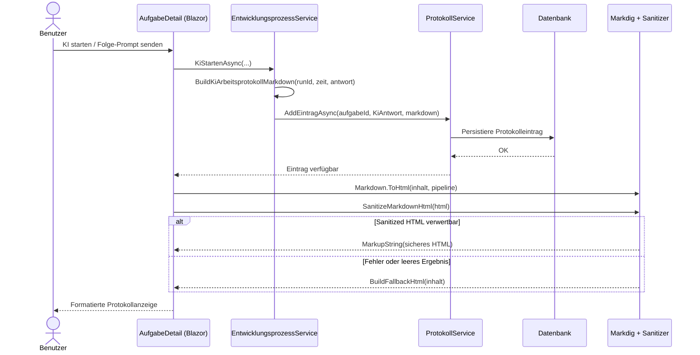

# Architektur-Blueprint – KI-Arbeitsprotokoll als Markdown

> **Dokument-Typ:** Architektur-Blueprint  
> **Status:** Aktualisiert (Stand Anforderungen v1.1.0)  
> **Betroffene Komponenten:** `EntwicklungsprozessService`, `AufgabeDetail.razor`, `AufgabeDetail.razor.cs`

---

## 1. Referenzen

- Requirements: [`../requirements/ki-arbeitsprotokoll-markdown-requirements-analysis.md`](../requirements/ki-arbeitsprotokoll-markdown-requirements-analysis.md)
- ERM: [`./ki-arbeitsprotokoll-markdown-entity-relationship-model.md`](./ki-arbeitsprotokoll-markdown-entity-relationship-model.md)
- Architektur-Review: [`../improvements/ki-arbeitsprotokoll-markdown-architecture-review.md`](../improvements/ki-arbeitsprotokoll-markdown-architecture-review.md)
- Ablaufdokument: [`../flows/ki-arbeitsprotokoll-rendering-flow.md`](../flows/ki-arbeitsprotokoll-rendering-flow.md)
- Implementierung:  
  - `src/Softwareschmiede/Application/Services/EntwicklungsprozessService.cs`  
  - `src/Softwareschmiede/Components/Pages/Aufgaben/AufgabeDetail.razor`  
  - `src/Softwareschmiede/Components/Pages/Aufgaben/AufgabeDetail.razor.cs`

---

## 2. Zielbild

Das KI-Arbeitsprotokoll wird nicht mehr als unstrukturierter Textblock behandelt, sondern als konsistentes Markdown-Artefakt mit klarer Semantik erzeugt und angezeigt.  
Jeder neue KI-Protokolleintrag beginnt mit einer Datumszeile im Format `# {Datum}` (konkret `# yyyy-MM-dd`), enthält eine nachvollziehbare RunId-Metadatenzeile und trennt die Antwort in eigenständige `## Schritt n`-Abschnitte mit klaren Leerzeilen zwischen den Schrittblöcken.

In der Webausgabe der Aufgabendetailseite wird dieser Inhalt über eine definierte Markdown-Render-Pipeline in HTML umgewandelt, sanitisiert und als formatiertes Markup dargestellt. Überschriften sowie weitere Markdown-Elemente (z. B. Listen, Links, Code) bleiben dabei sichtbar und benutzbar, ohne Sicherheitsregeln zu verletzen.

---

## 3. Betroffene Schichten

- **Presentation (Blazor UI):**  
  `AufgabeDetail.razor` bindet die Protokollausgabe über `@RenderProtokollInhalt(eintrag.Inhalt)` ein und rendert damit Markdown-basiertes Ergebnis statt reinen Rohtext.

- **Application (Use-Case-Orchestrierung):**  
  `EntwicklungsprozessService` erzeugt die persistierte Markdown-Struktur in `BuildKiArbeitsprotokollMarkdown(...)` und verwendet diese für normale sowie fehlerhafte KI-Läufe.

- **Domain (fachliche Protokollbedeutung):**  
  Protokolleinträge vom Typ `KiAntwort` tragen weiterhin den fachlichen Verlauf, nun jedoch in strukturierter, standardisierter Markdown-Form.

- **Infrastructure (Persistenz/Rendering-Bibliotheken):**  
  Persistenz bleibt unverändert über bestehende Protokollspeicherung; die Darstellung nutzt Markdig-Pipeline plus nachgelagertes Sanitizing in der UI-Logik.

---

## 4. Technologieentscheidungen

| Entscheidung | Umsetzung | Begründung |
|---|---|---|
| Datumszeile als Markdown-H1 | `builder.AppendLine($"# {zeitpunktUtc:yyyy-MM-dd}")` in `BuildKiArbeitsprotokollMarkdown` | Erfüllt FR-1.1 exakt und sorgt für visuelle Hauptstruktur im Protokoll. |
| Deterministische Schritttrennung mit Blockabstand | Nicht-leere Antwortzeilen werden in `## Schritt {i+1}` überführt; zwischen Schrittblöcken wird mindestens eine Leerzeile eingefügt; bei leerer Antwort wird `## Schritt 1` mit Fallbacktext erzeugt | Stellt FR-1.2 und klarere visuelle Trennung sicher, auch bei leeren oder fehlerhaften Antworten. |
| Markdown-Rendering in Webausgabe | `Markdown.ToHtml(inhalt, _protokollMarkdownPipeline)` in `RenderProtokollInhalt` | Erfüllt FR-2 und macht Markdown-Semantik in der Oberfläche sichtbar. |
| Sichere Pipeline mit deaktiviertem Raw-HTML | `new MarkdownPipelineBuilder().UseAdvancedExtensions().DisableHtml().Build()` | Reduziert Angriffsfläche bereits vor Sanitizing und unterstützt dennoch Standard-Markdown-Features. |
| Nachgelagertes Sanitizing | `SanitizeMarkdownHtml` entfernt `on*`-Attribute und neutralisiert unsichere `href/src`-Schemes | Erfüllt FR-2.1 und NFR-2 für sichere HTML-Ausgabe. |
| Fallback auf encodierte `<pre>`-Ausgabe | Bei Fehlern/leerem Sanitizing greift `BuildFallbackHtml` mit `HtmlEncoder.Default.Encode(...)` | Erfüllt FR-2.2 und NFR-3, da Anzeige auch im Fehlerfall stabil bleibt. |

---

## 5. Ablauf/Sequenz

---

## 6. UI/UX-Konzept

Die Protokollkarte in `AufgabeDetail.razor` bleibt in ihrer Position und Interaktionslogik unverändert, zeigt aber Inhalte semantisch formatiert an.  
Die Datums-H1 fungiert als sichtbarer Einstieg pro KI-Lauf; darunter werden Einzelschritte als H2-Struktur dargestellt. Dadurch entsteht ein klarer visueller Scan-Pfad: Datum → Metadaten → Schrittfolge.

Für Anwender bedeutet dies:

1. Schnellere zeitliche Einordnung über die H1-Datumszeile.
2. Bessere Nachvollziehbarkeit des Arbeitsverlaufs durch klar getrennte Schrittblöcke (inkl. Leerzeilen zwischen Schritten) statt Fließtextblock.
3. Konsistente Darstellung von Markdown-Elementen innerhalb desselben Protokollcontainers.
4. Stabiler Lesemodus auch im Fehlerfall durch `<pre>`-Fallback statt leerer/defekter Ausgabe.

Das Styling bleibt kompatibel mit der bestehenden Klasse `protokoll-markdown markdown-preview`; es wird kein separates Redesign der Seite eingeführt.

---

## 7. Qualitätsziele

| Qualitätsziel | Zieldefinition | Architekturmaßnahme |
|---|---|---|
| Lesbarkeit | Neue KI-Protokolle sind strukturiert, zeitlich einordenbar und schrittweise verständlich | H1-Datumszeile + standardisierte `## Schritt n`-Blöcke + Leerzeilen zwischen Schrittblöcken |
| Sicherheit | Keine unsicheren HTML-Inhalte in der Ausgabe | `DisableHtml` + Regex-Sanitizing für Event-Handler und unsichere URI-Schemes |
| Robustheit | Protokollanzeige bricht bei Renderproblemen nicht ab | Defensive `try/catch`-Renderlogik + encodiertes `<pre>`-Fallback |
| Konsistenz Ende-zu-Ende | Erzeugung und Anzeige folgen demselben Markdown-Vertrag | Einheitliche Struktur im Service und direkte Markdown-Renderung im UI |
| Wartbarkeit/Testbarkeit | Kernregeln bleiben automatisiert überprüfbar | Klare, separierte Methoden (`BuildKiArbeitsprotokollMarkdown`, `RenderProtokollInhalt`, `SanitizeMarkdownHtml`) |

---

## 8. Konkrete Komponenten- und Datenflussänderungen

### 8.1 Komponentenänderungen

| Komponente | Konkrete Änderung | Wirkung |
|---|---|---|
| `EntwicklungsprozessService.BuildKiArbeitsprotokollMarkdown(...)` | Erzwingt Protokollkopf als `# {Datum}` und erzeugt Schrittblöcke `## Schritt n` mit expliziter Leerzeile zwischen Blöcken | Klar getrennte, konsistente Markdown-Struktur in der Persistenz |
| `AufgabeDetail.razor` | Rendert Protokollinhalt weiterhin über `RenderProtokollInhalt(...)` im Markdown-Container | Kein Rohtext mehr, sondern formatierte Darstellung in der UI |
| `AufgabeDetail.razor.cs` (`RenderProtokollInhalt`, `SanitizeMarkdownHtml`, `BuildFallbackHtml`) | Definierte Markdown→HTML-Pipeline inkl. Sanitizing und robustem Fallback bleibt verbindlich | Sichere, stabile Web-Ausgabe mit sichtbaren Markdown-Strukturen |

### 8.2 Datenflussänderungen

| Schritt im Datenfluss | Vorher | Neu |
|---|---|---|
| Erzeugung im KI-Lauf | Textblock ohne klare Blockgrenzen | Strukturierter Markdown-Inhalt mit `# {Datum}` und getrennten `## Schritt n`-Blöcken |
| Persistierung | Unstrukturierter `Inhalt` in `Protokolleintrag` | Semantisch strukturierter Markdown-`Inhalt` in `Protokolleintrag` |
| Anzeige in Web-UI | Textnahe Darstellung mit eingeschränkter Semantik | Formatiertes Markdown-Rendering (Headings, Listen, Code, Links) mit Sanitizing/Fallback |

---

## 9. Änderungsumfang

### Zu ändern

1. `src/Softwareschmiede/Application/Services/EntwicklungsprozessService.cs`  
   Sicherstellen/fortführen, dass KI-Antworten ausschließlich als strukturiertes Markdown mit `# {Datum}` und `## Schritt n` gespeichert werden.
2. `src/Softwareschmiede/Components/Pages/Aufgaben/AufgabeDetail.razor`  
   Protokollinhalt über `RenderProtokollInhalt` in Markdown-fähigem Container ausgeben.
3. `src/Softwareschmiede/Components/Pages/Aufgaben/AufgabeDetail.razor.cs`  
   Rendering-Pipeline, Sanitizing und Fallback auf Sicherheits- und Robustheitsanforderungen ausrichten.
4. Verknüpfte Dokumentation (`Flow`, Review, ERM)  
   Architekturentscheidungen und Sequenzfluss konsistent zur Implementierung halten.

### Nicht zu ändern

1. Datenbankschema und Entitätenstruktur der Protokollpersistenz.  
2. Öffentliche API-Oberflächen außerhalb der Aufgabendetailseite.  
3. Gesamtlayout der Aufgabenseite (kein UI-Redesign).  
4. Historische Alt-Protokolle (keine rückwirkende Massenmigration erforderlich).

---

## 10. Architektur-Akzeptanzkriterien

1. Jeder neu erzeugte KI-Protokolleintrag beginnt mit `# yyyy-MM-dd` als erster Inhaltszeile.  
2. Die Schritttrennung erfolgt deterministisch über `## Schritt n`; zwischen den Schritten steht mindestens eine Leerzeile; bei leerer Antwort entsteht mindestens `## Schritt 1`.  
3. Die Aufgabendetailseite rendert Protokollinhalte als Markdown-basiertes HTML, sodass `#`/`##` als Headings sichtbar sind.  
4. Die Render-Pipeline verwendet eine definierte Markdown-Konfiguration und nachgelagertes Sanitizing vor DOM-Ausgabe.  
5. Unsichere URI-Schemes und HTML-Event-Attribute werden neutralisiert oder entfernt.  
6. Bei Render- oder Sanitizing-Fehlern wird ein sicher encodierter `<pre>`-Fallback statt rohem HTML ausgegeben.  
7. Der dokumentierte Ablauf ist konsistent mit [`../flows/ki-arbeitsprotokoll-rendering-flow.md`](../flows/ki-arbeitsprotokoll-rendering-flow.md).

---

## 11. Annahmen

1. KI-Antworten liegen als zeilenbasierter Rohtext vor und können ohne semantischen Verlust in Schritte segmentiert werden.  
2. Der Laufzeitkontext liefert einen verlässlichen UTC-Zeitpunkt für die Datumszeile.  
3. Markdig bleibt als zentraler Markdown-Renderer in der Webschicht verfügbar.  
4. Sanitizing-Regeln über Regex sind für den aktuellen Bedrohungsrahmen ausreichend und werden durch Tests abgesichert.  
5. Bestehende CSS-Regeln für `markdown-preview` unterstützen Heading- und Standard-Markdown-Darstellung ohne strukturelle UI-Änderung.

---

## 12. Risiken & Gegenmaßnahmen

| Risiko | Auswirkung | Gegenmaßnahme |
|---|---|---|
| Uneinheitliche Protokollstruktur bei zukünftigen Änderungen | Verlust von Lesbarkeit und Teststabilität | Strukturvertrag (`# Datum`, `## Schritt n`) als feste Akzeptanzkriterien und Testfälle verankern |
| Sicherheitslücken durch unzureichende HTML-Bereinigung | XSS-/Script-Injection-Risiken in der Protokollansicht | `DisableHtml`, Sanitizing-Regex, negative Sicherheitstests, Fallback auf encodiertes `<pre>` |
| Rendering-Ausnahmen bei Sonderinhalten | Leere oder fehlerhafte UI-Ausgabe | `try/catch` in `RenderProtokollInhalt` und garantierter Fallbackpfad |
| Veraltete Dokumentation gegenüber realem Codefluss | Fehlentscheidungen bei Wartung/Erweiterung | Konsistente Querverweise zwischen Requirements, Flow, Blueprint und Review fortlaufend pflegen |
