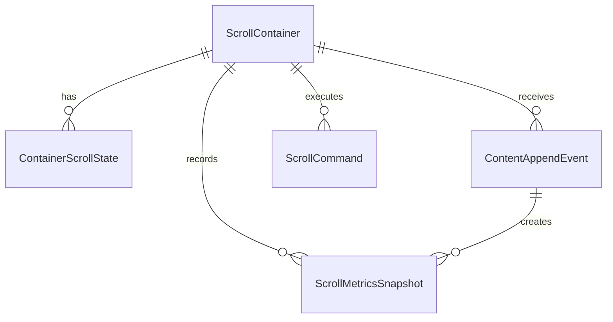

# Entity-Relationship-Model – KI-Protokoll Auto-Scroll

**Feature-Slug:** `ki-protokoll-auto-scroll`  
**Referenz:** `ki-protokoll-auto-scroll-architecture-blueprint.md`

## Zweck
Logisches In-Memory-ERM für Scrollzustand und Entscheidungslogik (kein persistentes Datenbankschema).

## Entitäten
### 1. ScrollContainer
- `containerId` (PK)
- `name` (z. B. Streaming, Historie)
- `selector`

### 2. ContainerScrollState
- `stateId` (PK)
- `containerId` (FK -> ScrollContainer)
- `initialScrollPending` (bool)
- `isAtEndBeforeUpdate` (bool)
- `shouldScrollAfterAppend` (bool)
- `updateVersion` (int)
- `pendingScrollVersion` (int)

### 3. ContentAppendEvent
- `eventId` (PK)
- `containerId` (FK -> ScrollContainer)
- `occurredAt`
- `appendedItemCount`

### 4. ScrollMetricsSnapshot
- `snapshotId` (PK)
- `containerId` (FK -> ScrollContainer)
- `phase` (`beforeAppend`, `afterAppend`, `afterScroll`)
- `scrollTop`
- `scrollHeight`
- `clientHeight`
- `distanceToBottom`

### 5. ScrollCommand
- `commandId` (PK)
- `containerId` (FK -> ScrollContainer)
- `commandType` (`scrollToEnd`, `noAction`)
- `reason` (`initialVisible`, `appendAtEnd`, `appendNotAtEnd`, `errorFallback`)
- `executedAt`
- `success`

## Beziehungen
- `ScrollContainer 1:n ContainerScrollState`
- `ScrollContainer 1:n ContentAppendEvent`
- `ScrollContainer 1:n ScrollMetricsSnapshot`
- `ScrollContainer 1:n ScrollCommand`
- `ContentAppendEvent 1:n ScrollMetricsSnapshot`

## Invarianten
1. Zustände sind pro Container isoliert.
2. Bei `shouldScrollAfterAppend = false` darf kein `scrollToEnd` ausgelöst werden.
3. Für jedes Append-Event muss mindestens ein `beforeAppend`-Snapshot existieren.
4. Scrollkommando nach Update nur bei Versionsgleichheit (`pendingScrollVersion == updateVersion`).

## Mermaid-Überblick

