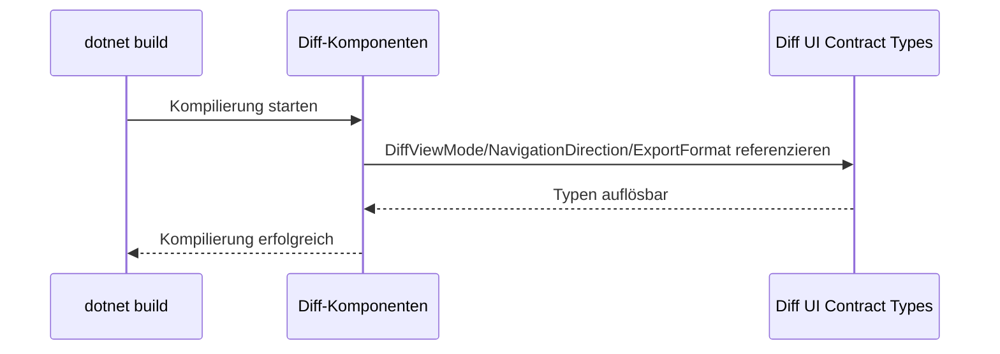

# Architektur-Blueprint – Behebung der Kompilierfehler im Diff-Modul

> **Dokument-Typ:** Architecture Blueprint  
> **Status:** Zur Umsetzung freigegeben  
> **Version:** 1.0.0  
> **Datum:** 2026-05-22

---

## 1. Referenzen

- Anforderungen: [../requirements/kompilierfehler-requirements-analysis.md](../requirements/kompilierfehler-requirements-analysis.md)
- ERM: [./kompilierfehler-entity-relationship-model.md](./kompilierfehler-entity-relationship-model.md)
- Review: [../improvements/kompilierfehler-architecture-review.md](../improvements/kompilierfehler-architecture-review.md)

---

## 2. Architekturentscheidung

Die drei Diff-UI-Typen (`DiffViewMode`, `NavigationDirection`, `ExportFormat`) werden als **zentraler, gemeinsam genutzter UI-Vertrag** geführt (dedizierte `.cs`-Datei im Diff-Modul bzw. gemeinsamer UI-Contracts-Namespace), statt implizit/lokal in einer Razor-Datei.

Begründung:
1. Razor-Datei-lokale Typen sind für andere Komponenten fehleranfällig.
2. Ein zentraler Vertrag reduziert Kopplungsfehler und verbessert Wartbarkeit.
3. Die Fehlerklasse (`CS0246`) adressiert genau Sichtbarkeit/Referenzierbarkeit.

---

## 3. Zielarchitektur (Komponenten und Verantwortlichkeiten)

| Komponente | Verantwortung |
|---|---|
| `DiffViewer.razor` | Orchestrierung von Anzeigezustand, Navigation und Exportaktionen |
| `DiffToolbar.razor` | Bedienlogik für ViewMode, Navigation, Export |
| `DiffContent.razor` | Rendering/Filterung sichtbarer Diff-Zeilen |
| `Diff UI Contract Types` (`.cs`) | Gemeinsame Enums und Signaturen |

---

## 4. Logische Ablaufarchitektur

---

## 5. Architekturregeln (MUST)

1. Diff-UI-Typen dürfen nur an einer kanonischen Stelle definiert sein.
2. Alle Diff-Komponenten müssen denselben Namespace/Vertrag verwenden.
3. Keine zweite Definition derselben Enum-Namen in anderen Razor-Dateien.
4. Build-Pipeline muss den Bereich durchgängig validieren.

---

## 6. Qualitätsziele

| Qualitätsziel | Zielwert | Maßnahme |
|---|---|---|
| Build-Stabilität | 0 Compile-Fehler im Diff-Modul | Zentralisierte Typdefinition |
| Wartbarkeit | keine Typduplikate | Single Source of Truth für Enums |
| Änderbarkeit | Erweiterung von Modi ohne Querfehler | Vertragstypen in dedizierter Datei |
| Nachvollziehbarkeit | reproduzierbare Fehler-/Fix-Kette | Build- und Review-Dokumentation |

---

## 7. Umsetzungsstrategie

1. Typdefinitionen in dedizierte `.cs`-Datei überführen/zentralisieren.
2. Komponenten-Imports und Referenzen vereinheitlichen.
3. Build lokal und in Testprojekten ausführen.
4. Bei Erfolg Review-Auflagen prüfen und abschließen.

---

## 8. Teststrategie (Architekturebene)

1. **Build-Test:** `dotnet build Softwareschmiede.slnx`.
2. **Kompilationsgrenzentest:** Diff-Komponenten einzeln auflösen lassen (Razor compile).
3. **Regressionscheck:** bestehende Tests der betroffenen Projekte ausführen.

---

## 9. Risiken und Trade-offs

| Entscheidung | Vorteil | Nachteil |
|---|---|---|
| Zentraler Vertragstyp | klare Referenzen, weniger Compile-Fehler | zusätzliche Datei/Struktur notwendig |
| Kein funktionales Redesign | schnelle Stabilisierung | UX-Themen bleiben unverändert |

Restrisiken:
- Verbleibende implizite Referenzen in nicht betrachteten Komponenten.
- Folgefehler, falls weitere Typen ähnlich verteilt sind.

---

## 10. Migrations-/Rollout-Hinweis

- Keine Datenmigration erforderlich.
- Rollout erfolgt über normalen Code- und Build-Prozess.
- Erfolgskriterium bleibt ein vollständiger grüner Build.
