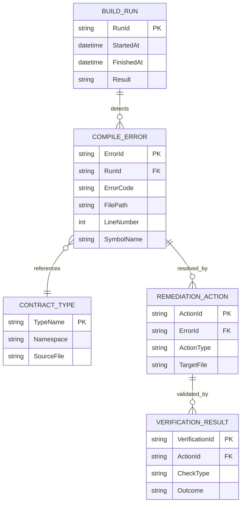

# ERM – Kompilierfehlerbehebung im Diff-Modul

> **Dokument-Typ:** Entity-Relationship-Model  
> **Status:** Abgeleitet aus Architektur-Blueprint  
> **Version:** 1.0.0  
> **Datum:** 2026-05-22

---

## 1. Referenzen

- Anforderungen: [../requirements/kompilierfehler-requirements-analysis.md](../requirements/kompilierfehler-requirements-analysis.md)
- Architektur: [./kompilierfehler-architecture-blueprint.md](./kompilierfehler-architecture-blueprint.md)
- Review: [../improvements/kompilierfehler-architecture-review.md](../improvements/kompilierfehler-architecture-review.md)

---

## 2. Persistenzrelevanz

**Ergebnis:** Keine Änderung am persistenten Datenmodell erforderlich.

Begründung:
1. Das Problem ist compile-/strukturbezogen.
2. Es werden nur Code- und Typdefinitionen konsolidiert.
3. Keine neue fachliche Persistenzanforderung abgeleitet.

---

## 3. Logisches Laufzeit-/Arbeitsmodell

---

## 4. Entitätenübersicht

| Entität | Beschreibung | Persistenz |
|---|---|---|
| `BUILD_RUN` | Repräsentiert einen Build-Lauf zur Fehlerdetektion | Nein (logisch) |
| `COMPILE_ERROR` | Einzelner Compilerfehler (z. B. `CS0246`) | Nein (logisch) |
| `CONTRACT_TYPE` | Gemeinsamer UI-Vertragstyp (Enum) | Code-Artefakt |
| `REMEDIATION_ACTION` | Korrekturmaßnahme zur Fehlerbehebung | Nein (logisch) |
| `VERIFICATION_RESULT` | Nachweisergebnis (Build/Test) | Nein (logisch) |

---

## 5. Kardinalitäten

1. Ein `BUILD_RUN` erkennt 0..n `COMPILE_ERROR`.
2. Ein `COMPILE_ERROR` referenziert genau einen primären `CONTRACT_TYPE`-Konflikt.
3. Ein `COMPILE_ERROR` hat 1..n `REMEDIATION_ACTION`.
4. Eine `REMEDIATION_ACTION` wird durch 1..n `VERIFICATION_RESULT` abgesichert.

---

## 6. Konsequenz für Schema/Migration

- **Neue Tabellen:** keine
- **Schemaänderungen:** keine
- **Migration:** nicht erforderlich
- **Rollback auf DB-Ebene:** entfällt

---

## 7. Modellierungsentscheidungen

1. Der ERM-Fokus liegt auf einem logischen Fehlerbehebungsprozess, nicht auf Persistenz.
2. Vertragstypen werden als Code-Domänenobjekte betrachtet.
3. Verifikation ist Pflichtbestandteil des Modells (Build/Test als Nachweis).
