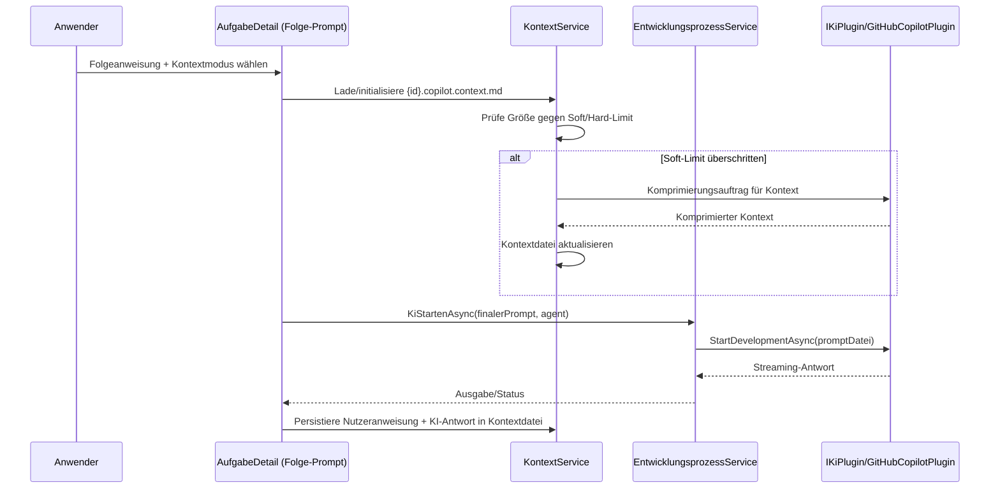

# Architektur-Blueprint – Kontextsteuerung bei Folgeanweisungen

> **Dokument-Typ:** Architektur-Blueprint  
> **Status:** Aktualisiert  
> **Betroffene Komponente:** `src/Softwareschmiede/Components/Pages/Aufgaben/AufgabeDetail.razor`  
> **Betroffene Logik:** `src/Softwareschmiede/Components/Pages/Aufgaben/AufgabeDetail.razor.cs`, `src/Softwareschmiede/Application/Services/EntwicklungsprozessService.cs`, `plugins/Softwareschmiede.Plugin.GitHubCopilot/GitHubCopilotPlugin.cs`

---

## 1. Referenzen

- Requirements: [`../requirements/kontextsteuerung-folgeanweisungen-requirements-analysis.md`](../requirements/kontextsteuerung-folgeanweisungen-requirements-analysis.md)
- ERM: [`./kontextsteuerung-folgeanweisungen-entity-relationship-model.md`](./kontextsteuerung-folgeanweisungen-entity-relationship-model.md)
- Architektur-Review: [`../improvements/kontextsteuerung-folgeanweisungen-architecture-review.md`](../improvements/kontextsteuerung-folgeanweisungen-architecture-review.md)

---

## 2. Zielbild

Folgeanweisungen erhalten eine explizite Kontextsteuerung mit exakt drei Modi: **Kontext mitgeben**, **Kontext ignorieren**, **Kontext neu beginnen**.  
Der Verlauf wird auf Aufgabenebene in einer dedizierten Kontextdatei persistiert, vor dem Senden deterministisch in die Anweisungsdatei injiziert (falls Modus aktiv), bei Größenüberschreitung KI-gestützt komprimiert und vollständig nachvollziehbar protokolliert.

---

## 3. Betroffene Schichten

- **Presentation:** Erweiterung der Folge-Prompt-Card in `AufgabeDetail.razor` um Kontextmodus-Auswahl und Statushinweise.
- **Application:** Orchestrierung in `AufgabeDetail.razor.cs` und `EntwicklungsprozessService` für Kontext laden, anwenden, komprimieren, persistieren.
- **Domain:** Einführung eines stabilen Kontextmodus-Enums (`Mitgeben`, `Ignorieren`, `NeuBeginnen`) und Kontext-Lifecycle-Regeln pro Aufgabe.
- **Infrastructure:** Dateibasierte Persistenz je Aufgabe (`{id}.copilot.context.md`) im lokalen Aufgaben-Repository; unveränderte Plugin-Schnittstelle.

---

## 4. Technologieentscheidungen

| Entscheidung | Beschreibung | Begründung |
|---|---|---|
| Kontextdatei pro Aufgabe | Persistenz unter `<lokalerKlonPfad>/{aufgabeId}.copilot.context.md`. | Eindeutige Zuordnung, keine zusätzliche DB-Migration, kompatibel zum bestehenden Dateifluss (`*.copilot-task.md`). |
| Strukturierte Append-Strategie | Nach jedem Folgezyklus werden Nutzeranweisung + KI-Antwort inkl. Metadaten (Modus, Zeit, Agent, ggf. Komprimierung) angehängt. | Unterstützt Auditierbarkeit (NFR-3) und robuste Rekonstruktion des Verlaufs. |
| Deterministische Prompt-Komposition | Bei Modus **Mitgeben** wird `Kontextdatei + Trennmarker + Nutzeranweisung` in die laufbezogene Anweisungsdatei geschrieben; bei **Ignorieren** nur Nutzeranweisung; bei **NeuBeginnen** erst Kontextdatei resetten, dann nur Nutzeranweisung. | Erfüllt FR-2/FR-2.1 und verhindert Reihenfolgefehler. |
| Größenmanagement über konfigurierbare Schwellwerte | Einführung `ContextCompressionSoftLimit` und `ContextCompressionHardLimit` (Zeichen + Token-Schätzer). Überschreitung des Soft-Limits triggert KI-Komprimierung vor Prompt-Erzeugung. | Verhindert Kontextüberlauf (FR-3, NFR-2) bei kontrollierter Kosten-/Latenzsteuerung. |
| Komprimierung als eigener Agentenauftrag | Komprimierung nutzt denselben KI-Pfad mit spezialisiertem Komprimierungs-Prompt und schreibt die verdichtete Fassung zurück in `{id}.copilot.context.md`. | Wiederverwendung bestehender KI-Infrastruktur, keine neue externe Abhängigkeit. |
| UI über Pflichtauswahl mit drei festen Optionen | Radio- oder Select-Control mit exakt den drei Labels „Kontext mitgeben“, „Kontext ignorieren“, „Kontext neu beginnen“. Default: „Kontext mitgeben“. | Erfüllt FR-4/FR-4.1, reduziert Fehlbedienung, klare Nutzerführung. |

---

## 5. Ablauf / Sequenz

---

## 6. UI/UX-Konzept (Kontextmodi)

- **Interaktionsort:** Bestehende Karte „🔄 Folge-Prompt“ in `AufgabeDetail.razor`.
- **Optionen (exakt):**
  1. **Kontext mitgeben** – vorhandener Verlauf wird vorangestellt.
  2. **Kontext ignorieren** – Folgeanweisung ohne Präfix.
  3. **Kontext neu beginnen** – aktiven Verlauf zurücksetzen, neuer Verlauf ab aktueller Folgeanweisung.
- **UX-Regeln:**
  - Eine Option ist immer aktiv (Default: *Kontext mitgeben*).
  - Bei *Kontext neu beginnen* wird vor dem Senden ein klarer Hinweis angezeigt („bisheriger Verlauf wird ersetzt“).
  - Gewählter Modus wird im Protokoll sichtbar abgelegt.

---

## 7. Qualitätsziele

| Qualitätsziel | Zieldefinition | Architekturmaßnahme |
|---|---|---|
| Performance | Prompt-Aufbereitung im Median < 500 ms ohne Komprimierung | Dateilesen lokal, string-basierte Komposition ohne zusätzliche Remote-Calls |
| Skalierbarkeit | 99 % der Langverläufe bleiben innerhalb nutzbarer LLM-Grenzen | Soft/Hard-Limits + automatisierte Komprimierung |
| Nachvollziehbarkeit | Kontextmodus + Komprimierungsereignisse auditierbar | Strukturierte Kontexteinträge + Protokolleinträge je Lauf |
| Sicherheit | Keine zusätzlichen Secrets in Kontextdateien | Nur bestehende Prompt-/Antwortinhalte, keine Tokenpersistenz |
| Testbarkeit | Modus-Mapping und Reihenfolge deterministisch prüfbar | Klare pure Build-Logik für finalen Prompt + Service-Tests |

---

## 8. Änderungsumfang

### Zu ändern
1. `src/Softwareschmiede/Components/Pages/Aufgaben/AufgabeDetail.razor` (UI für Kontextmodi)
2. `src/Softwareschmiede/Components/Pages/Aufgaben/AufgabeDetail.razor.cs` (Modusauswahl und Übergabe)
3. `src/Softwareschmiede/Application/Services/EntwicklungsprozessService.cs` (Prompt-Komposition, Trigger Komprimierung, Persistenz-Orchestrierung)
4. `plugins/Softwareschmiede.Plugin.GitHubCopilot/GitHubCopilotPlugin.cs` (Nutzung der komponierten Anweisungsdatei unverändert, Erweiterung nur falls separater Komprimierungsaufruf benötigt)
5. Tests: UI-Tests + Service-Tests für alle drei Moduspfade, Reihenfolge, Größenlimit, Komprimierung

### Nicht zu ändern
1. Öffentliche HTTP-APIs
2. Datenbankschema (keine Pflichtmigration)
3. Initialprompt-Flow für „Entwicklung starten“

---

## 9. Akzeptanzkriterien (Architektur)

1. Für jede Aufgabe wird genau eine aktive Kontextdatei mit Muster `{id}.copilot.context.md` verwendet.  
2. Bei Modus **Kontext mitgeben** steht der Kontextinhalt strikt vor der neuen Nutzeranweisung in der Anweisungsdatei.  
3. Bei Modus **Kontext ignorieren** enthält die Anweisungsdatei keinen historischen Kontextpräfix.  
4. Bei Modus **Kontext neu beginnen** wird der bisherige aktive Verlauf vor dem Lauf zurückgesetzt und danach neu aufgebaut.  
5. Bei Überschreitung des konfigurierten Soft-Limits wird vor Prompt-Erstellung automatisch eine KI-Komprimierung gestartet.  
6. Komprimierte Kontexte enthalten mindestens Ziel, offene Punkte und letzte Entscheidungen.  
7. Gewählter Kontextmodus und Komprimierungsereignisse sind im Protokoll nachvollziehbar.

---

## 10. Annahmen

1. Eine eindeutige Aufgaben-ID steht im Folgeanweisungsfluss immer vor Prompt-Erstellung zur Verfügung.  
2. Der lokale Arbeitsordner der Aufgabe ist beschreibbar, inklusive atomischem Replace von `{id}.copilot.context.md`.  
3. Für Komprimierung steht derselbe KI-Ausführungspfad wie für Folgeanweisungen zur Verfügung.  
4. Das Aufgabenprotokoll kann zusätzliche Korrelationsfelder (`RunId`, `ContextEventId`) speichern.

---

## 11. Risiken und Gegenmaßnahmen

| Risiko | Auswirkung | Gegenmaßnahme (verbindlich) |
|---|---|---|
| **Datenverlust bei Reset/Komprimierung** (z. B. Abbruch zwischen Löschen und Schreiben) | Historie kann teilweise oder vollständig verloren gehen | Kontextdatei nur atomisch ersetzen (`write temp` + `fsync` + `rename/replace`), Vorversion als `*.bak` für Recovery, Fehlerfall bricht Lauf mit klarer UI-Meldung ab |
| **Hard-Limit überschritten** (auch nach Komprimierung) | Prompt kann nicht an Agenten übergeben werden, Lauf scheitert | Zweistufige Strategie: (1) Soft-Limit triggert Komprimierung, (2) Hard-Limit erzwingt Abbruch mit Handlungsoption („ohne Kontext fortsetzen“ oder „neu beginnen“); kein stilles Trunkieren |
| **Fehlende Audit-Korrelation** zwischen Moduswahl, Komprimierung und Lauf | Ereignisse sind schwer nachvollziehbar, erschwerte Fehleranalyse | Jede Folgeanweisung erhält `RunId`; Kontextoperationen (`load`, `compress`, `reset`, `append`) erhalten `ContextEventId`; IDs werden in Kontextdatei und Laufprotokoll mitgeschrieben |

Zusätzliche Detailregeln werden im Review referenziert: [`../improvements/kontextsteuerung-folgeanweisungen-architecture-review.md`](../improvements/kontextsteuerung-folgeanweisungen-architecture-review.md).

