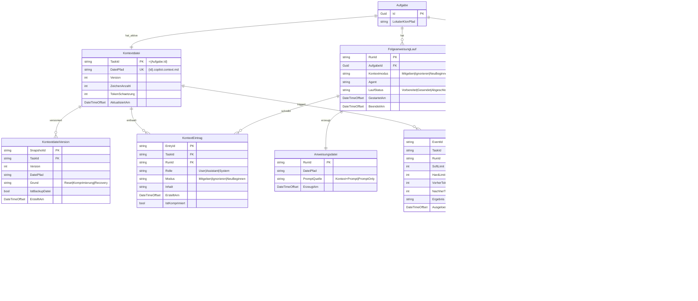

# Entity-Relationship-Modell – Kontextsteuerung bei Folgeanweisungen

> **Dokument-Typ:** Feature-spezifisches ERM (fachlich + logisch)  
> **Status:** Aktualisiert  
> **Version:** 1.1.0  
> **Feature:** Kontextsteuerung bei Folgeanweisungen

---

## 1. Referenzen

- Requirements: [`../requirements/kontextsteuerung-folgeanweisungen-requirements-analysis.md`](../requirements/kontextsteuerung-folgeanweisungen-requirements-analysis.md)
- Architektur-Blueprint: [`./kontextsteuerung-folgeanweisungen-architecture-blueprint.md`](./kontextsteuerung-folgeanweisungen-architecture-blueprint.md)
- Architektur-Review: [`../improvements/kontextsteuerung-folgeanweisungen-architecture-review.md`](../improvements/kontextsteuerung-folgeanweisungen-architecture-review.md)

---

## 2. Modellierungsrahmen (Persistenzebenen)

Dieses Feature erweitert primär den **Datei- und Laufzeitkontext**, nicht das relationale Kernschema.

- **DB-Ebene:** Keine neuen Tabellen/FKs erforderlich.
- **Dateiebene (persistiert):** `{aufgabeId}.copilot.context.md` als aktive Kontextdatei je Aufgabe inklusive Version/Backup.
- **Laufzeitebene (logisch):** Folgeanweisungslauf mit Kontextmodus, Prompt-Komposition, Komprimierung und korrelierter Audit-Spur.

**Explizite Entscheidung:** Es ist **keine DB-Migration** notwendig; das ERM beschreibt daher ein **logisches Datenmodell** über bestehende DB-Entitäten plus Datei-/Runtime-Entitäten.

---

## 3. ERM-Diagramm (Mermaid)

---

## 4. Datei-/Runtime-Modell (fokussiert)

### 4.1 Dateimodell

| Artefakt | Persistenz | Zweck | Schlüssel |
|---|---|---|---|
| `{id}.copilot.context.md` | dauerhaft | Aktiver Verlauf je Aufgabe | `TaskId` |
| `{id}.copilot.context.md.bak` | optional/Recovery | Vorversion bei atomischem Replace | `TaskId + Version` |
| Laufbezogene Anweisungsdatei | ephemer pro Lauf | Finaler Prompt für Agentenaufruf | `RunId` |

### 4.2 Runtime-Modell

| Runtime-Objekt | Zweck | Korrelation |
|---|---|---|
| `FolgeanweisungLauf` | Hält Modus, Agent, Status pro Folgezyklus | `RunId` |
| `KontextAuditEreignis` | Technische Kontextoperationen (`Load`, `Compress`, `Reset`, `Append`, `Write`) | `ContextEventId`, `RunId` |
| `Komprimierungsereignis` | Soft-/Hard-Limit-Prüfung + Ergebnis | `EventId`, `RunId` |

---

## 5. Tabellarische Übersicht (Entitäten, Beziehungen, Kardinalitäten)

| Entität | Ebene | Schlüssel | Kernattribute | Beziehungen | Kardinalität |
|---|---|---|---|---|---|
| `Aufgabe` | DB (bestehend) | `Id` | `LokalerKlonPfad` | zu `Kontextdatei`, `FolgeanweisungLauf`, `Protokolleintrag` | 1:1, 1:n, 1:n |
| `Kontextdatei` | Datei (neu) | `TaskId`, `DateiPfad` (UK) | `Version`, `ZeichenAnzahl`, `TokenSchaetzung`, `AktualisiertAm` | zu `KontextdateiVersion`, `KontextEintrag`, `Komprimierungsereignis` | 1:n, 1:n, 1:n |
| `KontextdateiVersion` | Datei (neu) | `SnapshotId` | `Version`, `DateiPfad`, `Grund`, `IstBackupDatei` | zu `Kontextdatei` | n:1 |
| `FolgeanweisungLauf` | Laufzeit (logisch) | `RunId` | `Kontextmodus`, `Agent`, `LaufStatus`, `GestartetAm`, `BeendetAm` | zu `Aufgabe`, `Anweisungsdatei`, `Komprimierungsereignis`, `KontextAuditEreignis` | n:1, 1:1, 1:n, 1:n |
| `Anweisungsdatei` | Laufzeit/Datei (ephemer) | `RunId` | `DateiPfad`, `PromptQuelle`, `ErzeugtAm` | zu `FolgeanweisungLauf` | 1:1 |
| `KontextEintrag` | Datei (neu) | `EntryId` | `Rolle`, `Modus`, `Inhalt`, `IstKomprimiert` | zu `Kontextdatei`, `FolgeanweisungLauf` | n:1, n:1 |
| `Komprimierungsereignis` | Runtime/Datei (neu) | `EventId` | `SoftLimit`, `HardLimit`, `VorherTokenSchaetzung`, `NachherTokenSchaetzung`, `Ergebnis` | zu `Kontextdatei`, `FolgeanweisungLauf` | n:1, n:1 |
| `KontextAuditEreignis` | Runtime (neu) | `ContextEventId` | `Operation`, `Ergebnis`, `Korrelation` | zu `FolgeanweisungLauf`, `Protokolleintrag` | n:1, 1:n |
| `Protokolleintrag` | DB (bestehend) | `Id` | `Typ`, `Inhalt`, `RunId`, `ContextEventId`, `Zeitstempel` | zu `Aufgabe`, `KontextAuditEreignis` | n:1, n:1 |

---

## 6. Komprimierungs- und Audit-Beziehungen

1. **Komprimierung ist laufgebunden:** `Komprimierungsereignis.RunId` verknüpft Soft-/Hard-Limit-Entscheidungen eindeutig mit dem Folgeanweisungslauf.  
2. **Audit ist operationell:** Jede Kontextoperation erzeugt ein `KontextAuditEreignis` mit `ContextEventId`.  
3. **Protokoll ist korreliert:** `Protokolleintrag` speichert `RunId` und optional `ContextEventId` zur End-to-End-Nachvollziehbarkeit.  
4. **Recovery ist modelliert:** `KontextdateiVersion` bildet Backup/Restore (`*.bak`) bei Reset/Komprimierung atomisch ab.

---

## 7. Zustände und Regeln der Kontextmodi

| Kontextmodus | Vorbedingung | Prompt-Bildung | Wirkung auf `{id}.copilot.context.md` | Audit-Pflicht |
|---|---|---|---|---|
| `Mitgeben` | Kontextdatei laden/initialisieren | `Kontextinhalt + Trennmarker + Nutzeranweisung` | Nutzer + Antwort anhängen | `Load`, ggf. `Compress`, `Append`, `Write` |
| `Ignorieren` | Keine Kontextinjektion | `Nutzeranweisung` ohne Präfix | Nutzer + Antwort trotzdem fortschreiben | `Append`, `Write` |
| `NeuBeginnen` | Vor Lauf aktiven Verlauf resetten | `Nutzeranweisung` ohne Alt-Kontext | Datei atomisch ersetzen, Verlauf ab aktuellem Lauf neu | `Reset`, `Write`, `Append` |

### Invarianten

1. Pro Aufgabe existiert genau **eine aktive Kontextdatei** (`{id}.copilot.context.md`).  
2. Pro Folgeanweisungslauf ist genau **ein Kontextmodus** gesetzt.  
3. Bei `Mitgeben` ist die Reihenfolge strikt: **Kontext vor Nutzeranweisung**.  
4. Bei Soft-Limit-Überschreitung erfolgt Komprimierung **vor** finaler Prompt-Erstellung.  
5. Moduswahl, Komprimierung und Kontextoperationen sind über `RunId`/`ContextEventId` auditierbar.

---

## 8. Modellierungsentscheidungen (Kurzbegründung)

- **Datei-zentrierte Persistenz statt DB-Erweiterung:** Blueprint fordert `{id}.copilot.context.md`; keine Pflichtmigration.
- **Explizites Dateiversionsmodell (`KontextdateiVersion`):** Deckt atomisches Replace und Recovery-Backup aus dem Blueprint-Risikoteil ab.
- **Audit als eigene Runtime-Entität:** `KontextAuditEreignis` bildet die geforderten Operationen `load/compress/reset/append` eindeutig ab.
- **Korrelation über IDs:** `RunId` und `ContextEventId` verbinden Lauf, Dateiänderung und Protokoll ohne zusätzliche relationale Persistenzpflicht.

---

## 9. Konsistenzabgleich mit Architektur-Blueprint

| Blueprint-Aussage | ERM-Abbildung | Ergebnis |
|---|---|---|
| Kontextdatei pro Aufgabe `{id}.copilot.context.md` | `Aufgabe 1:1 Kontextdatei`, Attribut `DateiPfad` | ✅ Konsistent |
| Drei feste Kontextmodi | `FolgeanweisungLauf.Kontextmodus` + Regelmatrix Abschnitt 7 | ✅ Konsistent |
| Deterministische Prompt-Komposition je Modus | Entität `Anweisungsdatei` + Invariante 3 | ✅ Konsistent |
| Soft/Hard-Limit + KI-Komprimierung | `Komprimierungsereignis` (mit `RunId`, Limits, Vorher/Nachher) | ✅ Konsistent |
| Auditierbarkeit inkl. Korrelation | `KontextAuditEreignis` + `Protokolleintrag.RunId/ContextEventId` | ✅ Konsistent |
| Reset/Komprimierung mit Recovery | `KontextdateiVersion` (`IstBackupDatei`, `Grund`) | ✅ Konsistent |
| Keine Pflicht-DB-Migration | Abschnitt 2 (explizit dokumentiert) | ✅ Konsistent |

---

## 10. Architektur-Review

- Architektur-Review: [`../improvements/kontextsteuerung-folgeanweisungen-architecture-review.md`](../improvements/kontextsteuerung-folgeanweisungen-architecture-review.md)

---

## 11. Versionshistorie

| Version | Datum | Autor | Änderung |
|---|---|---|---|
| 1.1.0 | 2026-05-11 | planning-entity-relationship-modeler | ERM auf Blueprint-Stand aktualisiert; Datei-/Runtime-Modell präzisiert; Komprimierungs-/Audit-Beziehungen inkl. `RunId`/`ContextEventId` ergänzt |
| 1.0.0 | 2026-05-11 | planning-entity-relationship-modeler | Initiales ERM für Feature „Kontextsteuerung bei Folgeanweisungen“ (Datei-/Laufzeitmodell, keine DB-Migration) |

