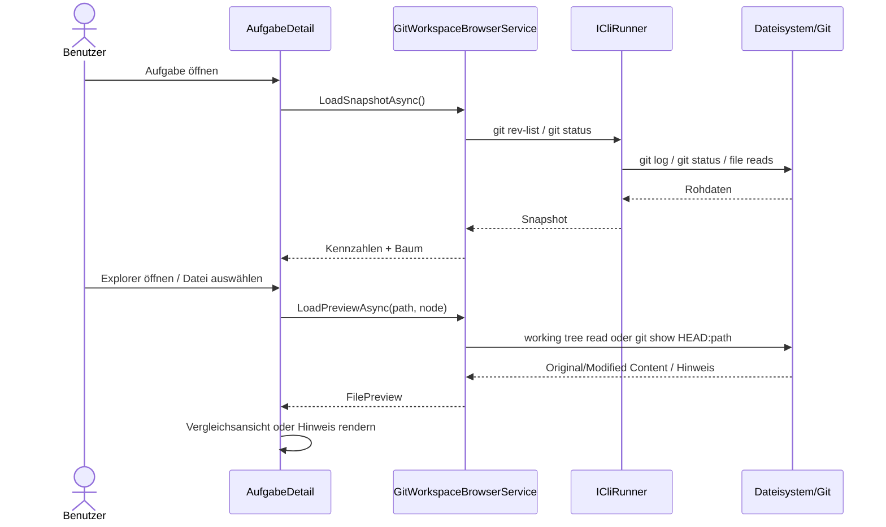

# Architektur-Blueprint – Live Project Browser mit Git-Status

> **Dokument-Typ:** Architecture Blueprint  
> **Status:** ✅ Implementiert und validiert  
> **Version:** 1.1.0  
> **Datum:** 2026-05-18

---

## 1. Referenzen

- [Requirements Analysis](../requirements/live-project-browser-git-status-requirements-analysis.md)
- [Entity-Relationship-Model](./live-project-browser-git-status-entity-relationship-model.md)
- [Architecture Review](../improvements/live-project-browser-git-status-architecture-review.md)

---

## 2. Zielarchitektur

Die Funktion wird als UI-nahe Repository-Inspektion umgesetzt. Der Zustand wird nicht persistiert, sondern zur Laufzeit aus dem lokalen Arbeitsverzeichnis und dem Git-Repository abgeleitet.

### Architekturentscheidung

1. Die Aufgabenseite bleibt Einstiegspunkt und hält nur View-State.
2. Ein dedizierter Service kapselt Git-Status, Commit-Zähler, Baumaufbau und Dateivorschau.
3. Die Darstellung erfolgt direkt in der Aufgabenkomponente mit klar getrennten UI-Sektionen.
4. Repositorydaten werden ausschließlich aus dem lokalen Klon gelesen.

---

## 3. Komponenten und Verantwortlichkeiten

| Komponente | Verantwortung |
|---|---|
| `AufgabeDetail.razor/.razor.cs` | View-Umschaltung per Query-Parameter, Kennzahlenanzeige, Baum-/Listenumschaltung, Dateiauswahl, Fehler-/Erfolgszustände |
| `GitWorkspaceBrowserService` | Ermittelt Commit-Anzahl, Statusdaten, Baumstruktur, Dateiinhalt, Originalinhalt aus `HEAD` und Vorschauhinweise |
| `ICliRunner` / Dateisystem | Führt Git-Kommandos aus und liest Arbeitskopie bzw. `HEAD`-Inhalte |
| `WorkspaceSnapshot` / `WorkspaceFileNode` / `WorkspaceFileStatus` / `FilePreview` / `WorkspaceNodeRow` | Laufzeitmodell für Baum, Status, Vorschau und Listenansicht |

---

## 4. Datenfluss

---

## 5. Technische Entscheidungen

### 5.1 Statusermittlung

- Commit-Anzahl via `git rev-list --count HEAD`
- Lokale Änderungen via `git status --porcelain=v1 --untracked-files=all`
- Staged/unstaged Trennung über Porcelain-Statuscodes
- Gelöschte Dateien werden in der Baumansicht sortiert ans Ende einer Ebene verschoben

### 5.2 Dateiinhalt und Diff

- Working-Tree-Datei wird direkt vom Dateisystem gelesen
- Ursprungsversion wird bei geänderten/gelöschten Dateien aus `HEAD:path` geladen
- Große Dateien > 1 MB werden nicht inline geladen
- Binärdateien werden über Null-Byte-Heuristik erkannt

### 5.3 UI-Navigation

- Umschaltung per Query-Parameter, z. B. `?view=task` und `?view=tree`
- Der aktuelle Task-Kontext bleibt erhalten
- Die Rückkehr zur Aufgabenseite erfolgt ohne Navigationsverlust

### 5.4 Wiederverwendung

- Die Vergleichsansicht ist direkt in `AufgabeDetail` eingebettet
- Status- und Vorschau-Logik bleibt im Service, nicht in der Razor-Komponente

---

## 6. Qualitätsziele

| Ziel | Maßnahme |
|---|---|
| Wartbarkeit | Klare Trennung aus UI, Service und Rendering-Komponente |
| Robustheit | Defensive Behandlung von fehlenden Repositories, Binary-Dateien und Lesefehlern |
| Performance | Nur benötigte Dateien laden, große Inhalte nicht inline rendern |
| Nachvollziehbarkeit | Einheitliche Fehlermeldungen und strukturierte Logs |

---

## 7. Auswirkungen auf bestehende Implementierung

### 7.1 Aufgabenseite

- Kopfbereich um Kennzahlen erweitern
- Aktionsleiste um Explorer-Toggle ergänzen
- Dateiansicht und Explorer als getrennte Views modellieren

### 7.2 Anwendungsschicht

- Neuer Browser-Service für Repositoryinspektion
- Keine Persistenzänderung erforderlich
- Bestehende Git-Orchestrierung bleibt für Commit/Push/Pull zuständig

### 7.3 Infrastruktur

- Git-Status- und Dateileseoperationen werden in einer isolierten Service-Schicht gebündelt
- Lokales Repository bleibt die einzige Datenquelle

---

## 8. Teststrategie

1. **Service-Tests:** Commit-Zähler, Statuscodes, Baumaufbau, File-Preview-Grenzen.
2. **Komponententests:** Explorer-Toggle, Datei-Selektion, Vergleichsansicht.
3. **Integrationstests:** Lokales Test-Repository mit staged, unstaged, deleted und untracked Dateien.
4. **Fehlerfälle:** Fehlender Repositorypfad, unlesbare Datei, große Datei, Binärdatei.

---

## 9. Migrations- und Rollout-Plan

1. Browser-Service und Laufzeitmodelle sind ergänzt.
2. Aufgabenseite zeigt Kennzahlen, Tree/List-Toggle und Vorschau.
3. Vergleichsansicht, Fehlerzustände und Refresh-Verhalten sind integriert.
4. Integrationstests für Git-Status und Vorschau sind vorhanden.
5. UI-Rückfall auf Fehlerzustände ist abgesichert.

---

## 10. Versionierung

| Version | Datum | Autor | Änderung |
|---|---|---|---|
| 1.0.0 | 2026-05-18 | planning-orchestrator | Initialer Architektur-Blueprint für Live Project Browser mit Git-Status |
| 1.1.0 | 2026-05-18 | documentation-orchestrator | Blueprint an die implementierte Tree-/Listenansicht, Query-Parameter-Navigation und Vergleichsansicht angepasst |
