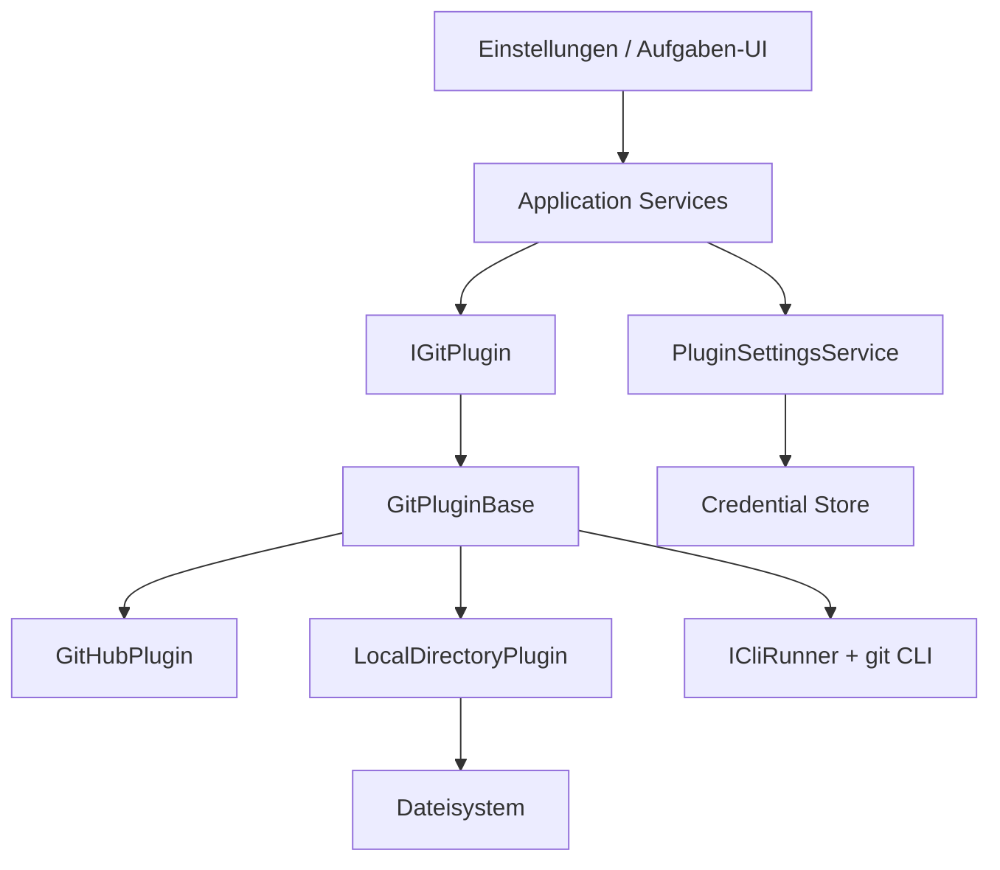
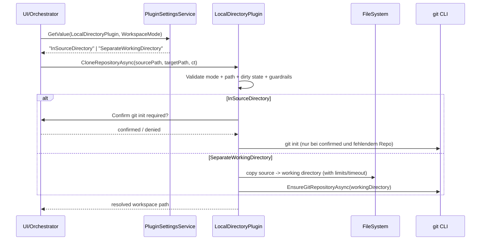

# Architektur-Blueprint – LocalDirectoryPlugin

> **Dokument-Typ:** Feature-spezifischer Architektur-Blueprint  
> **Projekt:** Softwareschmiede  
> **Status:** Aktualisiert  
> **Version:** 1.1.0  
> **Quelle:** Verbindlich abgeleitet aus `docs/requirements/lokales-verzeichnis-plugin-requirements-analysis.md`

---

## 1. Referenzen

- [Requirements Analysis](../requirements/lokales-verzeichnis-plugin-requirements-analysis.md)
- [Lokales ERM](./lokales-verzeichnis-plugin-entity-relationship-model.md)
- [Testplan Arbeitsverzeichnis](../tests/testplan-arbeitsverzeichnis.md)
- [Testplan systemweit](../tests/testplan-systemweit.md)

---

## 2. Zielarchitektur

Das System erweitert die bestehende SCM-Plugin-Architektur um ein `LocalDirectoryPlugin` für lokale Git-Workspaces und konsolidiert gemeinsame Git-Operationen in `GitPluginBase<TPlugin>`.

### 2.1 Schichten und Module

| Schicht | Bausteine | Verantwortung |
|---|---|---|
| Presentation | `Einstellungen.razor`, Aufgabenflows | Enum-basierte WorkspaceMode-Auswahl, Validierungshinweise |
| Application | `GitOrchestrationService`, `PluginSettingsService` | Orchestrierung, Schlüsselbildung `<PluginPrefix>.<Key>`, Fehlerweitergabe |
| Contracts | `IGitPlugin`, `WorkspaceMode`, `PluginSettingFieldType.Enum`, `GitPluginBase<TPlugin>` | Einheitliche Verträge für Host und Plugins |
| Plugins/Infrastructure | `GitHubPlugin`, `LocalDirectoryPlugin`, `ICliRunner` | Provider-spezifische Implementierung und Git/FS-Aufrufe |

### 2.2 Zielbild (Komponenten)

---

## 3. Verbindliche Designentscheidungen

### 3.1 `GitPluginBase<TPlugin>` (Abstraktion + Vererbung)

1. `GitPluginBase<TPlugin>` bleibt `public` und lebt in `Softwareschmiede.Plugin.Contracts`.
2. Die Basisklasse implementiert gemeinsame lokale Git-Operationen (`CreateBranchAsync`, `CommitAsync`, `ResetAsync`, `CheckoutRemoteBranchAsync`) sowie Helper (`RunGitAsync`, `EnsureGitRepositoryAsync`, `AddAllAsync`).
3. Provider-spezifische Operationen bleiben abstrakt (`CloneRepositoryAsync`, `PushBranchAsync`, `PullAsync`, `CreatePullRequestAsync`, `GetIssuesAsync`, `GetRemoteBranchesAsync`, `GetDefaultBranchAsync`, `CheckHealthAsync`).
4. `GitHubPlugin` und `LocalDirectoryPlugin` erben beide von `GitPluginBase<TPlugin>`.

### 3.2 `LocalDirectoryPlugin` (Clone/Branch/Commit/Reset)

- **CloneRepositoryAsync**
  - interpretiert `repositoryUrl` als lokalen Source-Pfad.
  - löst `WorkspaceMode` deterministisch auf:
    - `InSourceDirectory`: direkt im Source arbeiten; `git init` nur nach expliziter Nutzerbestätigung.
    - `SeparateWorkingDirectory`: Source in Working-Kopie kopieren (Guardrails: Timeout + Datei-/Größenlimits).
  - Dirty-Workspace führt zu hartem Fehler (kein Überschreiben).
- **CreateBranchAsync / CommitAsync / ResetAsync**
  - laufen immer auf dem aufgelösten Workspace-Pfad.
  - nutzen Basisklassen-Implementierung + plugin-spezifische Vorvalidierung.

### 3.3 Nicht unterstützte Remote-Funktionen

Für `LocalDirectoryPlugin` sind folgende Methoden **explizit nicht unterstützt** und werfen konsistent `NotSupportedException` mit plugin-spezifischer Meldung:

- `PushBranchAsync`
- `PullAsync`
- `CreatePullRequestAsync`
- `GetRemoteBranchesAsync`
- `GetDefaultBranchAsync`
- `CheckoutRemoteBranchAsync`
- `GetIssuesAsync`

### 3.4 Settings-UI (Enum/Select + Serialisierung)

1. `WorkspaceMode` wird als `PluginSettingFieldType.Enum` modelliert.
2. Die UI rendert Enum-Felder als `<select>` statt Freitext.
3. Persistenz als stabiler String-Enumname (`InSourceDirectory`, `SeparateWorkingDirectory`).
4. Ungültige gespeicherte Werte: Validierungsfehler + Fallback auf sicheren Default `SeparateWorkingDirectory`.

### 3.5 Persistenz + Validierung

- Persistenz bleibt im bestehenden Credential-Store-Schema (`<PluginPrefix>.<Key>`).
- Keine neue Tabelle und keine DB-Migration für Plugin-Settings.
- Vor Operationen werden Pfad, Schreibbarkeit, WorkspaceDirty-Status und Guardrails geprüft.
- `git init` im Source-Verzeichnis ist ohne Confirm-Flag unzulässig.

---

## 4. Schnittstellen und Datenflüsse

### 4.1 Vertragsrelevante Typen

- `IGitPlugin`
- `GitPluginBase<TPlugin>`
- `WorkspaceMode` (Contracts)
- `PluginSettingFieldType.Enum`

### 4.2 Clone-Datenfluss

### 4.3 Fehlerfluss (Remote-Methode auf lokalem Plugin)

`Application Service -> LocalDirectoryPlugin.RemoteMethod -> NotSupportedException -> UI-Hinweis ohne Retry mit Remote-Flow`

---

## 5. Fehlerbehandlung

| Fehlerklasse | Verhalten | Beispiel |
|---|---|---|
| Konfigurationsfehler | Früh validieren, klare Meldung, kein stiller Fallback außer definiertem Default | Ungültiger WorkspaceMode |
| Nicht unterstützte Funktion | Deterministisch `NotSupportedException` | `PushBranchAsync` in LocalDirectoryPlugin |
| Sicherheitskritischer Zustand | Harte Blockade | Dirty Workspace vor Clone/Moduswechsel |
| Infrastrukturfehler | Kontextreiche `InvalidOperationException` + Logging | `git`-Fehler, Kopierabbruch |
| Benutzerabbruch | `OperationCanceledException` durchreichen | CT ausgelöst, Copy-Timeout |

---

## 6. Sicherheits- und Qualitätsziele

| Ziel | Architekturmaßnahme | Nachweis |
|---|---|---|
| Sicherheit | Explizite Bestätigung vor `git init` im Source; keine stillen Überschreibungen | Unit + Integration Tests für Confirm/Dirty-Tree |
| Robustheit | Einheitlicher `NotSupportedException`-Pfad für Remote-Features | Test pro nicht unterstützter Methode |
| Performance | Kopier-Guardrails (Timeout, Datei-/Größenlimit) | Grenzwert-Integrationstests |
| Testbarkeit | Git-Logik in Basisklasse + isolierbare Plugin-Spezifika | Unit-Tests für Base + LocalDirectory + GitHub-Regression |
| Abwärtskompatibilität | GitHub-Remote-/Auth-Logik bleibt im GitHubPlugin | Bestehende GitHubPluginTests grün |

---

## 7. Teststrategie und Build-/Test-Gates

### 7.1 Unit-Tests

- `GitPluginBase`:
  - Branch/Commit/Reset-Erfolg und Fehlerabbildung.
- `LocalDirectoryPlugin`:
  - WorkspaceMode-Auflösung (2 Modi),
  - Confirm-Flow für `git init`,
  - Dirty-Workspace-Blockade,
  - NotSupported-Verhalten je Remote-Methode.
- Settings/UI:
  - Enum-Feld als Select,
  - String-Enum-Roundtrip 100 %,
  - Invalid-Enum -> definierter Fallback.

### 7.2 Integrationstests

- End-to-End LocalDirectory Clone in beiden WorkspaceModes.
- Kopier-Guardrails (Timeout/Datei-/Größenlimit) mit kontrolliertem Abbruch.
- Realer Git-Lauf für Branch/Commit/Reset auf aufgelöstem Workspace.
- Regressionstests für `GitHubPlugin` nach Basisklassen-Refactoring.

### 7.3 Release-Gates (verpflichtend)

1. `dotnet build Softwareschmiede.slnx`
2. `dotnet test src/Softwareschmiede.Tests/Softwareschmiede.Tests.csproj`
3. `dotnet test src/Softwareschmiede.IntegrationTests/Softwareschmiede.IntegrationTests.csproj`
4. Optionaler Gesamtnachweis: `dotnet test Softwareschmiede.slnx`

Ein Merge ist nur zulässig, wenn alle Gates grün sind.

---

## 8. Umsetzungsreihenfolge

1. Contracts stabilisieren (`WorkspaceMode`, `Enum`, `GitPluginBase<TPlugin>` public).
2. `GitHubPlugin` auf Basisklasse refaktorieren (ohne Verhaltensänderung).
3. `LocalDirectoryPlugin` implementieren (Clone/Branch/Commit/Reset + NotSupported Remote).
4. Settings-UI auf Enum-Select und Persistenz-Roundtrip erweitern.
5. Unit-/Integrationstests ergänzen und Gates ausführen.

---

## 9. Versionierung

| Version | Datum | Autor | Änderung |
|---|---|---|---|
| 1.1.0 | 2026-05-12 | GitHub Copilot Agent | Blueprint vollständig auf Requirements v1.1.0 ausgerichtet: Zielarchitektur, Designentscheidungen, Datenflüsse, Fehler-/Sicherheitsziele, Test- und Gate-Strategie präzisiert |
| 1.0.0 | 2026-05-12 | GitHub Copilot Agent | Initiale Fassung |

