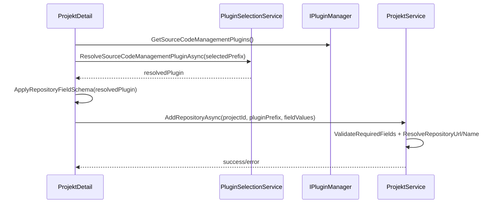

# Architektur-Blueprint – LocalDirectoryPlugin (As-Planned/As-Built)

> **Dokument-Typ:** Feature-Blueprint  
> **Status:** ✅ Konsistent mit Ist-Implementierung  
> **Version:** 1.3.0  
> **Datum:** 2026-05-13

---

## 1. Referenzen

- [Requirements](../requirements/lokales-verzeichnis-plugin-requirements-analysis.md)
- [ERM](./lokales-verzeichnis-plugin-entity-relationship-model.md)
- [Architecture Review](../improvements/lokales-verzeichnis-plugin-architecture-review.md)
- [Planning Overview](../planning-overview-lokales-verzeichnis-plugin.md)

## 2. Zielbild

Die Projektseite nutzt verfügbare SourceCode-Plugins als dynamische Quelle für Eingabefelder und Validierungsregeln. Die Plugin-Vorauswahl wird zentral über `PluginSelectionService` aufgelöst. WorkspaceMode wird benutzerfreundlich angezeigt, technisch aber unverändert persistiert.

## 3. Architekturentscheidungen

1. **Plugin-gesteuertes Linking:** `ProjektDetail` lädt `_sourceCodePlugins` über `IPluginManager` und Feldschema über `GetRepositoryLinkFields()`.
2. **Standardplugin-Auflösung:** Selektion erfolgt über `PluginSelectionService.ResolveSourceCodeManagementPluginAsync(...)`.
3. **Validierung im UI + Service:** Pflichtfelder werden im Dialog geprüft und serverseitig in `ProjektService.ValidateRequiredFields(...)` abgesichert.
4. **WorkingDirectory-Entkopplung:** LocalDirectoryPlugin führt kein `WorkingDirectory`-Setting in `GetSettingGroups()`.
5. **Enum-Display-Mapping:** `EinstellungenBase.GetEnumOptionDisplayLabel(...)` mappt WorkspaceMode-Enumwerte auf verständliche Labels.

## 4. Komponenten und Datenfluss

## 5. Qualitätsziele

| Ziel | Maßnahme | Status |
|---|---|---|
| Wartbarkeit | Kein GitHub-Hardcoding im Projekt-Linking | ✅ |
| Konsistenz | Pflichtfelder je Plugin serverseitig validiert | ✅ |
| UX | WorkspaceMode-Labels verständlich | ✅ |
| Performance | Dynamischer Feldwechsel im Dialog | 🔄 Messung offen |

## 6. Umsetzungshinweise

- `ProjektDetail.razor.cs` bleibt Orchestrator für Feldschema und Formularzustand.
- `ProjektService` bleibt Integritätsschicht für Pflichtfeldregeln.
- Plugin-Erweiterungen müssen `GetRepositoryLinkFields()` konsistent liefern.

## 7. Versionierung

| Version | Datum | Autor | Änderung |
|---|---|---|---|
| 1.3.0 | 2026-05-13 | GitHub Copilot Agent | Blueprint auf As-Built konsolidiert, Risiken/Offenpunkte aktualisiert |
| 1.2.0 | 2026-05-13 | GitHub Copilot Agent | Zielarchitektur für plugin-gesteuertes Linking dokumentiert |

