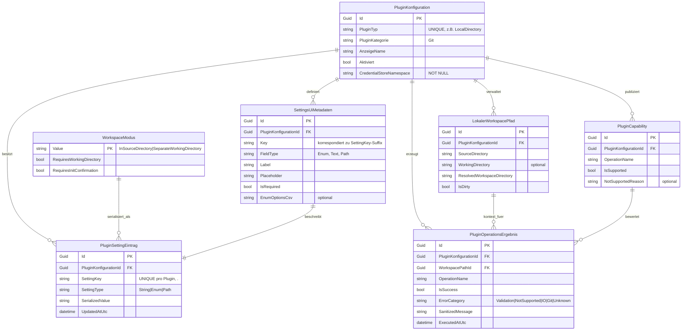

# Entity-Relationship-Modell – LocalDirectoryPlugin

> **Dokument-Typ:** Feature-spezifisches ERM  
> **Projekt:** Softwareschmiede  
> **Status:** Aktualisiert  
> **Version:** 1.2.0  
> **Bezug:** [Requirements Analysis](../requirements/lokales-verzeichnis-plugin-requirements-analysis.md) · [Architektur-Blueprint](lokales-verzeichnis-plugin-architecture-blueprint.md) · [Haupt-ERM](entity-relationship-model.md)

---

## 1. Ziel und Scope

Dieses ERM aktualisiert das Datenmodell für die LocalDirectoryPlugin-Planung mit Fokus auf:

- Plugin-Konfiguration und persistierte Setting-Einträge
- `WorkspaceMode` als Value Object (Enum)
- Settings-UI-Metadaten für Enum-Rendering
- lokale Workspace-Pfade (Source, Working, Resolved)
- Operationsergebnisse
- Capability-Handling (unterstützt vs. nicht unterstützt)

---

## 2. Mermaid-ERM

---

## 3. Entitäten, Value Objects, Kardinalitäten

| Element | Typ | Schlüssel | Beziehungen/Kardinalität |
|---|---|---|---|
| `PluginKonfiguration` | Entität | `Id` | 1:n zu `PluginSettingEintrag`, `SettingsUiMetadaten`, `LokalerWorkspacePfad`, `PluginCapability`, `PluginOperationsErgebnis` |
| `PluginSettingEintrag` | Entität (persistiert im Credential Store) | `Id`, Unique (`PluginKonfigurationId`,`SettingKey`) | n:1 zu `PluginKonfiguration`; n:1 zu `WorkspaceModus` (via Enum-String) |
| `SettingsUiMetadaten` | Entität/Metadaten | `Id`, Unique (`PluginKonfigurationId`,`Key`) | n:1 zu `PluginKonfiguration`; 1:1 zu passendem Setting-Key |
| `WorkspaceModus` | Value Object (Enum) | `Value` | Werte: `InSourceDirectory`, `SeparateWorkingDirectory` |
| `LokalerWorkspacePfad` | Entität (runtime + optional persistierte Ableitung) | `Id` | n:1 zu `PluginKonfiguration`; 1:n zu `PluginOperationsErgebnis` |
| `PluginCapability` | Entität (konfigurationsnah, aus Contracts ableitbar) | `Id`, Unique (`PluginKonfigurationId`,`OperationName`) | n:1 zu `PluginKonfiguration`; 1:n zu Operationsergebnissen |
| `PluginOperationsErgebnis` | Entität (Audit/Diagnose) | `Id` | n:1 zu `PluginKonfiguration`, n:1 zu `LokalerWorkspacePfad`, n:1 zu `PluginCapability` (fachlich über `OperationName`) |

---

## 4. Persistenzentscheidungen (inkl. Credential Store)

1. **Keine relationale Migration:** Plugin-Settings bleiben im bestehenden Credential-Store-basierten Setting-Schema.
2. **Schlüsselstruktur ist verbindlich:** `SettingKey = <PluginPrefix>.<Key>`.  
   Für LocalDirectoryPlugin:  
   - `LocalDirectoryPlugin.WorkspaceMode`  
   - `LocalDirectoryPlugin.SourceDirectory`  
   - `LocalDirectoryPlugin.WorkingDirectory`
3. **`WorkspaceMode` als stabiler String-Enumwert:** Nur `InSourceDirectory` oder `SeparateWorkingDirectory`.
4. **Secrets bleiben außerhalb des ERM-Inhalts:** Das ERM speichert nur Referenzen/Namen (`CredentialStoreNamespace`), keine Tokens/Secrets.
5. **Operationsergebnisse nur sanitisiert:** `SanitizedMessage` enthält keine sensitiven Werte oder Roh-CLI-Ausgaben mit Secrets.

---

## 5. Constraints und Validierungsregeln

| Regel | Constraint/Validierung |
|---|---|
| Plugin eindeutig | `PluginKonfiguration.PluginTyp` ist eindeutig |
| Setting-Key eindeutig pro Plugin | Unique (`PluginKonfigurationId`, `SettingKey`) |
| Enum-Werte strikt | `WorkspaceMode` ∈ {`InSourceDirectory`, `SeparateWorkingDirectory`} |
| Quellpfad immer Pflicht | `SourceDirectory` darf nicht leer sein |
| Arbeitsverzeichnis modusbasiert | Bei `SeparateWorkingDirectory` muss `WorkingDirectory` gesetzt sein; bei `InSourceDirectory` optional/leer |
| Resolved-Path deterministisch | `ResolvedWorkspaceDirectory = SourceDirectory` oder `WorkingDirectory` gemäß `WorkspaceMode` |
| Dirty-Workspace-Guard | Bei `IsDirty = true` schlagen Clone/Mode-Wechsel mit Validierungsfehler fehl |
| Capability-Gate | `IsSupported = false` erzwingt `NotSupportedException`-Pfad inkl. reason |
| UI-Enum-Rendering | Bei `FieldType=Enum` müssen `EnumOptionsCsv` und valide Enum-Werte vorhanden sein |

---

## 6. Modellierungsbegründungen

1. **Settings getrennt von Konfiguration:** Erlaubt konsistente Schlüsselstruktur `<PluginPrefix>.<Key>` und bleibt kompatibel zur bestehenden Settings-Persistenz.
2. **`WorkspaceModus` als Value Object statt Tabelle:** exakt zwei stabile Werte, keine eigene Lebenszyklusverwaltung nötig.
3. **Eigene `SettingsUiMetadaten`:** Architektur fordert Enum-Select-Rendering; dafür sind Label/Typ/Optionen explizit modelliert.
4. **`PluginCapability` explizit modelliert:** macht NotSupported-Verhalten testbar und nachvollziehbar je Operation.
5. **Operationsergebnisse als eigenes Modell:** trennt Ausführung und Konfiguration, unterstützt Diagnose ohne Secret-Leak.

---

## 7. Konsistenzabgleich mit Architektur-Blueprint

| Blueprint-Vorgabe | ERM-Abbildung | Ergebnis |
|---|---|---|
| WorkspaceMode als Setting + Enum-Select | `PluginSettingEintrag` + `SettingsUiMetadaten` + `WorkspaceModus` | ✅ Konsistent |
| Persistenz über Credential Store mit `<PluginPrefix>.<Key>` | `SettingKey`-Regel und Persistenzkapitel | ✅ Konsistent |
| Zwei Workspace-Modi mit deterministischer Pfadauflösung | `WorkspaceModus` + `LokalerWorkspacePfad.ResolvedWorkspaceDirectory` | ✅ Konsistent |
| Remote-Operationen für LocalDirectoryPlugin nicht unterstützt | `PluginCapability(IsSupported=false)` + Validierungsregel | ✅ Konsistent |
| Robuste, sanitisiert protokollierte Ergebnisse | `PluginOperationsErgebnis.SanitizedMessage` + ErrorCategory | ✅ Konsistent |

---

## 8. Delta zur Vorversion

| Bereich | Vorher | Jetzt |
|---|---|---|
| Modellumfang | nur `PluginKonfiguration` + `WorkspaceMode` | erweitert um Settings-UI, Workspace-Pfade, Capability, Operationsergebnisse |
| Persistenzdetails | allgemein | explizite Credential-Store-Schlüsselstruktur |
| Constraints | begrenzt | klare Kardinalitäten + Validierungsregeln |
| Architekturabgleich | vorhanden | auf neue Blueprint-Entscheidungen erweitert |

---

## 9. Versionierung

| Version | Datum | Autor | Änderung |
|---|---|---|---|
| 1.2.0 | 2026-05-12 | GitHub Copilot Agent | ERM auf LocalDirectoryPlugin-Planung erweitert: Settings-UI-Metadaten, Workspace-Pfade, Capability-Handling, Operationsergebnisse, Persistenz-/Constraint-Regeln |
| 1.1.0 | 2026-05-12 | GitHub Copilot Agent | Initiale ERM-Fassung für WorkspaceMode und Pfadfelder |
