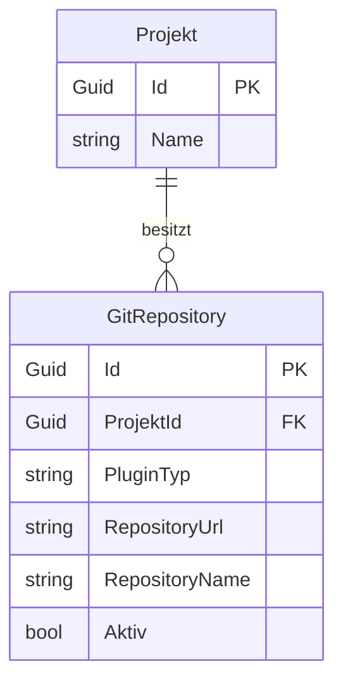

# Entity-Relationship-Modell – LocalDirectoryPlugin (Projekt-Linking)

> **Dokument-Typ:** Feature-ERM  
> **Status:** ✅ Mit aktueller Persistenz konsistent  
> **Version:** 1.4.0  
> **Datum:** 2026-05-13

---

## 1. Ziel

Das ERM beschreibt die derzeitige Persistenz des plugin-gesteuerten Repository-Linkings und die fachlichen Feldregeln für `LocalDirectoryPlugin` und `GitHubPlugin`.

## 2. Modell

## 3. Fachliche Feldmatrix (anwendungsseitig)

| Plugin | Feld | Pflicht | Persistenzabbildung |
|---|---|---|---|
| LocalDirectoryPlugin | SourceDirectory | ✅ | `GitRepository.RepositoryUrl` |
| LocalDirectoryPlugin | RepositoryName (abgeleitet) | implizit | `GitRepository.RepositoryName` |
| Softwareschmiede.GitHub / GitHub | RepositoryUrl | ✅ | `GitRepository.RepositoryUrl` |
| Softwareschmiede.GitHub / GitHub | RepositoryName | ✅ | `GitRepository.RepositoryName` |

## 4. Constraints

1. `PluginTyp` ist verpflichtend und wird als PluginPrefix gespeichert.
2. Für LocalDirectory muss `SourceDirectory` vorhanden sein.
3. Für GitHub müssen `RepositoryUrl` und `RepositoryName` vorhanden sein.
4. RepositoryName darf bei fehlender Eingabe aus URL/Pfad abgeleitet werden (außer Pflichtfall GitHub).

## 5. Konsistenz mit Blueprint

- Dynamische Felder stammen aus Plugin-Metadaten und werden vor Persistenz normalisiert.
- Die Datenbank bleibt bewusst schlank (`GitRepository`) und bildet die Kernwerte ab.
- Zusätzliche dynamische Feldtabellen sind derzeit nicht erforderlich, bleiben aber optionales Evolutionsziel.

## 6. Versionierung

| Version | Datum | Autor | Änderung |
|---|---|---|---|
| 1.4.0 | 2026-05-13 | GitHub Copilot Agent | ERM auf realen Persistenzstand konsolidiert; Feldmatrix und Constraints präzisiert |
| 1.3.0 | 2026-05-13 | GitHub Copilot Agent | Erweiterte konzeptionelle Feldmodellierung |

