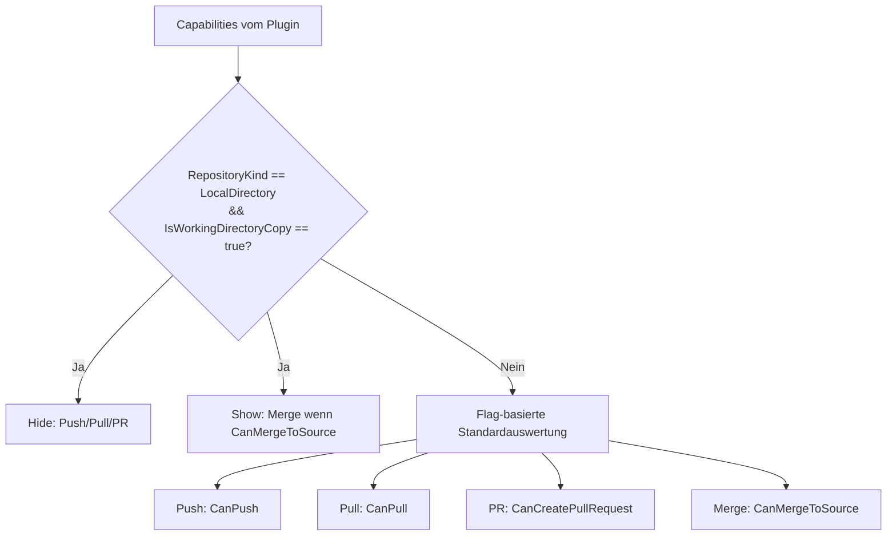
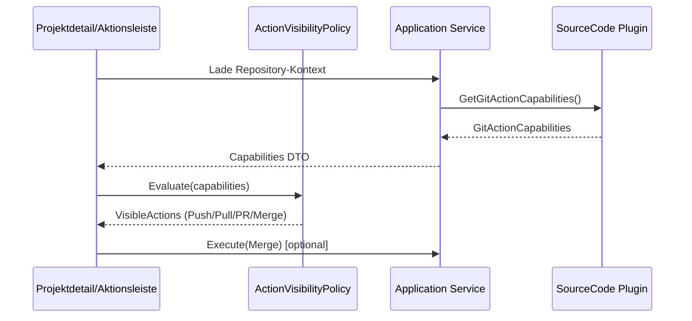

# Architektur-Blueprint – Lokales Verzeichnis Plugin (Kopie-Aktionsmatrix)

> **Dokument-Typ:** Architektur-Blueprint  
> **Status:** 📋 Geplant  
> **Version:** 1.0.0  
> **Datum:** 2026-05-14

---

## 1. Referenzen

- [Requirements](../requirements/lokales-verzeichnis-plugin-kopie-aktionsmatrix-requirements-analysis.md)
- [ERM](./lokales-verzeichnis-plugin-kopie-aktionsmatrix-entity-relationship-model.md)
- [Architecture Review](../improvements/lokales-verzeichnis-plugin-kopie-aktionsmatrix-architecture-review.md)
- [Planning Overview](../planning-overview-lokales-verzeichnis-plugin-kopie-aktionsmatrix.md)

---

## 2. Zielbild

Für den Zustand `RepositoryKind=LocalDirectory` und `IsWorkingDirectoryCopy=true` wird die UI-Aktionsleiste fachlich korrekt reduziert: **Push/Pull/Pull Request werden vollständig ausgeblendet**, **Merge wird angezeigt**.  
Die Entscheidungslogik wird nicht verteilt in mehreren UI-Komponenten umgesetzt, sondern zentral als deterministischer **Decision Point im UI-Layer**, gespeist aus einem vertraglich stabilen Capability-Objekt des Plugins.

---

## 3. Betroffene Schichten

- **Presentation (UI):** Zentrale Aktionsmatrix-Auswertung und Rendering der sichtbaren Aktionen.
- **Application:** Orchestrierung von Capabilities, Projektkontext und Merge-Ausführung.
- **Domain:** Fachregel „Kopie-Flow vs. Remote-Git-Flow“ als explizite Policy.
- **Infrastructure/Plugin:** Bereitstellung des Capability-Vertrags inklusive `RepositoryKind` und `IsWorkingDirectoryCopy`.

---

## 4. Technische Entscheidungsbegründungen

| Entscheidung | Beschreibung | Begründung |
|---|---|---|
| Zentraler Decision Point im UI-Layer | Eine dedizierte Entscheidungskomponente (z. B. `GitActionVisibilityPolicy`) bestimmt die Sichtbarkeit aller Aktionsbuttons. | Verhindert divergierende Heuristiken in einzelnen Views und erfüllt NFR-Konsistenz. |
| Capability-Vertrag statt UI-Heuristik | UI entscheidet ausschließlich anhand plugin-gelieferter Flags/Eigenschaften. | Klare Verantwortlichkeit; UI bleibt deklarativ, Plugin liefert Wahrheit über Kontext/Fähigkeiten. |
| `RepositoryKind + IsWorkingDirectoryCopy` als Pflichtsignale | Kombination steuert den Kopie-Sonderfall explizit. | Fachlich eindeutiger Trigger für das Ausblenden von Push/Pull/PR und Einblenden von Merge. |
| Merge als lokale Synchronisationsaktion | `CanMergeToSource` steuert Sichtbarkeit/Ausführbarkeit der lokalen Merge-Aktion. | Trennt lokalen Dateifluss sauber von Remote-Git-Operationen. |
| Default-Pfad für Remote-Git unverändert | Für `RepositoryKind != LocalDirectory` gelten bestehende Regeln unverändert. | Rückwärtskompatibilität für bestehende Git-Workflows. |

---

## 5. Vertraglicher Capability-Vorschlag

```csharp
public enum RepositoryKind
{
    Unknown = 0,
    LocalDirectory = 1,
    RemoteGit = 2
}

public sealed class GitActionCapabilities
{
    public RepositoryKind RepositoryKind { get; init; }
    public bool IsWorkingDirectoryCopy { get; init; }

    public bool CanPush { get; init; }
    public bool CanPull { get; init; }
    public bool CanCreatePullRequest { get; init; }
    public bool CanMergeToSource { get; init; }
}
```

### Verbindliche Semantik

1. `RepositoryKind` und `IsWorkingDirectoryCopy` sind **immer gesetzt** (kein implizites Defaulting in der UI).
2. Wenn `RepositoryKind=LocalDirectory && IsWorkingDirectoryCopy=true`, muss das Plugin `CanMergeToSource` fachlich korrekt liefern.
3. UI darf `CanPush/CanPull/CanCreatePullRequest` im Kopie-Sonderfall nicht „überstimmen“, sondern blendet diese Aktionen unabhängig von deren Wert aus (Policy-first).
4. Für alle anderen Kontexte gilt direkte Flag-Auswertung.

---

## 6. UI-Aktionsmatrix und Decision Point



### Matrix (sichtbar/unsichtbar)

| RepositoryKind | IsWorkingDirectoryCopy | Push | Pull | Pull Request | Merge |
|---|---:|---:|---:|---:|---:|
| LocalDirectory | true  | ❌ | ❌ | ❌ | `CanMergeToSource` |
| LocalDirectory | false | `CanPush` | `CanPull` | `CanCreatePullRequest` | `CanMergeToSource` |
| RemoteGit | false | `CanPush` | `CanPull` | `CanCreatePullRequest` | `CanMergeToSource` (i. d. R. ❌) |

---

## 7. Komponenten, Datenfluss, Verantwortlichkeiten



**Verantwortlichkeiten:**
- **Plugin:** Liefert korrekte Capabilities für aktuellen Repository-Kontext.
- **Application Service:** Transportiert Capabilities unverändert und orchestriert Merge-Aufruf.
- **UI Policy:** Enthält genau eine deterministische Sichtbarkeitsentscheidung.
- **UI-Komponente:** Rendert nur Ergebnis der Policy, keine eigene Sonderlogik.

---

## 8. Rückwärtskompatibilität

1. Remote-Git-Flows bleiben unverändert, da nur der klare Kopie-Sonderfall überschreibt.
2. Bestehende Berechtigungs-/Sichtbarkeitslogik (CanPush/CanPull/CanCreatePullRequest) bleibt außerhalb des Sonderfalls identisch.
3. Feature kann optional hinter ein Feature-Flag (`EnableLocalCopyActionMatrix`) gelegt werden für stufenweisen Rollout.

---

## 9. Test- und Validierungsstrategie

### Unit-Tests
- Policy-Testfälle für jede Matrix-Zeile.
- Negativfälle (`Unknown`, inkonsistente Flags, `CanMergeToSource=false` im Kopie-Fall).
- Determinismus-Test: gleicher Input => gleicher Output.

### Integrationstests
- Plugin + Application + Policy End-to-End (ohne UI-Rendering).
- Szenarien: `LocalDirectory+Copy`, `LocalDirectory+NoCopy`, `RemoteGit`.
- Merge-Ergebnisvertrag (`Status`, `ChangedFilesCount`, `HasConflicts`) validieren.

### UI-Tests
- Sichtbarkeit von Push/Pull/PR/Merge je Kontext.
- Kein Rendering von Push/Pull/PR im Kopie-Modus.
- Regressionspfad: Remote-Git zeigt weiterhin Push/Pull/PR gemäß Flags.

---

## 10. Risiken, Trade-offs, Open Questions

| Typ | Punkt | Umgang |
|---|---|---|
| Risiko | Plugin liefert `IsWorkingDirectoryCopy` fehlerhaft. | Contract-Tests auf Plugin-Seite + Fallback-Logging. |
| Risiko | Verteilte UI-Logik führt zu Inkonsistenz. | Verbindlich zentraler Decision Point; keine lokale Sonderlogik. |
| Trade-off | Policy-first blendet Aktionen ggf. trotz `CanPush=true` aus. | Gewollt, da Fachregel Kopie-Flow Vorrang hat. |
| Trade-off | Zusätzlicher Capability-Vertrag erhöht API-Oberfläche. | Höhere Klarheit und Testbarkeit rechtfertigt Erweiterung. |
| Open Question | Soll Merge im Kopie-Fall zusätzlich von Konfliktstatus abhängen? | Fachlich final klären, ggf. Flag `HasPendingConflicts` ergänzen. |
| Open Question | Wo werden Decision-Gründe für Support sichtbar protokolliert? | Strukturierte UI/Service-Logs mit anonymisierten Pfadangaben spezifizieren. |

---

## 11. Akzeptanzkriterien (Architektur)

1. Es existiert genau ein zentraler Decision Point für Aktionssichtbarkeit.
2. Für `LocalDirectory + IsWorkingDirectoryCopy=true` sind Push/Pull/PR immer unsichtbar.
3. Merge ist in diesem Modus sichtbar, wenn `CanMergeToSource=true`.
4. Für Remote-Git-Kontexte bleibt bestehendes Verhalten unverändert.
5. Alle Matrix-Kombinationen sind automatisiert getestet (Unit + Integration + mindestens ein UI-Pfad).

---

## 12. Versionierung

| Version | Datum | Autor | Änderung |
|---|---|---|---|
| 1.0.0 | 2026-05-14 | GitHub Copilot Agent | Initialer Architektur-Blueprint für LocalDirectory-Kopie-Aktionsmatrix |

