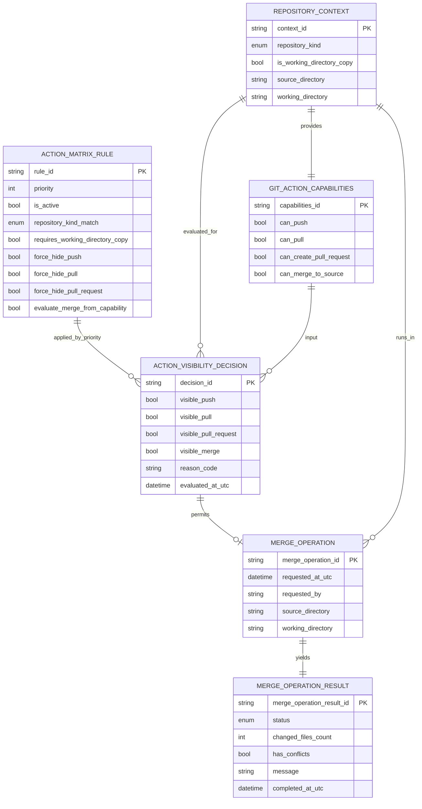

# Entity-Relationship-Modell – Lokales Verzeichnis Plugin (Kopie-Aktionsmatrix)

> **Dokument-Typ:** Konzeptionelles ERM / Domain-Model  
> **Status:** 📋 Geplant  
> **Version:** 1.0.0  
> **Datum:** 2026-05-14  
> **Hinweis:** Dieses Modell ist **konzeptionell**; zentrale Teile sind **Runtime-only** und nicht zwingend persistiert.

---

## 1. Ziel und konzeptioneller Charakter

Dieses ERM beschreibt die fachlichen Domänenobjekte für die Aktionsmatrix im lokalen Kopie-Workflow (`RepositoryKind=LocalDirectory`, `IsWorkingDirectoryCopy=true`).

- Fokus: deterministische Aktionssichtbarkeit (Push/Pull/PR ausblenden, Merge anbieten)
- Fokus: strukturierter Merge-Ablauf inkl. Ergebnisobjekt
- **Keine verpflichtende neue Persistenzstruktur**; Modell dient der fachlichen Klarheit und Testbarkeit.

## 2. Referenzen

- Requirements: [../requirements/lokales-verzeichnis-plugin-kopie-aktionsmatrix-requirements-analysis.md](../requirements/lokales-verzeichnis-plugin-kopie-aktionsmatrix-requirements-analysis.md)
- Architektur-Blueprint: [./lokales-verzeichnis-plugin-kopie-aktionsmatrix-architecture-blueprint.md](./lokales-verzeichnis-plugin-kopie-aktionsmatrix-architecture-blueprint.md)
- Architecture Review: [../improvements/lokales-verzeichnis-plugin-kopie-aktionsmatrix-architecture-review.md](../improvements/lokales-verzeichnis-plugin-kopie-aktionsmatrix-architecture-review.md)
- Planning Overview: [../planning-overview-lokales-verzeichnis-plugin-kopie-aktionsmatrix.md](../planning-overview-lokales-verzeichnis-plugin-kopie-aktionsmatrix.md)

## 3. Konzeptionelles ERM (Domain Model)

## 4. Entitäten / Value Objects / Beziehungen

| Modell | Art | Schlüssel | Wichtige Attribute | Beziehungen / Kardinalität |
|---|---|---|---|---|
| `RepositoryContext` | Value Object (Runtime) | `context_id` | `repository_kind`, `is_working_directory_copy`, `source_directory`, `working_directory` | 1:1 zu `GitActionCapabilities`; 1:n zu `ActionVisibilityDecision`; 1:n zu `MergeOperation` |
| `GitActionCapabilities` | Value Object (Runtime) | `capabilities_id` | `can_push`, `can_pull`, `can_create_pull_request`, `can_merge_to_source` | 1:1 von `RepositoryContext`; 1:n Input für `ActionVisibilityDecision` |
| `ActionMatrixRule` | Policy-Entity (konzeptionell) | `rule_id` | `priority`, Match-/Force-Flags | 1:n zu `ActionVisibilityDecision` |
| `ActionVisibilityDecision` | Value Object / Decision Snapshot | `decision_id` | `visible_push`, `visible_pull`, `visible_pull_request`, `visible_merge`, `reason_code` | n:1 zu `RepositoryContext`; n:1 zu `GitActionCapabilities`; n:1 zu `ActionMatrixRule`; optional 1:0..1 zu `MergeOperation` |
| `MergeOperation` | Domain-Entity (Use-Case-Lauf) | `merge_operation_id` | `requested_at_utc`, `requested_by`, `source_directory`, `working_directory` | n:1 zu `RepositoryContext`; 1:1 zu `MergeOperationResult` |
| `MergeOperationResult` | Value Object (Ergebnis) | `merge_operation_result_id` | `status`, `changed_files_count`, `has_conflicts`, `message`, `completed_at_utc` | 1:1 zu `MergeOperation` |

## 5. Feld-/Attributmatrix (Semantik & Validierungsregeln)

| Modell | Attribut | Typ | Pflicht | Semantik | Validierungsregeln |
|---|---|---:|:---:|---|---|
| `RepositoryContext` | `repository_kind` | Enum | ✅ | Repository-Typ (`Unknown`, `LocalDirectory`, `RemoteGit`) | Muss gesetzt sein; `Unknown` nur als expliziter Fallback |
| `RepositoryContext` | `is_working_directory_copy` | bool | ✅ | Kennzeichnet Kopie-Workflow | Muss immer explizit geliefert werden |
| `RepositoryContext` | `source_directory` | string | ✅ | Quellverzeichnis | Nicht leer; gültiger Pfad |
| `RepositoryContext` | `working_directory` | string | ✅ | Arbeitsverzeichnis | Nicht leer; gültiger Pfad; darf nicht identisch zu `source_directory` im Kopie-Modus sein |
| `GitActionCapabilities` | `can_push` | bool | ✅ | Push fachlich möglich | Im Kopie-Sonderfall für Sichtbarkeit nicht maßgeblich (Policy-first) |
| `GitActionCapabilities` | `can_pull` | bool | ✅ | Pull fachlich möglich | Im Kopie-Sonderfall für Sichtbarkeit nicht maßgeblich |
| `GitActionCapabilities` | `can_create_pull_request` | bool | ✅ | PR fachlich möglich | Im Kopie-Sonderfall für Sichtbarkeit nicht maßgeblich |
| `GitActionCapabilities` | `can_merge_to_source` | bool | ✅ | Merge in Quellverzeichnis möglich | Steuert Merge-Sichtbarkeit im Kopie-Sonderfall |
| `ActionMatrixRule` | `priority` | int | ✅ | Reihenfolge der Regelauswertung | Eindeutig pro Regelset |
| `ActionMatrixRule` | `repository_kind_match` | Enum | ✅ | Regel-Gültigkeit je Repository-Typ | Muss mit `RepositoryKind` vergleichbar sein |
| `ActionMatrixRule` | `requires_working_directory_copy` | bool | ✅ | Regel nur bei Copy-Status | Bei `true` nur aktiv, wenn `is_working_directory_copy=true` |
| `ActionVisibilityDecision` | `visible_push/pull/pull_request/merge` | bool | ✅ | Final sichtbare Aktionen | Deterministisch aus Kontext + Capabilities + Regel ableitbar |
| `ActionVisibilityDecision` | `reason_code` | string | ✅ | Nachvollziehbarer Entscheidungsgrund | Nicht leer; strukturierter Code (z. B. `LOCAL_COPY_POLICY`) |
| `MergeOperation` | `requested_by` | string | ✅ | Auslösender Benutzer/Prozess | Nicht leer |
| `MergeOperationResult` | `status` | Enum | ✅ | `Succeeded`, `Failed`, `Conflicted` | Muss gesetzt sein |
| `MergeOperationResult` | `changed_files_count` | int | ✅ | Anzahl veränderter Dateien | `>= 0` |
| `MergeOperationResult` | `has_conflicts` | bool | ✅ | Konfliktindikator | Bei `status=Conflicted` muss `has_conflicts=true` sein |

## 6. Abgrenzung: Persistiert vs. Runtime-only

| Modell | Persistenzstatus | Begründung |
|---|---|---|
| `RepositoryContext` | Runtime-only | Kontextobjekt aus laufendem Plugin-/UI-Flow |
| `GitActionCapabilities` | Runtime-only | Capability-Vertrag zur Laufzeit |
| `ActionMatrixRule` | Runtime-only / Konfiguration | Policy-Logik; keine Pflicht zur DB-Persistenz |
| `ActionVisibilityDecision` | Runtime-only (optional Logging) | Entscheidungssnapshot für UI/Diagnose |
| `MergeOperation` | Runtime-only (optional Audit) | Ausführungseinheit im Use Case |
| `MergeOperationResult` | Runtime-only (optional Audit) | Ergebnisobjekt für UI/Service-Rückgabe |

**Wichtig:** Das Modell fordert keine neuen Tabellen. Persistenz bleibt beim bestehenden Projekt-/Repository-Modell; dieses ERM ergänzt primär die fachliche Laufzeitdomäne.

## 7. Modellierungsentscheidungen (Kurzbegründung)

1. **Policy-first-Entscheidung:** `ActionMatrixRule` überschreibt im Kopie-Sonderfall Push/Pull/PR unabhängig von einzelnen Capability-Flags.
2. **Capabilities als separater VO:** klare Verantwortlichkeit Plugin → UI, keine UI-Heuristiken.
3. **Decision-Snapshot als eigenes Objekt:** erhöht Testbarkeit, Determinismus und Nachvollziehbarkeit.
4. **MergeOperation + MergeOperationResult getrennt:** klare Trennung zwischen Ausführung und Ergebnis (inkl. Fehler-/Konfliktfällen).

## 8. Abgleich mit Architektur-Blueprint

| Blueprint-Aussage | ERM-Abbildung | Ergebnis |
|---|---|---|
| Zentraler Decision Point | `ActionVisibilityDecision` aus `ActionMatrixRule` | ✅ Konsistent |
| Pflichtsignale `RepositoryKind` + `IsWorkingDirectoryCopy` | `RepositoryContext` Pflichtattribute | ✅ Konsistent |
| Push/Pull/PR im Kopie-Modus ausblenden | Regelattribute `force_hide_*` + Decision-Flags | ✅ Konsistent |
| Merge über `CanMergeToSource` steuern | `GitActionCapabilities.can_merge_to_source` → `visible_merge` | ✅ Konsistent |
| Merge liefert strukturiertes Ergebnis | `MergeOperationResult` mit `status`, `changed_files_count`, `has_conflicts` | ✅ Konsistent |

## 9. Versionierung

| Version | Datum | Autor | Änderung |
|---|---|---|---|
| 1.0.0 | 2026-05-14 | GitHub Copilot Agent | Initiales konzeptionelles ERM/Domain-Model für Aktionsmatrix im lokalen Kopie-Workflow |
