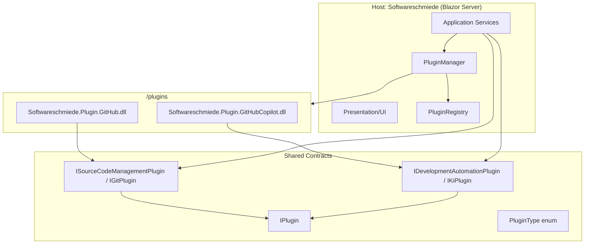
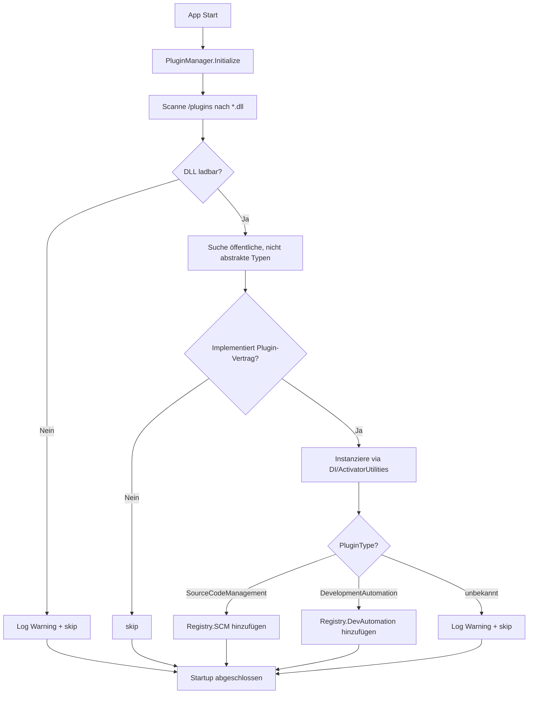
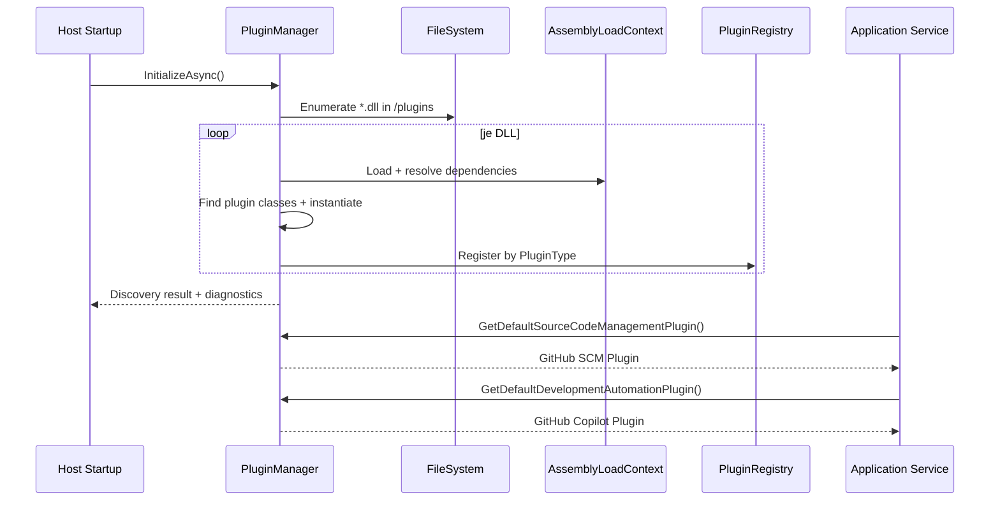
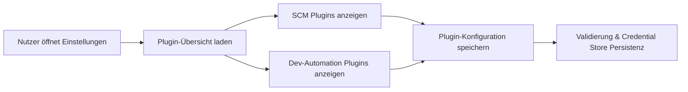

# Architektur-Blueprint – Plugin-Klassenbibliotheken für GitHub und GitHub Copilot

> **Dokument-Typ:** Feature-spezifischer Architektur-Blueprint  
> **Projekt:** Softwareschmiede  
> **Verbindliche Quellen:**  
> 1) [`../../.copilot-task.md`](../../.copilot-task.md)  
> 2) [`../requirements/plugin-klassenbibliotheken-github-und-copilot.md`](../requirements/plugin-klassenbibliotheken-github-und-copilot.md)  
> **Status:** ✅ Umgesetzt  
> **Version:** 1.0.0

---

## 1. Zielbild und Architekturprinzipien

### 1.1 Zielbild

Die bisher fest in der Hauptanwendung verdrahteten Implementierungen `GitHubPlugin` und `GitHubCopilotPlugin` werden in zwei **separate Klassenbibliotheken** ausgelagert:

- `plugins/Softwareschmiede.Plugin.GitHub`
- `plugins/Softwareschmiede.Plugin.GitHubCopilot`

Die Hauptanwendung lädt Plugins zur Laufzeit über einen `PluginManager` aus:

- `<Programmverzeichnis>/plugins/*.dll`

und ordnet sie automatisch den Pluginarten zu:

- **Source Code Management**
- **Development Automation**

### 1.2 Architekturprinzipien

1. **Host kennt nur Verträge, nicht Implementierungen**  
   Keine direkte Referenz auf konkrete GitHub-/Copilot-Klassen im Host.
2. **Runtime Discovery statt statischer Verdrahtung**  
   Plugins werden aus DLLs erkannt und registriert.
3. **Fehlertoleranz vor Strenge**  
   Defekte Plugins dürfen den Host-Start nicht blockieren.
4. **Build-Reproduzierbarkeit**  
   Ein normaler Solution-Build liefert immer lauffähige Plugin-Struktur.

---

## 2. Soll-Architektur (Schichten, Module, Integrationen)



### 2.1 Module

| Modul | Verantwortung |
|---|---|
| `Softwareschmiede` (Host) | UI, Orchestrierung, Plugin-Lebenszyklus, Fehlerbehandlung |
| `Softwareschmiede.Plugin.Contracts` (neu, Shared) | Plugin-Verträge, Plugin-Typisierung, Metadaten |
| `Softwareschmiede.Plugin.GitHub` (neu) | SCM-Integration über GitHub (`gh`, `git`) |
| `Softwareschmiede.Plugin.GitHubCopilot` (neu) | Development-Automation via GitHub Copilot CLI |

### 2.2 Integrationen

- **GitHub CLI (`gh`)** und **Git CLI (`git`)** verbleiben in Plugin-Implementierungen.
- **Windows Credential Store** bleibt Infrastrukturservice und wird in Plugins injiziert.
- Bestehende Application-Services (`GitOrchestrationService`, `EntwicklungsprozessService`) verwenden Plugin-Instanzen über Verträge.

---

## 3. PluginManager-Design (Discovery & Typzuordnung)

### 3.1 Vertragsmodell

Der `PluginManager` arbeitet auf Basis gemeinsamer Verträge (Shared Contracts):

- `IPlugin` (Basis: Name, Prefix, Settings, `PluginType`)
- `ISourceCodeManagementPlugin` (bzw. kompatibel zu `IGitPlugin`)
- `IDevelopmentAutomationPlugin` (bzw. kompatibel zu `IKiPlugin`)
- `PluginType` mit Werten:
  - `SourceCodeManagement`
  - `DevelopmentAutomation`

### 3.2 Discovery-Algorithmus



### 3.3 Designentscheidungen

| Entscheidung | Begründung |
|---|---|
| Discovery im Verzeichnis `<Programmverzeichnis>/plugins` | Entspricht verbindlicher Anforderung FR-2.1 |
| Typzuordnung über `PluginType` + Interface-Prüfung | Eindeutige Klassifizierung der zwei geforderten Pluginarten |
| Fehlerhafte DLLs werden übersprungen | Erfüllt FR-2.3 und NFR-3 |
| Registry nach Kategorie (`SCM`, `DevelopmentAutomation`) | Direkter Zugriff in Orchestrierungsservices |

### 3.4 Öffentliche Host-Schnittstelle (Vorschlag)

```csharp
public interface IPluginManager
{
    Task InitializeAsync(CancellationToken ct = default);
    IReadOnlyList<ISourceCodeManagementPlugin> GetSourceCodeManagementPlugins();
    IReadOnlyList<IDevelopmentAutomationPlugin> GetDevelopmentAutomationPlugins();
    ISourceCodeManagementPlugin GetDefaultSourceCodeManagementPlugin();
    IDevelopmentAutomationPlugin GetDefaultDevelopmentAutomationPlugin();
}
```

---

## 4. Komponenten und Laufzeitinteraktion



### 4.1 Betroffene bestehende Services

- `GitOrchestrationService`: statt direktem `IGitPlugin` Bezug auf PluginManager/Registry.
- `EntwicklungsprozessService`: statt direktem `IKiPlugin` Bezug auf PluginManager/Registry.
- `Program.cs`: keine statische Registrierung mehr von `GitHubPlugin`/`GitHubCopilotPlugin`.

---

## 5. Build- und Deployment-Strategie

### 5.1 Zielstruktur

Nach `dotnet build` (Debug/Release) soll im Host-Output liegen:

```text
<HostOutput>/
  Softwareschmiede.dll
  ...
  plugins/
    Softwareschmiede.Plugin.GitHub.dll
    Softwareschmiede.Plugin.GitHubCopilot.dll
    (ggf. transitive Dependencies)
```

### 5.2 Projektstruktur (Soll)

```text
plugins/
  Softwareschmiede.Plugin.GitHub/
    Softwareschmiede.Plugin.GitHub.csproj
  Softwareschmiede.Plugin.GitHubCopilot/
    Softwareschmiede.Plugin.GitHubCopilot.csproj
src/
  Softwareschmiede.Plugin.Contracts/
    Softwareschmiede.Plugin.Contracts.csproj
  Softwareschmiede/
    Softwareschmiede.csproj
```

### 5.3 Build-Mechanik (Vorschlag)

1. Beide Plugin-Projekte werden in der Solution geführt.
2. Host-Projekt erhält `ProjectReference` auf Plugin-Projekte **nur für Build-Reihenfolge** (`ReferenceOutputAssembly="false"`).
3. MSBuild-Target im Host kopiert Plugin-Artefakte nach `$(OutDir)\plugins`.
4. Analoges Publish-Target kopiert nach `$(PublishDir)\plugins`.

Beispiel (Blueprint-Niveau):

```xml
<ItemGroup>
  <ProjectReference Include="..\..\plugins\Softwareschmiede.Plugin.GitHub\Softwareschmiede.Plugin.GitHub.csproj"
                    ReferenceOutputAssembly="false" />
  <ProjectReference Include="..\..\plugins\Softwareschmiede.Plugin.GitHubCopilot\Softwareschmiede.Plugin.GitHubCopilot.csproj"
                    ReferenceOutputAssembly="false" />
</ItemGroup>

<Target Name="CopyPluginsToHostOutput" AfterTargets="Build">
  <MakeDir Directories="$(OutDir)plugins" />
  <Copy SourceFiles="@(PluginDlls)" DestinationFolder="$(OutDir)plugins" SkipUnchangedFiles="true" />
</Target>
```

### 5.4 Deployment

- Lokaler Start und CI-Artefakt nutzen identische Ordnerkonvention (`plugins/`).
- Keine manuelle DLL-Kopie.
- Publish/Installer muss den `plugins`-Ordner unverändert mit ausliefern.

---

## 6. Schnittstellen- und Konfigurationsdesign

### 6.1 Plugin-Metadaten

Mindestens erforderlich je Plugin:

- `PluginName` (Anzeige/Log)
- `PluginPrefix` (Credential-Schlüssel)
- `PluginType` (`SourceCodeManagement` / `DevelopmentAutomation`)

Optional empfohlen:

- `Version`
- `Capabilities` (z. B. `Issues`, `PullRequest`, `RunTests`)

### 6.2 Konfiguration

- Einstellungen bleiben via `PluginSettingsService` + Credential Store.
- Schlüsselkonvention bleibt `<PluginPrefix>.<FieldKey>`.
- Discovery-Resultate werden beim Start strukturiert geloggt:
  - Geladene Plugins
  - Übersprungene DLLs inkl. Grund

---

## 7. UI/UX-Konzept (Plugin-bezogene Aspekte)

### 7.1 Informationsarchitektur

1. **Einstellungen → Plugins**
   - Sektion „Source Code Management“
   - Sektion „Development Automation“
2. Anzeige je Plugin:
   - Name
   - Status (Geladen/Nicht verfügbar)
   - Konfigurationsfelder

### 7.2 Interaktionsfluss



### 7.3 UX-Grundsätze

- Klare Sichtbarkeit, welches Plugin aktiv ist.
- Verständliche Fehlermeldungen bei fehlenden DLLs/inkompatiblen Plugins.
- Keine Hardcoding-Annahmen in UI-Texten auf „nur GitHub“.

---

## 8. Qualitätsziele (priorisiert)

| ID | Qualitätsziel | Zielwert / Kriterium |
|---|---|---|
| Q-1 | **Zuverlässigkeit** | Defekte Plugin-DLL führt nicht zum Host-Absturz (FR-2.3) |
| Q-2 | **Wartbarkeit** | Neue Anbieter als zusätzliche DLL ohne Kernumbau integrierbar |
| Q-3 | **Performance** | Discovery ≤ 2 Sekunden bei bis zu 20 DLLs (NFR-2) |
| Q-4 | **Betriebsfähigkeit** | Vollständige Discovery-Diagnostik im Log (geladen/abgewiesen) |
| Q-5 | **Build-Qualität** | Debug/Release liefern identische Plugin-Output-Struktur |
| Q-6 | **Sicherheit** | Keine Tokens in Klartextdateien; Credential-Store-Konzept bleibt erhalten |

---

## 9. Risiken und Gegenmaßnahmen

| Risiko | Beschreibung | Gegenmaßnahme |
|---|---|---|
| R-1: Assembly-Konflikte | Abhängigkeiten in Plugin-DLLs kollidieren mit Host | Plugin-spezifische Load-Strategie (eigene ALC + Resolver) |
| R-2: Fehlklassifikation | DLL implementiert Vertrag unvollständig/falsch | Harte Validierung vor Registrierung, klare Log-Warnungen |
| R-3: Build-Artefakte fehlen | Plugin-DLLs nicht im Host-Output | Verbindliche MSBuild-Targets + CI-Prüfung auf Datei-Existenz |
| R-4: Regression in Services | Services erwarten bisher exakt ein Plugin | Default-Selektionsstrategie + Anpassung auf Manager-Zugriff |
| R-5: Publish-Lücke | Build ok, Publish ohne Plugins | separates Publish-Target + Release-Checklist |

---

## 10. Konkrete Implementierungsreihenfolge

1. **Shared Contracts extrahieren/ergänzen**
   - `IPlugin`, Plugin-Typen, Marker/Vertragsinterfaces stabilisieren.
2. **Plugin-Projekte unter `plugins/` anlegen**
   - GitHub-SCM-Implementierung migrieren.
   - GitHub-Copilot-Implementierung migrieren.
3. **PluginManager + Registry im Host implementieren**
   - Discovery, Laden, Typzuordnung, Fehlerhandling, Logging.
4. **DI und Services umbauen**
   - `Program.cs`: statische Plugin-Registrierung entfernen.
   - `GitOrchestrationService` / `EntwicklungsprozessService` auf PluginManager umstellen.
5. **Build-/Publish-Kopierlogik implementieren**
   - MSBuild-Targets für `$(OutDir)\plugins` und `$(PublishDir)\plugins`.
6. **Tests ergänzen**
   - Discovery positiv/negativ
   - Typzuordnung SCM/Development Automation
   - Build-Output-Prüfungen Debug/Release
7. **Dokumentation konsolidieren**
   - API-/Requirements-Verlinkung auf finale Architekturdatei.

---

## 11. Abnahmekriterien (architekturseitig)

- Die Hauptanwendung startet ohne direkte Referenz auf konkrete GitHub/Copilot-Implementierungen.
- Bei vorhandenem DLL-Bestand werden mindestens ein SCM-Plugin und ein Development-Automation-Plugin automatisch erkannt.
- Nach `dotnet build` liegen beide Plugin-DLLs im Host-Unterordner `plugins`.
- Discovery-Fehler einzelner DLLs werden protokolliert, Host bleibt bedienbar.

---

## 12. Versionshistorie

| Version | Datum | Autor | Änderung |
|---|---|---|---|
| 1.0.0 | 2026-05-10 | planning-architecture-blueprint | Initialer feature-spezifischer Architektur-Blueprint für Plugin-Auslagerung GitHub/GitHub Copilot inkl. PluginManager- und Build-/Deployment-Design |

---

*Dokument-Pfad: `docs/architecture/plugin-klassenbibliotheken-github-und-copilot-architecture-blueprint.md` · Projekt: Softwareschmiede · Sprache: Deutsch*
