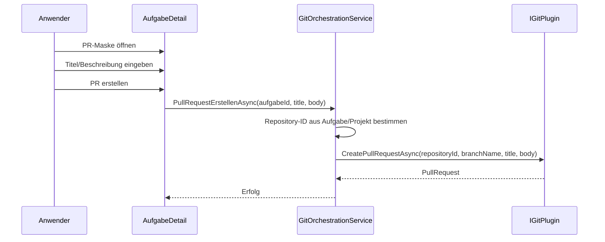

# Architektur-Blueprint – Pull-Request-Repository-ID entfernen

> **Dokument-Typ:** Architektur-Blueprint  
> **Status:** Entwurf  
> **Betroffene Komponente:** `src/Softwareschmiede/Components/Pages/Aufgaben/AufgabeDetail.razor`  
> **Betroffene Logik:** `src/Softwareschmiede/Application/Services/GitOrchestrationService.cs`

---

## 1. Referenzen

- Requirements: [`../requirements/pull-request-repository-id-removal-requirements-analysis.md`](../requirements/pull-request-repository-id-removal-requirements-analysis.md)
- ERM: [`./pull-request-repository-id-removal-entity-relationship-model.md`](./pull-request-repository-id-removal-entity-relationship-model.md)
- Architektur-Review: [`../improvements/pull-request-repository-id-removal-architecture-review.md`](../improvements/pull-request-repository-id-removal-architecture-review.md)

---

## 2. Zielbild

Die PR-Erstellung soll ohne manuelle Repository-ID-Eingabe funktionieren. Die UI bietet nur noch Titel und Beschreibung an. Die Repository-ID wird aus dem bestehenden Aufgaben- und Projektkontext ermittelt und serverseitig an den Git-Workflow übergeben.

---

## 3. Betroffene Schichten

- **Presentation:** Entfernt das redundante Eingabefeld aus der PR-Maske.
- **Application:** Resolvt die Repository-ID aus Aufgabe/Projekt und ruft das Git-Plugin auf.
- **Domain:** Nutzt bestehende Entitäten `Aufgabe`, `Projekt` und `GitRepository`.
- **Infrastructure:** Unverändert; keine neuen Persistenzobjekte erforderlich.

---

## 4. Technologieentscheidungen

| Entscheidung | Beschreibung | Begründung |
|---|---|---|
| UI ohne Repository-Override | Das Eingabefeld für owner/repo entfällt. | Verhindert widersprüchliche Benutzereingaben. |
| Serverseitige Ableitung | Repository-ID wird aus dem vorhandenen Projektkontext ermittelt. | Eine Quelle der Wahrheit statt doppelter Eingabe. |
| Kontrollierter Abbruch | Fehlt eine Repository-Zuordnung, wird die PR-Erstellung abgebrochen. | Verhindert fehlerhafte PRs. |
| Keine Schemaänderung | Das Datenmodell bleibt unverändert. | Die Information ist bereits vorhanden. |

---

## 5. Ablauf

---

## 6. UI/UX-Auswirkungen

- Weniger Eingabefelder in der PR-Maske.
- Kein Hinweis auf eine optionale Repository-ID mehr.
- Fehlerfall nur bei nicht ermittelbarer Repository-Zuordnung.

---

## 7. Qualitätsziele

| Qualitätsziel | Zieldefinition |
|---|---|
| Usability | Kein redundantes Feld, weniger Fehlbedienung. |
| Konsistenz | PR-Erstellung nutzt immer dieselbe Repository-Quelle. |
| Testbarkeit | UI- und Service-Tests prüfen den Defaultpfad. |
| Stabilität | Kein Einfluss auf Commit-/Push-/Pull-Workflows. |

---

## 8. Risiken und Gegenmaßnahmen

| Risiko | Auswirkung | Gegenmaßnahme |
|---|---|---|
| Mehrdeutige Repository-Zuordnung | Falsches Repository im PR | Aufgabegebundenes Repository zuerst; sonst genau ein aktives Projekt-Repository; andernfalls kontrollierter Abbruch. |
| Keine Repository-Zuordnung vorhanden | PR-Erstellung schlägt fehl | Früher, verständlicher Abbruch. |
| Versteckte Nebenregression | PR-Flow bricht an anderer Stelle | Tests für Standard- und Fehlerpfad ergänzen. |

---

## 9. Änderungsumfang

### Zu ändern
1. `AufgabeDetail.razor`
2. `AufgabeDetail.razor.cs`
3. `GitOrchestrationServiceTests`

### Nicht zu ändern
1. Datenbankschema
2. `IGitPlugin.CreatePullRequestAsync(...)`
3. Repo-/Projekt-Entitäten

---

## 10. Akzeptanzkriterien

- PR-Erstellung benötigt keine manuelle Repository-ID.
- Die Repository-ID wird aus dem bestehenden Kontext ermittelt.
- Fehlende Repository-Zuordnung führt zu einer klaren Fehlermeldung.
- Es entsteht keine Persistenzänderung.

