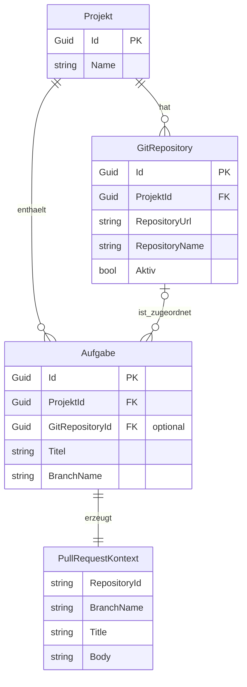

# Entity-Relationship-Modell – Pull-Request-Repository-ID entfernen

> **Dokument-Typ:** Konzeptionelles ERM  
> **Status:** Entwurf  
> **Hinweis:** Keine Schemaänderung erforderlich

---

## 1. Kontext

Die Repository-ID für Pull-Requests ist keine zusätzliche persistente Information. Sie wird aus den vorhandenen Beziehungen zwischen `Projekt`, `GitRepository` und `Aufgabe` abgeleitet.

---

## 2. Konzeptionelles Modell

---

## 3. Tabellarische Übersicht

| Entität / Kontext | Schlüssel | Wichtige Attribute | Beziehung | Bemerkung |
|---|---|---|---|---|
| `Projekt` | `Id` | `Name` | 1:n zu `GitRepository`, 1:n zu `Aufgabe` | Liefert den fachlichen Rahmen |
| `GitRepository` | `Id` | `ProjektId`, `RepositoryUrl`, `RepositoryName`, `Aktiv` | Optionaler PR-Quellkontext | Liefert die Repository-ID indirekt |
| `Aufgabe` | `Id` | `ProjektId`, `GitRepositoryId`, `BranchName` | Verknüpft mit Repository | Zentrale Quelle für PR-Erstellung |
| `PullRequestKontext` | – | `RepositoryId`, `BranchName`, `Title`, `Body` | Wird zur Laufzeit erzeugt | Nicht persistent |

---

## 4. Modellierungsentscheidungen

1. **Keine neue Entität:** Die Repository-ID wird nicht persistiert, weil sie bereits aus bestehenden Daten ableitbar ist.
2. **`PullRequestKontext` als Value-Object:** Die PR-Erstellung benötigt nur einen Laufzeitkontext, keinen Datenbankeintrag.
3. **`GitRepositoryId` bleibt optional:** Die vorhandene optionale Zuordnung reicht aus; bei fehlender Zuordnung muss der Flow abbrechen.
4. **Eine Quelle der Wahrheit:** Der manuelle Repository-Override wird aus dem UI-Flow entfernt.

---

## 5. Konsistenzprüfung

| Blueprint-Aussage | ERM-Abbildung | Ergebnis |
|---|---|---|
| Repository-ID wird automatisch genutzt | `Aufgabe` → `GitRepository` → `PullRequestKontext.RepositoryId` | ✅ Konsistent |
| Keine neue Persistenz | `PullRequestKontext` ist nicht persistent | ✅ Konsistent |
| Fehler bei fehlender Zuordnung | optionale Beziehung `Aufgabe` ↔ `GitRepository` | ✅ Konsistent |

---

## 6. Mapping zum Code

- `AufgabeDetail` erzeugt den PR-Dialog ohne Repository-Feld.
- `GitOrchestrationService.PullRequestErstellenAsync(...)` bleibt die zentrale Stelle für die Repository-Auflösung.
- `IGitPlugin.CreatePullRequestAsync(...)` erhält die aufgelöste Repository-ID unverändert.

---

## 7. Änderungsfokus

- Keine Datenbankmigration.
- Keine neuen Tabellen oder Spalten.
- Nur Ablauf- und UI-Vereinfachung.

