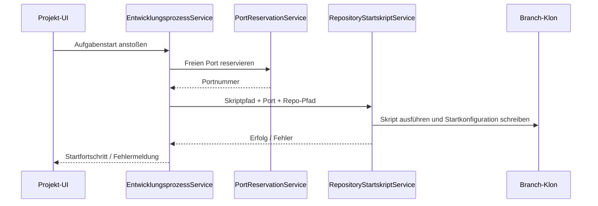

# Architektur-Blueprint: Repository-Startskript mit freier Portzuweisung

> **Dokument-Typ:** Architektur-Blueprint  
> **Status:** Entwurf  
> **Betroffene Komponente:** Projekt-/Repository-Konfiguration und Entwicklungsprozess  

## 1. Referenzen

- Requirements: [`../requirements/repository-startskript-freier-port-requirements-analysis.md`](../requirements/repository-startskript-freier-port-requirements-analysis.md)
- ERM-Zieldokument: [`./repository-startskript-freier-port-entity-relationship-model.md`](./repository-startskript-freier-port-entity-relationship-model.md)
- Architektur-Review-Zieldokument: [`../improvements/repository-startskript-freier-port-architecture-review.md`](../improvements/repository-startskript-freier-port-architecture-review.md)

## 2. Problembild und Ziel

Mehrere Branch-Klone dürfen nicht denselben lokalen Port verwenden. Ein Aufgabenstart muss daher vor dem eigentlichen Lauf einen freien Port bestimmen und ihn an ein Repository-spezifisches Startskript übergeben.

**Ziel:** Jeder Aufgabenstart erhält einen branchspezifischen, freien Port und aktualisiert die lokale Startkonfiguration deterministisch.

## 3. Systemarchitektur und betroffene Schichten/Module

### 3.1 Schichten

- **Presentation:** Repository-Konfiguration in der Projektansicht.
- **Application:** Orchestriert Portsuche, Skriptprüfung und Skriptausführung.
- **Domain:** Hält die Repository-Startkonfiguration als persistiertes Modell.
- **Infrastructure:** Führt PowerShell-Skripte aus und ermittelt freie Ports.

### 3.2 Betroffene Module

- `ProjektDetail.razor` / Repository-Konfiguration
- `EntwicklungsprozessService.ProzessStartenAsync(...)`
- Neuer Service für Portsuche, z. B. `PortReservationService`
- Neuer Service für Skriptausführung, z. B. `RepositoryStartskriptService`
- EF-Core-Modell für Repository-Startkonfiguration

## 4. Technologieentscheidungen

| Entscheidung | Beschreibung | Begründung |
|---|---|---|
| Repository-gebundene Startkonfiguration | Das ausgewählte Skript wird pro Repository gespeichert. | Das Skript gehört fachlich zum Repo und nicht zur globalen App. |
| Optional 1:1-Konfiguration | Die Startdaten liegen in einer separaten Konfigurationstabelle. | `GitRepository` bleibt schlank und erweiterbar. |
| PowerShell als Ausführungsstandard | Skripte werden lokal als `.ps1` gestartet. | Zielsystem ist Windows; Portänderungen sind lokal am zuverlässigsten. |
| Portreservierung vor Übergabe | Der ermittelte Port wird kurz reserviert, bevor das Skript startet. | Reduziert Race-Conditions zwischen Prüfung und Nutzung. |
| Sichere Prozessaufrufe | `ProcessStartInfo.ArgumentList` statt zusammengebauter Argumentstrings. | Verhindert Injection und Spezialzeichenfehler. |
| Konfigurationsänderung im Klon | Das Skript schreibt `launchSettings.json` oder eine gleichwertige lokale Datei. | Branch-spezifische Änderungen bleiben im Arbeitsverzeichnis isoliert. |

### 4.1 Zielablauf

## 5. UI/UX-Auswirkungen

- In der Repository-Konfiguration wird ein Startskript auswählbar angezeigt.
- Der Nutzer sieht, ob eine automatische Portzuweisung aktiv ist.
- Fehler werden konkret benannt: Skript fehlt, Port belegt, Skriptlauf fehlgeschlagen.

## 6. Qualitätsziele

| Qualitätsziel | Zieldefinition |
|---|---|
| Sicherheit | Nur Skripte innerhalb des Repositorys sind auswählbar; keine geheimen Werte im Log. |
| Zuverlässigkeit | Jeder Start erhält einen freien Port oder bricht kontrolliert ab. |
| Testbarkeit | Portsuche, Validierung und Skriptaufruf sind jeweils separat testbar. |
| Wartbarkeit | Keine Portlogik in UI oder Repository-Entities, sondern in dedizierten Services. |

## 7. Risiken und Gegenmaßnahmen

| Risiko | Auswirkung | Gegenmaßnahme |
|---|---|---|
| Port wird nach Prüfung doch belegt | Startkonflikt | Port vor Übergabe reservieren und kurz vor Nutzung erneut verifizieren. |
| Fehlendes oder manipuliertes Skript | Unsicherer Lauf | Nur relative Pfade innerhalb des Repo-Baums zulassen. |
| Branch-Klon überschreibt fremde Konfiguration | Datenverlust | Pro Aufgabe eigener Klonpfad, keine shared working copies. |
| Falsche Plattformannahme | Skript läuft nicht | Windows/PowerShell als primäre Zielplattform dokumentieren. |

## 8. Rollout-Plan

1. Repository-Startkonfiguration einführen.
2. Portreservierungsservice implementieren.
3. Skriptausführung in den Entwicklungsprozess einhängen.
4. UI für die Skriptauswahl ergänzen.
5. Tests für Portkonflikte und Fehlerszenarien erweitern.

## 9. Akzeptanzkriterien (architekturseitig)

- Das ausgewählte Startskript ist pro Repository persistiert.
- Ein Aufgabenstart erhält einen freien Port vor der Skriptausführung.
- Skriptaufruf und Portlogik sind voneinander getrennt.
- Die Branch-Kopie bleibt isoliert und wird nur lokal verändert.
