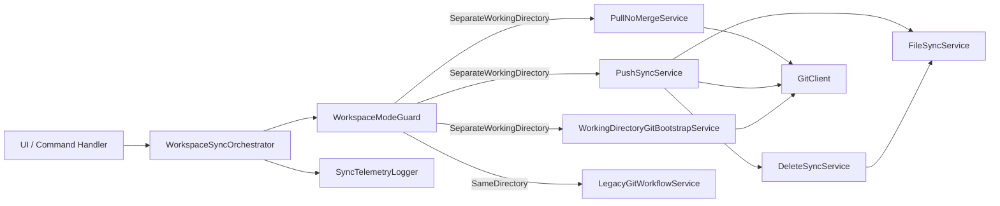
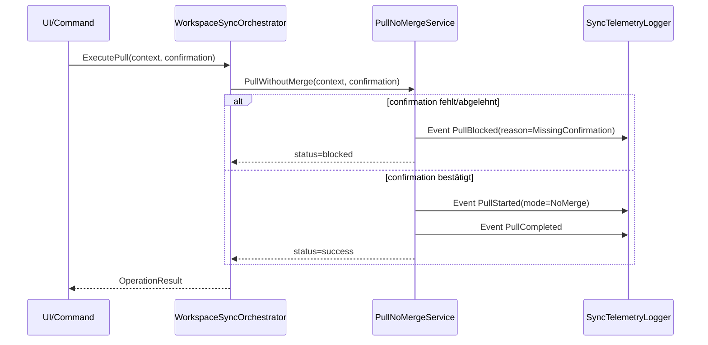
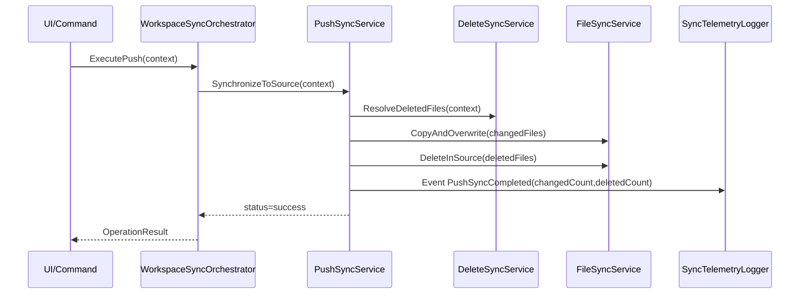
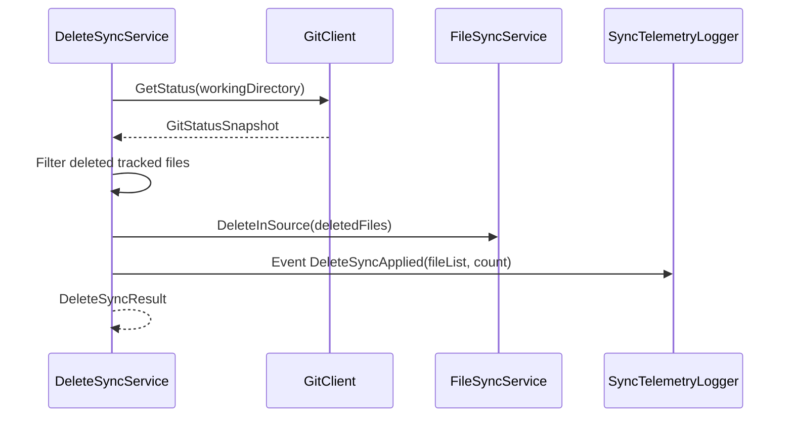
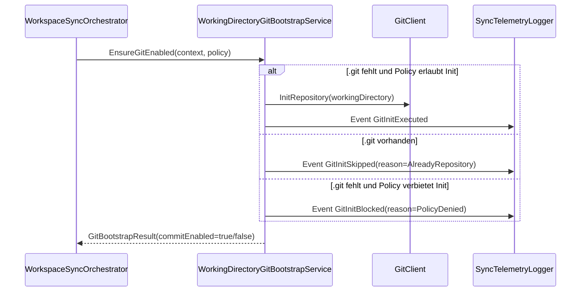

# Architektur-Blueprint – Separates Arbeitsverzeichnis mit Git-Workflow (Pull ohne Merge, Push als Sync)

> **Dokument-Typ:** Architecture Blueprint  
> **Status:** 📋 Geplant  
> **Version:** 2.0.0  
> **Datum:** 2026-05-13

---

## 1. Zielbild und Systemgrenzen

Für lokale Quellen im Modus `SeparateWorkingDirectory` wird ein vollständig nutzbarer Git-gestützter Arbeitsfluss definiert:

1. Git-Funktionen im Working Directory sind nutzbar (inkl. `git init` und lokaler Commits bei Bedarf).
2. Pull in diesem Modus führt **keinen Merge** aus und verlangt einen verpflichtenden Nutzerhinweis.
3. Push in diesem Modus führt **kein `git push`** aus, sondern eine deterministische Dateisynchronisation `WorkingDirectory -> SourceDirectory` mit Überschreiben.
4. Gelöschte Dateien werden über Git-Änderungserkennung im Working Directory ermittelt und im SourceDirectory ebenfalls gelöscht.
5. Für `WorkingDirectory == SourceDirectory` bleibt das bestehende Verhalten unverändert und regressionsfrei.

## 2. Architekturentscheidungen (ADRs)

### ADR-01 – Modusabhängige Workflow-Trennung
- **Entscheidung:** Der Workflow wird strikt nach `WorkspaceMode` verzweigt.
- **Begründung:** Verhindert Regressionen im Modus `WorkingDirectory == SourceDirectory` (FR-4).
- **Konsequenz:** Separate Services für `SeparateWorkingDirectory`, Legacy-Service bleibt unverändert nutzbar.

### ADR-02 – Pull ohne Merge mit verpflichtendem Hinweis
- **Entscheidung:** Pull im separaten Arbeitsverzeichnis ist ein eigener Ablauf ohne Merge-Operation.
- **Begründung:** Fachliche Vorgabe FR-2/NFR-2.
- **Konsequenz:** Ohne bestätigten Hinweis kein Pull-Start; Ereignis wird protokolliert.

### ADR-03 – Push als Dateisynchronisation statt Git-Push
- **Entscheidung:** Im separaten Arbeitsverzeichnis wird `git push` explizit unterbunden.
- **Begründung:** Fachliche Vorgabe FR-3.
- **Konsequenz:** Push ruft ausschließlich Sync-Pipeline auf (Änderungen kopieren/überschreiben, Löschungen spiegeln).

### ADR-04 – Delete-Sync über Git-Status im Working Directory
- **Entscheidung:** Löschkandidaten werden aus Git-Änderungserkennung des Working Directory ermittelt.
- **Begründung:** Fachliche Vorgabe FR-3.1 und nachvollziehbare, deterministische Löschlogik.
- **Konsequenz:** Nur eindeutig erkannte Löschungen werden im SourceDirectory entfernt; Ergebnis wird als Delete-Liste geloggt.

### ADR-05 – Git-Befähigung im Working Directory
- **Entscheidung:** Fehlt `.git` im Working Directory, wird abhängig von Policy `git init` ausgeführt und lokaler Commit-Flow freigeschaltet.
- **Begründung:** Fachliche Vorgabe FR-1/FR-1.1.
- **Konsequenz:** Init-Pfad ist klar getrennt, auditiert und mit Fehlerklasse `Init` belegbar.

### ADR-06 – Deterministische Fehler- und Logging-Taxonomie
- **Entscheidung:** Einheitliche Domänenfehlercodes und strukturierte Logs für `Init`, `PullNoMerge`, `PushCopy`, `DeleteSync`.
- **Begründung:** NFR-3/NFR-5 und Supportfähigkeit.
- **Konsequenz:** Klare Fehlersuche, stabile Testorakel und reproduzierbare Abläufe.

## 3. Komponenten und Verantwortungszuschnitt

| Komponente | Verantwortung | Eingaben | Ausgaben |
|---|---|---|---|
| `WorkspaceSyncOrchestrator` | End-to-End-Orchestrierung für Pull/Push/Init | Befehl, Pfade, Settings, User-Context | `OperationResult` |
| `WorkspaceModeGuard` | Entscheidung `SeparateWorkingDirectory` vs. Legacy | Source-/Working-Pfad, Mode | `ModeDecision` |
| `PullNoMergeService` | Pull-Ablauf ohne Merge inkl. Pflicht-Hinweis | Kontext + bestätigter Hinweis | `PullResult` |
| `PushSyncService` | Push als Datei-Sync ohne `git push` | Sync-Kontext | `PushResult` |
| `DeleteSyncService` | Ermittlung/Löschung gelöschter Dateien | Git-Status + Pfade | `DeleteSyncResult` |
| `WorkingDirectoryGitBootstrapService` | Git-Init und Commit-Enablement im Working Directory | WorkingDirectory, Policy | `GitBootstrapResult` |
| `FileSyncService` | Datei-Kopie/Overwrite mit Guardrails | Änderungsmenge | `FileSyncResult` |
| `GitClient` | Gekapselte Git-Operationen (`status`, `init`, `add`, `commit`) | CLI-Parameter | Git-Command-Result |
| `SyncTelemetryLogger` | Strukturierte Events/Metriken | OperationContext + Result | Event-Stream |
| `LegacyGitWorkflowService` | Unverändertes Verhalten bei gleichem Arbeits-/Quellverzeichnis | Standard-Git-Kontext | Legacy-Result |

## 4. Umsetzbare Artefakte (Services, Methoden, Verträge)

### 4.1 Domänenverträge
- `WorkspaceContext { sourceDirectory, workingDirectory, workspaceMode, taskId }`
- `OperationPolicy { allowGitInitInWorkingDirectory, requirePullWarningConfirmation, copyGuardrails }`
- `OperationResult { operationType, status, reasonCode, durationMs, warnings, error }`
- `SyncDelta { addedOrModifiedFiles[], deletedFiles[], ignoredFiles[] }`

### 4.2 Service-Verträge (ohne Implementierungscode)
1. `IWorkspaceSyncOrchestrator.ExecutePull(context, policy, userConfirmation) : OperationResult`
2. `IWorkspaceSyncOrchestrator.ExecutePush(context, policy) : OperationResult`
3. `IWorkingDirectoryGitBootstrapService.EnsureGitEnabled(context, policy) : GitBootstrapResult`
4. `IPullNoMergeService.PullWithoutMerge(context, confirmation) : PullResult`
5. `IPushSyncService.SynchronizeToSource(context, delta) : PushResult`
6. `IDeleteSyncService.ResolveDeletedFiles(context) : DeleteSyncResult`
7. `IFileSyncService.CopyAndOverwrite(context, files) : FileSyncResult`
8. `IGitClient.GetStatus(workingDirectory) : GitStatusSnapshot`
9. `IGitClient.InitRepository(workingDirectory) : GitCommandResult`
10. `IGitClient.CreateLocalCommit(workingDirectory, message) : GitCommandResult`

### 4.3 Verbindliche Invarianten
1. Bei `SeparateWorkingDirectory` darf Push keinen `git push`-Aufruf auslösen.
2. Pull ohne bestätigten Hinweis wird mit `status=blocked` beendet.
3. Delete-Sync darf nur auf Basis des Git-Status aus dem Working Directory löschen.
4. Bei `workingDirectory == sourceDirectory` muss der Legacy-Workflow selektiert werden.
5. Jede Operation erzeugt mindestens ein strukturiertes Start-/End-Event.

## 5. Sequenzflüsse

### 5.1 Pull (ohne Merge, mit Pflicht-Hinweis)

### 5.2 Push (Copy/Overwrite statt git push)

### 5.3 Delete-Sync (Git-Änderungserkennung)

### 5.4 Init/Commit-Enablement im Working Directory

## 6. Fehlerbehandlung und Recovery

### 6.1 Fehlerklassen
- `Init`: Repository-Initialisierung im Working Directory fehlgeschlagen.
- `PullNoMerge`: Pflicht-Hinweis fehlt, Pull-Policy verletzt oder Pull-Update fehlgeschlagen.
- `PushCopy`: Kopier-/Overwrite-Phase fehlgeschlagen.
- `DeleteSync`: Löschermittlung oder Löschausführung fehlgeschlagen.
- `CompatibilityGuard`: Falscher Workflow-Zweig für `workingDirectory == sourceDirectory`.

### 6.2 Recovery-Regeln
1. **Fail-Fast je Phase:** Bei Fehler in einer Phase keine nachgelagerten Phasen starten.
2. **Keine stille Teil-Synchronisation:** `status=failed` enthält explizite Angaben zu bereits ausgeführten Teilschritten.
3. **Idempotente Wiederholung:** Wiederholter Push bei unverändertem Delta erzeugt keine zusätzlichen Dateiänderungen.
4. **Legacy-Schutz:** Bei Gleichheit von Arbeits-/Quellverzeichnis wird sofort auf Legacy-Pfad umgeschaltet.

## 7. Logging und Observability

### 7.1 Strukturierte Pflichtfelder je Event
- `taskId`, `operationType`, `workspaceMode`, `sourceDirectory`, `workingDirectory`
- `strategy` (`NoMergePull`, `CopyOverwritePush`, `DeleteSync`, `GitBootstrap`)
- `status`, `reasonCode`, `durationMs`
- `changedFileCount`, `deletedFileCount` (falls anwendbar)

### 7.2 Mindest-Eventset
1. `PullWarningShown`
2. `PullBlocked`
3. `PullCompletedNoMerge`
4. `PushSyncStarted`
5. `PushSyncCompleted`
6. `DeleteSyncApplied`
7. `GitInitExecuted` / `GitInitBlocked`
8. `LegacyWorkflowSelected`

## 8. Teststrategie

### 8.1 Unit-Tests
- Entscheidungslogik `WorkspaceModeGuard` inkl. Legacy-Zweig.
- Pull-Blockierung ohne bestätigten Hinweis.
- Push-Guard: Verifikation, dass kein `git push` ausgelöst wird.
- Delete-Sync-Filterlogik (nur gültige Löschkandidaten).
- Git-Bootstrap-Policy (`init erlaubt` / `init verboten` / `bereits git`).

### 8.2 Integrationstests
- End-to-End Pull im `SeparateWorkingDirectory` mit Pflicht-Hinweis.
- End-to-End Push mit Copy/Overwrite und anschließender Konsistenzprüfung beider Verzeichnisse.
- Delete-Sync mit mindestens 3 gelöschten Dateien auf unterschiedlichen Verzeichnisebenen.
- Fehlerpfade (fehlende Rechte, gesperrte Dateien, Git-Fehler) mit erwarteten Fehlerklassen.

### 8.3 Regressions- und Kompatibilitätstests
- Bestehende Szenarien für `workingDirectory == sourceDirectory` unverändert grün.
- Vergleich Vorher/Nachher für Legacy-Operationen (keine Verhaltensänderung).
- Determinismus-Test: gleicher Input => gleiches `SyncDelta` und gleiches Resultat.

### 8.4 Nicht-funktionale Tests
- Performanzziel: bis 10.000 Dateien in < 60 s (Referenzumgebung).
- Stabilitätstest mit wiederholten Push/Pull-Zyklen.
- Observability-Test: alle Pflichtfelder in 100 % der Events vorhanden.

## 9. Qualitätsziele und Priorisierung

| Ziel | Priorität | Messgröße |
|---|---|---|
| Korrekte Push-Semantik ohne `git push` | MUST | 0 Aufrufe von `git push` im separaten Modus |
| Pull-Transparenz ohne Merge | MUST | 100 % Pulls zeigen/erzwingen Hinweis |
| Konsistente Delete-Synchronisation | MUST | 100 % erkannte Löschungen im SourceDirectory gespiegelt |
| Regressionsfreiheit Legacy-Modus | MUST | 0 fehlgeschlagene bestehende Legacy-Regressionstests |
| Nachvollziehbare Fehlerdiagnose | HIGH | 100 % Fehler mit Fehlerklasse + ReasonCode |

## 10. Verlinkung

- Anforderungen: [../requirements/separates-arbeitsverzeichnis-git-init-fallback-requirements-analysis.md](../requirements/separates-arbeitsverzeichnis-git-init-fallback-requirements-analysis.md)
- ERM: [separates-arbeitsverzeichnis-git-init-fallback-entity-relationship-model.md](separates-arbeitsverzeichnis-git-init-fallback-entity-relationship-model.md)
- Review: [../improvements/separates-arbeitsverzeichnis-git-init-fallback-architecture-review.md](../improvements/separates-arbeitsverzeichnis-git-init-fallback-architecture-review.md)

## 11. Versionierung

| Version | Datum | Autor | Änderung |
|---|---|---|---|
| 1.0.0 | 2026-05-13 | Architektur-Agent | Erstfassung (Init/Clone/Copy-Fallback) |
| 2.0.0 | 2026-05-13 | Architektur-Agent | Überarbeitung auf korrigierten Git-Workflow mit Pull-ohne-Merge, Push-Sync, Delete-Sync und Kompatibilitätsgarantie |
