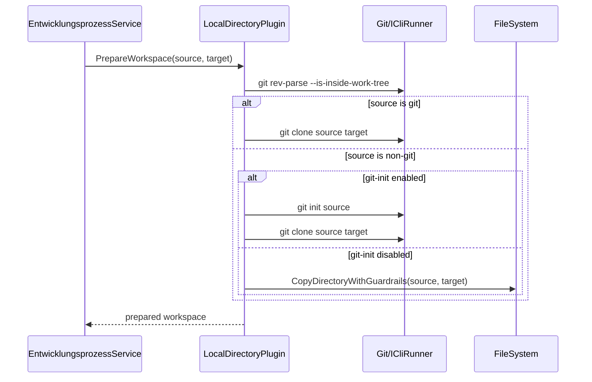

# Architektur-Blueprint – Separates Arbeitsverzeichnis mit git-init-/Copy-Fallback

> **Dokument-Typ:** Architecture Blueprint  
> **Status:** ✅ Umgesetzt  
> **Version:** 1.0.0  
> **Datum:** 2026-05-13

---

## 1. Zielbild

Für lokale Quellen im Modus `SeparateWorkingDirectory` soll die Vorbereitung robust erfolgen:

1. Git-Status der Quelle prüfen.
2. Nicht-Git + `git init` aktiv → `git init` in Quelle, danach `git clone`.
3. Nicht-Git + `git init` deaktiviert → Copy-Fallback statt Clone.

## 2. Qualitätsziele

- Robustheit: Kein harter Clone-Fehler nur wegen fehlendem `.git`.
- Nachvollziehbarkeit: Jeder Pfad wird begründet geloggt.
- Datenintegrität: Teilfehler hinterlassen kein inkonsistentes Zielverzeichnis.
- Rückwärtskompatibilität: Bestehende Git-Quellen verhalten sich wie bisher.

## 3. Komponenten und Verantwortlichkeiten

- **LocalDirectoryPlugin**
  - Führt Git-Check aus.
  - Entscheidet Strategie (`clone`, `init+clone`, `copy`).
  - Führt Init/Clone/Copy aus und übernimmt Cleanup.
- **ArbeitsverzeichnisResolver**
  - Liefert aufgelösten Zielpfad inkl. Fallback-ReasonCode.
- **ICliRunner / Git-Aufrufe**
  - Führt `git rev-parse`, `git init`, `git clone` robust und nicht-interaktiv aus.
- **EntwicklungsprozessService**
  - Orchestriert den Gesamtprozess und erhält final vorbereiteten Workspace.

## 4. Entscheidungslogik

| Quelle Git-basiert? | git-init aktiviert? | Aktion |
|---|---|---|
| Ja | egal | `git clone` |
| Nein | Ja | `git init` in Quelle, dann `git clone` |
| Nein | Nein | Dateikopie (Copy-Fallback), kein Clone |

### Sequenz (vereinfacht)

## 5. Fehlerbehandlung und Recovery

- Git-Check fehlgeschlagen: klarer Vorprüfungsfehler.
- `git init` fehlgeschlagen: Abbruch, kein Clone.
- Clone fehlgeschlagen: Zielverzeichnis bereinigen.
- Copy-Guardrail verletzt: Abbruch + Cleanup.
- Alle Pfade schreiben strukturierte Logs mit Strategie und Fehlergrund.

## 6. Konfigurationsmodell

- `WorkspaceMode` steuert Relevanz dieses Entscheidungsbaums.
- `ConfirmGitInitInSourceDirectory` steuert, ob Quellmutation (`git init`) erlaubt ist.
- Copy-Guardrails (`Timeout`, `MaxFiles`, `MaxMegabytes`) bleiben unverändert aktiv.

## 7. Teststrategie (Plan)

- Unit-Tests für alle Entscheidungszweige.
- Negativtests für Init-/Clone-/Copy-Fehler + Cleanup.
- Integrationstests für End-to-End-Prozesslauf mit:
  - Git-Quelle
  - Nicht-Git + init aktiv
  - Nicht-Git + init deaktiviert

## 8. Risiken und Gegenmaßnahmen

| Risiko | Gegenmaßnahme |
|---|---|
| Ungewollte Quelländerung durch `git init` | Harte Opt-in-Regel per Setting + klare Logs |
| Race Conditions bei parallelen Starts | Pfadbezogene Sperr-/Synchronisationsstrategie |
| Inkonsistenter Zielzustand bei Fehler | Atomare Vorbereitung + Cleanup-Vertrag |
| Unklare Nutzerdiagnose | Fehlercodes + verständliche Meldungen |

## 9. Verlinkung

- Anforderungen: [../requirements/separates-arbeitsverzeichnis-git-init-fallback-requirements-analysis.md](../requirements/separates-arbeitsverzeichnis-git-init-fallback-requirements-analysis.md)
- ERM: [separates-arbeitsverzeichnis-git-init-fallback-entity-relationship-model.md](separates-arbeitsverzeichnis-git-init-fallback-entity-relationship-model.md)
- Review: [../improvements/separates-arbeitsverzeichnis-git-init-fallback-architecture-review.md](../improvements/separates-arbeitsverzeichnis-git-init-fallback-architecture-review.md)
